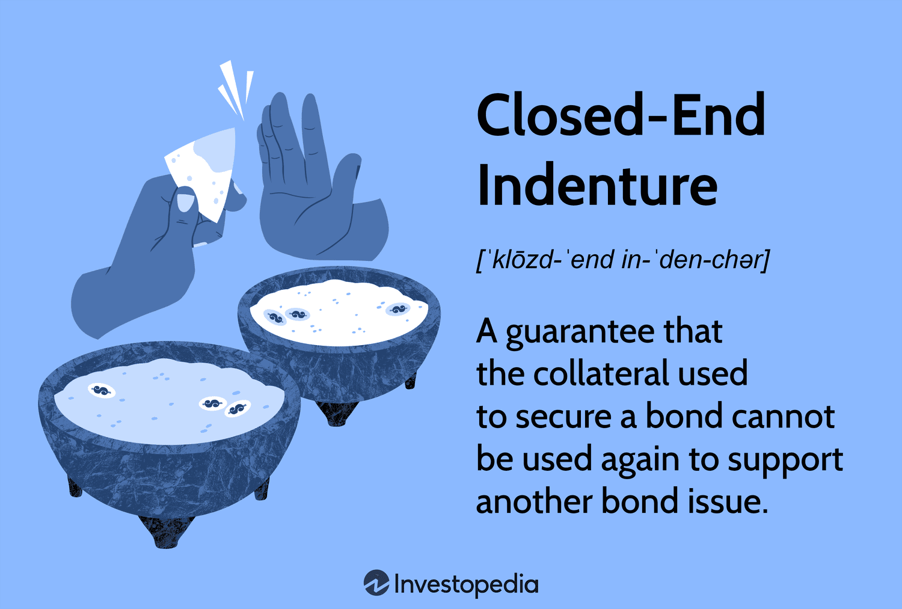

The interplay between traditional investment mechanisms and modern technology-driven strategies in finance is marked by increasing complexity and sophistication. This article examines the convergence of bond agreements, closed-end indentures, and algorithmic trading, assessing how these elements interact and influence the financial ecosystem.

Bonds have historically been favored by conservative investors for their potential to provide stability and regular income. Within this sphere, bond agreements, particularly those featuring closed-end indentures, require detailed scrutiny to ensure the protection of investor interests. Such indentures restrict the issuer from pledging the same collateral to secure multiple bonds, thereby safeguarding the security of the bondholders' investments.

Simultaneously, algorithmic trading has emerged as a dominant force in asset management. Leveraging advanced computational models, algorithmic trading executes buy and sell orders at speeds and efficiencies beyond human capability. This surge in technology usage is reshaping the understanding of traditional financial instruments, such as bonds, by altering liquidity dynamics and influencing price volatility.

This article seeks to illuminate the operational intricacies of bond agreements, with a particular emphasis on closed-end indentures, and to introduce the growing role of algorithmic trading in modern finance. By understanding these frameworks and their interconnections, market participants can better navigate investment strategies. Through this exploration, readers will gain insights into how these elements collectively shape today’s financial landscape, impacting decisions and outcomes in capital markets.

## Table of Contents

## Understanding Bond Agreements

A bond agreement, commonly represented by a bond indenture, serves as the legal contract binding a bond issuer to the bondholders. This document establishes the framework for the financial relationship between the issuer, which could be a government entity or a corporation, and the investors who purchase the bonds. The bond indenture specifies key terms of the bond, including its maturity date, which is when the principal amount of the bond is to be paid back to investors, and the face value, the amount the bond will be worth at maturity.

Additionally, bond agreements detail the interest rate, often referred to as the coupon rate, which indicates the periodic interest payments that will be made to bondholders. These payments are typically made annually or semi-annually. Another critical component outlined in a bond indenture is the security arrangement, which may involve pledging specific assets as collateral to protect bondholders in the event of default by the issuer. This aspect is particularly significant as it provides assurance to investors regarding the repayment of their investments.

Bond agreements are crucial because they delineate the exact terms under which investor loans will be repaid, thereby playing a vital role in investor confidence and the overall attractiveness of the bond issue. The clauses within a bond indenture are designed to protect investors’ interests, ensuring that their risks are minimized while the issuer's obligations are clearly defined. These can include covenants, which are conditions the issuer must adhere to, such as maintaining certain financial ratios or restrictions on additional debt issuance, to ensure the issuer remains financially healthy enough to meet its obligations.

Different types of bond agreements exist to cater to various investor needs and issuer circumstances. For instance, secured bonds come with collateral backing, offering increased protection to investors compared to unsecured bonds, which do not have specific assets pledged. Convertible bonds offer an additional feature that allows investors to convert the bonds into a predetermined number of the issuer’s shares, thereby providing potential equity upside. Furthermore, callable and putable bonds introduce options that can alter the standard bond repayment schedule under specified conditions, providing flexibility to issuers and investors alike.

Understanding the nuances of these agreements is essential for investors who aim to align their investment choices with their risk tolerance and financial objectives. By examining the specifics of each bond agreement, investors can better gauge the level of risk associated with a bond and its alignment with their overall portfolio strategy.

## Closed-End Indenture: An Essential Bond Clause

A closed-end indenture is a contractual clause embedded within certain bond agreements that ensures the collateral backing a bond issue is exclusively tied to that specific issuance. This stipulation is crucial in securing the interests of bondholders by prohibiting the use of the same collateral for multiple bond issues, thereby reducing the risk of dilution of collateral coverage.

The primary advantage of closed-end indentures is the protection they afford bondholders. In circumstances where an issuer may face financial distress or default, a closed-end indenture prioritizes the claims of bondholders over collateral assets. This exclusive right enhances the security of these bonds, rendering them particularly attractive to risk-averse investors who prioritize the preservation of their principal investment over potential yield.

Conversely, an open-end indenture permits the issuer to utilize the same collateral for multiple bond issues. This approach could potentially increase the issuer's access to capital but simultaneously elevates the risk for bondholders. In the event of default, bondholders under an open-end indenture might find their claims subordinated, as the collateral is obliged to serve multiple debt obligations. This increased risk profile typically necessitates a higher yield to attract investors to open-end indenture bonds.

To illustrate, consider two different bond issues—one governed by a closed-end indenture and the other by an open-end indenture. In a default scenario, bondholders of the closed-end indenture will inevitably enjoy a superior claim to any liquidation proceeds from the collateralized assets. This prioritization often results in higher recovery rates compared to those holding bonds with open-end indentures, who must divide the proceeds among all bondholders with claims against the same collateral assets.

The closed-end indenture, therefore, plays a fundamental role in the risk assessment and investment decision-making processes associated with bond markets. Its impact on a bond's risk profile cannot be overstated, as it directly influences an investor's confidence in the security and repayment potential of their bond investments. Understanding the nuances between closed-end and open-end indentures is vital for investors navigating the complex landscape of bond agreements, where security against issuer default remains a paramount concern.

## The Role of Algorithmic Trading in Bond Markets

Algorithmic trading, a method characterized by the use of computer programs to execute trades based on predefined criteria, has revolutionized bond markets. By automating the trading process, these algorithms can execute orders with speed and precision that exceed human capabilities. This technological advancement significantly impacts various aspects of bond trading, including [liquidity](/wiki/liquidity-risk-premium) enhancement, risk management, and price determination.

1. **Enhancing Liquidity**

Algorithmic trading plays a crucial role in improving liquidity in bond markets. By facilitating continuous trading and order matching, algorithms ensure that buy and sell orders are efficiently matched, reducing bid-ask spreads and providing greater market depth. This is essential for bond markets, traditionally known for their lower liquidity compared to equity markets. The increased liquidity resulting from [algorithmic trading](/wiki/algorithmic-trading) enables traders to enter and [exit](/wiki/exit-strategy) positions with minimal market impact, which is especially beneficial in fast-moving or volatile markets.

2. **Risk Management**

The integration of algorithmic trading into bond markets also advances risk management strategies. Algorithms can be designed to assess and respond to market conditions in real-time, enabling traders to adjust their portfolios in response to changing interest rates, credit spreads, or other market conditions. For example, algorithms can be programmed to utilize hedging techniques such as duration matching or convexity adjustments to mitigate [interest rate](/wiki/interest-rate-trading-strategies) risk. Additionally, algorithms can employ pattern recognition to detect and act on potential market anomalies, thereby protecting investments from unpredictable fluctuations.

3. **Influence on Pricing and Yields**

Algorithmic trading influences bond pricing and yields by ensuring rapid dissemination and integration of information into prices. With the ability to process vast amounts of data at remarkable speeds, algorithms can detect price discrepancies and execute [arbitrage](/wiki/arbitrage) strategies that contribute to market efficiency. Consequently, bond prices reflect available information more accurately, leading to yields that align more closely with underlying risk factors. This efficient price discovery process supports fairer and more transparent markets, benefiting investors and issuers alike.

Algorithmic trading strategies used in bond markets range from simple execution algorithms, such as time-weighted average price (TWAP) or [volume](/wiki/volume-trading-strategy)-weighted average price (VWAP), to more complex strategies involving [statistical arbitrage](/wiki/statistical-arbitrage) or [machine learning](/wiki/machine-learning) techniques. For instance, machine learning algorithms can analyze historical data to predict future price movements, allowing traders to capitalize on expected changes in bond yields or credit spreads.

In conclusion, while algorithmic trading introduces new complexities into bond markets, it also offers significant advantages in terms of liquidity, risk management, and price efficiency. As technology continues to advance, the role of algorithmic trading in bond markets is likely to expand, offering new opportunities for traders and investors to optimize their strategies and enhance returns.

## Integrating Bond Agreements with Algorithmic Trading

The intersection of bond agreements and algorithmic trading introduces both opportunities and challenges in the financial markets, especially as investors seek to navigate the complexities of bond transactions while maximizing returns. Algorithmic trading, which relies on advanced computational techniques, offers powerful tools for evaluating and executing bond trades with speed and precision, making it an essential component for contemporary investment strategies.

Algorithmic trading systems can process vast amounts of data, allowing investors to analyze critical variables like yield, maturity, and pricing trends efficiently. This real-time analysis enables rapid decision-making that is particularly beneficial in complex bond markets. For instance, algorithms can be programmed to identify favorable entry and exit points based on the fluctuations in bond prices and interest rates, thereby optimizing trading strategies to capitalize on market movements.

Moreover, algorithmic trading significantly enhances the liquidity of bond markets by facilitating the execution of trades at both large and small scales with minimal market impact. This reduction in transaction costs and improved market access can be advantageous for investors dealing with intricate bond contracts, such as those incorporating closed-end and open-end indentures. By leveraging these technological advancements, market participants can better manage the risks associated with bond agreements.

A practical example of algorithmic trading's efficacy in bond markets is the use of machine learning models to predict bond

## Case Studies and Market Examples

To illustrate the effectiveness of closed-end indentures in safeguarding bondholders, consider the case of the New York City Municipal Water Finance Authority (NYCMWFA) during the 2008 financial crisis. The closed-end indenture played a crucial role in protecting investors' interests. As the financial downturn intensified, many issuers faced increased financial strain, and defaults became more common. For NYCMWFA, the closed-end indenture ensured that the pledged revenue streams from water usage fees were solely dedicated to repaying the bondholders of that specific issuance. This enhanced the security and attractiveness of their bonds during turbulent times, granting bondholders the assurance of prioritized claims over revenue, even as financial markets faced uncertainty.

In contrast, open-end indentures might have allowed the same collateral to back additional bond issues, potentially diluting the claim of any single set of bondholders in the event of default. The clear delineation of collateral in a closed-end indenture provided by the NYCMWFA instilled confidence in the market, mitigating the risk and ensuring the continued interest of investors despite broader economic concerns.

Algorithmic trading has significantly influenced the bond market by enhancing portfolio management strategies and market efficiencies. Consider the use of algorithmic trading by Renaissance Technologies, a firm renowned for its Medallion Fund. In managing large portfolios, algorithms analyze vast amounts of historical and real-time data to identify pricing inefficiencies and optimize trade executions. Renaissance Technologies employs complex mathematical models and statistical techniques to predict bond price movements and execute trades at speeds unattainable by human traders.

These algorithms facilitate improved market efficiency, evident in tighter bid-ask spreads and increased liquidity. For instance, during volatile market phases, algorithmic strategies like statistical arbitrage have allowed traders to exploit minimal price discrepancies across different bond markets, ensuring profitability while preserving market balance. The results are reflected in allocations that minimize transaction costs and stabilize prices even amid adverse market conditions.

Overall, these examples underscore the symbiotic potential of traditional financial mechanisms like bond indentures and modern technological tools such as algorithmic trading. Both strategies not only protect investor interests but also enhance overall market stability and efficiency.

## Conclusion

As the financial landscape advances, integrating time-tested instruments like bond agreements with cutting-edge technological solutions such as algorithmic trading is set to significantly influence future investment dynamics. This synergy between tradition and innovation offers a multifaceted approach that can enhance investment strategies, providing a more nuanced understanding of market operations.

To navigate this evolving intersection, investors must acquire a deep comprehension of how traditional and modern elements interact. Bond agreements provide a stable, structured basis for investment, offering clarity and assurance to investors through clearly defined terms. Meanwhile, algorithmic trading introduces precision, speed, and data-driven insights into financial decision-making. The convergence of these elements empowers investors to optimize returns while effectively managing risk. For example, algorithmic models can analyze real-time data on bond pricing, yields, and market trends, facilitating rapid and informed trading decisions. Pyton libraries like `pandas`, `numpy`, and `scipy` can be utilized to construct financial models that assess these variables dynamically, illustrating the practical applications of integrating computational techniques with traditional financial metrics.

Balancing these dual approaches requires investors to appreciate the strengths and limitations inherent in both traditional and technological paradigms. Traditional methods emphasize security, reliability, and transparency, while technological solutions offer scalability, efficiency, and adaptability. An optimal investment strategy may involve using algorithmic insights to navigate complex bond agreements, thereby mitigating risks associated with market [volatility](/wiki/volatility-trading-strategies) and issuer defaults. This balanced approach not only enhances portfolio performance but also prepares investors to adapt to changes within the financial ecosystem.

In conclusion, the fusion of conventional financial instruments with modern technological advancements underscores the importance of a holistic investment strategy. As finance continues to evolve, investors must skillfully blend these approaches to create robust strategies that capture the benefits of both worlds. This dual focus facilitates not only the achievement of superior returns but also the safeguarding of assets in an increasingly complex and dynamic market environment.

## References & Further Reading

[1]: Choudhry, M. (2010). ["The Bond and Money Markets: Strategy, Trading, Analysis."](https://www.sciencedirect.com/book/9780750646772/the-bond-and-money-markets) Wiley.

[2]: Lopez de Prado, M. (2018). ["Advances in Financial Machine Learning."](https://www.amazon.com/Advances-Financial-Machine-Learning-Marcos/dp/1119482089) John Wiley & Sons.

[3]: Chan, E. (2008). ["Quantitative Trading: How to Build Your Own Algorithmic Trading Business."](https://github.com/ftvision/quant_trading_echan_book) John Wiley & Sons.

[4]: Aronson, D. R. (2006). ["Evidence-Based Technical Analysis: Applying the Scientific Method and Statistical Inference to Trading Signals."](https://www.amazon.com/Evidence-Based-Technical-Analysis-Scientific-Statistical/dp/0470008741) Wiley.

[5]: Jansen, S. (2020). ["Machine Learning for Algorithmic Trading."](https://github.com/stefan-jansen/machine-learning-for-trading) Packt Publishing.

[6]: Fabozzi, F. J. (2000). ["The Handbook of Fixed Income Securities."](https://www.amazon.com/Handbook-Fixed-Income-Securities-Ninth/dp/1260473899) McGraw-Hill Education.