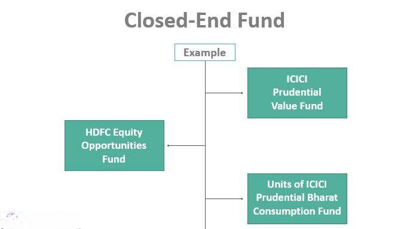

## Table of Contents

## What is a closed-end management company?

A closed-end management company is a type of investment company that raises a fixed amount of capital through an initial public offering (IPO). Once the shares are sold, the company does not issue new shares or redeem existing ones. Instead, the shares are traded on a stock exchange, much like any other publicly traded company. This means that the price of the shares can fluctuate based on supply and demand, and it may not always reflect the net asset value of the company's underlying investments.

These companies typically invest the capital they raise in a diversified portfolio of securities, such as stocks, bonds, or other assets. Because they have a fixed pool of capital, closed-end management companies can take a long-term approach to their investments without worrying about frequent inflows and outflows of money. This can be beneficial for investors looking for exposure to a specific strategy or asset class, as the company's management can focus on maximizing returns over time rather than managing daily liquidity.

## How does a closed-end management company differ from an open-end management company?

A closed-end management company and an open-end management company are different in how they handle their shares and money. A closed-end company raises money by selling a fixed number of shares through an initial public offering. After that, it doesn't sell new shares or buy back old ones. Instead, the shares trade on a stock exchange, and their price can go up or down based on what people are willing to pay for them. This means the share price might not match the value of the company's investments.

On the other hand, an open-end management company, often called a mutual fund, keeps selling and buying back its shares directly from investors. This means it can grow or shrink based on how much money people put in or take out. The price of the shares is based on the value of the company's investments, calculated at the end of each day. This makes it easier for investors to get in and out of the fund, but it can also mean the company has to manage its money more actively to handle these changes.

## What are the primary functions of a closed-end management company?

A closed-end management company's main job is to take the money it raises from selling shares and invest it in different things like stocks, bonds, or other assets. Once it has the money, it doesn't sell more shares or buy back the ones it sold. This lets the company keep the money it has and use it to try to make more money over time. The company's managers decide what to invest in, hoping to make good returns for the people who bought the shares.

The shares of a closed-end management company trade on a stock exchange, just like other companies. This means the price of the shares can go up or down based on what people are willing to pay for them. It might not always match the actual value of the company's investments. Because the company has a fixed amount of money to work with, it can focus on long-term goals without worrying about people constantly putting money in or taking it out. This can be good for investors who want to invest in something specific and are okay with not being able to easily sell their shares whenever they want.

## How are closed-end management companies structured?

A closed-end management company is set up by selling a set number of shares to the public through an initial public offering (IPO). Once these shares are sold, the company does not sell any more shares or buy back the ones it sold. Instead, these shares are traded on a stock exchange, just like other company shares. This means the price of the shares can go up or down based on what people want to pay for them, and it might not always match the actual value of the company's investments.

The company takes the money it raised from selling the shares and invests it in different things like stocks, bonds, or other assets. Because the company has a fixed amount of money to work with, it can focus on long-term goals without worrying about people constantly putting money in or taking it out. This can be good for investors who want to invest in something specific and are okay with not being able to easily sell their shares whenever they want.

## What are the typical investment strategies employed by closed-end management companies?

Closed-end management companies often use different ways to invest the money they get from selling shares. One common way is to focus on a specific type of investment, like stocks from certain countries or industries, or bonds from certain places. This can be good for investors who want to put their money into something specific. Another way is to use borrowed money, or leverage, to try to make more money. This can be riskier but might lead to bigger returns if things go well.

Another strategy is to invest in assets that might not be easy for regular investors to buy, like real estate or private companies. This can give investors a chance to own a piece of something they might not be able to buy on their own. Some closed-end companies also try to make money by buying other companies' shares at a lower price than they think they're worth, hoping the price will go up later. This is called value investing. By using these different strategies, closed-end management companies try to make the most of the money they have and give good returns to their shareholders.

## How do closed-end management companies raise capital?

Closed-end management companies raise money by selling a fixed number of shares to the public. This happens through something called an initial public offering, or IPO. Once the shares are sold, the company doesn't sell any more shares or buy back the ones it sold. This means the company has a set amount of money to work with, which it can then invest in different things like stocks, bonds, or other assets.

Because the shares are traded on a stock exchange after the IPO, the price of the shares can go up or down based on what people want to pay for them. This price might not always match the actual value of the company's investments. This way of raising money lets the company focus on long-term goals without worrying about people constantly putting money in or taking it out. It's good for investors who want to invest in something specific and are okay with not being able to easily sell their shares whenever they want.

## What are the advantages of investing in a closed-end management company?

One big advantage of investing in a closed-end management company is that it lets you put your money into specific things that you might not be able to invest in on your own. These companies often focus on certain types of investments, like stocks from a particular country or industry, or bonds from a specific place. This can be really helpful if you want to spread your money around and not just keep it all in one type of investment. Also, because these companies don't have to worry about people constantly putting money in or taking it out, they can focus on long-term goals. This means they can take their time and try to make the best decisions to grow your money over time.

Another advantage is that closed-end management companies can use borrowed money, or leverage, to try to make more money. This can be a bit riskier, but if things go well, it might lead to bigger returns for you. Also, the shares of these companies are traded on a stock exchange, which means you can buy and sell them just like any other company's shares. Sometimes, you might be able to buy the shares for less than the actual value of the company's investments, which can be a good deal. Overall, investing in a closed-end management company can give you a chance to grow your money in ways that might be harder to do on your own.

## What are the risks associated with closed-end management companies?

One big risk of investing in closed-end management companies is that the price of their shares can go up and down a lot. Because these shares trade on a stock exchange, what people are willing to pay for them can be different from what the company's investments are actually worth. This means you might buy the shares for more than they're worth or sell them for less. It can be hard to predict how the price will change, which makes it a bit riskier.

Another risk is that these companies sometimes use borrowed money, or leverage, to try to make more money. While this can lead to bigger returns if things go well, it can also mean bigger losses if things don't go as planned. If the investments don't do well, the company might have a hard time paying back the money it borrowed, which could hurt the value of your shares.

Lastly, because closed-end management companies don't sell new shares or buy back old ones after their initial public offering, it can be harder to get your money out if you need it quickly. The shares might not be as easy to sell as other types of investments, and you might have to wait for the right buyer to come along. This can be a problem if you need your money back in a hurry.

## How does the pricing of shares in a closed-end management company work?

The price of shares in a closed-end management company can go up and down based on what people want to pay for them. These shares are traded on a stock exchange, just like other companies' shares. This means the price might not always match the actual value of the company's investments. Sometimes, you can buy the shares for less than what the company's investments are worth, which is called trading at a discount. Other times, you might have to pay more than the investments are worth, which is called trading at a premium.

Because the price can change a lot, it's important to keep an eye on it. If a lot of people want to buy the shares, the price might go up. But if not many people are interested, the price could go down. This can make investing in closed-end management companies a bit riskier because you might not be able to predict how the price will change. It's different from open-end companies, where the price is based on the value of the investments at the end of each day, making it easier to know what you're paying for.

## What role do leverage and derivatives play in the operations of closed-end management companies?

Closed-end management companies often use borrowed money, or leverage, to try to make more money for their investors. This means they take out loans to buy more investments than they could with just the money they raised from selling shares. Using leverage can be a bit like a double-edged sword. If the investments do well, the returns can be bigger because they're using more money to invest. But if the investments don't do well, the losses can be bigger too, because the company still has to pay back the borrowed money. This makes investing in these companies riskier, but it can also lead to higher rewards if things go well.

Derivatives are another tool that closed-end management companies might use. These are financial contracts that get their value from something else, like stocks, bonds, or commodities. Companies use derivatives to try to protect themselves from big changes in the market, or to make bets on how the market will move. For example, they might use options or futures to hedge against falling prices, or to try to make money if prices go up. Using derivatives can be complicated and risky, but it can also help the company manage its investments better and potentially make more money for investors.

## How are closed-end management companies regulated?

Closed-end management companies are watched over by different groups to make sure they follow the rules. In the United States, the main group that keeps an eye on them is the Securities and Exchange Commission (SEC). The SEC makes sure these companies give honest information to people who might want to invest in them. They have to follow rules about how they sell their shares, how they tell people about their investments, and how they manage the money they get from investors. This helps keep things fair and safe for everyone.

Besides the SEC, closed-end management companies also have to follow rules from the stock exchanges where their shares are traded. These rules might be about how the company reports its financial information or how it treats its shareholders. If the company doesn't follow these rules, it could get in trouble or even be kicked off the exchange. All these rules are there to make sure that closed-end management companies work in a way that's good for investors and the overall market.

## What are some notable examples of successful closed-end management companies and their performance?

One well-known closed-end management company is the Eaton Vance Tax-Managed Global Diversified Equity Income Fund (EXG). This company focuses on investing in a mix of stocks from around the world to give its investors a good return and some tax benefits. Over the years, EXG has done a good job of growing its investments and paying out regular dividends to its shareholders. People like it because it gives them a way to invest in a lot of different stocks without having to pick them themselves, and the tax benefits can help them keep more of their earnings.

Another example is the BlackRock Science and Technology Trust (BST). This company invests in technology and science companies, which can be a bit riskier but also have the potential for big returns. BST has been successful in [picking](/wiki/asset-class-picking) good tech companies to invest in, and its share price has gone up over time. Investors are drawn to BST because it lets them get into the tech industry, which can be hard to do on their own, and the company's managers have a good track record of choosing companies that do well.

## References & Further Reading

[1]: Investment Company Act of 1940. [U.S. Securities and Exchange Commission](https://www.sec.gov/investment/laws-and-rules). 

[2]: El Mahdy, A. M., & Shubber, K. E. (2012). ["The Behavior of Closed-End Funds Discounts: Evidence from UK Market."](https://scholar.google.com/citations?user=kSUfXdwAAAAJ&hl=en) International Journal of Business and Management.

[3]: Statman, M. (1983). ["Fund Performance: A Comparison of Open-End and Closed-End Funds."](https://link.springer.com/article/10.1007/BF02920601) Financial Analysts Journal.

[4]: Narang, R. K. (2013). ["Inside the Black Box: A Simple Guide to Quantitative and High-Frequency Trading."](https://onlinelibrary.wiley.com/doi/book/10.1002/9781118662717) Wiley.

[5]: Johnson, B. A. (2010). ["Algorithmic Trading & DMA: An Introduction to Direct Access Trading Strategies."](https://archive.org/details/algorithmictradi0000john) 4Myeloma Press.

[6]: Hasbrouck, J., & Saar, G. (2013). ["Low-latency trading."](https://www.sciencedirect.com/science/article/abs/pii/S1386418113000165) American Economic Review.