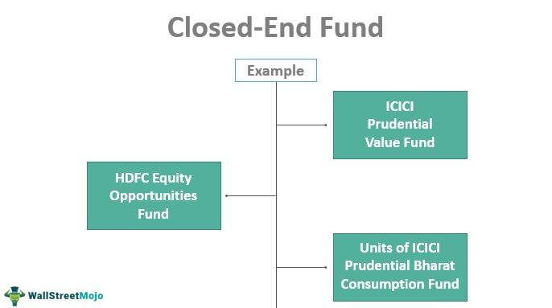

Investing in today's diverse financial landscape requires navigating a multitude of options designed to optimize returns while managing risks. Among the myriad of investment vehicles, mutual funds, closed-end funds, and algorithmic trading stand out as significant opportunities for investors seeking to achieve their financial goals. Each of these options offers distinct characteristics, advantages, and potential drawbacks that are crucial for investors to understand for effective portfolio management.

Mutual funds are a popular choice among investors due to their ability to provide a diversified portfolio managed by professionals. This makes them particularly appealing to those who prefer a more passive approach to investing. With continuous share issuance and redemption based on investor demand, mutual funds offer a level of liquidity that can be advantageous in various market conditions.



Closed-end funds, on the other hand, introduce a different dynamic by issuing a fixed number of shares that trade on public exchanges. This feature can lead to price fluctuations independent of their net asset value (NAV), presenting unique opportunities for trading at premiums or discounts. Such characteristics may appeal to investors looking for strategic investment options that can potentially offer higher returns.

Algorithmic trading is revolutionizing investment strategies by leveraging computer algorithms to execute trades with enhanced speed, precision, and cost-effectiveness. By reducing human error and exploiting market conditions more efficiently, algorithmic trading has become an integral part of modern investment practices. However, this also introduces new challenges, including increased technological reliance and the need for robust risk management.

This article explores mutual funds, closed-end funds, and algorithmic trading as prominent investment options. By highlighting their characteristics, benefits, and potential drawbacks, we aim to provide investors with the knowledge needed to navigate these options effectively. Furthermore, we will examine how algorithmic trading is reshaping traditional investment strategies, offering a nuanced approach to achieving financial success in today's markets.

## Table of Contents

## Understanding Mutual Funds

Mutual funds are a popular investment option that function as open-end funds and allow for continuous issuance and redemption of shares based on investor demand. This structure contrasts with closed-end funds, which have a fixed number of shares trading on public exchanges. The primary objective of mutual funds is to provide individual investors access to a professionally managed, diversified portfolio, appealing to those interested in a hands-off investment approach.

### Structure and Functioning

In a mutual fund, an asset management company pools money from multiple investors to purchase a broad range of securities, such as stocks, bonds, or other assets. The fund's value is determined by the net asset value (NAV), calculated daily as the total value of its assets minus its liabilities, divided by the number of outstanding shares. This daily valuation ensures that investors can buy or redeem shares at a price reflective of the current value of the underlying assets.

### Advantages

1. **Liquidity**: Mutual funds offer a high degree of liquidity, allowing investors to buy or sell shares at the end of each trading day at the NAV. This flexibility makes them suitable for investors who may need to access their money quickly.

2. **Professional Management**: Funds are managed by experienced professionals who make investment decisions guided by the fund's objectives. This is particularly beneficial for investors without the time or expertise to manage their portfolios.

3. **Diversification**: By investing in a variety of assets, mutual funds reduce the risk associated with investing in individual securities. Diversification helps mitigate the impact of poor performance of a single investment on the overall portfolio.

### Considerations

Despite their advantages, investors should be aware of certain drawbacks associated with mutual funds:

- **Management Fees**: To cover the costs of professional portfolio management, mutual funds charge fees and expenses, such as management fees, administrative fees, and, in some cases, sales charges. These fees can affect overall returns, especially in actively managed funds where fees tend to be higher.

- **Potential Dilution of Returns**: The open-end nature of mutual funds can lead to dilution of returns. As new investors buy into the fund, the impact of the underlying assets' performance is spread across a larger pool of shares, which might affect the distribution of returns to individual investors.

### Conclusion

Mutual funds are designed for investors seeking a combination of [liquidity](/wiki/liquidity-risk-premium), professional management, and diversification. However, due consideration should be given to the associated costs and potential impact on returns when choosing this investment vehicle. By understanding these aspects, investors can make informed decisions that align with their financial goals.

## Exploring Closed-End Funds

Closed-end funds are investment vehicles that offer a fixed number of shares, which distinguishes them from their open-end counterparts. These shares are traded on public exchanges, much like individual stocks. This market-traded nature introduces an interesting characteristic: the market price of closed-end fund shares can fluctuate independently of their net asset value (NAV). This discrepancy creates opportunities for strategic investors who can capitalize on shares trading at premiums or discounts relative to their NAV.

A key feature of closed-end funds is their ability to employ strategies that may not be viable for open-end funds. One such strategy is leveraging, which involves borrowing capital to amplify potential returns on investment. Leveraging can magnify gains in favorable market conditions, but it also increases the risk of losses if the market moves against the investment. The closed structure of these funds allows them to maintain a stable capital pool without the need to accommodate continuous inflows and outflows from investors, which is a requirement for open-end funds.

Moreover, closed-end funds often engage in specialized investment strategies, leveraging the expertise of fund managers to explore niche markets or asset classes that may not be suitable for open-end funds due to liquidity constraints or regulatory limitations. The fixed capital of closed-end funds enables this flexibility, allowing fund managers to take a long-term view and potentially generate higher returns.

Investors considering closed-end funds should be aware of the inherent risks and complexities involved, particularly concerning market price fluctuations relative to NAV and the potential impact of leveraging. Proper due diligence and an understanding of both the benefits and drawbacks are crucial for making informed investment decisions.

## Algorithmic Trading: A Game Changer

Algorithmic trading relies on sophisticated computer algorithms to execute trades with unparalleled speed and precision, transforming the investment management landscape. By automating trade decisions based on predefined criteria, this approach minimizes human involvement, thereby reducing errors often associated with manual trading. The core advantage of [algorithmic trading](/wiki/algorithmic-trading) lies in its ability to process vast data sets and execute orders at a speed and frequency beyond human capability, resulting in improved cost-effectiveness and performance optimization.

One primary benefit is the efficient exploitation of market conditions. Algorithms can analyze multiple market parameters, such as price movements, [volume](/wiki/volume-trading-strategy), and timing, to identify profitable trading opportunities, often in real-time. This analytical prowess enables fund managers to make informed decisions swiftly, enhancing portfolio returns while managing risk exposure effectively.

However, algorithmic trading is not without its challenges. The heavy reliance on technology necessitates a robust IT infrastructure and continuous system updates to prevent glitches that could have significant financial repercussions. Moreover, the complexity of algorithms requires rigorous testing and validation to avoid flawed logic that could lead to substantial losses. To counter these risks, a comprehensive risk management strategy is paramount, incorporating elements such as fail-safes, [backtesting](/wiki/backtesting), and ongoing performance monitoring.

Additionally, the regulatory landscape poses another set of challenges. Algorithmic traders must ensure compliance with financial regulations, which may involve maintaining transparency and audit trails for algorithms used, adding another layer of complexity to their deployment.

In summary, algorithmic trading introduces a dynamic dimension to financial markets by enhancing execution speed and decision accuracy. Nonetheless, its implementation demands a careful balance between technological innovation and prudent risk management to harness its full potential effectively.

## Comparative Analysis: Mutual Funds vs. Closed-End Funds

Liquidity, valuation, and investor flexibility distinctly differentiate mutual funds from closed-end funds, playing a central role in influencing investment decisions. Mutual funds are characterized by their open-end nature, allowing shares to be continuously issued and redeemed at the end of each trading day at the fund's net asset value (NAV). This structure provides investors with high liquidity, making mutual funds suitable for those requiring the ability to enter and [exit](/wiki/exit-strategy) investments with ease. The straightforward processing of buying and selling shares aligns with the needs of investors who prioritize flexibility and accessibility in their financial strategies.

In contrast, closed-end funds issue a fixed number of shares and are listed on public exchanges, similar to individual stocks. These funds can trade at prices deviating from their NAV, often at a premium or a discount. This potential for trading at a discount to NAV can present strategic opportunities for investors. Those seeking higher returns may find closed-end funds appealing, as the market price can offer attractive entry points if it trades below the actual value of the underlying assets. Furthermore, closed-end funds can employ leverage to potentially enhance returns, a strategy less feasible with mutual funds due to structural constraints.

The choice between these two fund types, therefore, hinges on an investor's need for liquidity and their appetite for potential gains through market price deviations. Mutual funds demand a more conservative approach aligned with immediate liquidity and consistent NAV-based valuation, whereas closed-end funds attract investors willing to navigate the fluctuations of market pricing in pursuit of optimized returns. Understanding these core differences is essential for building an investment portfolio that aligns with financial goals and risk tolerance.

## Integrating Algo Trading into Investment Strategies

Algorithmic trading has become an integral component of contemporary investment management, significantly augmenting the efficacy of mutual and closed-end funds. By leveraging sophisticated algorithms, fund managers can execute trades at unprecedented speed and precision, often within milliseconds. This technological advancement enhances decision-making processes as algorithms are capable of analyzing vast datasets to detect market trends and price discrepancies, often unseen by the human eye.

A popular strategy within algorithmic trading is high-frequency trading ([HFT](/wiki/high-frequency-trading-strategies)), which involves executing a large number of trades at rapid speeds to capitalize on minuscule price movements. HFT relies heavily on computational algorithms to scan multiple markets and exchanges for trading opportunities, allowing traders to profit from short-lived [arbitrage](/wiki/arbitrage) opportunities. For example, the ability to simultaneously buy and sell slightly mispriced securities across different platforms can yield significant returns over time.

Quantitative models are another strategic tool used in algorithmic trading to assess and predict market behavior. These models utilize mathematical computations and statistical techniques to forecast price movements and inform trading decisions. By optimizing these models, investment managers can enhance their portfolio allocation, risk management, and return optimization strategies. Python is a commonly used language for developing such quantitative models due to its versatility and the plethora of available financial libraries like NumPy, pandas, and SciPy.

For retail investors, the advent of robo-advisors has democratized algorithmic trading by providing access to automated investment platforms. These platforms use pre-defined algorithms to construct and manage personalized investment portfolios based on individual risk profiles and financial goals. Robo-advisors continuously monitor market conditions and adjust portfolio holdings, ensuring optimal asset allocation without the need for human intervention.

```python
import numpy as np
import pandas as pd
from scipy.optimize import minimize

# Example of a simple portfolio optimization using quantitative models
def objective(weights, returns, cov_matrix):
    # Calculate the portfolio's expected return and volatility
    port_return = np.dot(weights, returns)
    port_volatility = np.sqrt(np.dot(weights.T, np.dot(cov_matrix, weights)))
    return port_volatility - port_return

# Historical market data
mean_returns = np.array([0.1, 0.12, 0.14])  # Example expected returns for 3 assets
cov_matrix = np.array([
    [0.005, -0.010, 0.004],
    [-0.010, 0.040, -0.002],
    [0.004, -0.002, 0.023]
])

# Number of assets
n_assets = len(mean_returns)

# Initial guesses
init_guess = n_assets * [1. / n_assets,]

# Constraints: weights must sum to 1
constraints = {'type': 'eq', 'fun': lambda x: np.sum(x) - 1}

# Bounds: weights must be between 0 and 1
bounds = tuple((0, 1) for asset in range(n_assets))

# Optimizing portfolio
result = minimize(objective, init_guess, args=(mean_returns, cov_matrix), method='SLSQP', bounds=bounds, constraints=constraints)

# Optimized weights
optimized_weights = result.x
```

The integration of algorithmic trading tools, such as HFT and quantitative models, coupled with robo-advisors for retail investors, allows for more sophisticated investment strategies that maximize returns and manage risks effectively. As technology continues to evolve, so too will the capabilities and accessibility of algorithmic trading, further transforming the landscape of investment management.

## Conclusion

Investors face the crucial task of evaluating their financial objectives, risk tolerance, and prevailing market conditions when deciding between mutual funds and closed-end funds. Both fund types have merits: mutual funds offer liquidity and professional management, attracting those who prefer a straightforward approach, while closed-end funds present unique opportunities through trading at premiums or discounts to the net asset value, appealing to investors seeking strategic advantages.

The advent of algorithmic trading introduces an additional layer to this decision-making process, offering improved trade execution, minimized human error, and the ability to capitalize on fleeting market opportunities. Incorporating algorithmic trading into investment strategies can enhance the management of both mutual and closed-end funds, allowing for dynamic and responsive portfolio management that aligns with investors' financial objectives.

By thoroughly understanding these components, investors are better equipped to create a diversified portfolio that aligns with their financial ambitions, balancing the potential for returns with an acceptable level of risk. Whether choosing the liquidity and structure of mutual funds or the strategic opportunities of closed-end funds, complemented by algorithmic trading, achieving financial goals becomes a more structured and informed endeavor.

## FAQs

## FAQs

**What are the main differences between mutual and closed-end funds?**

Mutual funds and closed-end funds differ primarily in their structure and trading mechanisms. Mutual funds are open-end investment vehicles that continuously issue and redeem shares at their net asset value (NAV) based on investor demand. This feature provides high liquidity, as investors can buy or sell shares at the NAV at the end of each trading day. Closed-end funds, conversely, issue a fixed number of shares during an initial public offering (IPO) and subsequently trade on stock exchanges like individual stocks. The market price of closed-end funds can fluctuate above or below the NAV, influenced by supply and demand dynamics, often resulting in shares trading at a premium or discount.

**How does algorithmic trading improve investment strategies?**

Algorithmic trading enhances investment strategies by leveraging computer algorithms to execute trades at high speed and precision, reducing latency and transaction costs. Algorithms analyze vast datasets to identify patterns or arbitrage opportunities not easily discernible by humans. For example, an algorithm might use [statistical arbitrage](/wiki/statistical-arbitrage) to exploit price discrepancies across different markets. Python is commonly used to code such algorithms. Here's a simple example:

```python
import numpy as np

def simple_moving_average(prices, window):
    return np.convolve(prices, np.ones(window)/window, 'valid')

prices = [10, 11, 12, 11, 13, 14, 15]
window = 3
sma = simple_moving_average(prices, window)
print(sma)
```

This code calculates the simple moving average, helping identify trends which the algorithm can exploit.

**Are closed-end funds riskier than mutual funds?**

Closed-end funds can be riskier than mutual funds due to their price [volatility](/wiki/volatility-trading-strategies) and potential for leverage. Unlike mutual funds, closed-end funds can trade at significant discounts or premiums to their NAV, introducing market price risk. Additionally, many closed-end funds employ leverage to enhance returns, which also amplifies potential losses. On the other hand, mutual funds, with their daily redemption feature at NAV, offer a more stable valuation and typically restrict leverage, leading to lower price volatility.

**How can one incorporate algorithmic trading into their investment strategy?**

Incorporating algorithmic trading into an investment strategy involves several key steps. First, identify an investment objective and develop a trading strategy supported by statistical analysis. Next, code the algorithm using a language like Python to automate the decision-making process based on predetermined conditions. Backtest the algorithm using historical data to evaluate performance and adjust parameters as necessary. Finally, implement strong risk management practices, such as setting stop-losses and position limits, to mitigate potential losses. Retail investors can also use robo-advisors for a simplified approach to algorithmic portfolio management.

**Can mutual and closed-end funds coexist in a diversified portfolio?**

Mutual and closed-end funds can coexist in a diversified portfolio by leveraging their distinct advantages to balance risk and return. Mutual funds provide liquidity and stability, making them suitable for core holdings that require regular access to capital. Closed-end funds, offering the potential for higher returns through trading at NAV discounts or employing leverage, can complement the portfolio with targeted exposures to capture specific market opportunities. By combining both fund types, investors can achieve diversification across asset classes, investment strategies, and liquidity profiles, aligning their portfolio with their financial goals and risk tolerance.

## References & Further Reading

[1]: Bergstra, J., Bardenet, R., Bengio, Y., & Kégl, B. (2011). ["Algorithms for Hyper-Parameter Optimization."](https://dl.acm.org/doi/10.5555/2986459.2986743) Advances in Neural Information Processing Systems 24.

[2]: ["Advances in Financial Machine Learning"](https://www.amazon.com/Advances-Financial-Machine-Learning-Marcos/dp/1119482089) by Marcos Lopez de Prado

[3]: ["Evidence-Based Technical Analysis: Applying the Scientific Method and Statistical Inference to Trading Signals"](https://www.amazon.com/Evidence-Based-Technical-Analysis-Scientific-Statistical/dp/0470008741) by David Aronson

[4]: ["Machine Learning for Algorithmic Trading"](https://github.com/stefan-jansen/machine-learning-for-trading) by Stefan Jansen

[5]: ["Quantitative Trading: How to Build Your Own Algorithmic Trading Business"](https://github.com/LucindaYa/quant-resources/blob/master/Quantitative%20Trading%20How%20to%20Build%20Your%20Own%20Algorithmic%20Trading%20Business.pdf) by Ernest P. Chan