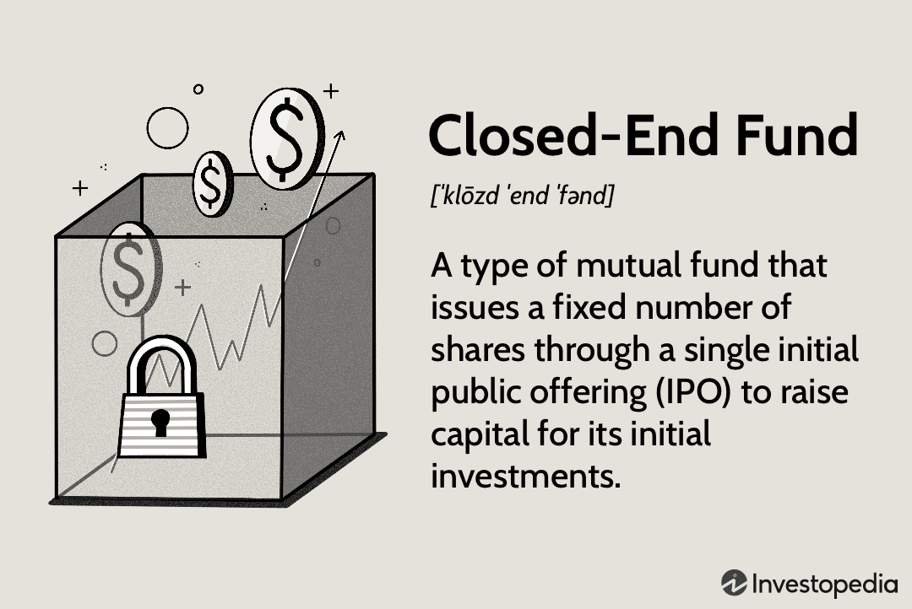

Navigating the world of investments can be complex, with numerous options available to investors. Among these options, closed-end and open-end funds offer distinct pathways for diversification and maximizing returns. Closed-end funds are known for their fixed-share issuance and trading on stock exchanges, which can offer unique advantages and risks. Conversely, open-end funds provide flexibility with continuous share issuance and redemption based on investor demand.

In recent years, algorithmic trading has revolutionized the investment landscape by introducing automation and precision to trading practices. By leveraging sophisticated algorithms, investors can enhance the speed and accuracy of trades, minimize human error, and improve cost efficiency. This technological advancement has significantly impacted both closed-end and open-end funds, altering how these funds are managed and traded.



This article explores the interplay between closed-end funds, mutual funds, and algorithmic trading, highlighting the benefits and challenges associated with each. Our goal is to equip investors with the knowledge needed to make informed decisions amidst these complex financial instruments and strategies. Understanding their unique characteristics and the integration of algorithmic trading will empower investors to navigate the investment landscape more effectively.

## Table of Contents

## What Are Investment Closed-End Funds?

Closed-end funds are a distinct category of mutual fund, characterized by issuing a fixed number of shares during an initial public offering (IPO). Once the shares are issued, the fund does not offer additional shares, nor does it redeem shares directly from investors, differentiating it from open-end funds. This closed structure permits these funds to be traded on stock exchanges similarly to individual securities, allowing market supply and demand to dictate their price rather than the net asset value (NAV) seen in open-end mutual funds.

The fixed-share structure of closed-end funds means that investors seeking to buy or sell shares must do so on the secondary market. This effectively severs the direct connection between investors and the fund manager for transactions, often resulting in the market price of the fund diverging from its underlying NAV. This disparity can present both opportunities and risks for investors, as shares may trade at a premium or discount relative to their NAV.

This setup affords certain advantages to closed-end funds, particularly in terms of strategic investment. The absence of redemption pressures allows fund managers to pursue longer-term, less liquid investments without concern for meeting potential redemptions, which can plague open-end funds during market downturns. Additionally, closed-end funds can leverage their assets, borrowing capital to potentially enhance returns—though this comes with increased risk.

However, the closed-end structure also introduces specific risks. The [liquidity](/wiki/liquidity-risk-premium) of closed-end funds can be relatively constrained, as investors depend on reaching buyers in the public market who are willing to match the desired selling price. Moreover, the potential for share prices to significantly deviate from NAV necessitates that investors remain aware of market conditions and sentiment.

In summary, closed-end funds represent a unique investment vehicle, providing opportunities to invest with a stable capital structure and the potential for premium returns via leverage. Despite these benefits, investors must navigate complexities such as pricing dynamics and market liquidity. This nuanced approach to investing requires diligent analysis and a keen understanding of market forces to maximize potential gains while minimizing inherent risks.

## Understanding Mutual Funds

Mutual funds are financial vehicles designed to pool capital from multiple investors in order to invest in a diversified portfolio of assets, which can include stocks, bonds, and other securities. They cater to investors by providing professional management, spreading investment risk, and requiring relatively small initial contributions, making them accessible to a broad audience.

Open-end mutual funds stand out for their operational flexibility, characterized by continuous issuance and redemption of shares. Investors can buy or sell units of these funds at the end of each trading day, with transactions executed at the fund's current net asset value (NAV). The NAV is a critical metric calculated daily by dividing the total value of the fund’s assets minus its liabilities by the number of outstanding shares. The formula is given by:

$$
\text{NAV} = \frac{\text{Total Assets} - \text{Total Liabilities}}{\text{Outstanding Shares}}
$$

This daily valuation ensures that the buying and selling prices accurately reflect the current market value of the underlying assets, promoting price transparency and fairness for all investors involved.

The professional management of mutual funds involves decisions about the portfolio's asset allocation, security selection, and periodic rebalancing to align with investment objectives. Fund managers utilize their expertise and market research to make informed investment decisions, aiming to optimize returns while managing risk in accordance with the fund's stated strategy and objectives.

Furthermore, mutual funds offer diversified portfolios, inherently reducing investment risk compared to investing in single securities. Diversification is achieved by spreading investments across various asset classes or sectors, which mitigates the impact of poor performance by any single investment. This characteristic is particularly beneficial for retail investors who might lack the resources or expertise to build a diversified portfolio independently.

Investors in mutual funds benefit from economies of scale, as the pooled capital lowers transaction costs and provides access to a wider array of investment opportunities, including those that may require significant minimum investments. This access is instrumental for individual investors looking to participate in more sophisticated investment strategies or markets that would normally be out of reach.

In summary, mutual funds offer a practical investment solution by pooling resources to create professionally managed, diversified portfolios. Their structure allows for continuous adaptation to market conditions via daily NAV calculations and open-end redemption mechanisms, providing a balance between liquidity, diversification, and professional expertise.

 to Algorithmic Trading

Algorithmic trading, often referred to as algo trading, involves the use of computer algorithms to execute trading orders with precision and speed that far surpass human capabilities. The core feature of [algorithmic trading](/wiki/algorithmic-trading) is its ability to leverage advanced mathematical models and data analysis to optimize trading strategies, thereby enhancing the overall efficiency of financial markets.

At its foundation, algorithmic trading automates the decision-making process by following a defined set of instructions and parameters, which might include timing, price, quantity, and other factors critical for executing trades. This automated process significantly mitigates human errors that may arise from emotional decision-making or miscalculations, offering a higher degree of accuracy and precision. For instance, a simple algorithm might be designed to buy 50 shares of a stock when its 50-day moving average surpasses the 200-day moving average.

The automation in algo trading translates to considerable cost efficiency for managing funds. By minimizing the need for manual intervention, it reduces transaction costs and improves the speed of execution, ensuring that trades are carried out at optimal prices. This efficiency is particularly beneficial in high-frequency trading environments where even milliseconds can impact profitability.

Algorithmic trading has become increasingly prevalent in the management of both closed-end and open-end funds. For closed-end funds, which have a fixed number of shares, algorithmic trading provides liquidity and aids in finding the best trading opportunities without affecting the fund's market dynamics. In open-end funds, where flexibility in share issuance and redemption is vital, algo trading helps manage the daily inflows and outflows more effectively.

As technology continues to evolve, the use of algorithmic trading in fund management is expected to become even more widespread. This evolution will likely bring greater sophistication to financial markets, offering investors new avenues for improving their investment strategies through enhanced data analysis and automated precision.

## Benefits and Risks of Closed-End Funds

Closed-end funds are investment vehicles that offer unique opportunities for investors seeking concentrated exposure and potentially higher yields. One of the main advantages of closed-end funds is their ability to use leverage. By borrowing capital, these funds can amplify their investment exposure, thereby increasing potential returns. This leverage can lead to higher yields compared to traditional investments, but it also introduces additional risk, especially in volatile markets.

In illiquid markets, closed-end funds provide significant advantages due to their fixed share structure. Unlike open-end funds, where shares can be redeemed based on investor demand, closed-end funds maintain a fixed number of shares trading on the stock exchange. This stability allows fund managers to hold onto investments without the pressure of fluctuating share redemptions, which can be particularly beneficial in markets where liquidity is constrained. Fixed shares mean that managers can execute long-term investment strategies with greater confidence and without the need to liquidate assets to meet redemption demands.

However, closed-end funds also come with inherent risks. A notable risk is the divergence between the market price and the net asset value (NAV) of the fund. Since closed-end funds trade like individual securities, their market price is subject to supply and demand dynamics, which can lead to trading at a premium or a discount to the NAV. This divergence can affect the overall return for investors, depending on whether the fund is bought or sold at a premium or discount.

Another risk is potential illiquidity. While the fixed share structure can be advantageous in certain markets, it also means that investors looking to [exit](/wiki/exit-strategy) a position must do so through the secondary market, potentially facing price fluctuations and liquidity issues. This limitation can be a significant concern for investors requiring quick access to their invested capital.

Overall, the structure of closed-end funds allows managers to focus on long-term strategies without the distractions of ongoing redemptions. This benefit makes them suitable for investors with a higher risk tolerance who are comfortable with the potential for price fluctuations and are seeking exposure to leveraged investments in less liquid markets. Understanding these benefits and risks is crucial for investors aiming to effectively navigate the closed-end fund landscape.

## Closed-End Funds vs. Open-End Funds

Open-end and closed-end funds represent two distinct structures in the investment spectrum, each presenting unique features regarding liquidity, capital stability, and pricing dynamics.

Open-end funds, commonly known as mutual funds, are characterized by their flexibility in issuing and redeeming shares. The liquidity of these funds is one of their standout features, as investors can buy and sell shares directly from the fund at any time. The transaction price is dictated by the Net Asset Value (NAV) per share, which is recalculated daily based on the market values of the fund's underlying assets. This ability to continually adjust shares based on investor transactions ensures that the fund's size can expand or contract as needed, providing a high level of liquidity to investors.

Conversely, closed-end funds operate with a fixed number of shares following their initial public offering (IPO). These shares trade on stock exchanges much like individual securities. A significant characteristic of closed-end funds is their stable level of capital, as they do not engage in the continuous issuance or redemption of shares. However, this also means that the market price of a closed-end fund's shares can diverge from its NAV, often trading at a premium or discount based on supply and demand dynamics rather than merely the value of underlying assets.

The structural differences between closed-end and open-end funds lead to divergent strategies in portfolio management and investor suitability. Open-end funds cater to investors prioritizing liquidity and less volatile pricing aligned with NAV. These funds adjust their portfolios in response to inflows and outflows, accommodating investors who need to access their capital readily.

In contrast, closed-end funds appeal to those willing to accept market price fluctuations in exchange for potentially higher returns and capital stability. The fixed capital structure allows managers to employ long-term investment strategies without the pressure of meeting redemption requests, which can be advantageous in less liquid markets. The lack of redemption-driven trades enables managers to maintain a consistent investment approach, potentially exploiting market inefficiencies.

Selecting between these two fund types requires careful consideration of an investor’s liquidity needs, risk tolerance, and market conditions. Open-end funds offer a liquid investment with low entry and exit barriers, suitable for those seeking moderate risk and regular access to their investments. Closed-end funds offer opportunities for gains through market price movements and strategic leverage, attracting those comfortable with greater risk and longer investment horizons. Understanding these distinctions is crucial in tailoring investment strategies to align with personal financial goals and market outlooks.

## How Algorithmic Trading Enhances Fund Management

Algorithmic trading has significantly transformed fund management by enhancing the proficiency and execution capabilities of trades. This approach leverages sophisticated computer programs to make quick and precise trading decisions, optimizing both the timing and pricing of transactions which in turn can benefit fund performance. By utilizing algorithms, fund managers can execute multiple trades with increased precision, thus reducing transaction costs and potentially leading to higher net gains for investors.

Algorithms are primarily designed to process vast amounts of market data and execute trades based on pre-defined criteria or adaptive strategies. This allows funds to react promptly to market changes, capturing opportunities that might be missed in manual trading. For example, an algorithm can identify [arbitrage](/wiki/arbitrage) opportunities or execute a large buy order in small batches to minimize market impact, thereby improving execution quality.

Consider a simple Python example where a moving average crossover strategy is implemented. This strategy involves buying when a short-term moving average crosses above a long-term moving average and selling when the opposite occurs:

```python
import pandas as pd

def moving_average_strategy(prices, short_window=40, long_window=100):
    signals = pd.DataFrame(index=prices.index)
    signals['price'] = prices
    signals['short_mavg'] = prices.rolling(window=short_window, min_periods=1, center=False).mean()
    signals['long_mavg'] = prices.rolling(window=long_window, min_periods=1, center=False).mean()

    # Generate signals
    signals['signal'] = 0.0
    signals['signal'][short_window:] = np.where(signals['short_mavg'][short_window:] > signals['long_mavg'][short_window:], 1.0, 0.0)   
    signals['positions'] = signals['signal'].diff()

    return signals

# Example usage
# prices = pd.Series(data_here) # Assume 'data_here' is a time series of stock prices
# signals = moving_average_strategy(prices)
```

This code snippet calculates two moving averages over a pricing data set and generates trading signals. Such methods are computationally efficient and significantly contribute to precise decision-making processes in fund management.

However, as with any technological advancement, there are inherent risks associated with algorithmic trading. The reliance on technology means that any errors in the data or flaws in the algorithm can lead to significant financial repercussions. It's crucial that funds incorporate robust oversight mechanisms to continuously monitor these algorithms. This oversight helps in mitigating risks such as erroneous trades or excessive trading volumes that could disrupt market dynamics.

To ensure algorithms operate effectively, fund managers must employ testing strategies and real-time monitoring systems. Backtesting with historical data is also essential to validate the strategies before live deployment. This combined approach can help manage risks while reaping the benefits of reduced costs and improved performance.

In sum, algorithmic trading significantly enhances fund management by optimizing trade execution and efficiency. Although it offers many advantages like cost reduction and increased precision, careful oversight and thorough risk management strategies are vital to harness its full potential without incurring unintended consequences.

## Future of Closed-End Funds with Algorithmic Trading

As technology advances, algorithmic trading is expected to increasingly shape the operations of closed-end funds, offering potential for enhanced returns and improved efficiency. The integration of algorithmic trading into these funds harnesses high-frequency trading and data-driven strategies, potentially increasing returns and improving risk management.

Algorithmic trading allows for the execution of trades at speeds and efficiencies that are impractical for human traders. By utilizing pre-programmed instructions and considering variables such as price, timing, and [volume](/wiki/volume-trading-strategy), algorithms can facilitate more advantageous trades. This becomes particularly beneficial for closed-end funds, which operate with a fixed capital structure, as it can mitigate some liquidity constraints inherent in such setups. Algorithms can thus exploit market inefficiencies and execute trades that capitalize on short-term fluctuations without affecting the stable capital structure of the closed-end fund.

Despite these advantages, algorithmic trading in closed-end funds presents notable complexities and operational challenges. The implementation requires sophisticated systems capable of handling large volumes of data and executing trades in milliseconds. Moreover, as exemplified in the 2010 Flash Crash, algorithmic trading systems can cause significant market disruptions if not properly regulated and monitored.

Balancing these advancements, closed-end fund managers must remain vigilant about the operational risks associated with algorithmic trading. Robust risk management frameworks and oversight protocols are essential to mitigate the potential negative effects that algorithm malfunctions or misconfigurations might cause. This includes regular audits of algorithms, employing fail-safes to detect anomalies, and ensuring alignment with broader fund strategies.

Understanding these benefits and risks is essential for leveraging algorithmic trading in closed-end funds effectively. As algorithmic trading continues to evolve, it is imperative for fund managers and investors to maintain an informed perspective, adapting their investment strategies to harness the technological advancements while mitigating associated risks. This nuanced approach will be pivotal in optimizing the operations of closed-end funds in an increasingly automated financial landscape.

## Conclusion

In the contemporary financial landscape, closed-end funds and algorithmic trading both provide investors with substantial opportunities along with their associated challenges. It is crucial for investors to comprehend the complexities and functionalities of these financial tools to make strategic and informed decisions.

Closed-end funds, with their fixed number of shares, offer a stable pool of capital that isn't influenced by investor redemption demands. This characteristic allows fund managers the freedom to pursue long-term investment strategies without the pressure of having to redeem or issue new shares, unlike open-end funds. However, the challenge lies in the price [volatility](/wiki/volatility-trading-strategies) of closed-end funds, which can deviate significantly from their net asset value (NAV) due to market demands. Understanding the interplay between market forces and NAV becomes essential for investors interested in closed-end funds.

Algorithmic trading, on the other hand, introduces precision and speed to trade execution. It minimizes human error and leverages data-driven strategies to optimize trading outcomes. For funds, especially those managing large capital, algorithmic trading can lead to improved cost efficiencies and better timing of trades. However, the risks associated with algorithmic trading—such as errors in code or data feed issues—demand vigilant oversight and robust risk management frameworks.

For investors, the integration of algorithmic trading with closed-end funds opens potential pathways for improved returns by enhancing trade execution and operational efficiency. Nevertheless, the evolving nature of technology and markets means that these potential benefits must be weighed against the complexities they introduce. Navigating this space requires a comprehensive understanding not only of each individual financial instrument but also of how they interact within broader investment strategies.

In conclusion, the dual consideration of closed-end funds and algorithmic trading necessitates a clear understanding of their implications on investment dynamics. By grasping both operational frameworks and market behaviors, investors can better align their strategies with their financial goals, thus maximizing the benefits while mitigating inherent risks.

## References & Further Reading

[1]: Bergstra, J., Bardenet, R., Bengio, Y., & Kégl, B. (2011). ["Algorithms for Hyper-Parameter Optimization."](https://dl.acm.org/doi/10.5555/2986459.2986743) Advances in Neural Information Processing Systems 24.

[2]: ["Advances in Financial Machine Learning"](https://www.amazon.com/Advances-Financial-Machine-Learning-Marcos/dp/1119482089) by Marcos Lopez de Prado

[3]: ["Evidence-Based Technical Analysis: Applying the Scientific Method and Statistical Inference to Trading Signals"](https://www.amazon.com/Evidence-Based-Technical-Analysis-Scientific-Statistical/dp/0470008741) by David Aronson

[4]: ["Machine Learning for Algorithmic Trading"](https://github.com/stefan-jansen/machine-learning-for-trading) by Stefan Jansen

[5]: ["Quantitative Trading: How to Build Your Own Algorithmic Trading Business"](https://www.amazon.com/Quantitative-Trading-Build-Algorithmic-Business/dp/1119800064) by Ernest P. Chan

[6]: Elton, E. J., Gruber, M. J., & Blake, C. R. (2011). ["The Rationality of Fund Families: The Investment Performance of Open-End and Closed-End Funds."](https://www.jstor.org/stable/2353461) Journal of Financial Economics.

[7]: Agarwal, V., & Naik, N. Y. (2004). ["Risks and Portfolio Decisions Involving Hedge Funds."](https://www.jstor.org/stable/1262669) The Review of Financial Studies, 17(1), 63-98.