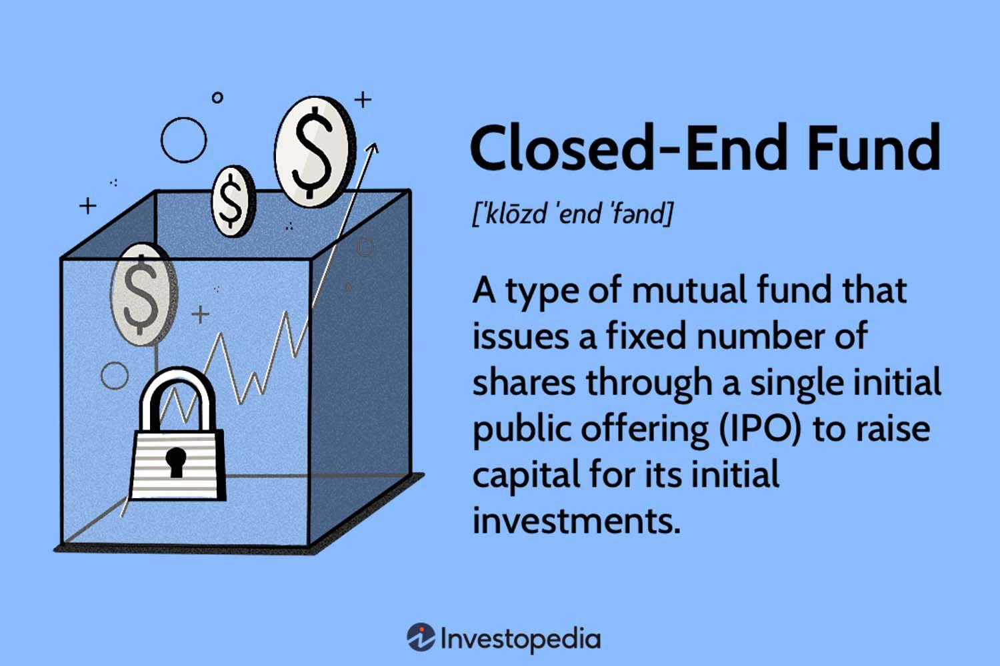

## Table of Contents

## What is a closed-end fund in mutual fund investing?

A closed-end fund is a type of investment fund that works differently from the more common open-end mutual funds. In a closed-end fund, the company that manages the fund sells a fixed number of shares to investors through an initial public offering (IPO). After the IPO, these shares are traded on a stock exchange, just like regular stocks. This means the price of the shares can go up or down based on what investors are willing to pay, and it might not match the value of the investments the fund holds.

Because the number of shares in a closed-end fund doesn't change after the IPO, the fund manager doesn't have to buy or sell investments when investors want to put money in or take it out. This can be good because it lets the manager focus on long-term goals without worrying about short-term money movements. However, it also means that if you want to buy or sell shares, you have to do it through the stock market, and the price you get might be higher or lower than the actual value of the fund's investments.

## How does a closed-end fund differ from an open-end fund?

A closed-end fund and an open-end fund are two different ways to invest money, and they work in different ways. A closed-end fund starts by selling a set number of shares to people through something called an initial public offering (IPO). After that, these shares are traded on a stock exchange, kind of like buying and selling regular stocks. This means the price you pay for a share can be different from what the fund's investments are actually worth. On the other hand, an open-end fund doesn't have a fixed number of shares. Instead, it keeps selling new shares to new investors and buying back shares from people who want their money back. The price of an open-end fund's shares is based directly on the value of the investments it holds, which is called the net asset value (NAV).

The way these funds handle money coming in and going out is also different. In a closed-end fund, since the number of shares doesn't change after the IPO, the fund manager doesn't need to worry about buying or selling investments every time someone wants to invest or take their money out. This can help the manager focus on long-term goals without being bothered by short-term money movements. But if you want to buy or sell shares in a closed-end fund, you have to do it on the stock market, and the price might not match the value of the fund's investments. In contrast, an open-end fund has to be ready to buy back shares whenever someone wants to sell, which means the fund manager might need to sell some of the fund's investments to give people their money back. This can affect the fund's performance, especially if a lot of people want their money back at the same time.

## What are the key features of a closed-end fund?

A closed-end fund is a type of investment where a company sells a fixed number of shares to people through an initial public offering (IPO). After the IPO, these shares are traded on a stock exchange, just like regular stocks. This means the price of the shares can go up or down based on what investors are willing to pay, and it might not match the actual value of the investments the fund holds. Because the number of shares in a closed-end fund doesn't change after the IPO, the fund manager doesn't need to buy or sell investments when people want to put money in or take it out. This can be good because it lets the manager focus on long-term goals without worrying about short-term money movements.

However, if you want to buy or sell shares in a closed-end fund, you have to do it through the stock market. This means the price you get might be higher or lower than the actual value of the fund's investments. This difference between the market price and the actual value of the investments is called the premium or discount. Closed-end funds can be a good choice for people who want to invest in a way that's not affected by people putting money in or taking it out all the time, but they need to be aware that the price they pay or get for their shares might not be exactly what they expect.

## How are shares of a closed-end fund bought and sold?

Shares of a closed-end fund are bought and sold on a stock exchange, just like regular stocks. When a closed-end fund first starts, it sells a fixed number of shares to people through something called an initial public offering (IPO). After that, if you want to buy shares, you have to find someone who already owns them and is willing to sell them to you. The price you pay depends on what other people are willing to pay, and it might not be the same as the actual value of the investments the fund holds.

If you want to sell your shares in a closed-end fund, you also have to do it through the stock exchange. You need to find someone who wants to buy them from you. The price you get for your shares depends on what other people are willing to pay, and it might be higher or lower than the actual value of the fund's investments. This difference between the market price and the actual value is called a premium or a discount.

## What are the advantages of investing in closed-end funds?

One big advantage of investing in closed-end funds is that they can focus on long-term goals without worrying about people putting money in or taking it out all the time. Because the number of shares doesn't change after the initial public offering, the fund manager doesn't have to buy or sell investments just because someone wants to invest or get their money back. This can help the manager make better decisions for the long run and possibly get better returns for investors.

Another advantage is that closed-end funds can sometimes be bought at a discount. This means you might be able to buy the shares for less than what the investments inside the fund are actually worth. If the price of the shares goes up to match the value of the investments, you could make a profit. Plus, some closed-end funds pay out regular dividends, which can give you a steady income while you wait for the price to go up.

## What are the potential risks associated with closed-end funds?

One risk of investing in closed-end funds is that the price you pay for the shares might be different from the actual value of the investments inside the fund. This difference is called a premium or a discount. If you buy at a premium, you're paying more than the investments are worth, and if the price goes down to match the real value, you could lose money. If you buy at a discount, it might seem like a good deal, but there's no guarantee the price will go up to the real value, and you could still lose money if the investments don't do well.

Another risk is that closed-end funds can be less liquid than other types of investments. Because they trade on a stock exchange like regular stocks, there might be times when it's hard to find someone to buy your shares if you want to sell them. This can be a problem if you need your money back quickly. Also, the fund manager's focus on long-term goals means they might not be able to take advantage of short-term opportunities, which could affect the fund's performance.

Lastly, closed-end funds often use borrowed money, or leverage, to try to increase their returns. While this can lead to higher profits, it also increases the risk. If the investments don't perform well, the losses can be bigger because of the borrowed money. So, it's important to understand how much leverage a closed-end fund is using before you decide to invest.

## How does the pricing of closed-end funds work, including premiums and discounts?

The price of shares in a closed-end fund is decided by what people are willing to pay for them on the stock exchange. This means the price can be different from the actual value of the investments inside the fund. The actual value of the investments is called the net asset value (NAV). If the price of the shares is higher than the NAV, it's called a premium. If the price is lower than the NAV, it's called a discount. So, when you buy shares in a closed-end fund, you might be paying more or less than what the investments are really worth.

Premiums and discounts happen because of things like how popular the fund is, how well it's doing, and how much people want to buy or sell the shares. If a lot of people want to buy the shares and not many want to sell, the price might go up and create a premium. If more people want to sell than buy, the price might go down and create a discount. This difference between the market price and the NAV can be a risk, because if you buy at a premium and the price goes down to the NAV, you could lose money. But if you buy at a discount and the price goes up to the NAV, you could make a profit.

## What role do dividends and distributions play in closed-end funds?

Dividends and distributions are important for people who invest in closed-end funds. These funds often pay out regular dividends, which can give investors a steady income. This is good for people who want to get money from their investments regularly, like retirees. The dividends come from the income the fund makes from its investments, like interest from bonds or dividends from stocks. Sometimes, closed-end funds also make special distributions, which can be from selling investments at a profit or from other types of income.

The way closed-end funds handle dividends and distributions can be different from other types of funds. Because closed-end funds have a fixed number of shares, the fund manager doesn't have to worry about people putting money in or taking it out all the time. This means they can focus on making the most income from the investments they have. But, the dividends and distributions can affect the price of the shares on the stock market. If the fund pays out a lot of money, the price of the shares might go down because the value of the fund goes down. But, if the dividends are high and people like them, it might make the shares more popular and push the price up.

## How can leverage be used in closed-end funds and what are its implications?

Closed-end funds sometimes use something called leverage to try to make more money for investors. Leverage means borrowing money to buy more investments than the fund could with just the money from investors. For example, if a closed-end fund has $100 million from investors, it might borrow another $50 million to invest a total of $150 million. This can be good because if the investments do well, the fund can make more money and pay higher dividends to investors. But it's also riskier because if the investments don't do well, the losses can be bigger because of the borrowed money.

Using leverage in closed-end funds can affect the price of the shares on the stock exchange. If the fund is doing well and making more money because of the leverage, the price of the shares might go up, and investors might be happy with the higher dividends. But if the investments start losing money, the price of the shares can go down quickly because the losses are bigger. Also, the fund has to pay interest on the borrowed money, which can eat into the profits and make it harder to pay dividends. So, it's important for investors to understand how much leverage a closed-end fund is using and to be ready for the extra risk that comes with it.

## What are some strategies for selecting a closed-end fund for investment?

When [picking](/wiki/asset-class-picking) a closed-end fund to invest in, it's important to look at the fund's investment goal and how well it has done in the past. You want to choose a fund that fits with what you want to achieve with your money. For example, if you want regular income, you might pick a fund that focuses on paying out high dividends. Also, looking at how the fund has done over time can give you an idea of how good the fund manager is at picking investments. But remember, past results don't guarantee future success, so it's also good to check if the fund's strategy makes sense for the future.

Another thing to think about is the price you're paying for the shares compared to what the investments inside the fund are really worth. This is called the premium or discount. If you can buy the shares at a discount, it might be a good deal, but make sure the discount isn't because the fund is having problems. Also, check how much the fund uses borrowed money, or leverage, because this can make the fund riskier. A fund with a lot of leverage might offer higher returns, but it could also lose more money if things go wrong. So, balancing the potential rewards with the risks is key when choosing a closed-end fund.

## How do closed-end funds perform compared to open-end funds over different market cycles?

Closed-end funds and open-end funds can perform differently over different market cycles because they work in different ways. Closed-end funds have a fixed number of shares that are traded on a stock exchange, so their prices can be affected by what people are willing to pay, which might not match the actual value of the investments inside the fund. This means closed-end funds can sometimes be bought at a discount or sold at a premium, which can affect their performance. Also, because closed-end funds can use borrowed money, or leverage, to invest more, they might do better when the market is going up but worse when the market is going down.

On the other hand, open-end funds have a price that's directly based on the value of their investments, called the net asset value (NAV). This means their performance is more closely tied to how well their investments are doing, without the extra influence of what people are willing to pay on the stock exchange. Open-end funds don't use leverage as often as closed-end funds, so they might not have the same potential for big gains or big losses. Over different market cycles, closed-end funds might do better in a bull market because of the leverage, but they could also lose more in a bear market. Open-end funds might be more stable but could miss out on some of the gains that closed-end funds can achieve.

## What are the tax considerations for investors in closed-end funds?

When you invest in closed-end funds, you need to think about taxes. These funds can give you money in two ways: dividends and capital gains. Dividends are payments the fund makes from the income it earns, like interest from bonds or dividends from stocks. Capital gains happen when the fund sells investments for more than it paid for them. Both dividends and capital gains can be taxed, but the tax rate might be different depending on how long the fund held the investments and what kind of income it is. For example, qualified dividends and long-term capital gains usually have lower tax rates than ordinary income.

Another thing to consider is that closed-end funds can use something called return of capital. This is when the fund gives you back some of your own money as a distribution, instead of paying it out from earnings or gains. Return of capital isn't taxed right away, but it reduces the cost basis of your investment. This means when you sell your shares, you might have to pay more in capital gains tax because your cost basis is lower. It's important to keep track of these distributions and understand how they affect your taxes, so you might want to talk to a tax advisor to make sure you're doing everything right.

## What is Understanding Mutual Funds?

Mutual funds are financial vehicles designed to pool capital from multiple investors in order to invest in a diversified portfolio of assets, which can include stocks, bonds, and other securities. They cater to investors by providing professional management, spreading investment risk, and requiring relatively small initial contributions, making them accessible to a broad audience.

Open-end mutual funds stand out for their operational flexibility, characterized by continuous issuance and redemption of shares. Investors can buy or sell units of these funds at the end of each trading day, with transactions executed at the fund's current net asset value (NAV). The NAV is a critical metric calculated daily by dividing the total value of the fund’s assets minus its liabilities by the number of outstanding shares. The formula is given by:

$$
\text{NAV} = \frac{\text{Total Assets} - \text{Total Liabilities}}{\text{Outstanding Shares}}
$$

This daily valuation ensures that the buying and selling prices accurately reflect the current market value of the underlying assets, promoting price transparency and fairness for all investors involved.

The professional management of mutual funds involves decisions about the portfolio's asset allocation, security selection, and periodic rebalancing to align with investment objectives. Fund managers utilize their expertise and market research to make informed investment decisions, aiming to optimize returns while managing risk in accordance with the fund's stated strategy and objectives.

Furthermore, mutual funds offer diversified portfolios, inherently reducing investment risk compared to investing in single securities. Diversification is achieved by spreading investments across various asset classes or sectors, which mitigates the impact of poor performance by any single investment. This characteristic is particularly beneficial for retail investors who might lack the resources or expertise to build a diversified portfolio independently.

Investors in mutual funds benefit from economies of scale, as the pooled capital lowers transaction costs and provides access to a wider array of investment opportunities, including those that may require significant minimum investments. This access is instrumental for individual investors looking to participate in more sophisticated investment strategies or markets that would normally be out of reach.

In summary, mutual funds offer a practical investment solution by pooling resources to create professionally managed, diversified portfolios. Their structure allows for continuous adaptation to market conditions via daily NAV calculations and open-end redemption mechanisms, providing a balance between [liquidity](/wiki/liquidity-risk-premium), diversification, and professional expertise.

 to Algorithmic Trading

Algorithmic trading, often referred to as algo trading, involves the use of computer algorithms to execute trading orders with precision and speed that far surpass human capabilities. The core feature of [algorithmic trading](/wiki/algorithmic-trading) is its ability to leverage advanced mathematical models and data analysis to optimize trading strategies, thereby enhancing the overall efficiency of financial markets.

At its foundation, algorithmic trading automates the decision-making process by following a defined set of instructions and parameters, which might include timing, price, quantity, and other factors critical for executing trades. This automated process significantly mitigates human errors that may arise from emotional decision-making or miscalculations, offering a higher degree of accuracy and precision. For instance, a simple algorithm might be designed to buy 50 shares of a stock when its 50-day moving average surpasses the 200-day moving average.

The automation in algo trading translates to considerable cost efficiency for managing funds. By minimizing the need for manual intervention, it reduces transaction costs and improves the speed of execution, ensuring that trades are carried out at optimal prices. This efficiency is particularly beneficial in high-frequency trading environments where even milliseconds can impact profitability.

Algorithmic trading has become increasingly prevalent in the management of both closed-end and open-end funds. For closed-end funds, which have a fixed number of shares, algorithmic trading provides liquidity and aids in finding the best trading opportunities without affecting the fund's market dynamics. In open-end funds, where flexibility in share issuance and redemption is vital, algo trading helps manage the daily inflows and outflows more effectively.

As technology continues to evolve, the use of algorithmic trading in fund management is expected to become even more widespread. This evolution will likely bring greater sophistication to financial markets, offering investors new avenues for improving their investment strategies through enhanced data analysis and automated precision.

## References & Further Reading

[1]: Bergstra, J., Bardenet, R., Bengio, Y., & Kégl, B. (2011). ["Algorithms for Hyper-Parameter Optimization."](https://dl.acm.org/doi/10.5555/2986459.2986743) Advances in Neural Information Processing Systems 24.

[2]: ["Advances in Financial Machine Learning"](https://www.amazon.com/Advances-Financial-Machine-Learning-Marcos/dp/1119482089) by Marcos Lopez de Prado

[3]: ["Evidence-Based Technical Analysis: Applying the Scientific Method and Statistical Inference to Trading Signals"](https://www.amazon.com/Evidence-Based-Technical-Analysis-Scientific-Statistical/dp/0470008741) by David Aronson

[4]: ["Machine Learning for Algorithmic Trading"](https://github.com/stefan-jansen/machine-learning-for-trading) by Stefan Jansen

[5]: ["Quantitative Trading: How to Build Your Own Algorithmic Trading Business"](https://www.amazon.com/Quantitative-Trading-Build-Algorithmic-Business/dp/1119800064) by Ernest P. Chan

[6]: Elton, E. J., Gruber, M. J., & Blake, C. R. (2011). ["The Rationality of Fund Families: The Investment Performance of Open-End and Closed-End Funds."](https://www.jstor.org/stable/2353461) Journal of Financial Economics.

[7]: Agarwal, V., & Naik, N. Y. (2004). ["Risks and Portfolio Decisions Involving Hedge Funds."](https://www.jstor.org/stable/1262669) The Review of Financial Studies, 17(1), 63-98.