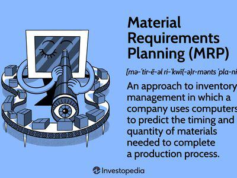

In today's fast-paced manufacturing environment, effective resource planning is essential to maintain competitiveness and efficiency. Material Requirements Planning (MRP) systems have evolved significantly over time to address these needs, providing robust frameworks for managing inventory, production scheduling, and procurement activities. A pivotal development within this field is the emergence of the Closed Loop MRP system. Unlike traditional open-loop systems, Closed Loop MRP incorporates feedback mechanisms that allow for dynamic adjustments and improved responsiveness to real-time data.

This article examines the fascinating intersection between MRP systems and algorithmic trading. While these fields might appear distinct, they share underlying principles such as optimization, efficiency, and adaptability. The advanced features of modern MRP systems, particularly the feedback and dynamic planning attributes of Closed Loop MRP, can offer valuable insights and methodologies that apply to trading and finance. 



As markets become increasingly complex and data-driven, the ability to leverage systematic planning and real-time adjustments becomes critical. This piece will explore how these advanced MRP systems can contribute to optimizing trading strategies, enhancing decision-making processes, and potentially transforming the landscape of finance through their integration with algorithmic trading.

## Table of Contents

## Understanding MRP Systems

Material Requirements Planning (MRP) systems represent a pivotal development in the sphere of inventory management and production scheduling. Designed to optimize the efficiency of manufacturing processes, MRP systems serve as a strategic tool that helps manufacturers determine the quantity and timing of raw material purchases. At its most basic level, MRP is a computational process that relies on various inputs—such as the master production schedule, inventory status records, and bill of materials—to determine what is required for production and when these materials should be acquired.

The primary aim of MRP systems is to ensure that materials and components are available for production while minimizing inventory levels and associated carrying costs. This involves complex calculations that consider lead times, order quantities, and production schedules to balance the demands of manufacturing workflows with resource availability. As such, the system focuses on aligning production variables with existing and projected demand to avoid either overstocking or underutilization of critical resources.

Closed Loop MRP, a significant evolution of MRP, enhances the traditional model by integrating feedback mechanisms that facilitate dynamic adjustments to planning schedules. Unlike earlier iterations of MRP, which operated in an open-loop system with no feedback, Closed Loop MRP continually updates and corrects itself in response to real-time data acquired from ongoing operations. This feedback loop is integral, allowing for precise recalibrations of procurement and production orders as conditions change, thus ensuring that production targets are met efficiently without excess expenditure on materials.

Central to the efficiency of Closed Loop MRP systems is their ability to synchronize input resources with production deadlines. This is achieved through a layered approach that covers not just material requirements but also incorporates capacity constraints and labor availability. By simulating future production scenarios and assessing their feasibility against available resources, MRP systems enable manufacturers to proactively manage potential bottlenecks. 

The mathematical underpinnings of MRP often involve linear programming and optimization techniques to calculate the optimal schedule of production orders. Such calculations ensure that all elements of the production process align with the overarching manufacturing objectives.

In summary, MRP systems, particularly those incorporating closed-loop capabilities, function as a critical component in the manufacturing toolkit. They effectively transform production requirements into actionable plans that ensure resource optimization and production efficiency while responding adaptively to the fluid nature of manufacturing demands.

## What Sets Closed Loop MRP Apart?

Closed Loop Material Requirements Planning (MRP) distinguishes itself by integrating feedback mechanisms that allow for dynamic updates to production and procurement plans. At the core of Closed Loop MRP is its feedback feature, which facilitates continuous adjustments based on real-time data. This capability ensures that production schedules and inventory levels remain aligned with actual demand and supply conditions, thus optimizing resource utilization and minimizing waste.

The 'closed loop' aspect specifically refers to the system's ability to receive and process feedback from various stages of the production and supply chain, enabling instantaneous recalibrations. For instance, if a delay in raw material delivery is detected, the MRP system can automatically adjust production schedules to minimize disruptions. This contrasts with open-loop systems, which historically lacked these adaptive features and operated on static data inputs, potentially leading to inefficiencies in production management.

Closed Loop MRP's adaptability is one of its significant strengths. It can be tailored to suit different production environments, whether they involve discrete manufacturing or process industries. This customization capability means that the system can handle a diverse array of variables unique to each production setting, from variable lead times to fluctuating demand patterns.

Moreover, the evolution from open-loop to closed-loop systems marked a pivotal enhancement in manufacturing efficiency. By enabling real-time data integration, Closed Loop MRP improves decision-making processes, thereby reducing the likelihood of overproduction or stockouts. For businesses, this means not only improved operational efficiency but also enhanced capacity to respond to market changes swiftly.

In summary, Closed Loop MRP sets itself apart by its feedback-driven adaptability, allowing for seamless integration of real-time data into planning and procurement processes. This evolution from static, open-loop systems to dynamic, closed-loop systems represents a significant leap forward in production and inventory management.

## Applications in Algorithmic Trading

Algorithmic trading, a cornerstone of modern financial markets, relies on the use of advanced algorithms to execute trading strategies with remarkable speed and precision. These algorithms can capitalize on small price fluctuations across various markets, implementing strategies that would be impossible for human traders to perform manually. A crucial aspect of this process is the effective management of resources—akin to the principles applied in Material Requirements Planning (MRP) systems. 

MRP systems focus on inventory management, ensuring that production schedules are met efficiently. At the heart of Closed Loop MRP is a feedback mechanism that dynamically updates procurement plans based on real-time data. This capability to adjust rapidly to changing conditions is a concept that resonates with the requirements of [algorithmic trading](/wiki/algorithmic-trading), which demands regular updates in response to volatile market movements. 

By embedding similar feedback processes into trading practices, algorithms can be fine-tuned to execute trades more effectively. For instance, in the financial markets, price trends can shift within seconds, and an algorithm must adjust its activity to either capitalize on these shifts or mitigate potential losses. This mirrors the adaptive capability of Closed Loop MRP systems, which modify production plans in real-time as new information about inventory levels or supply chain disruptions becomes available. 

In practical terms, this can be illustrated in Python using a simplified model for an algorithmic trading strategy. Consider the moving average crossover strategy, where trade execution decisions are based on short-term and long-term moving averages of asset prices:

```python
import numpy as np

def moving_average(prices, window_size):
    return np.convolve(prices, np.ones(window_size), 'valid') / window_size

def trading_signal(short_window, long_window):
    signals = np.where(short_window > long_window, 1, -1)
    return signals

# Sample data: historical prices
prices = np.array([100, 101, 102, 103, 102, 101, 104, 106, 108, 107])

# Calculate moving averages
short_ma = moving_average(prices, 3)
long_ma = moving_average(prices, 5)

# Generate trading signals
signals = trading_signal(short_ma[:-(len(short_ma) - len(long_ma))], long_ma)

print("Trading Signals:", signals)  # Outputs: [ 1  1 -1  1  1]
```

In this script, `moving_average` computes a simple moving average, while `trading_signal` generates buy (1) or sell (-1) signals by comparing short and long moving average periods. Similar to Closed Loop MRP, where feedback informs decision-making on inventory, this model illustrates how algorithmic traders might automatically adapt their strategies in real-time, conditioned on market data.

Moreover, feedback loops borrowed from MRP can foster innovation in trading algorithms, enabling them to anticipate market behaviors and make split-second decisions that enhance trade execution and risk management. By leveraging the predictive power of such systems, traders can craft strategies that offer higher returns and lower risk, despite the inherent uncertainties of the financial markets. This intersection of feedback-based adjustments and real-time trading decisions underscores the ongoing convergence of manufacturing principles with financial technologies.

## Benefits of Integrating Closed Loop MRP with Trading

Integrating Closed Loop Material Requirements Planning (MRP) systems with algorithmic trading offers a range of advantages, primarily due to the synergy between the dynamic adjustment capabilities inherent in MRP systems and the execution speed of trading algorithms. This integration can significantly reduce operational inefficiencies by enhancing responsiveness and decision-making processes in volatile financial markets.

One significant benefit is the capability for real-time adjustments. Closed Loop MRP systems are designed to dynamically adjust procurement and production plans based on real-time feedback. This characteristic can be translated into trading environments, where real-time market data can be used to adjust trading strategies instantaneously. For example, in volatile markets where prices fluctuate rapidly, a system that can process real-time data and adapt its strategy accordingly can make more informed decisions, potentially increasing profitability and reducing risk.

Another advantage is the enhancement of risk management through the integration of MRP feedback loops with trading algorithms. The feedback mechanisms in Closed Loop MRP continuously monitor discrepancies between planned and actual outcomes, enabling constant revision and optimization of processes. In trading, similar feedback loops can be used to assess the effectiveness of trading strategies, quickly identify emerging risks, and adjust positions in real-time. This adaptive approach allows for more robust risk mitigation, which is particularly crucial in markets prone to unexpected events and price changes.

Furthermore, the increased responsiveness to market changes is a notable benefit. The adaptive nature of Closed Loop MRP systems aligns well with the needs of algorithmic trading, where the ability to respond to new information rapidly is a critical [factor](/wiki/factor-investing) for success. By leveraging the feedback and adjustment features of these systems, traders can develop strategies that better anticipate market movements, optimizing entry and [exit](/wiki/exit-strategy) points to maximize returns.

Overall, integrating Closed Loop MRP with trading algorithms holds the potential to streamline operations, improve precision in decision-making, enhance risk management, and increase adaptability to market dynamics. As these technologies continue to advance, the opportunities for innovation and efficiency gains in both manufacturing and financial sectors are substantial.

## Challenges and Considerations

Integrating Material Requirements Planning (MRP) systems with algorithmic trading strategies presents both technical and operational challenges. One of the primary concerns is ensuring data accuracy and integrity, which are critical for the efficient functioning of both MRP systems and trading algorithms. Inaccurate data can result in flawed inventory forecasts in MRP systems or misguided trading decisions in financial markets. Therefore, robust data validation and cleaning processes must be implemented to maintain the reliability of the systems.

The complexity of systems often increases with integration, necessitating skilled personnel who are proficient in both manufacturing processes and financial markets. Developing and maintaining an integrated system requires a multidisciplinary team capable of understanding both domains. This complexity can be managed through continuous education and comprehensive training programs that equip personnel with the necessary knowledge and skills.

In addition, cybersecurity threats pose a significant risk to integrated systems, as they involve sensitive data related to inventory levels, production schedules, and trading strategies. To safeguard this information, it is essential to employ robust cybersecurity measures, such as encryption, multi-factor authentication, and regular security audits. These practices can help protect against unauthorized access and data breaches, which could have severe repercussions on both manufacturing and financial operations.

Overall, while the integration of Closed Loop MRP systems with algorithmic trading strategies offers promising benefits, it is imperative to address these challenges proactively. By ensuring data accuracy, managing system complexity, and fortifying cybersecurity, organizations can enhance the reliability and efficiency of integrated systems, thus maximizing their potential benefits.

## Future Prospects

Continued technological advancements are set to increasingly merge the functionalities of Closed Loop MRP systems and algorithmic trading. One of the key drivers of this convergence is [artificial intelligence](/wiki/ai-artificial-intelligence) (AI), which holds the potential to significantly enhance the adaptive capabilities of both systems. In MRP, AI can optimize inventory levels, predict demand more accurately, and facilitate real-time decision-making by analyzing vast datasets. In algorithmic trading, AI algorithms can process market data at speeds unattainable by human traders, adapt to market movements, and predict price fluctuations with greater accuracy. For example, [machine learning](/wiki/machine-learning) models can be used to analyze historical trading data to identify patterns and inform trading strategies. This synergy not only promises efficiency but also a competitive edge in market operations.

The increasing complexity of global supply chains necessitates robust planning systems that can efficiently handle unexpected changes in demand and supply. Closed Loop MRP systems, with their feedback mechanisms, can play a crucial role in ensuring that supply chain disruptions are minimized. They can dynamically adjust production schedules and procurement strategies by assessing real-time data, thus maintaining a seamless flow of materials and information.

Algorithmic trading also stands to benefit from the evolution of MRP systems. The core principles that underpin MRP, such as real-time feedback and adaptive planning, can inspire innovation in trading strategies. By incorporating such principles, trading algorithms can become more responsive to market changes, offering improved risk management and reduced operational inefficiencies. This potential for innovation is vast, as trading strategies can be continuously refined and adapted to an ever-changing financial landscape.

In conclusion, the future of Closed Loop MRP systems and algorithmic trading appears promising, with technological advancements fostering even greater levels of integration and functionality. Both sectors will likely continue to benefit from improvements in AI and data analytics, driving efficiencies that were previously unimaginable. As these systems evolve, they offer myriad opportunities for businesses engaged in manufacturing and financial trading, allowing them to stay ahead in highly competitive environments.

## Conclusion

Closed Loop Material Requirements Planning (MRP) systems and algorithmic trading represent two distinct yet increasingly synergistic domains within industry and finance. At their core, both systems are designed to optimize processes through systematic planning and timely execution, each offering unique capabilities that, when combined, promise significant advancements in efficiency and effectiveness.

Firstly, the integration of advanced resource planning with sophisticated trading algorithms could result in notable efficiencies. By leveraging the robust, feedback-driven protocols of Closed Loop MRP systems, algorithmic trading platforms can adapt to real-time data, enhancing decision-making processes even in fluctuating markets. This dynamic adaptability allows for strategic optimizations that are crucial in both managing physical materials and executing financial trades. 

As technology progresses, the potential for further integration between these fields seems vast and boundless. Continuous advancements in artificial intelligence and machine learning could further enhance the adaptive capabilities of both MRP systems and trading algorithms. Such technological progress will likely foster innovation, allowing for more nuanced and responsive systems that can manage increasing complexities within global supply chains and financial markets.

Manufacturers and traders are poised to reap substantial benefits from these technological convergences. The promise of integrating these methodologies and technologies lies not only in reducing operational inefficiencies but also in enhancing risk management and responsiveness to environmental changes. As such, these advancements could herald a new era of efficiency and efficacy in both manufacturing and trading, underscoring the transformative potential of this evolving synergy.

## References & Further Reading

[1]: Orlicky, J. (1975). ["Material Requirements Planning: The New Way of Life in Production and Inventory Management."](https://archive.org/details/materialrequirem00orli) McGraw-Hill.

[2]: Vollmann, T. E., Berry, W. L., Whybark, D. C., & Jacobs, F. R. (2005). ["Manufacturing Planning and Control for Supply Chain Management."](https://www.mhebooklibrary.com/doi/book/10.1036/9780071750325) McGraw-Hill.

[3]: López de Prado, M. (2018). ["Advances in Financial Machine Learning."](https://www.amazon.com/Advances-Financial-Machine-Learning-Marcos/dp/1119482089) Wiley.

[4]: Chan, E. (2009). ["Quantitative Trading: How to Build Your Own Algorithmic Trading Business."](https://github.com/ftvision/quant_trading_echan_book) Wiley.

[5]: Gill, P. E., Murray, W., & Wright, M. H. (1981). ["Practical Optimization."](https://epubs.siam.org/doi/book/10.1137/1.9781611975604) Academic Press.