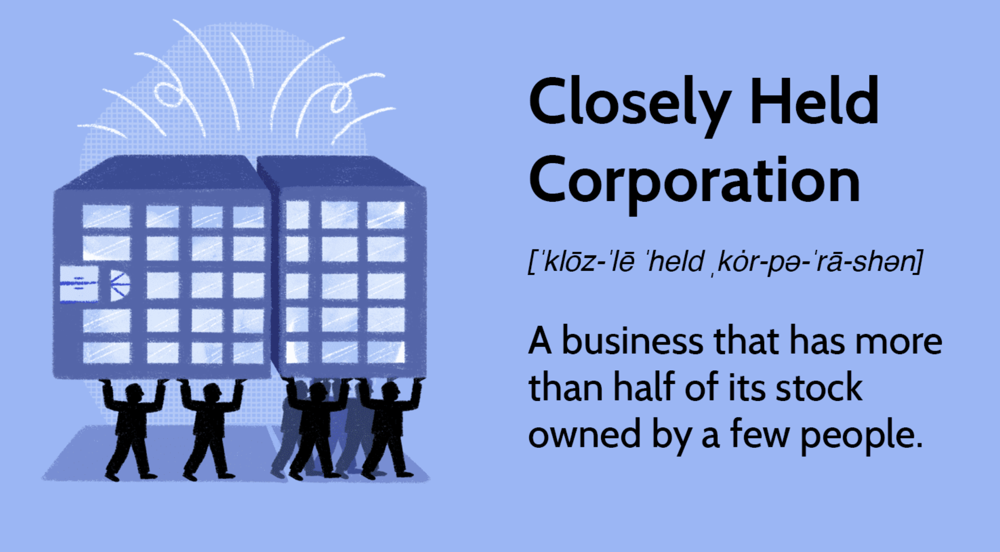

## Table of Contents

## What is a closely held corporation?

A closely held corporation is a type of company where the ownership is limited to a small number of people, usually family members, friends, or a few investors. These companies are not publicly traded, which means their stocks are not available for anyone to buy on the stock market. Instead, the shares are held by a select group of people who often have a direct role in managing the business.

Because of their private nature, closely held corporations have more flexibility in how they operate compared to larger, public companies. They can make decisions quickly and keep financial and operational details private. However, this type of corporation can face challenges in raising capital since they cannot easily sell shares to the public. Despite these challenges, many closely held corporations thrive by relying on the dedication and involvement of their small group of owners.

## How does a closely held corporation differ from a public corporation?

A closely held corporation and a public corporation are different in how they are owned and how they work. A closely held corporation is owned by a small group of people, like family or friends. They don't sell their stocks to the public. This means they can keep their business plans and money details private. They can also make decisions quickly because there are fewer people involved. But, it can be hard for them to get more money because they can't sell shares to everyone.

On the other hand, a public corporation sells its stocks to anyone who wants to buy them on the stock market. This means they have many owners, often people they don't even know. Because they are public, they have to share a lot of information about their business and money with everyone. They have to follow strict rules and it can take longer to make decisions because they need to think about what all their shareholders want. But, it's easier for them to raise money because they can sell more shares to the public.

## What are the typical characteristics of a closely held corporation?

A closely held corporation is a business owned by a small group of people, like family or close friends. They don't sell their stocks to the public, so they keep control within their small group. This means they can make decisions quickly and keep their business plans and financial details private. They don't have to share everything with the public like bigger companies do.

These companies have more freedom in how they run things compared to big public companies. They can be more flexible and change things fast if they need to. But, it can be hard for them to get more money because they can't easily sell shares to a lot of people. They often rely on the dedication and close involvement of their owners to keep the business going strong.

## Who are the primary shareholders in a closely held corporation?

The primary shareholders in a closely held corporation are usually a small group of people. This group often includes family members, close friends, or a few trusted investors. They own most or all of the company's shares and have a big say in how the business is run.

These shareholders are not just investors; they are often involved in the day-to-day operations of the business. Because the company is not publicly traded, these shareholders can keep their ownership private and make decisions quickly without needing to consult a large group of people. This close-knit ownership structure helps them maintain control and focus on the company's long-term goals.

## What are the advantages of forming a closely held corporation?

One big advantage of forming a closely held corporation is that it lets a small group of people, like family or friends, keep control of the business. They don't have to share their business plans or financial details with the public. This privacy can be really helpful because it lets them make decisions quickly without having to worry about what a lot of outside people think. They can also be more flexible in how they run the business, changing things fast if they need to.

Another advantage is that closely held corporations can keep their ownership within a trusted group. This means the people who own the company are often the same people who work in it every day. They care a lot about the business and can focus on long-term goals instead of just short-term profits. This close connection can make the business stronger because everyone is working together towards the same thing.

Lastly, even though it can be hard for closely held corporations to raise money since they can't sell shares to the public, they can still get funding from their owners or private investors who believe in the business. This way, they can grow without losing control to outside shareholders. It's a good way to keep the business in the hands of people who really care about it.

## What are the potential disadvantages of a closely held corporation?

One big problem with a closely held corporation is that it can be hard to get more money. Since they can't sell their stocks to the public, they have to rely on their owners or a few private investors to give them money. This can limit how much they can grow or make it tough if they need money quickly for something important.

Another disadvantage is that disagreements can happen more easily because there are only a few owners. If family members or friends who own the business don't get along, it can cause big problems. They might not agree on how to run the business, and this can slow things down or even hurt the business.

Also, closely held corporations can miss out on some benefits that public companies get. For example, they might not have as many resources or connections that bigger, public companies have. This can make it harder for them to compete in some markets or to get the help they need to grow.

## How is ownership transferred in a closely held corporation?

In a closely held corporation, transferring ownership can be tricky because the shares are not sold on the public stock market. Instead, the owners have to find someone they trust to buy their shares. This could be another family member, a friend, or a private investor who believes in the business. The owners might set rules about who can buy shares to keep control within a small group.

The process of transferring ownership often involves a lot of talking and planning. The owners need to agree on the price of the shares and make sure everyone is okay with the new owner. They might have to change the company's rules or agreements to make the transfer happen. It can take time and might need the help of lawyers to make sure everything is done right and legally.

## What legal and regulatory requirements apply to closely held corporations?

Closely held corporations have to follow certain legal and regulatory rules, but they are not as strict as those for public companies. They still need to file paperwork with the government to start the business and keep it running. This includes things like getting a business license, registering the company, and filing annual reports. They also need to follow tax laws, which means paying taxes on their profits and maybe getting special tax treatments if they qualify.

Even though closely held corporations are private, they still have to follow some rules about how they treat their shareholders. They need to have meetings and keep good records of what happens in those meetings. If they want to sell shares, they might need to follow securities laws, which can be different depending on where they are located. But, because they are not public, they don't have to share as much information with the government or the public as bigger companies do.

## How do closely held corporations manage governance and decision-making?

In a closely held corporation, governance and decision-making are usually more straightforward and flexible than in a public company. Because there are fewer shareholders, often just family members or close friends, they can meet and discuss things more easily. They don't need to follow as many strict rules as public companies, so they can make decisions quickly. The owners, who are often also the managers, can focus on what's best for the business without worrying about what a lot of outside people think.

However, this close-knit structure can also lead to challenges. If the owners don't agree on something important, it can cause big problems. They need to have good ways to talk and solve disagreements so the business can keep running smoothly. They might set up rules or agreements about how decisions are made to help keep things fair and clear. Even though they have more freedom, they still need to follow some basic laws about how they run the company and treat their shareholders.

## What tax considerations should be noted for closely held corporations?

Closely held corporations have to think about taxes just like any other business. They need to pay taxes on the money they make, which is called corporate income tax. But, they might be able to choose a special tax status called an S corporation. This lets the company's profits and losses pass through to the owners' personal tax returns, so the business itself doesn't pay corporate income tax. This can save money, but there are rules about who can be an owner and how many owners the company can have.

There are other tax things to think about too. For example, if the owners take money out of the business, they might have to pay personal income tax on it. They also need to keep good records and follow the rules about what they can and can't write off as business expenses. It's important for closely held corporations to work with a tax professional to make sure they are doing everything right and taking advantage of any tax breaks they can get.

## How can conflicts of interest be managed in a closely held corporation?

In a closely held corporation, conflicts of interest can happen because the owners are often also the managers. They might make decisions that are good for them but not good for the business. To manage this, it's important to have clear rules about what is okay and what is not. The owners should talk openly about any possible conflicts and agree on how to handle them. They might need to write down these rules in a special agreement so everyone knows what to do.

One good way to handle conflicts is to have regular meetings where everyone can talk about what's going on. If someone has a conflict, they should tell everyone and maybe not be part of the decision about that issue. This helps keep things fair. Sometimes, it can be helpful to get advice from someone outside the company, like a lawyer or a business advisor, to make sure the decisions are good for the business and not just for one person.

## What strategies can closely held corporations use to plan for succession and continuity?

Closely held corporations need to plan for what happens when the owners retire or can't run the business anymore. This is called succession planning. A good way to do this is to start early and talk about it with everyone involved. They might decide to pass the business on to family members or sell it to someone they trust. It's important to train the people who will take over so they know how to run things. They should also write down a plan that says who will do what and when, so everyone knows what to expect.

Another strategy is to think about the future of the business and how to keep it going strong. This means making sure the business can keep making money and growing even after the current owners leave. They might set up rules about how decisions are made or how to handle disagreements. It can also help to have a board of advisors or outside experts who can give advice and help keep things on track. By planning ahead and being clear about what they want, closely held corporations can make sure the business keeps going and stays successful for a long time.

## References & Further Reading

[1]: Shleifer, A., & Vishny, R. W. (1986). ["Large Shareholders and Corporate Control."](https://scholar.harvard.edu/shleifer/publications/large-shareholders-and-corporate-control) The Journal of Political Economy, 94(3), 461-488.

[2]: Easley, D., Lopez de Prado, M. M., & O'Hara, M. (2011). ["The Microstructure of the 'Flash Crash': Flow Toxicity, Liquidity Crashes and the Probability of Informed Trading."](https://www.semanticscholar.org/paper/Flow-Toxicity-and-Liquidity-in-a-High-Frequency-Easley-Prado/9369430bd005d194f9332ae7cbd5a57ace5e9ab3) Journal of Portfolio Management, 37(2), 118-128.

[3]: ["Algorithmic and High-Frequency Trading"](https://www.amazon.com/Algorithmic-High-Frequency-Trading-Mathematics-Finance/dp/1107091144) by Álvaro Cartea, Sebastian Jaimungal, and José Penalva

[4]: Jensen, M. C. (1986). ["Agency Costs of Free Cash Flow, Corporate Finance, and Takeovers."](https://www.jstor.org/stable/1818789) American Economic Review, 76(2), 323-329.

[5]: Chalmers, J. M. R., & Kadlec, G. B. (1998). ["An Empirical Examination of the Amortized Spread."](https://www.sciencedirect.com/science/article/abs/pii/S0304405X98000075) Journal of Financial Economics, 48(2), 159-188.

[6]: Pardo, R. (2008). ["The Evaluation and Optimization of Trading Strategies"](https://onlinelibrary.wiley.com/doi/book/10.1002/9781119196969) by Robert Pardo

[7]: Hasbrouck, J. (2007). ["Empirical Market Microstructure: The Institutions, Economics, and Econometrics of Securities Trading"](https://academic.oup.com/book/52241) by Joel Hasbrouck

