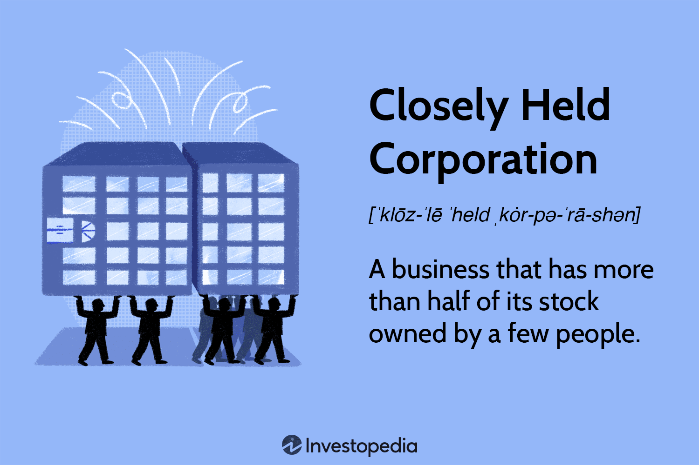

## Table of Contents

## What are closely held shares?

Closely held shares are shares of a company that are owned by a small group of people, often the company's founders, their family members, or a few investors. These shares are not traded on public stock exchanges, which means they are not available for the general public to buy and sell. Because of this, the owners of closely held shares have more control over the company's decisions and operations.

Having closely held shares can be good for the owners because it lets them keep control and make decisions without outside influence. However, it can also make it harder for the company to raise money since they can't sell shares to the public. If the company wants to grow or needs more money, the owners might need to find other ways to get funds, like taking out loans or finding private investors.

## How do closely held shares differ from publicly traded shares?

Closely held shares are owned by a small group of people, like the company's founders or a few investors. These shares are not available on public stock exchanges, so regular people can't buy or sell them. Because of this, the people who own closely held shares have a lot of control over what the company does and how it's run. They can make decisions without worrying about what a lot of different shareholders might want.

On the other hand, publicly traded shares are available on stock exchanges where anyone can buy and sell them. This means that a company with publicly traded shares has many shareholders, and these shareholders can influence the company's decisions. Companies with publicly traded shares often have to follow more rules and share more information with the public. This can make it easier for them to raise money by selling more shares, but it also means they have less control over their own decisions.

In summary, closely held shares keep control within a small group and are not traded publicly, while publicly traded shares are open to everyone and can lead to less control for the original owners but more opportunities to raise funds.

## Who typically owns closely held shares?

Closely held shares are usually owned by a small group of people. This group often includes the company's founders, their family members, and sometimes a few close friends or private investors. These people started the company or have been with it from the beginning, so they have a big say in how things are run.

Because the shares aren't sold on public stock markets, the owners can keep tight control over the company's decisions. They don't have to worry about what a lot of different shareholders might want. This can be good for keeping the company's direction clear and focused, but it can also make it harder to get more money if the company needs to grow.

## What are the advantages of owning closely held shares?

Owning closely held shares means you have a lot of control over the company. Since these shares aren't sold on public stock markets, only a small group of people, like the founders and their family, own them. This lets the owners make decisions without having to listen to a lot of different shareholders. They can keep the company's direction clear and focused on what they think is best.

Another advantage is privacy. Companies with closely held shares don't have to share as much information with the public as companies with publicly traded shares do. This can be good for keeping business plans and financial details secret from competitors. It also means less time and money spent on following strict rules that public companies have to follow.

## What are the potential disadvantages of closely held shares?

One big problem with closely held shares is that it can be hard to raise money. Since these shares aren't sold on public stock markets, the company can't easily get money by selling more shares to the public. If the company needs to grow or needs more money, the owners might have to find other ways to get funds, like taking out loans or finding private investors. This can be harder and might cost more than selling shares on a public market.

Another issue is that it can be tough to sell closely held shares. Because they're not traded on public stock exchanges, there aren't a lot of people who can buy them. If an owner wants to sell their shares, they might have to wait a long time to find someone willing to buy them. This can make it hard for owners to get their money out of the company if they need to.

Lastly, disagreements among the small group of owners can be a big problem. Since only a few people own the shares, if they don't agree on what the company should do, it can cause big fights. These disagreements can slow down the company and make it hard to make decisions, which can hurt the business.

## How can someone acquire closely held shares?

Someone can acquire closely held shares by buying them directly from the current owners. Since these shares aren't sold on public stock markets, you have to find the owners and talk to them about buying their shares. This can be hard because there might not be many people willing to sell, and you might have to wait a long time to find someone who wants to sell their shares.

Another way to get closely held shares is by being part of the company from the start. If you're one of the founders or an early investor, you might get shares when the company is created. This is a common way for family members or close friends of the founders to get shares. It's easier to get shares this way because you're involved in the company from the beginning, but it means you have to be part of the company's early days.

## What legal considerations should be noted when dealing with closely held shares?

When dealing with closely held shares, it's important to think about the legal rules that come with them. One big thing to consider is the shareholders' agreement. This is a document that says how the shares can be bought, sold, or transferred. It might have rules about who can buy the shares and how much they have to pay. If you want to buy or sell closely held shares, you need to read this agreement carefully to make sure you're following the rules.

Another legal thing to think about is the rights and duties of the shareholders. Since closely held companies have fewer shareholders, each person's actions can affect the whole company more. The law might say that shareholders have to act in the best interest of the company, and they can't do things that hurt the company just to help themselves. If you're thinking about buying or selling closely held shares, you should talk to a lawyer to make sure you understand all the legal stuff and don't get into trouble.

## Can closely held shares be sold or transferred? If so, how?

Yes, closely held shares can be sold or transferred, but it's not as easy as selling publicly traded shares. The process usually involves finding someone who wants to buy the shares directly from the current owner. This can be hard because there aren't many people who can buy them, and you might have to wait a long time to find a buyer. Also, there might be rules in the shareholders' agreement that say who can buy the shares and how much they have to pay. You need to follow these rules carefully when selling or transferring the shares.

If you want to sell or transfer closely held shares, you should first check the shareholders' agreement. This document will tell you what you can and can't do with the shares. Sometimes, the agreement might say that you have to offer the shares to other shareholders first before selling them to someone outside the company. If everything is okay with the agreement, you can talk to potential buyers and agree on a price. It's a good idea to get help from a lawyer to make sure you're doing everything right and following the law.

## What impact do closely held shares have on company governance?

Closely held shares give a lot of control to a small group of people who own them. These people are often the company's founders, their family, or a few close investors. Because they own most of the shares, they can make big decisions about how the company is run without having to ask a lot of different people. This means they can keep the company's direction clear and focused on what they think is best. They don't have to worry about what a big group of shareholders might want, which can make it easier to make decisions quickly.

But this control can also cause problems. If the small group of owners don't agree on what the company should do, it can lead to big fights. These disagreements can slow down the company and make it hard to make decisions, which can hurt the business. Also, because closely held shares aren't sold on public stock markets, the company might have a harder time raising money if it needs to grow. They might have to find other ways to get funds, like taking out loans or finding private investors, which can be harder and might cost more.

## How are closely held shares valued, and what factors influence their valuation?

Closely held shares are valued by looking at what the company is worth and how much of the company the shares represent. Since these shares are not traded on public stock markets, it can be harder to figure out their value. People often use different methods to value them, like looking at the company's earnings, its assets, or what similar companies are worth. Sometimes, they might even hire a special person called an appraiser to help figure out the value.

A few things can change how much closely held shares are worth. One big thing is how well the company is doing. If the company is making a lot of money and growing, the shares will be worth more. Another thing is what the shareholders' agreement says. This document can have rules about how shares can be bought or sold, which can affect their value. Also, if the company needs money to grow but can't easily get it because the shares aren't publicly traded, that can make the shares less valuable.

## What are some common strategies for managing closely held shares in a business?

One common strategy for managing closely held shares is to have a clear shareholders' agreement. This document sets rules about who can buy or sell the shares and how much they have to pay. It helps keep control within a small group of people and makes sure everyone knows what they can and can't do with their shares. This can prevent fights and make it easier to manage the company. For example, the agreement might say that if someone wants to sell their shares, they have to offer them to other shareholders first before selling to someone outside the company.

Another strategy is to plan for the future by thinking about how to raise money and grow the business. Since closely held shares aren't sold on public stock markets, it can be hard to get more money by selling more shares. Owners might need to find other ways to get funds, like taking out loans or finding private investors. They should also think about what will happen if one of the owners wants to leave the company or if something happens to them. Having a plan in place can help keep the company running smoothly and make sure everyone knows what to do.

Lastly, it's important to keep good communication among the small group of shareholders. Since only a few people own the shares, disagreements can cause big problems. Regular meetings and open discussions can help everyone stay on the same page and make decisions together. This can prevent fights and help the company move forward. It's also a good idea to get advice from lawyers and other experts to make sure everything is done right and to help with any big decisions.

## Can you provide real-world examples of companies with closely held shares and discuss their outcomes?

One example of a company with closely held shares is Mars, Incorporated, the maker of candy like M&M's and Snickers. Mars is owned by the Mars family and a few other shareholders. They keep tight control over the company and don't sell shares to the public. This has helped them keep their business private and focused on what they think is best. Mars has grown a lot over the years, and being closely held has let them make decisions quickly without worrying about what a lot of different shareholders might want.

Another example is Cargill, a big company that makes food and other products. Cargill is owned by the Cargill and MacMillan families and a few other investors. Like Mars, Cargill's shares aren't sold on public stock markets. This has given them a lot of control over their business and let them keep their plans and financial details secret from competitors. Cargill has become one of the largest privately held companies in the world, showing that being closely held can help a company grow and succeed without the pressures of public shareholders.

## What are the synergies between stock ownership and algo trading?

The intersection of closely held shares and algorithmic trading introduces distinctive challenges and opportunities in the financial markets. Closely held shares, typically associated with private companies or tightly controlled corporations, often lack the liquidity and transparency of publicly traded stocks. Algorithmic trading, with its capacity for executing high-speed transactions and its reliance on advanced computational models, impacts the valuation and liquidity of such shares.

Algorithmic trading can enhance market efficiency by facilitating rapid execution of buy and sell orders, which can potentially improve liquidity even in markets with closely held shares. However, the limited availability of these shares can lead to increased price volatility when algorithms aggressively seek to balance supply and demand. This volatility can result in rapid price changes that might not reflect underlying fundamentals, posing a risk to investors who rely heavily on algorithmic systems for pricing information.

Consider an algorithm that predicts the price movement of a stock using historical data and executes trades based on these predictions. In markets with closely held shares, this could mean fewer transactions, leading to potential gaps between predicted and actual stock values. The formula used to predict price changes might take a simple form as follows:

$$
\text{Predicted Price Change} = \alpha \times (\text{Current Price} - \text{Mean Price}) + \epsilon
$$

where $\alpha$ is a sensitivity parameter controlling the algorithm's reaction to price deviations, and $\epsilon$ is a random error term. Models based on such equations must account for the low volume of trades in closely held stocks to avoid executing trades at unfavorable prices.

Moreover, the proprietary and opaque nature of closely held shares adds a layer of complexity in assessing the impact of algorithmic trading. Algorithms depend on the availability and accuracy of data; hence, information asymmetry prevalent in private markets can skew predictions and result in suboptimal trading strategies.

Investors need to adapt by incorporating both [fundamental analysis](/wiki/fundamental-analysis) of company financials and technical analysis derived through algorithmic models. Risk management strategies should also consider the potential effects of algorithms on market liquidity and share valuations, particularly in periods of market stress or irregular buy/sell orders. By understanding these dynamics, investors and companies can craft effective strategies to navigate the interplay between stock ownership structures and automated trading systems, minimizing risks and optimizing returns.

## References & Further Reading

[1]: Ekinci, R. (2012). ["The Private Equity Return Drivers: Identification of Management's Alpha and Beta."](https://www.tandfonline.com/doi/full/10.1080/13691066.2012.688494) Vikalpa: The Journal for Decision Makers, 37(3), 57-70.

[2]: Harris, L. (2003). ["Trading and Exchanges: Market Microstructure for Practitioners."](https://www.amazon.com/Trading-Exchanges-Market-Microstructure-Practitioners/dp/0195144708) Oxford University Press.

[3]: Hasbrouck, J. (2007). ["Empirical Market Microstructure: The Institutions, Economics, and Econometrics of Securities Trading."](https://archive.org/details/empiricalmarketm0000hasb) Oxford University Press.

[4]: Narang, R. K. (2013). ["Inside the Black Box: A Simple Guide to Quantitative and High-Frequency Trading."](https://onlinelibrary.wiley.com/doi/book/10.1002/9781118662717) Wiley.

[5]: Sloman, J. (2009). ["Economics for Business."](https://www.pearson.com/nl/en_NL/higher-education/subject-catalogue/economics/Sloman-economics-for-business.html) Pearson.