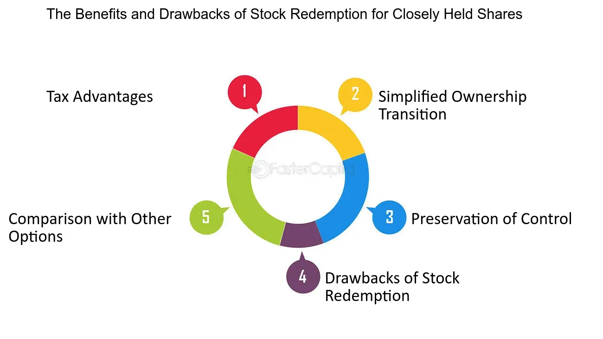

## Table of Contents

## What is closely held stock?

Closely held stock refers to shares of a company that are owned by a small number of people or entities, rather than being publicly traded on a stock exchange. These companies are often family-owned businesses or small firms where the owners prefer to keep control within a tight group. Because the stock is not available to the general public, it is usually not as easy to buy or sell as publicly traded stocks.

The value of closely held stock can be harder to determine because it doesn't have a public market price. Owners might need to hire professionals to appraise the stock's value if they want to sell it or use it for things like estate planning. This type of stock can offer benefits like more control over the company's direction and decisions, but it also comes with challenges, such as limited liquidity and potential difficulties in raising capital.

## How does closely held stock differ from publicly traded stock?

Closely held stock is owned by a small group of people, like family members or a few investors. It's not traded on a big stock market where anyone can buy or sell it. This means if you want to sell your closely held stock, you have to find someone who wants to buy it directly from you. It can be hard to figure out how much the stock is worth because there's no public price to look at. People who own closely held stock often like it because they can keep more control over their company and make decisions without a lot of outside influence.

Publicly traded stock, on the other hand, is available to anyone who wants to buy it on a stock exchange, like the New York Stock Exchange or NASDAQ. These stocks have prices that change all the time based on what people are willing to pay for them. It's usually easier to buy and sell publicly traded stocks because there are lots of buyers and sellers. Companies with publicly traded stock have to share a lot of information with the public, which can mean less control for the original owners but more chances to raise money from a wider group of investors.

## What are the common characteristics of a closely held company?

A closely held company is usually owned by just a few people, like family members or a small group of investors. These companies are not listed on big stock markets, so their shares are not available for anyone to buy and sell easily. Because of this, the owners have a lot of control over the company's decisions and direction. They can make choices without worrying about what a lot of outside shareholders might think.

These companies often have a more personal feel because the owners know each other well. They might not have to share as much information with the public as bigger companies do. This can be good for keeping business plans secret, but it can also make it harder to know how much the company is really worth. If the owners want to sell their shares, they need to find someone who wants to buy them directly, which can be tricky.

Closely held companies might find it harder to get big loans or raise a lot of money quickly because they don't have as many investors to turn to. But, they can still grow and do well, especially if the owners work well together and have a clear plan for the future. These companies can be found in all kinds of industries, from small family-run shops to larger businesses that just prefer to stay private.

## Who typically owns closely held stock?

Closely held stock is usually owned by a small group of people. This group can include family members, friends, or a few investors who know each other well. They might be the founders of the company or people who have been with it from the start. Because the stock isn't sold on big stock markets, these owners can keep a lot of control over what the company does.

Sometimes, closely held stock can also be owned by employees of the company. These employees might get stock as part of their job benefits or as a way to keep them motivated. Other times, it could be owned by private investors who believe in the company and want to help it grow without the company going public. Either way, the owners of closely held stock are usually closely connected to the company itself.

## What are the advantages of investing in closely held stock?

Investing in closely held stock can give you more control over the company. Since only a few people own the stock, you can have a bigger say in how the business is run. This can be good if you want to make sure the company follows your ideas and plans. Also, because the stock isn't traded on big stock markets, you don't have to worry about sudden changes in the stock price that can happen with public companies. This can make things feel more stable and predictable.

Another advantage is that you might get to know the other owners well. This can create a strong team that works together closely. It can also make it easier to share information and make decisions quickly. Plus, if the company does well, the value of your stock could go up a lot. Since closely held stock isn't easy to buy and sell, when you do find a buyer, you might be able to get a good price for it.

## What are the potential risks associated with closely held stock?

Investing in closely held stock can be risky because it's hard to sell. Since the stock isn't traded on big stock markets, you have to find someone who wants to buy it directly from you. This can take a long time and might mean you can't get your money out of the investment when you need to. Also, because there's no public market, it's tough to know how much the stock is really worth. You might need to hire someone to figure that out, which can cost money and still not give you a clear answer.

Another risk is that the company might not do well. Since only a few people own the stock, if something goes wrong, like the business losing money or the owners not getting along, it can be hard to fix. The owners might not have enough money or new ideas to turn things around. Plus, if the company has problems, it's harder to find new investors to help out because they can't easily buy the stock. This can make the value of your investment go down and leave you stuck with a company that's struggling.

## How can someone acquire closely held stock?

Someone can acquire closely held stock by buying it directly from the current owners. Since closely held stock isn't traded on big stock markets, you need to find someone who already owns the stock and is willing to sell it to you. This could be a family member, a friend, or another investor. You might hear about the opportunity through personal connections or by reaching out to the company directly to see if they know of anyone looking to sell their shares.

The process can be more complicated than buying publicly traded stock because you have to negotiate the price and terms directly with the seller. It's a good idea to have the stock valued by a professional to make sure you're paying a fair price. Sometimes, closely held companies have rules about who can buy their stock, so you'll need to check if you meet those requirements. Once you agree on a price and any other details, you can complete the purchase, usually with the help of a lawyer to make sure everything is done correctly.

## What are the tax implications of owning closely held stock?

Owning closely held stock can have different tax effects than owning stock in a big public company. When you get closely held stock, you might have to pay taxes on it right away if it's considered income. This can happen if you get the stock as part of your job or as a gift. Also, if you sell the stock later, you'll have to pay capital gains tax on any profit you make. The tax rate you pay depends on how long you held the stock before selling it. If you held it for more than a year, you might pay a lower long-term capital gains tax rate. If you held it for a year or less, you'll pay a higher short-term capital gains tax rate, which is the same as your regular income tax rate.

Another thing to think about is that closely held companies might give you dividends, which are payments from the company's profits. These dividends are usually taxed as regular income. Sometimes, closely held companies can choose to be taxed as S corporations or partnerships, which can change how your taxes work. In these cases, the company's profits or losses pass through to the owners' personal tax returns. This means you report the company's income on your own taxes, which can be good or bad depending on your situation. It's a good idea to talk to a tax professional to understand all the tax rules and make sure you're doing everything right.

## How does the valuation of closely held stock work?

Valuing closely held stock is tricky because it's not traded on big stock markets. When a stock is publicly traded, you can easily see its price because people are buying and selling it all the time. But with closely held stock, there's no public price to look at, so you need other ways to figure out what it's worth. One common way is to get a professional appraiser to look at the company's financials, like its profits, assets, and debts. The appraiser might also think about how much similar companies are worth and what the future might hold for the company.

Another way to value closely held stock is by looking at what buyers might be willing to pay for it. If someone wants to buy the stock, they might offer a price based on how much they think the company is worth. This can be hard to predict because it depends on finding the right buyer. Sometimes, owners might use a formula that looks at the company's earnings and multiplies them by a certain number to come up with a value. No matter which method is used, valuing closely held stock often involves a lot of guesswork and can be different depending on who's doing the valuation.

## What are the legal and regulatory considerations for closely held companies?

Closely held companies have to follow certain legal and regulatory rules, but they don't have to deal with as many as big public companies. One important thing is that they need to keep good records of their business activities and financials. This helps them stay organized and can be useful if they need to show their financial situation to someone, like a bank or a potential buyer. They also need to make sure they follow any rules about how they can sell their stock. Some closely held companies have special agreements that say who can buy their stock and under what conditions. This helps them keep control over who owns the company.

Another thing to think about is taxes. Closely held companies have to file tax returns and pay taxes on their income. Depending on how the company is set up, like as an S corporation or a partnership, the way they handle taxes can be different. They might need to report their profits or losses on the owners' personal tax returns. It's important for these companies to understand the tax rules that apply to them so they can stay in good standing with the government. Talking to a lawyer or a tax professional can help make sure they're following all the right rules and not missing anything important.

## How do closely held companies manage liquidity and exit strategies for shareholders?

Closely held companies often struggle with liquidity because their stock isn't traded on big stock markets. This means if a shareholder wants to sell their stock, they need to find someone who wants to buy it directly from them. This can be hard and take a long time. To help with this, some closely held companies set up rules or agreements about how stock can be sold. For example, they might have a "right of first refusal" rule, where other shareholders get the first chance to buy the stock before it's offered to outsiders. This helps keep control within the group but can still make it tough to sell quickly.

For exit strategies, closely held companies might plan ways for shareholders to leave the company. One common way is through a buy-sell agreement, which is like a contract that says what happens if a shareholder wants to sell their stock or if something happens to them, like they retire or pass away. This agreement can set a price for the stock and say who can buy it. Another way is for the company to buy back the stock from the shareholder, using money from the company's profits or a loan. These strategies help make sure that shareholders can get out of the company when they need to, but it's still not as easy as selling stock in a big public company.

## What role do closely held stocks play in estate planning and wealth transfer?

Closely held stocks can be important in estate planning and wealth transfer because they are often part of a family's wealth. When someone who owns closely held stock wants to pass it on to their family or others after they die, they need to think about how to do it fairly and smoothly. They might use a will or a trust to say who gets the stock. This can help make sure the stock goes to the right people and that the company stays in the family if that's what they want. But, because closely held stock can be hard to value and sell, it's important to plan carefully and maybe talk to a lawyer or a financial advisor to make sure everything is done right.

Another thing to think about is taxes. When closely held stock is passed on, there might be estate taxes or capital gains taxes to pay. These taxes can be a lot, so it's good to have a plan to deal with them. Some people use special trusts or other ways to lower the taxes they have to pay. Also, if the stock is going to be sold to pay for things like taxes or to give money to the people who inherit it, the family needs to think about how to find buyers and what the stock is worth. Planning ahead and talking to experts can help make the process of passing on closely held stock easier and less stressful for everyone involved.

## What are the challenges in trading private shares?

Trading private shares presents several challenges primarily stemming from the lack of liquidity. Liquidity, the ease with which an asset can be converted into cash without significantly affecting its price, is a major concern in private markets. Unlike publicly traded stocks, which can be bought and sold on exchanges with relative ease, private shares typically do not have a ready market. This insufficiency often results in prolonged holding periods for investors wishing to divest and can make it difficult to determine a realistic market value for the shares.

The valuation of private shares is inherently complex. Without public trading platforms, there are no reliable market price signals to guide valuations. Instead, investors must rely on methods like discounted cash flow analysis, comparable company analysis, and precedent transactions to estimate value. Each of these methods has its own set of assumptions and limitations. For example, discounted cash flow analysis requires accurate projections of future cash flows and an appropriate discount rate, while comparable company analysis hinges on identifying truly comparable public companies.

$$
\text{DCF} = \sum_{t=1}^{n} \frac{CF_t}{(1+r)^t}
$$

Where:
- $CF_t$ = Cash flow at time $t$
- $r$ = Discount rate
- $n$ = Number of periods

In private share transactions, investors often negotiate deals based on these valuations, yet such negotiations might not reflect real-time market conditions. The absence of continuous trading can lead to price discrepancies and potential unfair valuations, especially if one party possesses more information than the other. Furthermore, negotiated agreements are subject to various terms and conditions that can complicate the simplicity typically seen in public market transactions.

Moreover, the reliance on negotiated agreements necessitates a robust due diligence process, demanding significant time and resources to evaluate the business, its financials, and its market position. Given the bespoke nature of these transactions, legal and financial advisers play critical roles, which can add to the complexity and cost of trading private shares.

In conclusion, the primary challenges in trading private shares revolve around liquidity constraints and valuation difficulties. Investors and companies must navigate these intricacies through comprehensive market understanding and strategic negotiation, often requiring expert input to reach equitable transaction terms.

## References & Further Reading

[1]: Bennedsen, M., Lunde, A., & Pakkanen, M. S. (2017). ["Decoupling the short- and long-term behavior of stochastic volatility."](https://arxiv.org/abs/1610.00332) Journal of Financial Economics, 124(3), 537-557.

[2]: Athey, S., & Imbens, G. W. (2017). ["The state of applied econometrics: Causality and policy evaluation."](https://www.aeaweb.org/articles?id=10.1257/jep.31.2.3) Journal of Economic Perspectives, 31(2), 3-32.

[3]: Degryse, H., Jong, F., & Kervel, V. V. (2015). ["The impact of dark trading and visible fragmentation on market quality."](https://academic.oup.com/rof/article/19/4/1587/1567671) The Review of Financial Studies, 28(3), 629-659.

[4]: Eric Falkenstein (2009). ["Finding Alpha: The Search for Alpha When Risk and Return Break Down."](https://www.amazon.com/Finding-Alpha-Search-Return-Break/dp/0470445904) Wiley.

[5]: Sias, R. W. (2004). ["Institutional Herding."](https://www.jstor.org/stable/1262672) The Journal of Portfolio Management, 30(1), 7-11.