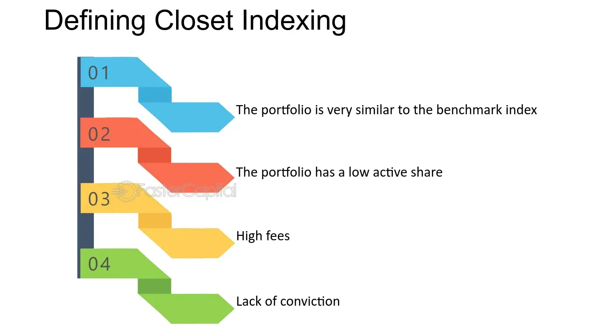

## Table of Contents

## What is closet indexing?

Closet indexing is when a fund manager says they are actively managing a fund, but they are actually just copying a benchmark index, like the S&P 500. They might do this to reduce risk or because it's easier, but it means investors are paying high fees for what is basically a passive investment.

This can be a problem because investors expect active management to try to beat the market, not just match it. If they wanted to match the market, they could invest in a low-cost index fund instead. Closet indexing can lead to disappointment and lower returns after fees, which is why it's important for investors to know what they're really getting.

## How can you identify if a fund is engaging in closet indexing?

To spot if a fund is closet indexing, you can look at how different the fund's investments are from its benchmark index. If the fund holds a lot of the same stocks as the index, and in similar amounts, it might be closet indexing. You can check this by comparing the fund's list of investments with the index's list. If they look very similar, that's a warning sign.

Another way to tell is by looking at the fund's performance. If the fund's returns are very close to the index's returns over a long time, it might not be doing much active management. Also, if the fund's fees are high but it's not beating the index by much, that could mean you're paying a lot for something that's not very different from a cheaper index fund.

To be sure, you can use something called the Active Share measure. This number shows how different a fund's investments are from the index. A low Active Share, usually below 60%, can mean the fund is closet indexing. You can find this information in the fund's reports or on financial websites.

## What are the key differences between a closet index fund and a true actively managed fund?

A closet index fund and a true actively managed fund differ mainly in how they invest and what they aim to achieve. A closet index fund pretends to be actively managed but actually closely follows a benchmark index like the S&P 500. It holds a lot of the same stocks as the index and doesn't stray far from it. This means it's not trying hard to beat the market; it's just trying to match it. A true actively managed fund, on the other hand, tries to beat the market by picking different stocks and making bold investment choices. The fund manager actively decides what to buy and sell, aiming to do better than the index.

The second big difference is in fees and performance. Closet index funds often charge high fees, even though they're not doing much different from the index. This can be frustrating for investors because they're paying a lot for something that's not very different from a cheaper index fund. A true actively managed fund also charges higher fees, but investors expect these fees to be worth it because the fund is trying to beat the market. If the fund does beat the market, the higher fees might be justified. But if it doesn't, investors might feel they're better off with a low-cost index fund.

## Why might a fund manager engage in closet indexing?

A fund manager might engage in closet indexing because it's easier and safer than trying to beat the market. Picking stocks to do better than the market is hard and risky. If the manager's choices don't work out, they could lose their job or the fund could lose money. By sticking close to the index, they avoid big mistakes and keep their job safer. It's like playing it safe instead of taking big risks.

Another reason is that closet indexing can still make money for the fund company, even if it's not the best for investors. The fund can charge high fees, just like a true actively managed fund, but without the hard work of trying to beat the market. This means more profit for the fund company, even if the investors are not getting what they expect. It's a way for the company to make money while keeping things easy for the fund manager.

## What are the potential drawbacks of closet indexing for investors?

Closet indexing can be bad for investors because they pay high fees for something that doesn't do much different from a cheaper index fund. When a fund says it's actively managed, investors expect it to try to beat the market. But if the fund is just copying the index, it's not trying hard to do better. So, investors end up paying a lot of money for something that's not worth it.

Another problem is that investors might not know they're in a closet index fund. They think they're getting a fund that's working hard to make more money, but really, it's just following the market. This can lead to disappointment when the fund doesn't do much better than the market, and investors feel like they've been tricked. It's important for investors to check what they're really getting before they invest their money.

## How does closet indexing impact the fees investors pay?

Closet indexing can make investors pay more money than they should. When a fund says it's actively managed, it usually charges higher fees because it's supposed to be working hard to beat the market. But if the fund is actually just copying the market, it's not doing the extra work that justifies those high fees. So, investors end up paying a lot for something that's not much different from a cheaper index fund.

This can be frustrating because investors expect to get what they pay for. If they knew the fund was just following the market, they might choose a low-cost index fund instead. Paying high fees for a fund that's not trying to do better than the market can lead to lower returns after fees, which is why it's important for investors to understand what they're really getting.

## Can closet indexing affect the overall performance of a fund?

Closet indexing can make a fund's performance look a lot like the market's performance. When a fund copies the market, it doesn't try to do better than it. So, the fund's returns will be very close to the market's returns. This means the fund won't beat the market by much, if at all. Investors might think they're getting a fund that tries hard to make more money, but they're really just getting something that follows the market.

This can be a problem because investors pay high fees for a fund that's supposed to be actively managed. If the fund is just copying the market, those high fees aren't worth it. Investors could get the same performance from a cheaper index fund. So, closet indexing can lead to lower returns after fees, which is not what investors expect when they choose an actively managed fund.

## What regulatory measures are in place to prevent closet indexing?

Some countries have rules to stop closet indexing, but they're not the same everywhere. In Europe, they have something called the Markets in Financial Instruments Directive (MiFID II). This rule says that fund managers have to tell investors how much their fund is different from the market. If a fund is too similar to the market, it has to say so. This helps investors know what they're really getting.

In other places, like the United States, there aren't specific rules just for closet indexing. But the U.S. has rules that say funds can't lie about what they're doing. If a fund says it's actively managed but it's really just copying the market, that could be against the rules. Still, it can be hard to catch because it's not always clear where to draw the line between active management and closet indexing.

## How can investors protect themselves from closet indexing?

Investors can protect themselves from closet indexing by doing their homework before they invest. They should look at a fund's list of investments and compare it to the market index. If the fund has a lot of the same stocks as the index, it might be closet indexing. Investors can also check the fund's Active Share, which shows how different the fund's investments are from the index. A low Active Share, usually below 60%, can mean the fund is closet indexing. By looking at these things, investors can see if the fund is really doing what it says it's doing.

Another way to protect against closet indexing is to pay attention to the fund's performance and fees. If the fund's returns are very close to the market's returns over a long time, and it's charging high fees, it might not be worth it. Investors should think about whether they could get the same performance from a cheaper index fund. By being careful and doing some research, investors can make sure they're not paying too much for a fund that's not trying hard to beat the market.

## What are some examples of funds that have been accused of closet indexing?

Some funds that have been accused of closet indexing include certain mutual funds managed by big companies. For example, in Europe, some funds run by companies like BlackRock and Fidelity have been criticized for being too similar to the market index. People noticed that these funds had a lot of the same stocks as the index and didn't try hard to beat it. This made investors upset because they were paying high fees for something that wasn't much different from a cheaper index fund.

In the United States, some funds from companies like Vanguard and State Street have also faced accusations of closet indexing. Investors and financial experts found that these funds were closely following the S&P 500 instead of making bold choices to do better than the market. This led to questions about whether the high fees charged by these funds were really worth it, especially when investors could get similar performance from a low-cost index fund.

## How does closet indexing influence the market as a whole?

Closet indexing can make the market less exciting and less risky for fund managers. When a lot of funds just copy the market, they don't take big risks or make big changes. This can make the market more stable because there's less wild buying and selling. But it also means fewer new ideas and less chance for the market to grow in new ways. If everyone is just following the market, there's less room for new companies and new investments to shake things up.

For investors, closet indexing can be a problem because it means they're not getting what they expect. When people invest in a fund, they want it to try hard to make more money than the market. But if the fund is just copying the market, investors are paying high fees for something that's not worth it. This can make people lose trust in the market and in fund managers. If more people know about closet indexing, they might choose cheaper index funds instead, which could change how money moves around in the market.

## What advanced metrics can be used to detect closet indexing more accurately?

To spot closet indexing more accurately, investors can use something called the Tracking Error. This number shows how much a fund's returns differ from the market's returns. A low Tracking Error means the fund is very similar to the market, which could mean it's closet indexing. Another useful metric is the Information Ratio, which looks at how well a fund does compared to the market, while also considering how risky it is. A low Information Ratio might mean the fund isn't trying hard enough to beat the market.

Another advanced metric is the R-squared value, which shows how closely a fund's performance matches the market's performance. A high R-squared, close to 1, means the fund is behaving a lot like the market, which can be a sign of closet indexing. By looking at these metrics together, investors can get a better idea of whether a fund is really doing what it says it's doing, or if it's just copying the market.

## What is Understanding Closet Indexing?

Closet indexing occurs when an investment fund presents itself as actively managed while its portfolio composition is closely aligned with a benchmark index. This strategic mimicry typically seeks to minimize the risk of deviating significantly from the benchmark’s performance, thereby reducing the chance of underperformance. However, these funds continue to charge higher fees typical of active management, which can be misleading to investors seeking the benefits of active decision-making.

The mechanics of closet indexing involve constructing a portfolio that closely tracks the weights of a benchmark index. The risk management strategy here is primarily about limiting the portfolio's tracking error, a measure of how closely a portfolio follows the index. Tracking error ($TE$) can be calculated using the standard deviation of the differences between the portfolio returns ($R_p$) and the index returns ($R_i$):

$$

TE = \sqrt{\frac{1}{n-1} \sum_{t=1}^{n} (R_{p,t} - R_{i,t})^2} 
$$

A low tracking error suggests that a fund's performance is very similar to that of the benchmark. Closet indexers seek such low tracking error to ensure their performance is aligned with the benchmark while nominally maintaining an active management label.

The impact of closet indexing on investors is multifaceted. For one, investors may erroneously believe they are paying premium fees for manager expertise and active market insights when, in reality, their returns are largely similar to those of a less expensive index fund. This cost-to-benefit mismatch raises concerns about value for money, as closet indexing typically results in fee structures that are not justified by the incremental returns over comparable index funds.

A pertinent study by Cremers and Petajisto (2009) introduced the concept of "active share," a measure that indicates the percentage of a portfolio's holdings that differ from a benchmark index. An active share of 0% corresponds to full replication of the index, while 100% indicates no overlap. Closet indexers tend to have active shares between 20-60%, highlighting their limited deviation from the benchmark.

Overall, closet indexing obscures true portfolio management activity, presenting challenges for investors who wish to allocate capital based on a clear understanding of investment styles and associated costs. Investors should critically evaluate fund strategies and consider fees relative to performance to ensure alignment with their financial goals.

## References & Further Reading

[1]: Cremers, M., & Petajisto, A. (2009). "How Active Is Your Fund Manager? A New Measure That Predicts Performance." The Review of Financial Studies, 22(9), 3329-3365. [Link](https://papers.ssrn.com/sol3/papers.cfm?abstract_id=891719)

[2]: Lopez de Prado, M. (2018). [Advances in Financial Machine Learning](https://www.amazon.com/Advances-Financial-Machine-Learning-Marcos/dp/1119482089). Wiley.

[3]: Stein, J. C. (2009). "Presidential Address: Sophisticated Investors and Market Efficiency." The Journal of Finance, 64(4), 1517-1548. [Link](https://scholar.harvard.edu/files/stein/files/presidential-address-jf-final.pdf)

[4]: Chan, E. P. (2009). [Quantitative Trading: How to Build Your Own Algorithmic Trading Business](https://github.com/ftvision/quant_trading_echan_book). Wiley.

[5]: Jansen, S. (2020). [Machine Learning for Algorithmic Trading](https://github.com/stefan-jansen/machine-learning-for-trading). Packt Publishing.