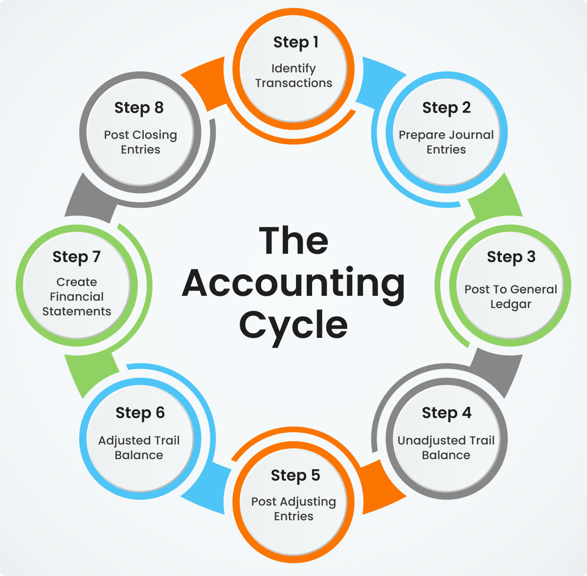

## Table of Contents

## What is a closing entry in accounting?

A closing entry in accounting is a journal entry made at the end of an accounting period to transfer the balances of temporary accounts to permanent accounts. Temporary accounts, like revenue, expense, and dividend accounts, are used to track financial activities for a specific period and need to be reset to zero to start fresh for the next period. By moving these balances to permanent accounts, such as retained earnings, the company can accurately reflect its financial position at the end of the period.

The process of making closing entries helps businesses prepare their financial statements and ensures that the income statement accurately shows the revenues and expenses for the period. After closing entries are made, the temporary accounts will have zero balances, ready for the new accounting period. This practice is crucial for maintaining clear and accurate financial records, allowing businesses to assess their performance and make informed decisions based on the financial data.

## Why are closing entries necessary at the end of an accounting period?

Closing entries are necessary at the end of an accounting period because they help businesses keep their financial records accurate and up-to-date. By transferring the balances from temporary accounts like revenue, expense, and dividend accounts to permanent accounts like retained earnings, closing entries ensure that the income statement only shows the financial activities for the specific period that just ended. This helps businesses see clearly how much money they made or spent during that time.

Without closing entries, the temporary accounts would keep adding up the balances from one period to the next, which would make it hard to understand the financial performance of any single period. By resetting these accounts to zero, closing entries allow businesses to start fresh with each new accounting period. This practice is essential for preparing accurate financial statements and making informed decisions based on clear and current financial data.

## What types of accounts are affected by closing entries?

Closing entries affect two main types of accounts: temporary accounts and permanent accounts. Temporary accounts are the ones that get reset to zero at the end of each accounting period. These include revenue accounts, which track the money a business earns, expense accounts, which track the money a business spends, and dividend accounts, which track the money paid out to shareholders. When the accounting period ends, the balances in these temporary accounts are moved to a permanent account.

The permanent account that usually receives these balances is the retained earnings account. Retained earnings show how much profit a company has kept over time after paying out dividends. By moving the balances from the temporary accounts to retained earnings, the business can see how much money it made or lost during the period that just ended. This helps keep the financial records clear and accurate, making it easier to understand the company's financial health at the end of each period.

## How do you identify which accounts need to be closed?

To identify which accounts need to be closed, you need to know the difference between temporary and permanent accounts. Temporary accounts are the ones you close at the end of each accounting period. These include revenue accounts, which track the money your business earns, expense accounts, which track the money your business spends, and dividend accounts, which track the money paid out to shareholders. These accounts are called temporary because they start over at zero each new period.

Permanent accounts, on the other hand, do not get closed. They keep their balances from one period to the next. The main permanent account affected by closing entries is the retained earnings account. This account shows how much profit your company has kept over time after paying out dividends. When you close the temporary accounts, you move their balances to the retained earnings account. This way, you can see how much money your business made or lost during the period that just ended.

## What is the step-by-step process for recording closing entries?

To record closing entries, start by closing the revenue accounts. This means you take the total amount of money your business earned during the period and move it to an account called "Income Summary." The Income Summary account is a temporary account used just for closing entries. To do this, you debit the revenue accounts to zero them out and credit the Income Summary account with the same amount. For example, if your business earned $10,000, you would debit the revenue account for $10,000 and credit the Income Summary account for $10,000.

Next, close the expense accounts. You do the opposite of what you did with revenue. You credit the expense accounts to zero them out and debit the Income Summary account with the total amount of expenses. For example, if your business spent $7,000, you would credit the expense accounts for $7,000 and debit the Income Summary account for $7,000. After this step, the Income Summary account will show the net income or loss for the period. If the Income Summary account has a credit balance, it means you made a profit; if it has a debit balance, it means you had a loss.

Finally, close the Income Summary account and the dividend account to the retained earnings account. If you made a profit, you debit the Income Summary account and credit the retained earnings account with the net income amount. If you had a loss, you credit the Income Summary account and debit the retained earnings account. For dividends, you debit the retained earnings account and credit the dividend account to zero it out. This last step completes the process of closing entries, ensuring all temporary accounts are reset to zero and the net income or loss is reflected in the retained earnings account.

## Can you explain the difference between temporary and permanent accounts in the context of closing entries?

Temporary accounts are like notebooks that businesses use to keep track of money earned and spent during a specific time, like a month or a year. These accounts include revenue accounts, which show how much money the business made, expense accounts, which show how much money the business spent, and dividend accounts, which show how much money was given to shareholders. At the end of each period, these temporary accounts need to be closed, which means their balances are moved to another account and then set back to zero. This way, the business can start fresh with new numbers for the next period.

Permanent accounts, on the other hand, are like long-term records that keep going from one period to the next. The most important permanent account for closing entries is the retained earnings account, which shows how much profit the business has kept over time after paying out dividends. When closing entries are made, the balances from the temporary accounts are moved into the retained earnings account. This helps the business see how much money was made or lost during the period that just ended, without mixing it up with the money from other periods.

## How do closing entries impact the financial statements?

Closing entries help make the financial statements clear and correct. They move the money from the temporary accounts, like revenue and expenses, to the retained earnings account. This way, the income statement only shows the money earned and spent during the period that just ended. Without closing entries, the income statement would mix up the money from different periods, making it hard to see how much the business made or lost in any single period.

After the closing entries are done, the income statement will show the right amount of profit or loss for the period. The balance sheet will also be updated because the retained earnings account, which is part of the balance sheet, will show the new total after adding the net income or subtracting the net loss. This helps everyone see a clear picture of the business's financial health at the end of each period, making it easier to make good decisions based on the financial data.

## What are common mistakes to avoid when preparing closing entries?

When preparing closing entries, one common mistake is forgetting to close all the temporary accounts. Temporary accounts include revenue, expenses, and dividends. If any of these are left open, the balances will carry over to the next period, which can mess up the financial statements. Always make sure to close all these accounts to start fresh for the new period.

Another mistake is getting the direction of the entries wrong. When you close revenue accounts, you need to debit them and credit the Income Summary account. For expense accounts, you do the opposite: credit the expenses and debit the Income Summary account. Mixing these up can lead to incorrect balances in the Income Summary and retained earnings accounts, which can throw off the whole financial picture.

Lastly, not updating the retained earnings correctly is a big error. After closing the Income Summary account, you need to move the net income or loss to the retained earnings account. If this step is missed or done incorrectly, the balance sheet won't show the right amount of retained earnings, which is crucial for understanding the company's financial health. Always double-check that the retained earnings account reflects the correct changes after closing entries.

## How does the use of accounting software affect the closing entry process?

Using accounting software makes the closing entry process a lot easier and faster. Instead of doing everything by hand, the software can automatically close the temporary accounts like revenue, expenses, and dividends at the end of the period. It knows exactly which accounts need to be closed and does all the math for you, so you don't have to worry about making mistakes with the numbers. This saves a lot of time and helps make sure everything is done correctly.

Even though the software does most of the work, it's still important to check everything to make sure it's right. Sometimes, there might be special situations where you need to make adjustments that the software can't do on its own. By reviewing the closing entries, you can catch any errors and make sure the financial statements show the true picture of the business's performance. So, while accounting software makes things easier, it's still good to keep an eye on the process to keep everything accurate.

## What are the advanced considerations for closing entries in complex business structures?

In complex business structures, like those with multiple subsidiaries or different branches, closing entries can be trickier. Each part of the business might need its own set of closing entries, and then you have to combine them all at the end. This means you have to be careful to make sure the numbers from each part are added up right and that no money is counted twice or missed. It's also important to think about how to handle things like intercompany transactions, where money moves between different parts of the business, so the financial statements show the true picture of the whole company.

Another thing to consider is how to deal with different accounting standards or rules that might apply to different parts of the business. For example, if the business operates in different countries, each country might have its own way of doing things. You have to make sure that the closing entries follow the right rules for each place, and then put it all together in a way that makes sense for the whole company. This can be a lot of work, but it's important to get it right so the financial statements are clear and correct.

## How do international accounting standards influence the closing entry process?

International accounting standards can change how businesses do their closing entries. Different countries might follow different rules, like IFRS or GAAP. These rules can affect what counts as revenue or an expense and how you should close those accounts at the end of the period. For example, under IFRS, some businesses might need to use different methods to figure out their income, which means they have to close their accounts in a specific way to match those rules. This can make the closing entry process more complicated, especially for companies that work in many countries and have to follow different standards in each place.

To handle these differences, businesses often need to keep careful records and make sure their closing entries follow the right rules for each country they operate in. This might mean doing extra work to adjust the numbers so they fit with the local standards before combining everything into one set of financial statements for the whole company. It's important to get this right because it helps everyone understand the company's financial health correctly, no matter where they are.

## What are the best practices for auditing closing entries to ensure accuracy and compliance?

When auditing closing entries, it's important to start by checking that all temporary accounts like revenue, expenses, and dividends have been closed correctly. Make sure the balances from these accounts have been moved to the Income Summary account and then to the retained earnings account. This means looking at each entry to see if the numbers add up right and if the entries were made in the right direction. For example, revenue accounts should be debited to zero them out and the Income Summary account should be credited. If anything looks off, it's a good idea to go back and figure out why before moving on.

Another key part of auditing closing entries is making sure the company followed the right accounting rules, like GAAP or IFRS, depending on where they operate. This can be tricky if the business works in different countries because each place might have its own rules. The auditor needs to check that the closing entries match these rules and that any special situations, like intercompany transactions, were handled correctly. By going through everything carefully, the auditor can make sure the financial statements show the true picture of the company's performance and that everything is in line with the law.

## What is the process of understanding accounting closing entries?

Closing entries are a fundamental component of the accounting cycle, serving the crucial function of preparing financial records for the transition into a new accounting period. These entries primarily focus on transferring the balances from temporary accounts, such as revenues and expenses, to permanent accounts like retained earnings. The significance of this process lies in its ability to ensure that a company's financial performance is accurately reported and ready for the next period.

The mechanics of closing entries involve a series of steps aimed at resetting temporary account balances to zero. This is vital because temporary accounts are used to track financial activities within a specific period and should not [carry](/wiki/carry-trading) over to the next cycle. The classic approach involves a step-by-step closing of revenue, expense, income summary, and dividend accounts. 

1. **Revenue Closure**: The first step is to transfer all revenue account balances to the Income Summary account. This is typically represented as:
$$
   \text{Income Summary} = \text{Total Revenues}

$$

2. **Expenses Closure**: Next, transfer all expense account balances to the Income Summary account. This step aims to zero out these accounts:
$$
   \text{Income Summary} = \text{Total Expenses}

$$

3. **Income Summary to Retained Earnings**: The subsequent step entails transferring the net income (or loss) in the Income Summary to Retained Earnings. Net income is derived by subtracting total expenses from total revenues:
$$
   \text{Net Income} = \text{Total Revenues} - \text{Total Expenses}

$$
   This net figure is transferred out of the Income Summary account:
$$
   \text{Retained Earnings} = \text{Net Income/Loss}

$$

4. **Dividends Declaration**: Any dividends declared during the period are then transferred from the Dividend account to Retained Earnings, reflecting their distribution to shareholders.

Executing these steps ensures that the financial statements after the closing entries accurately mirror the company's financial status. The income statement will capture the period's summary of operations, and the balance sheet accurately reflects the retained earnings at the end of that period. 

Regularity in executing closing entries is integral to maintaining the accuracy and reliability of financial statements. This structured approach not only ensures compliance with accounting standards but also facilitates effective financial analysis. An accurate reset of temporary accounts allows businesses to start each new period with a clean slate, thereby promoting transparency and ease in financial reporting. This, in turn, ensures stakeholders have a precise understanding of a company's financial health, enabling informed decision-making.

## What is the Role of Financial Statements?

Financial statements are structured reports essential for disclosing a business's financial performance and position. They provide a comprehensive overview of financial activities and serve as a critical resource for various stakeholders, including investors, creditors, and regulatory bodies, who rely on these reports to make informed decisions.

The trio of primary financial statements includes the balance sheet, income statement, and cash flow statement. Each of these components serves a distinct purpose:

1. **Balance Sheet**: Often referred to as the statement of financial position, the balance sheet provides a snapshot of a company's assets, liabilities, and equity at a specific point in time. The formula underpinning the balance sheet is:
$$
   \text{Assets} = \text{Liabilities} + \text{Equity}

$$

   This equation forms the foundation of double-entry accounting, ensuring that the balance sheet remains balanced.

2. **Income Statement**: The income statement, or profit and loss statement, details a company’s revenues, expenses, and profits over a reporting period. It highlights the company’s operational efficiency and profitability. The core formula used in the income statement is:
$$
   \text{Net Income} = \text{Total Revenues} - \text{Total Expenses}

$$

   Closing entries significantly impact the income statement, as they involve transferring balances from temporary accounts such as revenues and expenses. The resultant net income or loss is subsequently moved to the retained earnings section of the equity, influencing the balance sheet.

3. **Cash Flow Statement**: This statement tracks the flow of cash in and out of the business over the reporting period. It is divided into three primary activities: operating, investing, and financing. It provides critical insights into the liquidity and financial flexibility of the company.

Accurate financial statements are indispensable for assessing a company's financial health and operational efficiency. They are not merely compliance documents but tools for strategic planning and performance evaluation. Stakeholders rely on the integrity of these statements to gauge the risk and return profile of their involvement with the business.

Moreover, the reliability of financial statements hinges on precise accounting practices, including the effective execution of closing entries. These processes ensure that temporary accounts are correctly zeroed out and the resulting figures are accurately reflected in the final reports. This accuracy is paramount for stakeholders to conduct relevant financial analyses and for the business to remain in good standing with regulatory requirements.

## References & Further Reading

[1]: Kaplan, R. S., & Atkinson, A. A. (1998). ["Advanced Management Accounting."](https://archive.org/details/advancedmanageme0000kapl_u5x7) Prentice Hall.

[2]: ["Financial Statement Analysis."](https://www.investopedia.com/terms/f/financial-statement-analysis.asp) by Martin Fridson and Fernando Alvarez

[3]: ["Accounting Principles"](https://www.investopedia.com/terms/a/accounting-principles.asp) by Jerry Weygandt, Paul Kimmel, and Donald Kieso

[4]: Narang, R. K. (2009). ["Inside the Black Box: A Simple Guide to Quantitative and High Frequency Trading."](https://onlinelibrary.wiley.com/doi/book/10.1002/9781118267738) Wiley.

[5]: Jain, P. K. (2005). ["Financial Market Design and the Equity Premium: Electronic Versus Floor Trading."](https://onlinelibrary.wiley.com/doi/10.1111/j.1540-6261.2005.00822.x) Review of Financial Studies, 18(4), 1171-1192.