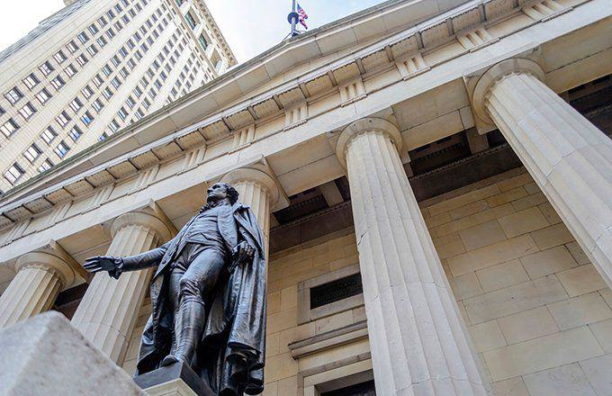

## Table of Contents

## What is a closing offset order?

A closing offset order is a type of order used in trading to close an existing position. When you have bought something, like a stock or a futures contract, and you want to sell it to end your position, you use a closing offset order. This helps you to get out of your trade without having to wait until the contract expires.

For example, if you bought 100 shares of a company, you would use a closing offset order to sell those 100 shares. This way, you can manage your investments better and avoid holding onto something that might lose value. It's a common tool used by traders to control their positions in the market.

## Why would someone use a closing offset order?

Someone would use a closing offset order to end their position in a trade. Imagine you bought some shares of a company because you thought the price would go up. But now, you see that the price is not going up as you expected, or maybe it's going down. You want to sell those shares to stop losing more money. A closing offset order helps you do that easily. It's like saying, "I want to get out of this trade now."

Using a closing offset order also helps you manage your investments better. It lets you decide when to [exit](/wiki/exit-strategy) a trade instead of waiting until the end of a contract. This can be really important if the market is changing fast. By using a closing offset order, you can quickly react to these changes and protect your money. It's a smart way to keep control over your trading decisions.

## How does a closing offset order differ from a regular closing order?

A closing offset order and a regular closing order both aim to end a trade, but they work a bit differently. A closing offset order is specifically used in futures and options trading. When you use a closing offset order, you're telling the market you want to cancel out your existing position by taking the opposite action. For example, if you bought a futures contract, you'd use a closing offset order to sell it and end your trade.

On the other hand, a regular closing order is more general and can be used in various types of trading, like stocks. It simply means you want to close your position, usually by selling what you bought. The main difference is that a closing offset order is tailored for futures and options, where you need to offset your initial trade with an opposite action to close it. A regular closing order doesn't have this specific requirement and can be used in a broader range of markets.

## What are the key components of a closing offset order?

A closing offset order has a few important parts that help it work right. The first part is the type of trade you want to close. This means you need to say if you are selling a futures contract or an options contract that you bought before. The second part is the amount or the number of contracts you want to close. If you bought 10 contracts, you need to say you want to sell those 10 to close your trade.

The third part is the price at which you want to close your trade. You can choose to close at the current market price or set a specific price you want to reach. This is called a limit order. The last part is the time you want the order to be active. You can set it to last until the end of the trading day or until you cancel it. All these parts together make sure your closing offset order works the way you want it to.

## Can you explain the mechanism of how a closing offset order works?

When you want to end a trade in futures or options, you use a closing offset order. Imagine you bought a futures contract because you thought the price would go up. But now you see the price isn't going up as you expected, or maybe it's going down. You decide you want to sell that contract to stop losing money. So, you place a closing offset order. This order tells the market you want to sell the same type and number of contracts you bought earlier, but at the current market price or a price you set.

Once you place the closing offset order, the market looks for someone who wants to buy what you're selling. When that happens, your trade is closed. This means you don't have to wait until the contract expires to get out of your trade. It's like canceling out your first trade with an opposite action. This way, you can quickly react to changes in the market and protect your money. Using a closing offset order helps you stay in control of your trading decisions.

## What are the potential benefits of using a closing offset order?

Using a closing offset order can help you manage your trades better. When you see that the market is not going the way you thought, you can quickly get out of your trade without waiting until the contract ends. This is really useful because it lets you stop losing money if the price starts going down. You can decide when to leave the trade, which gives you more control over your investments.

Another benefit is that it makes trading easier and less risky. Since you can close your position anytime, you don't have to worry about holding onto a trade that might lose value. This can save you from big losses and help you make smarter choices about when to buy or sell. Overall, using a closing offset order is a smart way to keep your trading safe and under control.

## What are the risks associated with closing offset orders?

Using a closing offset order can have some risks. One big risk is that the market might not have someone ready to take the opposite side of your trade right away. This means you might not be able to close your position as quickly as you want. If the market keeps moving against you while you wait, you could lose more money before you can get out of your trade.

Another risk is that if you set a specific price to close your trade, the market might not reach that price. This can leave your order open and your position still active. If the market moves a lot, you might miss the chance to close at a better price. So, it's important to understand these risks and be ready for them when you use a closing offset order.

## How do market conditions affect the effectiveness of a closing offset order?

Market conditions can really change how well a closing offset order works. If the market is moving fast and lots of people are trading, it's easier to find someone to take the opposite side of your trade. This means you can close your position quickly and at a good price. But if the market is slow or not many people are trading, it might be hard to find someone to buy what you're selling. You might have to wait longer to close your trade, and if the market keeps moving against you, you could lose more money.

Also, if the market is very up and down, it can be tough to use a closing offset order the way you want. If you set a specific price to close your trade, the market might not reach that price. This can leave your order open and your position still active. If the market moves a lot, you might miss the chance to close at a better price. So, it's important to watch the market and be ready to change your plans if things don't go as expected.

## What are the best practices for setting up a closing offset order?

When setting up a closing offset order, it's important to keep an eye on the market and be ready to adjust your plans. Start by choosing the right type and number of contracts you want to close. Make sure you know if you're selling futures or options and how many you need to close your position. Also, decide if you want to close at the current market price or set a specific price. If you set a specific price, be aware that the market might not reach it, so you might need to change your order if the market moves too much.

Another good practice is to set a time limit for your order. You can choose to have it active until the end of the trading day or until you cancel it. This helps you control when you want to close your trade. Always keep an eye on market conditions because they can affect how quickly you can close your position. If the market is busy, it's easier to find someone to take the opposite side of your trade. But if it's slow, you might have to wait longer, and that could mean more risk if the market moves against you. So, be ready to act quickly and make changes if needed.

## How can traders monitor and adjust a closing offset order?

To monitor a closing offset order, traders need to keep a close eye on their trading platform. Most platforms show the status of your orders in real-time, so you can see if your closing offset order is still open or if it has been filled. It's a good idea to check the market prices and the overall market conditions often. This helps you understand if your order is likely to be filled soon or if you might need to make changes.

If you need to adjust your closing offset order, you can usually do this through your trading platform. For example, if you set a specific price to close your trade but the market isn't reaching that price, you might want to change it to a different price or switch to closing at the current market price. Also, if the market is moving fast, you might decide to cancel your order and place a new one to react quickly to the changes. By staying alert and ready to make adjustments, you can better manage your trades and reduce the risk of losing money.

## What are some common mistakes to avoid when using closing offset orders?

One common mistake traders make when using closing offset orders is setting the price too far from the current market price. If you want to close your trade at a specific price, but that price is too high or too low compared to what the market is doing, your order might not get filled. This can leave you stuck in a trade that's losing money. It's better to set a price that's closer to the market price so you can close your trade more easily.

Another mistake is not watching the market closely enough. The market can change fast, and if you're not paying attention, you might miss the chance to close your trade at a good time. Always keep an eye on your trading platform and be ready to change your order if needed. If the market is moving against you, it's smart to act quickly and adjust your closing offset order to limit your losses.

## Can you provide examples of successful uses of closing offset orders in different market scenarios?

Imagine you bought some oil futures because you thought the price would go up. But then, news comes out that oil production is going to increase a lot, so the price starts dropping. You see this happening and decide to use a closing offset order to sell your oil futures at the current market price. Because the market is busy with lots of people trading, your order gets filled quickly. You end up closing your trade without losing too much money, which is a smart move.

Another example is when you bought some stock options hoping the stock price would rise. The stock does go up, but then it starts to level off and you think it might go down soon. You decide to use a closing offset order to sell your options at a specific price that's a bit lower than the current market price. The market is moving slowly, but your order still gets filled because you set a reasonable price. You end up making a small profit instead of waiting and possibly losing money if the stock price drops.

## References & Further Reading

[1]: Weber, Bruce W. (2009). ["The NYSE’s Closing Auction: Proof That Algorithmic Trading Works for You."](https://www.researchgate.net/scientific-contributions/Bruce-W-Weber-70147721) Capco Institute Journal of Financial Transformation, 25.

[2]: "Market Microstructure in Practice" by Charles-Albert Lehalle and Sophie Laruelle. Discusses market microstructure and algorithmic trading including mechanisms like CO orders.

[3]: "Algorithmic and High-Frequency Trading" by Álvaro Cartea, Sebastian Jaimungal, and José Penalva. Provides a comprehensive overview of algorithmic trading and the role of market orders.

[4]: Aldridge, Irene (2013). "High-Frequency Trading: A Practical Guide to Algorithmic Strategies and Trading Systems." This book explains algorithmic strategies including those used for end-of-day trading.

[5]: "Advances in Financial Machine Learning" by Marcos Lopez de Prado. Covers machine learning techniques relevant to advanced algorithmic trading strategies.

[6]: Hendershott, Terry and Riordan, Ryan (2013). ["Algorithmic Trading and the Market for Liquidity."](https://www.jstor.org/stable/43303831) The Review of Financial Studies, Volume 24, Issue 3. Discusses the impact of algorithmic trading on market liquidity.