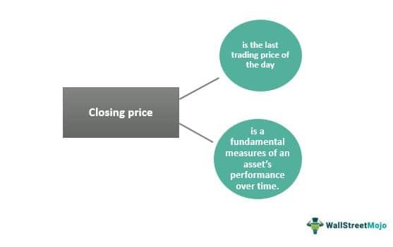

## Table of Contents

## What is the closing price in finance?

The closing price in finance is the last price at which a stock or any financial asset trades during a regular trading session. It's important because it gives investors a clear point to measure the value of their investments at the end of each trading day. Many financial reports and analyses use the closing price to track the performance of stocks over time.

This price is also used to calculate daily price changes and other financial metrics like the stock's daily return. For example, if you want to know how much a stock's value increased or decreased in a day, you would compare the closing price of that day with the closing price of the previous day. It's a key number that helps investors make decisions about buying or selling stocks.

## How is the closing price determined?

The closing price is decided by the last trade that happens before the market closes. Imagine a big market where people buy and sell things all day. Just before the market shuts down for the day, the last deal that gets made sets the closing price. This can be different from the highest or lowest price of the day, but it's what everyone looks at to see how the day ended.

Sometimes, there's a special time at the end of the day called the closing auction. During this time, people can put in orders to buy or sell at the closing price. The market then figures out the best price that matches up all these orders. This helps make sure the closing price is fair and reflects what most people think the stock is worth at that moment.

## Why is the closing price important for investors?

The closing price is really important for investors because it tells them how much their investments are worth at the end of each trading day. It's like a snapshot that helps them see if their stocks went up or down in value. By looking at the closing price, investors can decide if they want to buy more of a stock, sell what they have, or just keep holding onto it. It's a key number that helps them make smart choices about their money.

Also, the closing price is used to figure out other important things like how much a stock's value changed in a day. If you want to know if your stock did well or not, you compare today's closing price with yesterday's. This helps investors track how their investments are doing over time. It's also used in lots of financial reports and charts, so understanding the closing price helps investors stay informed about the market.

## How does the closing price affect stock market indices?

The closing price of stocks is really important for figuring out stock market indices like the S&P 500 or the Dow Jones. These indices are like big lists of stocks that show how the whole market or a part of it is doing. They use the closing prices of all the stocks in the list to calculate the index's value at the end of the day. So, if the closing prices of most stocks go up, the index will go up too. If they go down, the index will go down.

This matters a lot because people use these indices to see if the market is doing well or not. For example, if the S&P 500 goes up, it usually means that a lot of big companies are doing well, and people might feel good about investing. On the other hand, if the index goes down, it might make people worry about the economy. So, the closing prices of individual stocks have a big impact on how we understand the overall health of the stock market.

## Can the closing price be manipulated, and if so, how?

Yes, the closing price can be manipulated, but it's not easy and usually against the rules. Some people might try to do it by making a big trade right at the end of the day. They buy or sell a lot of a stock just before the market closes, hoping to push the price up or down to what they want. This can affect the closing price because it's based on the last trade of the day. But, because it's against the rules, if someone gets caught doing this, they can get in big trouble.

To stop this from happening, stock markets have rules and watch closely for any funny business. They use things like closing auctions, where lots of people can put in orders at the end of the day, to make sure the closing price is fair. If someone tries to manipulate the price, the market can spot it and take action. So while it's possible to try and manipulate the closing price, it's risky and not something most people should try.

## What is the difference between the closing price and the closing auction price?

The closing price is the last price at which a stock trades during a regular trading day. It's like the final score at the end of a game. This price is important because it shows what the stock is worth at the end of the day, and it's used to figure out how much the stock's value changed from the day before.

The closing auction price is a bit different. It happens during a special time at the end of the day called the closing auction. During this time, people can put in orders to buy or sell at the closing price. The market then works out the best price that matches up all these orders. This helps make sure the closing price is fair and reflects what most people think the stock is worth at that moment. So, the closing auction price is what comes out of this special process, and it can be the same as the closing price if the last trade happens during the auction.

## How do after-hours trading activities influence the closing price?

After-hours trading happens after the regular market closes. It doesn't directly change the closing price because the closing price is set by the last trade during regular trading hours. But, after-hours trading can still affect how people think about a stock's value. If a lot of people are buying or selling a stock after the market closes, it might make the news and change what investors think the stock is worth the next day.

When the market opens again, the opening price can be different from the closing price because of what happened in after-hours trading. If a company announces good news after the market closes, and the stock goes up a lot in after-hours trading, people might expect the stock to open higher the next day. So, while after-hours trading doesn't set the closing price, it can influence what happens when the market opens again.

## What role does the closing price play in calculating financial derivatives?

The closing price is really important for figuring out the value of financial derivatives like options and futures. These are special kinds of investments that get their value from something else, like a stock. For example, if you have an option to buy a stock, the price of that option depends a lot on the closing price of the stock it's based on. The closing price helps set what's called the "strike price" for options, which is the price at which you can buy or sell the stock.

Also, the closing price is used to settle futures contracts. Futures are agreements to buy or sell something at a future date, and the closing price on the last day of trading for the contract helps decide how much money changes hands. This makes the closing price a key number for people who trade in derivatives, because it helps them know how much their investments are worth at the end of each day.

## How is the closing price used in technical analysis?

In technical analysis, the closing price is a big deal because it helps traders see patterns and trends in how a stock is doing. They use it to draw lines on charts, like moving averages, which show the average closing price over a certain time. This can help them guess where the stock price might go next. If the closing price keeps going up or down over time, it can tell traders that the stock might keep moving in that direction.

Another way the closing price is used is in making something called candlestick charts. Each "candle" on the chart shows the opening, high, low, and closing prices for a day. The closing price is really important here because it can tell traders if the stock ended the day stronger or weaker than it started. If the closing price is higher than the opening price, the candle might be green or white, showing a good day for the stock. If it's lower, the candle might be red or black, showing a bad day. By looking at these patterns, traders can make better guesses about what might happen next with the stock.

## What are the implications of a closing price gap?

A closing price gap happens when there's a big difference between the closing price of one day and the opening price of the next day. This can happen because of news or events that come out after the market closes. For example, if a company announces really good news after the market shuts down, the stock might open much higher the next day, causing a gap. These gaps can tell traders that something big has changed with the stock, and it might keep moving in that direction.

Traders and investors pay close attention to these gaps because they can give clues about what might happen next with the stock. If the gap is big, it might mean that a lot of people want to buy or sell the stock quickly. This can make the stock more exciting but also riskier. By watching these gaps, traders can try to guess if the stock will keep going up or down, and make their buying or selling decisions based on that.

## How do different stock exchanges handle the calculation of the closing price?

Different stock exchanges around the world might use slightly different ways to figure out the closing price, but they all want to make sure it's fair and accurate. In the United States, the New York Stock Exchange (NYSE) and the Nasdaq use a closing auction to help set the closing price. During this auction, which happens at the end of the trading day, people can put in orders to buy or sell stocks. The exchange then matches up all these orders to find the best price that works for everyone. This helps make sure the closing price reflects what most people think the stock is worth at the end of the day.

In other parts of the world, like in Europe or Asia, stock exchanges might use similar methods, but there can be some differences. For example, the London Stock Exchange uses a closing auction too, but they also have rules about what happens if there's no trade during the auction. In that case, they might use the last trade price from the regular trading day as the closing price. No matter where you are, the goal is the same: to find a closing price that's fair and shows the true value of the stock at the end of the trading day.

## What advanced statistical methods are used to predict future closing prices?

To predict future closing prices, people use advanced statistical methods like time series analysis. This method looks at how a stock's price has changed over time and tries to find patterns. One popular way to do this is by using something called ARIMA, which stands for AutoRegressive Integrated Moving Average. ARIMA looks at past closing prices and uses them to make guesses about what might happen next. It's like trying to see the future by looking at the past, but with math.

Another method is [machine learning](/wiki/machine-learning), which is a bit like teaching a computer to learn from data. People feed the computer lots of information about a stock, like its past closing prices, how much people are buying or selling it, and even news about the company. The computer then tries to find patterns in all this data and use them to predict future closing prices. It's a bit like how you might guess what will happen in a story based on what you've read so far, but the computer does it much faster and with a lot more data.

Both of these methods are pretty advanced and help investors make better guesses about where a stock's price might go. But remember, predicting the future is hard, and even the best methods can be wrong sometimes. So, while these tools can be helpful, they're just one part of making smart investment choices.

## What is the role of the closing price in finance?

The closing price is a critical metric in financial analysis, serving as a baseline for calculating various technical indicators. These indicators, such as moving averages and the Relative Strength Index (RSI), rely on closing prices to assess market trends and [momentum](/wiki/momentum). For instance, a simple moving average is often calculated using the formula:

$$
\text{SMA} = \frac{\sum_{i=1}^{n} \text{Closing Price}_i}{n}
$$

where $n$ is the number of time periods considered. This type of analysis provides investors with insights into trend directions and potential reversal points.

Beyond technical analysis, the closing price influences the valuation of companies by being an integral component of key financial ratios. It plays a significant role in ratios such as Price-to-Earnings (P/E) and Price-to-Book (P/B) ratios, which investors use to evaluate the comparative valuation of stocks. A change in the closing price can alter these ratios, influencing investor perceptions of a company's value.

Investor psychology is also impacted by closing prices, as they represent the final market assessment of a stock's value for the day. This can lead to significant effects on investor decisions to buy, hold, or sell. A stock closing at a higher price may indicate positive sentiment, whereas a lower closing price might trigger concerns, potentially leading to sell-offs.

Investment strategies, especially [quantitative trading](/wiki/quantitative-trading) strategies, depend on accurate closing price data. These strategies use historical closing prices as a foundation for modeling future stock movements. Quantitative models often employ algorithms that analyze patterns and trends from historical data, requiring precise closing prices to execute optimal trades.

Understanding the significance of the closing price aids in crafting robust financial models for portfolio management. These models use closing prices to calibrate risk assessments, diversification strategies, and expected returns. A well-constructed model can enhance the ability to forecast future market behavior and improve overall portfolio performance.

In summary, the closing price is indispensable in financial analysis, affecting a broad spectrum of strategic decisions and market valuations. Accurate interpretation and utilization of this data can offer a substantial advantage in the competitive field of finance.

## References & Further Reading

[1]: Bergstra, J., Bardenet, R., Bengio, Y., & Kégl, B. (2011). ["Algorithms for Hyper-Parameter Optimization."](https://proceedings.neurips.cc/paper/2011/file/86e8f7ab32cfd12577bc2619bc635690-Paper.pdf) Advances in Neural Information Processing Systems 24.

[2]: ["Advances in Financial Machine Learning"](https://www.amazon.com/Advances-Financial-Machine-Learning-Marcos/dp/1119482089) by Marcos Lopez de Prado

[3]: ["Evidence-Based Technical Analysis: Applying the Scientific Method and Statistical Inference to Trading Signals"](https://www.amazon.com/Evidence-Based-Technical-Analysis-Scientific-Statistical/dp/0470008741) by David Aronson

[4]: ["Machine Learning for Algorithmic Trading"](https://github.com/stefan-jansen/machine-learning-for-trading) by Stefan Jansen

[5]: ["Quantitative Trading: How to Build Your Own Algorithmic Trading Business"](https://www.amazon.com/Quantitative-Trading-Build-Algorithmic-Business/dp/1119800064) by Ernest P. Chan