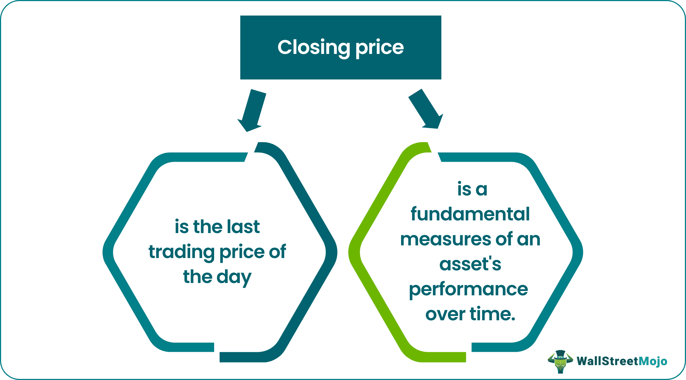

## Table of Contents

## What is the closing price of a stock?

The closing price of a stock is the last price at which it was traded during a day's trading session. This price is important because it is often used as a reference point for the stock's value at the end of the trading day. Investors and analysts look at the closing price to understand how the stock performed and to make decisions about buying or selling.

The closing price is also used to calculate other important financial metrics, like the daily price change and the stock's performance over time. For example, if a stock's closing price today is higher than yesterday's, it means the stock's value increased during the day. This information helps investors track the stock's trends and make informed investment choices.

## What is the last traded price of a stock?

The last traded price of a stock is the most recent price at which the stock was bought or sold. This price can change throughout the trading day as people keep buying and selling the stock. It's different from the closing price, which is the last price at the end of the trading day.

The last traded price is important because it shows what people are willing to pay for the stock right now. If you want to buy or sell a stock, the last traded price gives you an idea of what price you might get. It helps you make quick decisions during the trading day.

## How is the closing price determined?

The closing price of a stock is determined at the end of each trading day. It is the last price at which the stock was traded before the market closes. Usually, stock markets have set times for opening and closing, like 9:30 AM to 4:00 PM for the New York Stock Exchange. The closing price is important because it is used as a reference point for the stock's value at the end of the day.

Sometimes, the closing price can be influenced by special trading sessions called "closing auctions." During these auctions, buy and sell orders are matched to find the best price that satisfies as many orders as possible. This helps make sure the closing price is fair and reflects what people are willing to pay for the stock at the end of the day.

## How does the last traded price differ from the closing price?

The last traded price and the closing price are two different things. The last traded price is the price at which a stock was last bought or sold during the trading day. It can change many times as people keep buying and selling the stock. This price is important because it tells you what people are willing to pay for the stock right now.

The closing price, on the other hand, is the last traded price at the end of the trading day. It's set when the market closes, usually at a specific time like 4:00 PM for the New York Stock Exchange. The closing price is used as a reference point for the stock's value at the end of the day and can be influenced by special trading sessions called closing auctions, where buy and sell orders are matched to find a fair price.

## Why is the closing price important for investors?

The closing price is important for investors because it shows the value of a stock at the end of the trading day. It helps investors see how much their stocks are worth right now. If the closing price is higher than it was the day before, it means the stock went up in value. This can make investors happy because their investments are doing well. On the other hand, if the closing price is lower, it means the stock lost value, which might make investors worried.

Investors also use the closing price to make decisions about buying or selling stocks. They look at the closing price to see trends over time. For example, if a stock's closing price keeps going up, investors might decide to buy more of that stock because they think it will keep getting more valuable. If the closing price keeps going down, they might decide to sell the stock to avoid losing more money. So, the closing price is a key piece of information that helps investors plan their next moves.

## Can the last traded price be used for trading decisions?

Yes, the last traded price can be used for trading decisions. It shows what people are willing to pay for a stock right now. If you want to buy or sell a stock, knowing the last traded price helps you decide if you should do it now or wait. For example, if the last traded price is lower than what you think the stock is worth, you might decide to buy it because you think the price will go up later.

The last traded price is useful because it changes all the time during the trading day. This means you can see how the stock's value is changing and make quick decisions. If the last traded price is going up quickly, you might decide to sell your stock to make a profit before the price goes down. So, the last traded price gives you up-to-date information that can help you make smart trading choices.

## How do stock exchanges calculate the closing price?

Stock exchanges calculate the closing price at the end of each trading day. It is the last price at which a stock was traded before the market closes. For example, if the New York Stock Exchange closes at 4:00 PM, the closing price is the price of the last trade that happened right before that time. This price is important because it tells investors what the stock is worth at the end of the day.

Sometimes, stock exchanges use a special trading session called a closing auction to find the closing price. During this auction, all the buy and sell orders for a stock are collected and matched to find a price that works for as many people as possible. This helps make sure the closing price is fair and reflects what people are willing to pay for the stock at the end of the day. So, the closing price can be either the last trade before the market closes or the result of a closing auction.

## What role does the last traded price play in real-time trading?

The last traded price is really important when you're trading stocks in real time. It tells you the most recent price someone paid for the stock. This helps you decide if you want to buy or sell the stock right now. If the last traded price is going up, you might think the stock is getting more valuable and decide to buy it. If it's going down, you might want to sell it before it loses more value.

In real-time trading, things can change fast. The last traded price gives you up-to-date information so you can make quick decisions. For example, if you see the last traded price suddenly jump, you might decide to buy the stock quickly to take advantage of the increase. On the other hand, if you see it drop, you might sell to avoid losing money. So, the last traded price is a key piece of information that helps you trade smartly during the day.

## How can discrepancies between closing price and last traded price affect investment strategies?

Discrepancies between the closing price and the last traded price can affect investment strategies because they show different values for a stock at different times. The closing price is what the stock was worth at the end of the trading day, while the last traded price is what someone paid for it right before you check. If the last traded price is higher than the closing price, it might mean the stock is getting more popular and could be a good time to buy. But if the last traded price is lower, it might mean the stock is losing value, and you might want to sell it before it goes down more.

These differences can help investors decide when to buy or sell stocks. For example, if you see the last traded price going up a lot during the day but the closing price hasn't changed much, you might think the stock is starting to do better and decide to buy more. On the other hand, if the last traded price is much lower than the closing price, it might be a sign that the stock is not doing well, and you might want to sell it to avoid losing money. So, understanding these discrepancies can help you make smarter choices about your investments.

## What are the implications of using closing price versus last traded price for technical analysis?

Using the closing price for technical analysis means looking at the stock's value at the end of each trading day. This helps you see how the stock is doing over time. You can use the closing price to draw charts and spot patterns that can tell you if the stock is going up or down. For example, if the closing price keeps getting higher, you might think the stock is doing well and decide to buy it. But if the closing price keeps dropping, it might be a sign to sell the stock before it loses more value.

On the other hand, using the last traded price for technical analysis gives you a more up-to-date picture of what's happening with the stock. The last traded price changes all the time during the trading day, so it can help you make quick decisions. If you see the last traded price going up fast, you might decide to buy the stock right away to take advantage of the increase. But if it's going down quickly, you might want to sell it to avoid losing money. So, the last traded price is good for making fast trades, while the closing price is better for seeing long-term trends.

## How do different markets handle the calculation of closing and last traded prices?

Different markets have their own ways of figuring out the closing and last traded prices of stocks. For the closing price, most markets set a specific time when trading stops for the day. For example, the New York Stock Exchange closes at 4:00 PM, and the closing price is the last price a stock was traded at before that time. Some markets also use a special trading session called a closing auction to find the closing price. During this auction, all the buy and sell orders are collected and matched to find a price that works for as many people as possible. This helps make sure the closing price is fair and reflects what people are willing to pay for the stock at the end of the day.

For the last traded price, it's simpler. It's just the most recent price someone paid for the stock, and it can change many times during the trading day. Different markets might show the last traded price a bit differently, but it's always the price of the most recent trade. This price is important because it tells you what people are willing to pay for the stock right now. If you're thinking about buying or selling a stock, the last traded price gives you a good idea of what price you might get.

## What advanced trading strategies leverage the differences between closing and last traded prices?

Some traders use a strategy called "gap trading" to take advantage of the differences between the closing price and the last traded price. When the market opens, the last traded price might be a lot different from the closing price of the day before. If the last traded price is higher, it's called a "gap up," and if it's lower, it's called a "gap down." Traders might buy a stock right when the market opens if they see a gap up, hoping to sell it later in the day for a profit. If they see a gap down, they might sell the stock or even short sell it, expecting the price to keep going down.

Another strategy is called "[momentum](/wiki/momentum) trading." This involves watching the last traded price during the day to see if it's moving a lot. If the last traded price is going up quickly, momentum traders might buy the stock, thinking the price will keep going up. They can use the closing price to see if the stock has been going up over time. If the closing price has been rising, it might mean the stock is strong and could keep going up. But if the last traded price suddenly starts dropping, they might sell the stock quickly to avoid losing money. So, by looking at both the closing price and the last traded price, traders can make quick decisions to try to make money.

## What is the role of closing and last traded prices in algo trading?

In [algorithmic trading](/wiki/algorithmic-trading), closing and last traded prices are pivotal components that shape trading strategies and decision-making processes. Algorithms are meticulously programmed to leverage these data points to ensure optimal trade execution. Here's how these prices are utilized and the considerations involved.

Algorithms utilize closing prices primarily for strategies requiring a comprehensive analysis of historical data points. The closing price, being the last price a security trades at during a standard trading session, serves as a stable and reflective benchmark. This price is typically used in calculating daily price movements, moving averages, and other technical indicators. For instance, a simple moving average (SMA) can be computed using closing prices as follows:

$$
\text{SMA} = \frac{\sum_{i=1}^{n} \text{Closing Price}_i}{n}
$$

where $n$ is the number of data points.

On the other hand, the last traded price is crucial for real-time trading decisions. It provides the most current valuation of a security, making it essential for high-frequency trading ([HFT](/wiki/high-frequency-trading-strategies)) strategies where timing is critical. Algorithms that rely on the last traded price are typically designed for rapid execution, ensuring trades are made swiftly in response to market movements.

The advantages of using these prices in algo trading include accuracy in reflecting market sentiment and efficiency in execution. By leveraging the closing price, algorithms can maintain a consistent analytic framework, reducing noise from intraday [volatility](/wiki/volatility-trading-strategies). Meanwhile, the last traded price allows for exploiting short-term opportunities, enhancing the potential for profit margins.

Common strategies utilizing these prices include mean reversion strategies, where algorithms predict that prices will return to an average level, often determined by moving averages of closing prices. Another strategy is [trend following](/wiki/trend-following), where trades are executed in the direction of a well-defined trend, often using the last traded prices for confirmation and entry points.

Nevertheless, integrating closing and last traded prices into algorithms poses challenges. One key consideration is the latency in data processing—algorithms must process large volumes of data swiftly to capitalize on last traded price movements. Moreover, algorithms need to account for potential anomalies or manipulations in closing prices, such as those arising from market closing auctions.

Accuracy and reliability are paramount in algorithmic models. Errors or inaccuracies in price data can lead to significant financial losses. As a result, robust data validation and error-checking mechanisms are essential in algorithmic systems to maintain trustworthiness and performance reliability.

In summary, closing and last traded prices are indispensable elements in algo trading. Their correct application and integration into algorithmic models enhance trading efficiency and accuracy, empowering traders to make informed decisions and execute effective strategies.

## References & Further Reading

[1]: Bergstra, J., Bardenet, R., Bengio, Y., & Kégl, B. (2011). ["Algorithms for Hyper-Parameter Optimization."](https://papers.nips.cc/paper/4443-algorithms-for-hyper-parameter-optimization) Advances in Neural Information Processing Systems 24.

[2]: ["Advances in Financial Machine Learning"](https://www.amazon.com/Advances-Financial-Machine-Learning-Marcos/dp/1119482089) by Marcos Lopez de Prado

[3]: ["Evidence-Based Technical Analysis: Applying the Scientific Method and Statistical Inference to Trading Signals"](https://www.amazon.com/Evidence-Based-Technical-Analysis-Scientific-Statistical/dp/0470008741) by David Aronson

[4]: ["Machine Learning for Algorithmic Trading"](https://github.com/stefan-jansen/machine-learning-for-trading) by Stefan Jansen

[5]: ["Quantitative Trading: How to Build Your Own Algorithmic Trading Business"](https://www.amazon.com/Quantitative-Trading-Build-Algorithmic-Business/dp/1119800064) by Ernest P. Chan