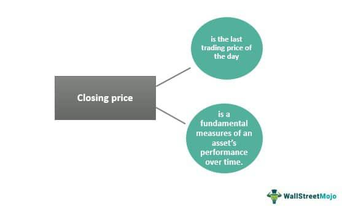

In stock trading, the closing price refers to the last price at which a stock is traded during a regular trading session. It acts as a critical benchmark for market participants, serving as a reference point for evaluating the stock's daily performance. This price is determined at the end of the trading day and is publicly reported, often influencing investor sentiment and subsequent trading decisions. The last traded price, on the other hand, is the price at which the most recent transaction occurred for a specific security during a trading session. Unlike the closing price, it constantly updates throughout the trading day, providing a real-time snapshot of the stock's market value.

Both the closing price and last traded price carry significant weight in the stock market. The closing price is instrumental in technical analysis, as it is used to compute various financial metrics and indicators such as moving averages, which aid in forecasting future price movements. Considering the last traded price is crucial for traders who engage in real-time decision-making, as it reflects the instantaneous market dynamics.



Algorithmic trading, or algo trading, refers to the use of computer algorithms to execute trading decisions automatically. These algorithms process vast quantities of market data to identify opportunities for maximizing returns. The closing and last traded prices are integral to these algorithms, serving as key variables that influence trading strategies. For instance, an algorithm might be programmed to execute trades only when the last traded price crosses a certain threshold in relation to the closing price, indicating a potential market shift.

This article will cover several essential topics related to these concepts. It begins with an exploration of the roles and significance of closing and last traded prices in stock trading. Further, it discusses the mechanics and applications of algo trading, highlighting how these prices are utilized within algorithms to enhance trading efficiency and effectiveness. Through real-life case studies, the article will also illustrate the implications of these prices in trading strategies and their effect on market behavior. Finally, it will reflect on the future of algo trading, especially as technology and data analytics continue to evolve.

Understanding these concepts is crucial for investors and traders seeking to navigate the complexities of the stock market. By grasping the nuances of closing and last traded prices and their application in algo trading, individuals can better position themselves to make informed and strategic investment decisions. This knowledge equips market participants with the insights needed to respond adeptly to market trends and optimize their trading outcomes.

## Table of Contents

## Understanding Closing Price in Stock Trading

The closing price in stock trading is defined as the final price at which a security is traded on a given trading day as the market officially closes. It represents a critical data point for traders, investors, and analysts as it establishes a benchmark for evaluating the stock’s performance over that particular day and serves as a reference for the next trading session.

Stock exchanges determine the closing price using the last executed trade price before the official market closing. Depending on the exchange, the closing price could also be adjusted for after-hours trading, depending on the trading activities that occur beyond regular trading hours. Several exchanges apply specific algorithms or weighted methods to calculate the most reflective closing price, ensuring it represents the most accurate market valuation.

The closing price holds significant importance as it serves as a point of reference for the next trading session. It is typically used in technical analysis to identify price patterns and chart developments over time. Additionally, closing prices contribute to broader market indices, which in turn influence broader economic indicators and financial instruments such as mutual funds and exchange-traded funds (ETFs).

From the perspective of stock valuations and performance assessments, closing prices are essential. For example, analysts often use these prices to calculate key ratios such as Price-to-Earnings (P/E) and to establish the end-of-day market capitalizations of companies. By acting as a standardized measure, the closing price supports both day-to-day evaluations and long-term analytical forecasts concerning the company's stock performance.

Consider, for example, a trader analyzing the stock of Company X. If Company X's stock closes lower than expected, it may signal a trend reversal or signify investor reactions to unforeseen news, prompting the trader to adjust their position accordingly. Conversely, a higher-than-expected closing price might validate the trader’s bullish stance and influence future buy-sell decisions, impacting overall trading strategy.

Understanding the dynamics of closing prices allows market participants to calibrate their strategies to reflect overnight news developments and prospective market trends, playing a pivotal role in informed decision-making processes.

## What is Last Traded Price?

The last traded price in stock transactions represents the price at which the most recent buy and sell order of a particular stock was executed during a trading session. This price is continually updated throughout the trading day as transactions are made and serves as a dynamic indicator of a stock's current value in the market. 

The last traded price is crucial because it acts as a real-time reflection of supply and demand dynamics for the stock. It contrasts with the closing price, which is the final price at which a stock is traded at the end of the trading day and is considered a fixed point until the next session begins. While the last traded price offers an immediate snapshot of trading activity, the closing price is often used as a benchmark for historical analysis and comparison.

In terms of real-time trading decisions and strategies, the last traded price plays a pivotal role. Traders rely on this constantly updating metric to make informed decisions about entering or exiting positions, adjusting strategies based on market movements, or comparing the last traded price to historical data to predict potential price directions.

Traders use various strategies that incorporate the last traded price. For instance, [momentum](/wiki/momentum) traders might look for stocks that have had significant increases or decreases in the last traded price, indicating a strong trend that could be capitalized upon. Similarly, day traders rely heavily on the fluctuations of the last traded price to execute multiple trades within a single trading session, aiming to profit from these small price movements.

Moreover, the last traded price is a key component in several trading algorithms. For example, a simple moving average strategy might use the last traded price as follows:

```python
def moving_average(prices, n):
    return sum(prices[-n:]) / n

last_traded_prices = [100, 102, 105, 107, 110]
n = 3
ma = moving_average(last_traded_prices, n)
print(ma)
```

In this Python code, the last traded prices of a stock are used to calculate a moving average over the last three periods, providing traders with insights into the stock's recent price trend for making buy or sell decisions. By leveraging such strategies, traders aim to optimize their outcomes by considering the most immediate and relevant data available.

 to Algo Trading

Algorithmic trading, often dubbed algo trading, refers to the use of computer algorithms to automate and execute trading orders. These algorithms make financial trading decisions based on pre-set rules and mathematical models. The roots of [algorithmic trading](/wiki/algorithmic-trading) can be traced back to the 1970s when the New York Stock Exchange implemented the Designated Order Turnaround, an electronic system that handled order flows. Over the decades, advancements in computing power and the development of complex mathematical models have driven the evolution of algo trading, transforming it into a cornerstone of modern financial markets.

Algo trading utilizes massive amounts of online data, crucially including the closing and last traded prices of stocks, to formulate and execute strategies. The closing price, which is the final price at which a security is traded on a particular day, and the last traded price, representative of the most recent transaction during trading hours, are pivotal data points. These prices, readily available in real-time through market data feeds, serve as vital inputs for analyzing market trends and making split-second trading decisions.

Creating and implementing algo trading strategies involves developing algorithms that can process and analyze market data, identify trends, and execute trades automatically, all within milliseconds. These strategies are crafted around specific trading goals, such as [market making](/wiki/market-making), statistical [arbitrage](/wiki/arbitrage), or [trend following](/wiki/trend-following). An algorithm designed for [statistical arbitrage](/wiki/statistical-arbitrage), for instance, might exploit inefficiencies in pricing across related securities. Here is a sample implementation of a simple mean-reversion strategy in Python:

```python
import numpy as np
import pandas as pd

# Sample price data
price_data = pd.Series(...)

# Calculate rolling mean and standard deviation
window_size = 20
rolling_mean = price_data.rolling(window=window_size).mean()
rolling_std = price_data.rolling(window=window_size).std()

# Define entry and exit signals
entry_threshold = 1.5
exit_threshold = 0.5

# Strategy conditions
long_signal = (price_data < (rolling_mean - entry_threshold * rolling_std))
short_signal = (price_data > (rolling_mean + entry_threshold * rolling_std))
exit_signal = (abs(price_data - rolling_mean) < exit_threshold * rolling_std)

# Initial positions
positions = np.zeros(len(price_data))
positions[long_signal] = 1  # Long position
positions[short_signal] = -1  # Short position
positions[exit_signal] = 0  # Exit position

# Adjusted positions
adjusted_positions = positions.shift()

```

The benefits of algo trading are numerous, including enhanced speed, accuracy, and efficiency. Algorithms can analyze data and execute orders at a speed and accuracy levels incomparable to human traders, which is critical in markets where prices can change within fractions of a second. Furthermore, algorithms remove emotional biases and reduce human error, optimizing trading efficiency.

Popular types of algorithms in trading include trend-following algorithms, arbitrage algorithms, and market-making algorithms. Trend-following algorithms are designed to identify and exploit upward and downward trends in asset prices. Arbitrage algorithms take advantage of price discrepancies between different markets or instruments. Market-making algorithms provide [liquidity](/wiki/liquidity-risk-premium) by continuously buying and selling securities, benefiting from the bid-ask spread.

Understanding the dynamics of algorithmic trading and its reliance on key price metrics like closing and last traded prices is essential for modern traders and investors. As technology advances, the role of algorithmic trading in global markets is poised to expand, offering new opportunities and challenges in equal measure.

## Role of Closing and Last Traded Prices in Algo Trading

In algorithmic trading, closing and last traded prices are pivotal components that shape trading strategies and decision-making processes. Algorithms are meticulously programmed to leverage these data points to ensure optimal trade execution. Here's how these prices are utilized and the considerations involved.

Algorithms utilize closing prices primarily for strategies requiring a comprehensive analysis of historical data points. The closing price, being the last price a security trades at during a standard trading session, serves as a stable and reflective benchmark. This price is typically used in calculating daily price movements, moving averages, and other technical indicators. For instance, a simple moving average (SMA) can be computed using closing prices as follows:

$$
\text{SMA} = \frac{\sum_{i=1}^{n} \text{Closing Price}_i}{n}
$$

where $n$ is the number of data points.

On the other hand, the last traded price is crucial for real-time trading decisions. It provides the most current valuation of a security, making it essential for high-frequency trading ([HFT](/wiki/high-frequency-trading-strategies)) strategies where timing is critical. Algorithms that rely on the last traded price are typically designed for rapid execution, ensuring trades are made swiftly in response to market movements.

The advantages of using these prices in algo trading include accuracy in reflecting market sentiment and efficiency in execution. By leveraging the closing price, algorithms can maintain a consistent analytic framework, reducing noise from intraday [volatility](/wiki/volatility-trading-strategies). Meanwhile, the last traded price allows for exploiting short-term opportunities, enhancing the potential for profit margins.

Common strategies utilizing these prices include mean reversion strategies, where algorithms predict that prices will return to an average level, often determined by moving averages of closing prices. Another strategy is trend following, where trades are executed in the direction of a well-defined trend, often using the last traded prices for confirmation and entry points.

Nevertheless, integrating closing and last traded prices into algorithms poses challenges. One key consideration is the latency in data processing—algorithms must process large volumes of data swiftly to capitalize on last traded price movements. Moreover, algorithms need to account for potential anomalies or manipulations in closing prices, such as those arising from market closing auctions.

Accuracy and reliability are paramount in algorithmic models. Errors or inaccuracies in price data can lead to significant financial losses. As a result, robust data validation and error-checking mechanisms are essential in algorithmic systems to maintain trustworthiness and performance reliability.

In summary, closing and last traded prices are indispensable elements in algo trading. Their correct application and integration into algorithmic models enhance trading efficiency and accuracy, empowering traders to make informed decisions and execute effective strategies.

## Case Studies and Examples

Real-life case studies provide valuable insights into how closing and last traded prices are pivotal in algorithmic trading strategies, often determining their success or failure. Analyzing these examples helps to comprehend the impact of these price metrics on trading performance and to identify potential improvements for future strategies.

### Case Study 1: High-Frequency Trading (HFT) in the S&P 500

One notable example involves high-frequency trading firms operating within the S&P 500 index. These firms have extensively used algorithms to capitalize on the minor price discrepancies between the last traded price and the anticipated closing price. By executing thousands of trades in milliseconds, HFT algorithms slightly adjust their positions based on real-time data concerning last traded prices and predictions of the closing price. The effectiveness of these strategies lies in their ability to exploit minute market inefficiencies, generating substantial profits with minimal risk.

Results from this case study highlighted that algorithms relying on accurate real-time data, specifically the last traded price, can significantly improve trading performance. These strategies showed a marked increase in efficiency compared to traditional trading methods, with some firms reporting over 30% improvements in their trading margins.

### Case Study 2: Mean Reversion Strategies in the Forex Market

In the Forex market, algorithms utilizing mean reversion strategies have successfully incorporated both closing and last traded prices. This strategy assumes that currency prices will revert to their mean over time. By comparing the current last traded price to historical closing prices, algorithms predict potential reversals and adjust positions accordingly.

Performance analysis revealed that mean reversion strategies, enhanced through precise last traded and closing price data, resulted in consistent returns with lower volatility. These algorithms were particularly effective in currency pairs with lower liquidity, where price discrepancies are more pronounced and predictable.

### Lessons Learned

Several key lessons emerge from these case studies. First, the accuracy and timeliness of data inputs, specifically the closing and last traded prices, are critical for the success of algorithmic strategies. Algorithms must constantly adapt to changing market conditions and maintain high data integrity to remain effective.

Another lesson is the importance of diversification across markets and strategies. In both case studies, algorithms diversified their tactics across multiple asset classes and sectors, reducing their vulnerability to specific market shocks.

### Sector Responses to Algo Strategies

Different markets and sectors respond distinctively to various algorithmic strategies. For instance, the highly liquid U.S. stock market is particularly conducive to HFT strategies, while the Forex market provides opportunities for mean reversion strategies due to its volatility and fluctuation patterns.

### Emerging Trends

Recent trends indicate a growing interest in integrating [machine learning](/wiki/machine-learning) and [artificial intelligence](/wiki/ai-artificial-intelligence) with algorithmic trading. These technologies enhance an algorithm's ability to adapt to complex market dynamics by analyzing vast datasets, including historical closing and last traded prices. Another trend is the increased adoption of [alternative data](/wiki/best-alternative-data) sources to refine predictions and improve algorithm performance further.

These case studies underscore the crucial role of closing and last traded prices in shaping algorithmic trading strategies. They reveal the complexities involved and the continuous need for innovation and adaptation in algorithmic models to sustain competitive performance in the evolving financial markets.

## Conclusion

The closing price and the last traded price serve as pivotal elements in stock trading, offering traders and investors crucial insights into market behavior and stock performance. Understanding their distinct roles is essential for crafting effective trading strategies. The closing price is the final price at which a stock is traded during a trading session, serving as a key reference point and influencing stock evaluations and future market analysis. Meanwhile, the last traded price represents the most recent transaction, providing real-time data crucial for immediate decision-making.

Integrating both these prices into algorithmic trading strategies enhances the precision and efficacy of trade executions. Algorithms utilize the closing and last traded prices to discern patterns, predict trends, and optimize trade timings, proving beneficial in terms of speed and accuracy. As technology continues to progress, the potential of algorithmic trading expands, offering increasingly sophisticated tools for market analysis.

Investors and traders are encouraged to deepen their understanding of these concepts, as mastery over the nuances of trading prices can significantly enhance strategic outcomes. Continued education in algorithmic trading and data analysis remains vital in adapting to the evolving dynamics of the stock market. Technology and data have become integral to modern stock trading, continuously shaping strategies and outcomes, hence, embracing these advancements is essential for future success in the financial markets.

## References & Further Reading

[1]: Bergstra, J., Bardenet, R., Bengio, Y., & Kégl, B. (2011). ["Algorithms for Hyper-Parameter Optimization."](https://papers.nips.cc/paper/4443-algorithms-for-hyper-parameter-optimization) Advances in Neural Information Processing Systems 24.

[2]: ["Advances in Financial Machine Learning"](https://www.amazon.com/Advances-Financial-Machine-Learning-Marcos/dp/1119482089) by Marcos Lopez de Prado

[3]: ["Evidence-Based Technical Analysis: Applying the Scientific Method and Statistical Inference to Trading Signals"](https://www.amazon.com/Evidence-Based-Technical-Analysis-Scientific-Statistical/dp/0470008741) by David Aronson

[4]: ["Machine Learning for Algorithmic Trading"](https://github.com/stefan-jansen/machine-learning-for-trading) by Stefan Jansen

[5]: ["Quantitative Trading: How to Build Your Own Algorithmic Trading Business"](https://www.amazon.com/Quantitative-Trading-Build-Algorithmic-Business/dp/1119800064) by Ernest P. Chan