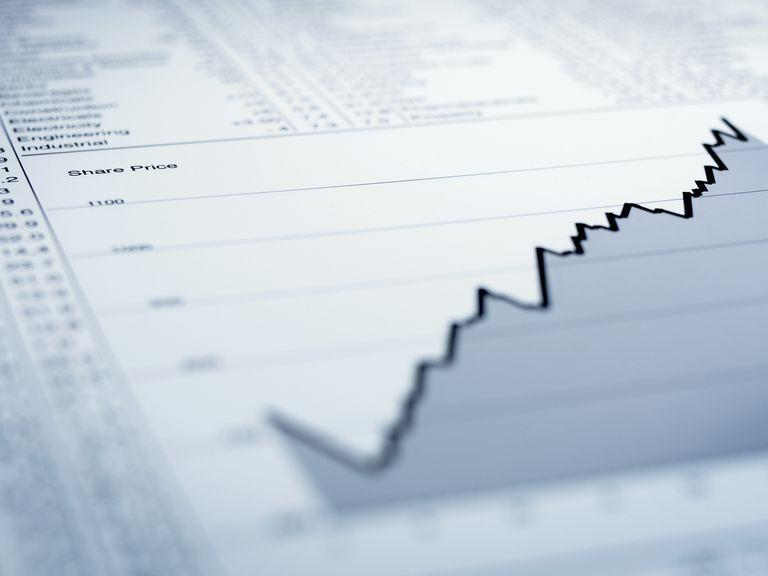

## Table of Contents

## What is a closing price?

The closing price is the last price at which a stock or other security trades during a regular trading session. It is important because it gives investors a clear point of reference to see how the value of their investments has changed from one day to the next. For example, if you own a stock and want to know if it went up or down today, you would look at the closing price.

Many financial reports and analyses use the closing price to calculate performance metrics like daily gains or losses. It's also used to determine the value of stock market indices like the S&P 500 or Dow Jones Industrial Average at the end of each trading day. This makes the closing price a key piece of information for anyone following the stock market.

## How is the closing price determined?

The closing price is determined by the last trade of a stock during the regular trading hours of the stock market. Regular trading hours are usually from 9:30 AM to 4:00 PM Eastern Time in the United States. If a stock trades at $50 at 3:59 PM and then at $51 at 4:00 PM, the closing price for that stock would be $51 because that was the last price it traded at during the regular session.

Sometimes, the closing price can be influenced by special auction processes that some exchanges use. For example, the New York Stock Exchange uses a closing auction to help determine the closing price. During this auction, buy and sell orders are matched to find a fair closing price that reflects the market's supply and demand at the end of the day. This helps make sure the closing price is as accurate as possible.

## Why is the closing price important for investors?

The closing price is important for investors because it tells them the value of their stocks at the end of each trading day. This helps them see if their investments went up or down in value. For example, if an investor bought a stock at $100 and the closing price that day was $105, they would know their investment increased by $5. This information is useful for making decisions about whether to buy more, sell, or hold onto their stocks.

The closing price also helps investors compare their stocks to others and to the overall market. Many stock market indexes, like the S&P 500, use closing prices to calculate their values. By looking at the closing prices, investors can see how their stocks performed compared to these indexes. This can give them a better understanding of how well their investments are doing in the bigger picture of the market.

## Can the closing price affect stock market indices?

Yes, the closing price can affect stock market indices. These indices, like the S&P 500 or the Dow Jones, are made up of many different stocks. The closing prices of these stocks are used to figure out the value of the index at the end of each trading day. If a lot of the stocks in the index have higher closing prices, the index will go up. If the closing prices go down, the index will go down too.

This is important because many people watch these indices to see how the whole market is doing. If the closing prices of stocks in the index change a lot, it can make the index move a lot too. This can affect how people feel about the market and might make them decide to buy or sell their stocks. So, the closing price of individual stocks can have a big impact on the bigger picture of the stock market.

## How does the closing price differ from the opening price?

The closing price is the last price a stock trades at during the regular trading day, which ends at 4:00 PM Eastern Time. This price is important because it shows the final value of a stock for that day. Investors use it to see how their stocks did and to compare them with other stocks or the whole market. The closing price can affect stock market indexes like the S&P 500, which are calculated using the closing prices of the stocks they include.

The opening price, on the other hand, is the first price a stock trades at when the market opens at 9:30 AM Eastern Time. This price can be different from the closing price of the previous day because new information might have come out overnight or over the weekend that changes what people think the stock is worth. The opening price gives investors a starting point to see how the stock might move during the day. Both prices are important, but they tell us different things about what's happening with a stock.

## What role does the closing price play in technical analysis?

In technical analysis, the closing price is really important. It helps people who study stock charts to see patterns and make guesses about where the stock might go next. They look at the closing price every day to see if the stock is going up, down, or staying the same. This helps them draw lines and shapes on the chart to predict future movements. For example, if the closing price keeps going up, they might think the stock will keep going up for a while.

The closing price is also used to figure out things like moving averages, which are lines on the chart that smooth out the price over time. These moving averages can help show if a stock is in a trend. If the closing price is above the moving average, it might mean the stock is doing well. If it's below, it might mean the stock is not doing so well. So, the closing price is a big part of how people use technical analysis to make choices about buying or selling stocks.

## How can the closing price be used to calculate daily price changes?

The closing price helps us figure out how much a stock's price changed in one day. To do this, you take the closing price of today and subtract the closing price from yesterday. If the result is positive, the stock's price went up. If it's negative, the price went down. For example, if a stock closed at $50 yesterday and $52 today, the daily price change would be $52 minus $50, which is $2. This tells you the stock went up by $2 that day.

This simple calculation is useful for investors because it shows them right away if their stocks are making money or losing money. They can use this information to decide if they want to keep their stocks, sell them, or buy more. Knowing the daily price change helps investors keep track of their investments and make smart choices about what to do next.

## What are the implications of a high closing price on a stock?

When a stock has a high closing price, it means that it ended the trading day at a higher value than before. This can be good news for people who own the stock because it means their investment is worth more money. For example, if someone bought the stock at a lower price and it keeps going up, they could sell it for a profit. A high closing price might also make other people want to buy the stock because they think it will keep going up. This can make the stock even more popular and possibly increase its price even more.

However, a high closing price isn't always a sure sign that things will keep getting better. Sometimes, a stock's price can go too high too fast, and then it might drop back down. This can happen if people start to think the stock is too expensive or if something bad happens to the company. So, while a high closing price can be exciting, it's important for investors to look at other things too, like how the company is doing and what's happening in the market, before deciding what to do with their stocks.

## How do after-hours trading activities influence the closing price?

After-hours trading happens after the regular trading day ends at 4:00 PM Eastern Time. The closing price is the last price a stock trades at during regular hours, so after-hours trading doesn't change the closing price directly. But what happens after hours can affect how people feel about the stock the next day. If a lot of people buy or sell the stock after hours, it might make the opening price the next day different from the closing price.

For example, if good news comes out after the market closes and the stock's price goes up a lot in after-hours trading, more people might want to buy it when the market opens again. This could make the opening price higher than the closing price. On the other hand, if bad news comes out and the stock's price drops a lot after hours, people might want to sell it when the market opens, making the opening price lower. So, while after-hours trading doesn't change the closing price itself, it can influence what happens to the stock's price the next day.

## What is the significance of the closing price in options and futures markets?

In the options and futures markets, the closing price is very important because it helps set the value of these contracts at the end of each trading day. Options are agreements that give you the right to buy or sell a stock at a certain price, and futures are agreements to buy or sell something at a set price in the future. The closing price of the underlying stock or asset is used to figure out how much these options and futures are worth. This helps traders know if their options or futures are making or losing money.

The closing price also affects how much you have to put up as a deposit, called margin, in futures trading. If the closing price of the asset moves a lot, it can change the value of your futures contract. If the price goes against you, you might need to add more money to your margin account to keep your position. So, the closing price is a key part of managing risk and making decisions in both options and futures markets.

## How does the concept of closing price vary in different global markets?

The concept of closing price is pretty much the same around the world: it's the last price a stock trades at during the regular trading day. But the times when the market closes can be different in different countries. For example, the U.S. stock market closes at 4:00 PM Eastern Time, but the Tokyo Stock Exchange closes at 3:00 PM local time. So, if you're looking at stocks from different countries, you have to know when their markets close to understand their closing prices.

Sometimes, the way the closing price is figured out can be a bit different too. Some markets use a special auction at the end of the day to find the closing price. This is like a big sale where people put in their buy and sell orders, and the market matches them to find a fair price. Other markets might just use the last trade of the day. Even though these small differences exist, the main idea of the closing price as the final value of a stock for the day stays the same everywhere.

## What advanced statistical models use closing prices for forecasting market trends?

Advanced statistical models like time series analysis and [machine learning](/wiki/machine-learning) algorithms use closing prices to forecast market trends. Time series analysis looks at how the closing prices change over time and uses this information to predict what might happen next. For example, it can look at patterns like how the stock went up and down in the past to guess where it might go in the future. This helps investors and traders make better decisions about buying or selling stocks.

Machine learning models, on the other hand, can learn from lots of data, including closing prices, to make predictions. These models can find complex patterns in the data that might be hard for people to see. They can use the closing prices along with other information, like news or economic reports, to forecast how the market might move. Both types of models are powerful tools that help people understand and predict what might happen in the stock market based on closing prices.

## What is the understanding of Closing Price in Financial Data?

The closing price of a stock represents the final transaction price recorded at the end of a trading day. This price is pivotal as it serves as a benchmark for evaluating the stock's performance on that particular day and provides insights into market sentiment. Traders and investors use the closing price to understand how a stock has been valued at the end of the trading session, often comparing it against previous closing prices to identify trends or reversals.

In technical analysis, closing prices play a crucial role in identifying market trends and generating potential buy or sell signals. Analysts frequently incorporate closing prices into chart patterns and indicators, such as moving averages and candlestick formations, to gain insights into the future direction of price movements. For example, a simple moving average (SMA) can be calculated using the closing prices over a specified period, providing a smoothed line that helps identify the general direction of a stock's trend:

$$
\text{SMA}(n) = \frac{\sum_{i=1}^{n} \text{Closing Price}_i}{n}
$$

Where $n$ is the number of periods considered in the moving average.

The determination of the closing price is influenced by the prevailing supply and demand dynamics at the end of the trading session, often reflecting the market’s consensus value for the stock. Market orders placed just before the market closes, particularly those by institutional investors or through automated trading systems, can significantly affect the closing price.

Comparing closing prices to historical data allows traders to assess whether a stock is trending upwards or downwards. A consistent increase in closing prices over several periods might indicate an upward trend, prompting traders to consider buying opportunities. Conversely, a series of declining closing prices could signal a downward trend and potential selling opportunities.

The significance of closing prices extends beyond daily trading as they serve as a reference for the opening price of the next trading day. Discrepancies between the previous day's closing price and the next day's opening price can provide insights into overnight sentiment or news developments that may affect market dynamics.

Overall, the closing price is an essential component of market analysis, enabling traders to evaluate a stock's [momentum](/wiki/momentum), construct indications of future price movements, and formulate strategies that leverage historical price patterns.

## What is the Role of Closing Prices in Stock Market Analysis?

Stock market analysis fundamentally depends on the interpretation of closing prices due to their capacity to encapsulate daily market sentiment. These prices represent the last trade price before the market closes for the day and are essential in gauging investor psychology and market conditions at the end of a trading session. Traders extensively use closing prices to derive pivotal analytical metrics, such as moving averages, which aid in identifying trends and potential reversal points.

Moving averages, defined as the average of a stock's closing prices over a specific time period, are instrumental in smoothing out price data to highlight the direction of the trend. A simple moving average (SMA) can be calculated as follows:

$$
SMA_n = \frac{P_1 + P_2 + ... + P_n}{n}
$$

where $P$ represents the closing prices over $n$ periods. This moving average assists traders in making data-driven predictions by filtering out noise from volatile market data.

Beyond technical indicators, closing prices are integral to both technical and fundamental analyses. In technical analysis, these prices are utilized to conduct pattern recognition, where price charts are scrutinized for formations like head and shoulders, which predict upcoming trends or reversals. Additionally, closing prices are key in identifying support and resistance levels—price points where the stock habitually rebounds or stalls respectively, guiding traders on entry and [exit](/wiki/exit-strategy) points for positions.

In [fundamental analysis](/wiki/fundamental-analysis), closing prices enable traders to calculate valuation metrics, such as price-to-earnings (P/E) ratios. Since these calculations often hinge on market evaluations at the close of trading, they provide a more stable comparative valeue over intra-day prices, facilitating informed long-term investment decisions. For instance, closing prices serve as reference points for assessing relative performance against earnings announcements or economic reports.

Ultimately, closing prices furnish traders and investors with critical insights required for constructing strategic trading decisions. They serve as anchors in aligning broader economic perspectives with market realities, allowing for robust analyses that tackle both immediate and long-term market opportunities. Beyond raw data, closing prices underscore consistent patterns in price behavior, providing crucial context for both predictive and retrospective evaluations within market analyses.

## What is the relationship between Algorithmic Trading and the Use of Closing Prices?

Algorithmic trading leverages the power of computer programs to automate trading decisions based on specific sets of rules and algorithms. At the heart of many [algorithmic trading](/wiki/algorithmic-trading) systems is the use of closing prices, a fundamental piece of financial data that aids in the formation and execution of trading strategies.

Closing prices are essential for [backtesting](/wiki/backtesting), a process where strategies are tested against historical data to evaluate their potential effectiveness before their actual implementation. By analyzing how a strategy would have performed in the past, traders can refine their algorithms to enhance future performance.

One prevalent strategy in algorithmic trading that utilizes closing prices is the moving average crossover. This technique involves calculating moving averages, which are smoothed representations of stock prices over a specified period, to identify potential trading signals. In a simple moving average (SMA) crossover strategy, two SMAs—one short-term and one long-term—are calculated. A common rule is to buy when the short-term SMA crosses above the long-term SMA (a bullish signal), and sell when the short-term SMA crosses below the long-term SMA (a bearish signal). The formulas for SMAs are:

$$
\text{SMA}_n = \frac{P_1 + P_2 + \cdots + P_n}{n}
$$

where $P_i$ represents the closing price on the $i$-th day and $n$ is the number of periods.

Mean reversion strategies are another category of algorithmic trading strategies that use closing prices. These strategies are based on the assumption that prices will eventually revert to their historical mean or average level. When a stock's closing price deviates significantly from its average, traders might expect a correction. A common approach implements the z-score, defined as:

$$
z = \frac{P_{\text{close}} - \mu}{\sigma}
$$

where $P_{\text{close}}$ is the closing price, $\mu$ is the mean of historical closing prices, and $\sigma$ is the standard deviation. Trades are executed when the z-score exceeds a predefined threshold, indicating that the price is significantly overbought or oversold.

Algorithmic trading systems can be developed and tested using programming languages such as Python, offering libraries and frameworks to streamline algorithm development and execution. For instance, the following Python code snippet demonstrates a basic structure for implementing a moving average crossover strategy:

```python
import pandas as pd
import numpy as np

def calculate_sma(prices, window):
    return prices.rolling(window=window).mean()

def moving_average_crossover(prices, short_window=40, long_window=100):
    short_sma = calculate_sma(prices, short_window)
    long_sma = calculate_sma(prices, long_window)
    signals = pd.DataFrame(index=prices.index)
    signals['signal'] = 0.0
    signals['short_sma'] = short_sma
    signals['long_sma'] = long_sma
    signals['signal'][short_window:] = np.where(signals['short_sma'][short_window:] > signals['long_sma'][short_window:], 1.0, 0.0)
    signals['positions'] = signals['signal'].diff()
    return signals

# Example usage with closing prices from a DataFrame `data`
# data should have a column 'Close' with the closing prices
signals = moving_average_crossover(data['Close'])
```

Algorithmic trading strategies that leverage closing prices can execute trades with precision and speed, qualities that are essential in the fast-paced financial markets. By systematically applying such strategies, traders can mitigate subjective biases and improve their decision-making processes.

## References & Further Reading

[1]: Bergstra, J., Bardenet, R., Bengio, Y., & Kégl, B. (2011). ["Algorithms for Hyper-Parameter Optimization"](https://dl.acm.org/doi/10.5555/2986459.2986743). Advances in Neural Information Processing Systems 24.

[2]: ["Advances in Financial Machine Learning"](https://www.amazon.com/Advances-Financial-Machine-Learning-Marcos/dp/1119482089) by Marcos Lopez de Prado.

[3]: Aronson, D. R. (2006). ["Evidence-Based Technical Analysis: Applying the Scientific Method and Statistical Inference to Trading Signals"](https://www.amazon.com/Evidence-Based-Technical-Analysis-Scientific-Statistical/dp/0470008741). Wiley.

[4]: Jansen, S. (2020). ["Machine Learning for Algorithmic Trading"](https://github.com/stefan-jansen/machine-learning-for-trading). Packt Publishing.

[5]: Chan, E. P. (2008). ["Quantitative Trading: How to Build Your Own Algorithmic Trading Business"](https://github.com/ftvision/quant_trading_echan_book). Wiley.