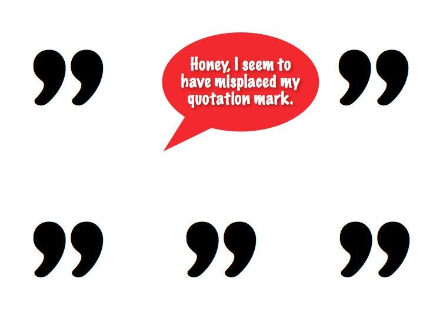

## Table of Contents

## What are closing quotation marks?

Closing quotation marks are the symbols used at the end of a quote to show where the quoted text finishes. They look like this: " or '. When you write something someone said, you put these marks at the beginning and end of their words. The closing ones tell the reader that the quote is over.

Sometimes, you might see different styles of quotation marks in different places. In American English, double quotes (") are often used for the main quote, and single quotes (') for quotes inside quotes. In British English, it can be the opposite. But no matter the style, the closing quotation marks always signal the end of the quoted part.

## How do closing quotation marks differ from opening quotation marks?

Opening quotation marks and closing quotation marks look a bit different and they have different jobs. Opening quotation marks are the ones you see at the start of a quote. They tell you that someone is about to say something or that a piece of text is being quoted. They look like this: " or '. In American English, we usually use the double one (") for the main quote, and in British English, it might be the single one (').

Closing quotation marks come at the end of the quote. They let you know that the quoted part is finished. They look like this: " or ', but they are a mirror image of the opening ones. So if you start with ", you end with ". It's the same with ', you start with ' and end with '. This helps readers see clearly where the quote begins and ends.

## In which languages are closing quotation marks used?

Closing quotation marks are used in many languages around the world. They are common in English, Spanish, French, German, and Italian. These languages use them to show where someone's words start and stop in writing. The marks look like " or ' and are put at the end of the quoted part.

Some languages use different kinds of quotation marks. For example, in Russian, they use « and » for quotes. In Greek, they use “ and ”. But no matter the language, the closing marks always tell readers that the quote is finished.

## What are the different styles of closing quotation marks?

Closing quotation marks can look different depending on where you are and what language you're using. In English, we usually see two kinds: double quotes (") and single quotes ('). Double quotes are used more in American English, while in British English, single quotes might be used more often. But no matter which one you use, the closing quote always looks like a mirror image of the opening quote.

Some other languages use different styles of quotation marks. For example, in Russian, they use « at the start and » at the end of a quote. In Greek, they use “ at the start and ” at the end. These marks still do the same job as the ones in English – they show where the quote ends. So, even though the marks can look different, they all help readers know when someone's words are finished.

## How do you use closing quotation marks in a sentence?

When you want to show what someone said, you put their words in quotation marks. At the end of what they said, you use a closing quotation mark. It looks like " or '. For example, if your friend said, "I like ice cream," you would write it like that, with the closing quotation mark right after "ice cream." This tells the reader where your friend's words end.

Sometimes, you might want to quote something inside another quote. In American English, you would use single quotes for the inside quote. So if your friend said, "My favorite flavor is 'chocolate,'" you would use a single closing quotation mark after "chocolate" and a double closing quotation mark after the whole sentence. This helps keep the quotes clear and easy to understand.

## What are the common mistakes to avoid when using closing quotation marks?

One common mistake is not matching the opening and closing quotation marks. If you start a quote with a double quotation mark (") you need to end it with a double quotation mark (") too. The same goes for single quotation marks ('). Mixing them up can confuse readers and make your writing look messy.

Another mistake is putting punctuation marks in the wrong place. In American English, periods and commas go inside the closing quotation mark, like this: "I love reading." In British English, it can be different, but it's important to be consistent. Also, make sure you don't forget the closing quotation mark at the end of a quote. It's easy to miss, but it's important for showing where the quote ends.

When using quotes inside quotes, be careful not to get the marks mixed up. In American English, use single quotes for the inside quote and double quotes for the outside quote, like this: "She said, 'I'm going home.'" In British English, it's often the opposite. Keeping the rules straight helps your writing stay clear and easy to read.

## How do closing quotation marks interact with other punctuation marks?

When you use closing quotation marks, you need to think about where to put other punctuation marks. In American English, periods and commas go inside the closing quotation mark. So if you write a sentence like "I like apples," the period goes before the closing quotation mark. In British English, it can be different. Sometimes the period goes outside the closing quotation mark, like "I like apples". But commas always go inside the closing quotation mark in both styles.

For other punctuation marks like question marks and exclamation points, it depends on the sentence. If the quote itself is a question or an exclamation, the mark goes inside the closing quotation mark, like "What time is it?" or "Wow!" If the whole sentence is a question or an exclamation but the quote is not, the mark goes outside, like Did she say "hello"? or He shouted "Stop"! Keeping these rules in mind helps your writing stay clear and correct.

## What are the historical origins of closing quotation marks?

The use of quotation marks, including closing ones, started a long time ago. In the old days, people used different ways to show when someone was speaking in a book or writing. One early way was to use a special symbol called a diple, which looked like >. This was used by ancient Greeks to show important parts of a text. Later, in the Middle Ages, people started using other marks like the pilcrow (¶) or the dash (—) to show quotes. But these were not the quotation marks we use today.

The modern quotation marks, including the closing ones, began to appear in the 16th century. In 1516, a man named Aldus Manutius, who was a printer in Venice, used marks that looked like today's quotation marks in a book. These marks were used to show where someone's words started and stopped. Over time, different countries and languages started to use their own styles of quotation marks. But the idea stayed the same: to clearly show readers where a quote begins and ends.

## How have the uses of closing quotation marks evolved over time?

In the old days, people used different symbols to show when someone was speaking in writing. They used things like the diple (>) and the pilcrow (¶) to mark important parts of text, but these were not the quotation marks we know today. It was not until the 16th century that modern quotation marks started to appear. A printer named Aldus Manutius used marks that looked like today's quotation marks in a book he printed in 1516. This was an early way to show where someone's words began and ended.

Over time, the use of closing quotation marks became more common and more standard. Different countries and languages started to use their own styles of quotation marks. For example, American English uses double quotes (") for the main quote, while British English might use single quotes ('). But no matter the style, the closing quotation mark always tells readers that the quote is finished. Today, closing quotation marks are used in many languages around the world to clearly show where someone's words end in writing.

## What are the typographical considerations when using closing quotation marks?

When using closing quotation marks, it's important to think about how they look on the page. The marks should be clear and easy to see. In printed [books](/wiki/algo-trading-books) and on computers, the marks usually look like " or '. They need to match the opening quotation marks, so if you start with a double quote (") you end with a double quote (") too. This helps readers understand where the quote starts and stops. Also, make sure the marks are not too close to the words or other punctuation marks, so they don't get mixed up.

Spacing is another thing to consider. In most cases, there should be no space between the last word of the quote and the closing quotation mark. For example, it should look like "Hello" not "Hello ". Also, think about how the quotation marks fit with other punctuation. In American English, periods and commas go inside the closing quotation mark, like "Hello." In British English, the rules can be different, but it's important to be consistent. By keeping these typographical details in mind, your writing will look neat and be easier for readers to understand.

## How do closing quotation marks vary in digital versus print media?

In digital media, like websites and e-books, closing quotation marks can look different than in print. On a computer or phone screen, the marks are usually the same as in print, like " or '. But sometimes, digital fonts can make them look a bit different. Also, in digital media, you might see different styles of quotation marks depending on the font or the language of the text. But no matter what, the closing quotation mark still tells you where the quote ends.

In print media, like books and newspapers, the closing quotation marks are very clear and standard. They look like " or ' and they are easy to see on the page. The marks need to match the opening quotation marks, so if you start with a double quote (") you end with a double quote (") too. This helps readers know where the quote starts and stops. In both digital and print, the closing quotation mark has the same job, but the way it looks can change a little bit depending on the media.

## What are the international standards and variations for closing quotation marks?

Closing quotation marks can look different around the world. In English, American style uses double quotes (") to end a quote, while British style might use single quotes ('). In other languages, the marks can be even more different. For example, in Russian, they use » to show the end of a quote, and in Greek, they use ”. These different marks help readers know where the quoted part finishes, no matter the language.

There are also international standards for using closing quotation marks. The International Organization for Standardization (ISO) suggests using double quotes (") for the main quote and single quotes (') for quotes inside quotes. But not all countries follow this rule. Some places have their own ways of doing things, like using guillemets (») in French or low-high quotation marks („”) in German. Even though the marks look different, they all do the same job: showing where someone's words end in writing.

## What are Popular Algorithmic Techniques Utilizing Closing Quotes?

Algorithmic trading employs various strategies that leverage closing quotes to achieve profitability. Two prominent techniques are mean reversion and [momentum](/wiki/momentum) strategies, both of which utilize closing quote data to obtain a competitive edge in the market.

**Mean Reversion Strategies**

Mean reversion strategies operate on the principle that price fluctuations are temporary and will eventually revert to an average value. These strategies capitalize on deviations from the historical mean of closing prices. Statistical models are often used to estimate the mean and its variance, allowing the algorithm to predict optimal entry and [exit](/wiki/exit-strategy) points.

For instance, if a stock's closing price deviates significantly from its moving average, a mean reversion algorithm might signal a buy or sell action, predicting that the price will revert to its mean. Mathematically, if $P_t$ is the closing price at time $t$ and $\mu_t$ is the moving average of the closing prices over $n$ days, the trading signal $S_t$ can be represented as:

$$
S_t = P_t - \mu_t
$$

If $S_t$ exceeds a certain threshold, a trading action will be triggered.

**Momentum Strategies**

Momentum strategies, on the other hand, focus on the persistence of price trends. A momentum algorithm analyses a series of closing quotes to determine the strength and direction of a trend. For example, suppose the closing price increases consistently over a period; in that case, the algorithm may signal a buy, anticipating the trend to continue.

A popular model used in momentum strategies is the moving average convergence divergence (MACD), which monitors the difference between short-term and long-term moving averages of closing prices. The strategy generates signals based on the convergence and divergence of these averages.

**Machine Learning Applications**

Machine learning enhances the capability of these algorithms by learning from historical closing quote data to make more informed predictions. Models can be trained to recognize patterns or anomalies in the data that may not be apparent through simpler strategies. Algorithms like neural networks and support vector machines can process complex datasets to improve the accuracy of trading signals.

For instance, a [machine learning](/wiki/machine-learning) model can be trained to predict price movements using features derived from closing quotes, such as moving averages, price [volatility](/wiki/volatility-trading-strategies), and [volume](/wiki/volume-trading-strategy) changes.

**Comparison and Evaluation**

Different algorithms are suited to varying market conditions. Mean reversion performs well in stable markets with recognizable cycles, while momentum strategies thrive in volatile markets with strong trends. The choice of strategy depends on market conditions, risk tolerance, and investment goals.

**Integration of AI**

Artificial intelligence (AI) can optimize trading strategies by incorporating adaptive learning mechanisms that dynamically adjust to changing market conditions. AI-driven algorithms can analyze vast datasets, constantly refining their strategies based on closing quote insights and other market indicators. The use of AI in algorithm design allows for more sophisticated trading strategies, potentially increasing profitability and reducing risk.

In conclusion, understanding and effectively implementing popular [algorithmic trading](/wiki/algorithmic-trading) techniques that utilize closing quotes can greatly enhance market performance. With advancements in machine learning and AI, the potential for optimizing trading strategies continues to evolve.

## References & Further Reading

[1]: Bergstra, J., Bardenet, R., Bengio, Y., & Kégl, B. (2011). ["Algorithms for Hyper-Parameter Optimization."](https://dl.acm.org/doi/10.5555/2986459.2986743) Advances in Neural Information Processing Systems 24.

[2]: ["Advances in Financial Machine Learning"](https://www.amazon.com/Advances-Financial-Machine-Learning-Marcos/dp/1119482089) by Marcos Lopez de Prado

[3]: ["Evidence-Based Technical Analysis: Applying the Scientific Method and Statistical Inference to Trading Signals"](https://www.amazon.com/Evidence-Based-Technical-Analysis-Scientific-Statistical/dp/0470008741) by David Aronson

[4]: ["Machine Learning for Algorithmic Trading"](https://github.com/stefan-jansen/machine-learning-for-trading) by Stefan Jansen

[5]: ["Quantitative Trading: How to Build Your Own Algorithmic Trading Business"](https://www.amazon.com/Quantitative-Trading-Build-Algorithmic-Business/dp/1119800064) by Ernest P. Chan