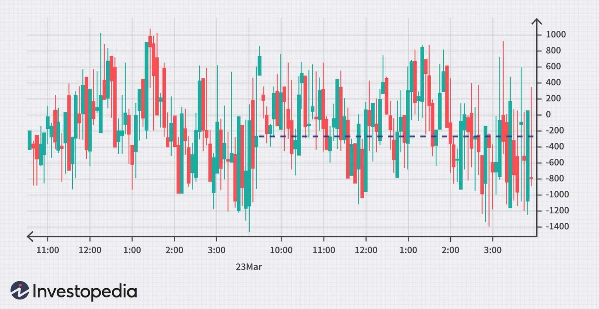

## Table of Contents

## What is a closing tick in financial markets?

A closing tick in financial markets is the last price change of a stock or an index at the end of a trading day. It shows if the last trade was higher, lower, or the same as the trade before it. If the closing tick is positive, it means the last trade was at a higher price. If it's negative, the last trade was at a lower price. If it's zero, the last trade was at the same price as the one before it.

People who study the market, like analysts and traders, look at the closing tick to understand how the market ended the day. A positive closing tick might mean the market is feeling good, while a negative one might mean the market is worried. It's just one piece of information, but it helps people make decisions about buying or selling stocks the next day.

## How is the closing tick calculated?

The closing tick is found by looking at the very last trade of the day for a stock or an index. If this last trade happens at a higher price than the trade just before it, the closing tick is positive. If the last trade is at a lower price than the one before it, the closing tick is negative. If the last trade is at the same price as the trade before it, then the closing tick is zero. It's a simple way to see if the market ended the day on an up or down note.

People who watch the market closely, like traders and analysts, use the closing tick to help them understand how the market is feeling at the end of the day. If lots of stocks have a positive closing tick, it might mean that people are feeling good about the market. On the other hand, if many stocks have a negative closing tick, it might mean that people are worried. The closing tick is just one small piece of information, but it can help make decisions about buying or selling stocks the next day.

## Why is the closing tick important for traders?

The closing tick is important for traders because it shows them the last move of the market for the day. If the closing tick is positive, it means the last trade was at a higher price than the one before it. This can make traders feel good about the market and think that it might keep going up the next day. On the other hand, if the closing tick is negative, it means the last trade was at a lower price, which might make traders worry that the market could go down the next day.

Traders use the closing tick along with other information to make decisions about buying or selling stocks. It's like a quick snapshot of how the market feels at the end of the day. While it's just one piece of the puzzle, it helps traders understand the market's mood and plan their next moves. By looking at the closing tick, traders can get a sense of whether the market is ending the day strong or weak, which can influence their strategies for the next trading day.

## Can the closing tick be used to predict market trends?

The closing tick can give traders some clues about what might happen in the market the next day, but it's not perfect for predicting trends. If the closing tick is positive, it means the last trade of the day was at a higher price than the one before it. This might make traders think the market will keep going up. But if the closing tick is negative, it means the last trade was at a lower price, and traders might worry the market will go down. So, the closing tick can show the market's mood at the end of the day, but it's just one small piece of information.

Traders use the closing tick along with lots of other information to try to guess where the market is headed. It's like looking at a small part of a big puzzle. The closing tick can help traders see if the market is ending the day strong or weak, which might influence what they do next. But because the market can change quickly and is affected by many things, the closing tick alone isn't enough to predict trends accurately. It's a helpful tool, but traders need to look at the bigger picture too.

## What is the difference between a positive and a negative closing tick?

A positive closing tick means the last trade of the day was at a higher price than the trade before it. This can make traders feel good because it shows the market ended the day on a high note. They might think the market will keep going up the next day. It's like the market is saying, "I'm feeling good today!"

A negative closing tick means the last trade of the day was at a lower price than the trade before it. This can make traders worry because it shows the market ended the day on a low note. They might think the market will go down the next day. It's like the market is saying, "I'm not feeling so great today."

## How does the closing tick relate to market sentiment?

The closing tick is like a quick check on how the market is feeling at the end of the day. If the closing tick is positive, it means the last trade was at a higher price than the one before it. This can make traders feel good about the market because it shows that things ended on a high note. They might think that the market is feeling happy and could keep going up the next day.

On the other hand, if the closing tick is negative, it means the last trade was at a lower price than the one before it. This can make traders worry because it shows that the market ended the day on a low note. They might think that the market is feeling sad or worried and could go down the next day. So, the closing tick gives traders a little hint about the market's mood at the end of the day.

## What are some common strategies that use the closing tick?

Traders often use the closing tick to help decide if they should buy or sell stocks the next day. If the closing tick is positive, it means the market ended the day feeling good, so traders might decide to buy more stocks the next day. They think the market might keep going up. But if the closing tick is negative, it means the market ended the day feeling worried. Traders might decide to sell some of their stocks the next day because they think the market might go down.

Another way traders use the closing tick is by looking at it along with other market information. They might look at the closing tick of many stocks to see if most of them are positive or negative. If most stocks have a positive closing tick, traders might feel more sure that the market is in a good mood and decide to buy more stocks. If most stocks have a negative closing tick, they might feel more sure that the market is worried and decide to sell. So, the closing tick is just one piece of the puzzle, but it helps traders make better guesses about what to do next.

## How can the closing tick influence trading decisions at the end of the day?

The closing tick can help traders decide what to do with their stocks at the end of the day. If the closing tick is positive, it means the last trade was at a higher price than the one before it. This can make traders feel good about the market because it shows that things ended on a high note. They might decide to hold onto their stocks or even buy more because they think the market might keep going up the next day.

On the other hand, if the closing tick is negative, it means the last trade was at a lower price than the one before it. This can make traders worry because it shows that the market ended the day on a low note. They might decide to sell some of their stocks because they think the market might go down the next day. The closing tick gives traders a quick snapshot of the market's mood, helping them make better decisions about what to do at the end of the day.

## What are the limitations of using the closing tick as a trading indicator?

The closing tick is just one small piece of information about the market, so it has some limits. It only shows what happened at the very end of the day, not what happened all day long. The market can change a lot from one day to the next, and lots of things can affect it, like news or big events. So, the closing tick might not tell the whole story about where the market is going.

Also, the closing tick can be tricky because it might not always predict what will happen next. Sometimes the market goes up even if the closing tick was negative, and sometimes it goes down even if the closing tick was positive. Traders need to look at other things too, like how the market has been doing over time, what's happening in the world, and other market indicators. Using the closing tick by itself can lead to wrong guesses about what the market will do.

## How does the closing tick compare to other market indicators like the advance-decline line?

The closing tick and the advance-decline line are both used to understand how the market is doing, but they look at different things. The closing tick shows if the last trade of the day for a stock or index was higher or lower than the trade before it. It's like a quick check to see how the market feels at the very end of the day. On the other hand, the advance-decline line looks at how many stocks went up versus how many went down during the whole day. It gives a broader view of the market's strength or weakness over the entire trading session.

Both indicators can help traders make decisions, but they have different uses. The closing tick is more about the market's mood at the end of the day, which might help traders decide what to do the next day. If the closing tick is positive, traders might feel good and decide to buy more stocks. The advance-decline line, however, tells traders about the overall health of the market throughout the day. If more stocks are going up than down, it might mean the market is strong, even if the closing tick is negative. So, while the closing tick gives a snapshot at the end, the advance-decline line provides a fuller picture over time.

## Can the closing tick be applied to different time frames beyond daily?

The closing tick is usually used for the end of a trading day, but it can be used for other time frames too. For example, if you're looking at a one-hour chart, the closing tick for that hour would be the difference between the last trade of the hour and the trade before it. This can help traders understand how the market feels at the end of each hour, which might be useful for making quick decisions during the day.

Using the closing tick for different time frames can give traders more information to work with. If you're looking at a weekly chart, the closing tick for the week would show if the last trade of the week was higher or lower than the one before it. This could help traders decide what to do at the start of the next week. But remember, the closing tick is just one small piece of information, no matter what time frame you're using. It's always good to look at other things too to get a fuller picture of the market.

## What advanced statistical methods can be used to analyze the closing tick data?

Advanced statistical methods can help traders understand the closing tick better. One method is using time series analysis, which looks at how the closing tick changes over time. This can help traders see if there are any patterns or trends in the closing tick data. They can use tools like moving averages to smooth out the data and see the bigger picture. Another method is regression analysis, which can help traders figure out how the closing tick relates to other things like stock prices or market indexes. By doing this, traders can see if the closing tick can help predict what might happen next in the market.

Another useful method is machine learning, which can find patterns in the closing tick data that are hard for people to see. Traders can use machine learning algorithms to look at lots of past data and learn from it. These algorithms can then help predict future closing ticks based on what they've learned. This can be really helpful for making better trading decisions. But remember, even with these advanced methods, the closing tick is just one piece of information. Traders need to use it along with other data to get the best results.

## What is the Role of Closing Ticks in Market Analysis?

Closing ticks play a crucial role in market analysis as they represent the sentiment and [momentum](/wiki/momentum) at the end of a trading session. For traders, particularly those engaged in technical analysis, closing ticks serve as vital signals that can indicate the potential direction of market movements in subsequent trading days.

### Evaluation of Closing Ticks in Technical Analysis

Technical analysis relies heavily on historical price data to predict future price movements. Within this analytical domain, the closing tick is a pivotal component, often considered more significant than opening or intra-day ticks. This is because the closing price encapsulates the most comprehensive data of what market participants are willing to hold overnight, reflecting their confidence levels and sentiment. Technical analysts use closing ticks to generate price patterns, identify trends, and develop trading strategies.

### Predicting Next-Day Movements with Closing Tick Data

Investors often use closing tick data to infer the market’s sentiment and make predictions about the next day's movement. A closing uptick, where the last trade price is higher than the previous one, can suggest bullish sentiments. Conversely, a closing downtick implies bearish outlooks. By combining these insights with other indicators like moving averages and relative strength indices, traders aim to enhance their decision-making processes.

For quantifying these movements, traders might look at the cumulative tick values, expressed as:

$$
\text{{Cumulative Tick}} = \sum_{i=1}^{n} (\text{{Close}}_i - \text{{Previous Close}}_i)
$$

where $n$ is the number of trading periods such as days or sessions.

### Interpretation Across Major Indices

The interpretation of closing ticks can vary across major stock indices, like the New York Stock Exchange (NYSE) and others. In these venues, the closing tick provides a consensus of sentiment among the vast range of market participants. 

For example, on the NYSE, a surge in the closing tick value might indicate robust buying pressure towards the end of the trading day, which is typically interpreted as a precursor to a strong opening in the subsequent trading session. This is often visualized through tick charts, where aggregated tick movements throughout the day can highlight intraday patterns:

```python
import matplotlib.pyplot as plt
import numpy as np

# Assume tick_data is a list of (time, tick) tuples
tick_data = [("09:30", 12), ("10:00", -7), ("10:30", 4), ("11:00", -2), ("15:30", 20)]

times = [data[0] for data in tick_data]
ticks = [data[1] for data in tick_data]

plt.figure(figsize=(10, 5))
plt.plot(times, np.cumsum(ticks), marker='o')
plt.title("Cumulative Tick Chart")
plt.xlabel("Time")
plt.ylabel("Cumulative Tick Value")
plt.grid()
plt.show()
```

This script provides a visual representation of cumulative tick movements throughout a trading day, helping traders to interpret the overall direction and sentiment.

In conclusion, while closing ticks serve as a key element of technical analysis, interpreting these signals correctly requires an understanding of broader market contexts and other complementary indicators. By leveraging closing tick data effectively, traders can potentially gain insights that offer a competitive advantage in forecasting market trends.

## References & Further Reading

[1]: ["Advances in Financial Machine Learning"](https://www.amazon.com/Advances-Financial-Machine-Learning-Marcos/dp/1119482089) by Marcos Lopez de Prado

[2]: ["Evidence-Based Technical Analysis: Applying the Scientific Method and Statistical Inference to Trading Signals"](https://www.amazon.com/Evidence-Based-Technical-Analysis-Scientific-Statistical/dp/0470008741) by David Aronson

[3]: ["Machine Learning for Algorithmic Trading"](https://github.com/stefan-jansen/machine-learning-for-trading) by Stefan Jansen

[4]: ["Quantitative Trading: How to Build Your Own Algorithmic Trading Business"](https://www.amazon.com/Quantitative-Trading-Build-Algorithmic-Business/dp/1119800064) by Ernest P. Chan

[5]: Aldridge, I. (2013). ["High-Frequency Trading: A Practical Guide to Algorithmic Strategies and Trading Systems, Second Edition"](https://www.amazon.com/High-Frequency-Trading-Practical-Algorithmic-Strategies/dp/1118343506). Wiley Trading Series.

[6]: Hendershott, T., Jones, C. M., & Menkveld, A. J. (2011). ["Does Algorithmic Trading Improve Liquidity?"](https://onlinelibrary.wiley.com/doi/full/10.1111/j.1540-6261.2010.01624.x) The Review of Financial Studies, Volume 24, Issue 5.

[7]: Securities and Exchange Commission (SEC) (2018). ["Assessing the Impact of the Tick Size Pilot Program"](https://www.sec.gov/ticksizepilot)