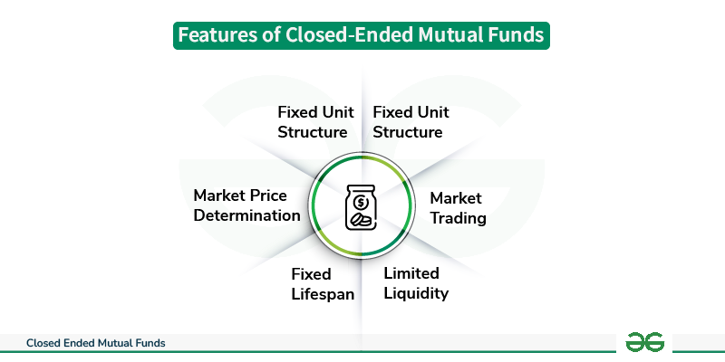

## Table of Contents

## What is a mutual fund?

A mutual fund is a type of investment where many people pool their money together to buy a variety of stocks, bonds, or other assets. It's like a big basket where everyone contributes, and a professional manager decides what to put in the basket to try to make it grow. This makes it easier for people who don't have a lot of money or time to invest in a diverse range of assets on their own.

When you invest in a mutual fund, you buy shares of the fund, and the value of your shares goes up or down based on how well the investments in the fund are doing. Mutual funds can be a good option for people who want to invest but don't want to pick individual stocks or bonds themselves. They offer diversification, which means spreading out the risk by investing in many different things, and they are managed by experts who try to make the best decisions for the fund's growth.

## Why do mutual funds close?

Mutual funds can close for a few reasons. One big reason is if not enough people are investing in the fund. If a mutual fund doesn't have enough money coming in, it can be hard for the fund to keep running smoothly. The costs of managing the fund might be too high compared to the money it has, so the company might decide to close it down.

Another reason a mutual fund might close is if the people running it decide to change their business strategy. Sometimes, the company that manages the fund might want to focus on different types of investments or start new funds. If a fund isn't doing well or doesn't fit with their new plans, they might choose to close it.

Lastly, regulatory issues can also cause a mutual fund to close. If the fund doesn't follow the rules set by government agencies, it might have to shut down. This can happen if there are problems with how the fund is managed or if it breaks laws about investing.

## What are the signs that a mutual fund might be closing?

One sign that a mutual fund might be closing is if it's getting smaller. If fewer people are buying into the fund and more are taking their money out, this can be a warning. When a fund gets smaller, it can be harder for the people running it to keep things going because the costs of managing the fund stay the same, but there's less money to work with.

Another sign is if the fund isn't doing well compared to other similar funds. If it's not making as much money as others, people might start pulling their money out. This can lead to the fund getting smaller and eventually closing. Also, if the company that runs the fund starts talking about changing its focus or starting new funds, that could mean they're thinking about closing some of their current ones.

Lastly, if there are problems with how the fund is being run, like breaking rules or not following laws, this can be a big sign that it might close. Government agencies keep an eye on mutual funds, and if they find issues, they might force the fund to shut down to protect investors.

## How does the closure of a mutual fund affect investors?

When a mutual fund closes, it can affect investors in a few ways. First, they might have to take their money out of the fund. This means they'll get back the value of their shares at the time the fund closes. If the fund was doing well, this might be good news, but if it was doing poorly, they might get less money than they hoped for. Also, if they need to move their money quickly, they might have to sell at a bad time, which could mean losing money.

Second, investors might need to find a new place to put their money. This can be a hassle because they'll need to research and choose another investment. It's important to pick a new investment that fits their goals and how much risk they're willing to take. If they don't pick a good one, it could affect how their money grows in the future.

Overall, the closure of a mutual fund can be a bit stressful for investors. They need to think about what to do with their money and make sure they're still on track with their investment plans. It's a good idea to talk to a financial advisor to help make the best choices during this time.

## What is the process of closing a mutual fund?

When a mutual fund decides to close, the first step is usually to stop new investments. This means no new people can buy into the fund. The people running the fund, called the management team, will tell everyone who has money in the fund that it's going to close. They'll explain why and what will happen next. This is important so investors know what to expect and can start planning what to do with their money.

Next, the fund starts to wind down. This means they start selling off all the stocks, bonds, or other things the fund owns. They do this slowly and carefully to try to get the best price possible. Once everything is sold, the money is given back to the investors. Each investor gets a share of the money based on how many shares they own in the fund. This whole process can take a few months, and during this time, the fund's managers keep everyone updated on how things are going.

After all the money is given back, the fund officially closes. It's no longer running, and investors need to find a new place to put their money. This can be a good time for investors to talk to a financial advisor to help them decide what to do next. The closure of a mutual fund is a big change, but with the right planning, investors can keep their money working for them.

## What are the legal and regulatory requirements for closing a mutual fund?

When a mutual fund wants to close, it has to follow certain rules set by government agencies like the Securities and Exchange Commission (SEC) in the United States. The first thing the fund needs to do is tell the SEC about the plan to close. This is called filing a notice, and it's important because it lets the government know what's happening. The fund also has to tell all the people who have money in it, called shareholders, about the closure. They do this by sending a letter or email, explaining why the fund is closing and what will happen next. This helps keep everyone informed and protects the investors.

Once the fund has told everyone, it starts selling off all its investments, like stocks and bonds. The fund needs to do this in a fair way, making sure it gets the best price possible for the assets. This process can take some time, and the fund has to keep the SEC updated on how it's going. After everything is sold, the fund gives the money back to the shareholders. The SEC checks to make sure the fund followed all the rules during the closure. If the fund didn't follow the rules, it could face penalties or even be forced to close by the government.

## How can investors protect their investments when a mutual fund is closing?

When a mutual fund is closing, investors can take some steps to protect their money. First, they should read all the information the fund sends them about the closure. This will help them understand what's happening and what they need to do. They should also keep an eye on the value of their shares in the fund. If they think the value might go down as the fund winds down, they might want to take their money out before the closure is complete. Talking to a financial advisor can also be a good idea. An advisor can help them understand their options and make a plan for what to do with their money.

Once investors get their money back from the closing fund, they need to find a new place to invest it. They should think about their goals and how much risk they're willing to take. It's important to do some research and maybe even talk to a financial advisor again to find a new investment that fits their needs. By being proactive and making smart choices, investors can keep their money safe and working for them, even when a mutual fund closes.

## What are the tax implications of a mutual fund closure?

When a mutual fund closes, investors might have to pay taxes on the money they get back. If the fund sells its investments at a profit, this is called a capital gain. Investors will have to pay taxes on their share of these gains. The tax rate depends on how long the investor held the shares. If they held them for more than a year, it's a long-term capital gain, which usually has a lower tax rate. If they held them for less than a year, it's a short-term capital gain, which is taxed at the same rate as regular income.

On the other hand, if the fund sells its investments at a loss, investors might be able to use this loss to reduce their taxes. This is called a capital loss, and it can be used to offset other gains or even some of their income. It's important for investors to keep good records of their investments and talk to a tax advisor to understand how the closure of a mutual fund will affect their taxes. By doing this, they can make sure they're following the tax rules and not paying more than they need to.

## How do fund managers decide when to close a mutual fund?

Fund managers decide to close a mutual fund when it's not doing well or when it's too small to keep running smoothly. If not enough people are putting money into the fund, it can get hard to manage because the costs stay the same but there's less money to work with. Also, if the fund isn't making as much money as other similar funds, people might start taking their money out, making the fund even smaller. Sometimes, the company that runs the fund might want to focus on different types of investments or start new funds, and if the current fund doesn't fit with their new plans, they might decide to close it.

Another reason fund managers might choose to close a mutual fund is if there are problems with how it's being run. If the fund isn't following the rules set by government agencies, it might have to shut down to protect the investors. The managers will look at all these things and decide if closing the fund is the best choice. It's a big decision, and they want to make sure it's the right one for everyone involved.

## What are the differences between voluntary and involuntary closure of mutual funds?

A voluntary closure of a mutual fund happens when the people running the fund decide to close it on their own. They might choose to do this if the fund is too small and not enough people are investing in it. It can also happen if the fund isn't making as much money as other similar funds, or if the company wants to focus on different types of investments. When a fund closes voluntarily, the managers have time to plan and tell everyone who has money in the fund what's going to happen. They can do things in a calm and organized way.

An involuntary closure, on the other hand, is when the fund has to close because of rules or problems it can't control. This can happen if the fund isn't following the laws set by government agencies, like the SEC in the United States. If the fund breaks these rules, the government might force it to close to protect the investors. Involuntary closures can be sudden and might cause more worry for the people who have money in the fund. They might not have as much time to plan what to do next with their money.

## How does the performance of a mutual fund influence its closure?

The performance of a mutual fund can be a big reason why it might close. If a fund isn't making as much money as other similar funds, people might start taking their money out. This can make the fund smaller and harder to manage because the costs of running it stay the same, but there's less money coming in. When a fund gets too small, the people running it might decide it's better to close it down. They want to make sure the fund can still work well for everyone who has money in it.

Also, if a fund keeps losing money, the company that runs it might decide to focus on other investments that are doing better. They might start new funds or change their business plan, and if the current fund doesn't fit with what they want to do, they might close it. The performance of the fund is really important because it shows if people are happy with it and if it's worth keeping open. If the fund isn't doing well, it might be time to close it and let investors put their money somewhere else that might do better.

## What long-term strategies should investors consider in light of potential mutual fund closures?

When thinking about long-term strategies, investors should focus on diversification. This means spreading their money across different types of investments, like stocks, bonds, and maybe even real estate. By doing this, if one mutual fund closes, it won't hurt their whole investment plan. They should also keep an eye on how well their mutual funds are doing compared to others. If a fund isn't doing as well, they might want to take their money out and put it in a better-performing fund before it closes.

Another important strategy is to stay informed and be ready to act. Investors should read all the news and updates from their mutual funds. If they hear that a fund might close, they can start planning what to do with their money. Talking to a financial advisor can also help them make good choices. It's good to have a plan for what to do if a fund closes, so they can move their money quickly and keep it safe.

Lastly, investors should think about their overall financial goals and how much risk they're willing to take. If they're close to needing their money, like for retirement, they might want to be more careful and pick funds that are less likely to close. If they have a long time before they need the money, they can take more risks. By keeping these things in mind and planning ahead, investors can protect their money even if a mutual fund closes.

## References & Further Reading

Statman, Meir, explores index fund strategies by inspecting “Investment Strategies and Performance: The Case of Index Funds and Index-Based Investment.” This study provides insights into the role of passive investing, drawing contrasts with active fund management, and explores how index-based investments can offer a risk-adjusted performance advantage in certain market conditions. This work is foundational for understanding the dynamics of passive strategies and their performance metrics.

Sharpe, William F., in his seminal paper “Capital Asset Prices: A Theory of Market Equilibrium Under Conditions of Risk,” introduces the Capital Asset Pricing Model (CAPM), which has become a cornerstone for modern portfolio theory and investment strategy formulation. The model explains the relationship between systematic risk and expected return in financial markets, adding a theoretical foundation for pricing risky securities.

For a deeper understanding of mutual funds and [algorithmic trading](/wiki/algorithmic-trading), consider “Mutual Funds: Risk and Performance Analysis for Decision Making” by John Haslem. This text covers comprehensive risk management strategies and performance evaluation in mutual fund investments, giving readers practical tools for informed decision-making.

“Algorithmic Trading and DMA: An Introduction to Direct Access Trading Strategies” by Barry Johnson provides a thorough overview of algorithmic trading methodologies. It includes practical coding examples and examines how trading algorithms enhance market efficiency, offering a beginner-friendly approach to complex trading dynamics.

Investors seeking to align their strategies with contemporary market dynamics may benefit from “Quantitative Investment Analysis” by Richard A. DeFusco, CFA. The book offers methodologies for applying quantitative techniques in investment decisions, ensuring strategies remain robust and adaptive to changes in financial markets.

Furthermore, for a comprehensive guide on advanced quantitative strategies and risk assessment, "Machine Learning for Asset Managers" by Marcos López de Prado can be an invaluable resource. The book introduces cutting-edge [machine learning](/wiki/machine-learning) techniques tailored for portfolio management, offering practitioners new avenues for achieving competitive investment outcomes.

These resources provide a solid foundation for anyone interested in gaining a well-rounded understanding of mutual funds and algorithmic trading, supporting both academic and practical pursuits in finance.

