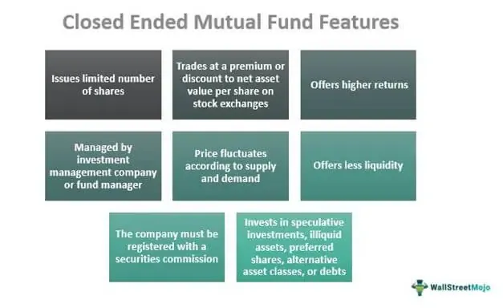

The financial landscape is undergoing remarkable changes propelled by advancements in technology and innovative investment strategies. At the forefront of these developments are mutual funds, diverse investment strategies, and algorithmic trading, which together are reshaping how investments are conceived and executed.

Mutual funds play a crucial role in this transformation by pooling resources from various investors to construct diversified portfolios. This collective approach provides individual investors access to a broad range of securities, promoting diversification and risk mitigation. Professional fund managers leverage their expertise to make strategic decisions aligned with specific investment goals, catering to varying risk tolerances and financial objectives.



Algorithmic trading, another pivotal development, leverages computer algorithms to execute trades with unparalleled speed and accuracy. This method reduces human error and enhances trade efficiency, crucial for navigating today's fast-paced financial markets. Algorithmic trading is instrumental in optimizing portfolio performance and managing large orders, thereby providing a competitive edge in investment management.

Integral to mutual funds is the concept of investment liquidation, where a fund's assets are sold off to distribute proceeds to shareholders. While necessary at times, liquidation can be detrimental if it involves forced sales during unfavorable market conditions, potentially leading to losses. Understanding liquidation's implications is essential for investors to make informed decisions in mutual fund investments.

Collectively, these components are redefining the investment paradigm, offering new opportunities and challenges. The integration of technology, through algorithmic trading, with traditional investment avenues like mutual funds, presents a dynamic landscape where adaptability and informed decision-making are paramount for success. In an era characterized by rapid change, staying informed and strategically employing these tools can significantly enhance portfolio performance and help investors meet their financial goals.

## Table of Contents

## Understanding Mutual Funds

Mutual funds are pivotal instruments in the financial market, designed to aggregate investments from multiple individuals to acquire a diversified portfolio of securities. This collective investment approach significantly mitigates risks associated with individual stock holdings, as the fund's risk is distributed across various asset classes. The fundamental advantage of mutual funds lies in their ability to offer investors access to professionally managed portfolios, which would otherwise be challenging for individual investors to construct on their own due to capital constraints.

Professional fund managers play a crucial role in mutual funds by making strategic decisions on asset allocation. Their primary objective is to align these allocations with the fund's stated investment goals, which can range from aggressive growth and income generation to capital preservation. For instance, a mutual fund with a growth objective may have a significant portion of its assets invested in equities, targeting higher long-term returns, albeit with greater [volatility](/wiki/volatility-trading-strategies). Conversely, a fund focused on capital preservation may invest predominantly in bonds and other fixed-income securities.

There is a wide array of mutual funds available to cater to different investment preferences and risk tolerances. Broadly, these can be classified into equity funds, bond funds, money market funds, and hybrid funds. Equity funds primarily invest in stocks and are suited for investors with a higher risk appetite seeking capital appreciation. Bond funds, on the other hand, are less volatile and focus on generating regular income through investments in government and corporate debt. Money market funds aim at maintaining capital stability while generating modest income, making them appropriate for risk-averse investors seeking [liquidity](/wiki/liquidity-risk-premium). Hybrid funds, which invest in a mix of equities and bonds, offer a balance of growth and income, appealing to moderate risk-takers.

The mutual fund market has evolved to offer specialized funds that invest in specific sectors, geographic regions, or commodities. Such specialized funds can significantly enhance portfolio diversification by adding exposure to niche markets or emergent economies, although they may also exhibit higher volatility due to their concentrated nature.

Investors should carefully consider several factors when choosing mutual funds, including the investment goals, time horizon, and the fund's expense ratio, which can diminish overall returns. A thorough evaluation of a fund's historical performance and the expertise of the fund manager can further guide investors in selecting funds that align with their financial objectives.

## Investment Liquidation in Mutual Funds

Liquidation in mutual funds refers to the process of selling off all fund assets, with the aim of distributing the proceeds to shareholders. This occurrence, while not common, can have significant financial implications for investors. Liquidation is typically initiated when a mutual fund faces unsustainable financial conditions, such as continued underperformance, declining asset value, or inability to meet redemption requests from its investors.

One of the primary concerns with fund liquidation is the potential for forced sales and consequent losses. When a fund liquidates, it must sell its portfolio holdings, often within a short period, to return money to investors. This urgency can lead to selling assets at unfavorable prices, particularly in a declining market. If the market for the specific assets is illiquid or volatile, the forced sale can exacerbate the decline in asset value. This scenario can ultimately lead to investors receiving a lower return than originally anticipated.

The decision to liquidate a mutual fund is a critical one, influenced by several factors. Fund managers may decide to liquidate due to consistent poor performance, as maintaining operations might not be in the best interests of the shareholders. Sometimes, changes in economic conditions or regulatory environments prompt liquidation decisions if they adversely affect the fund's viability. Moreover, shifts in investor preferences or demographics can result in significant outflows, further compelling a fund to liquidate.

Understanding the implications of fund liquidation is essential for investors as it directly affects their returns and investment strategies. Investors must consider potential liquidation risks when selecting mutual funds, examining factors like the fund’s performance history, management stability, and market trends. Additionally, investors should be vigilant regarding warning signs of possible liquidation, such as significant redemptions or consistent underperformance relative to benchmarks.

Investment liquidation also presents tax considerations. When a fund liquidates, any gains realized through the sale of assets are generally passed on to shareholders in the form of capital gains distributions. This could lead to an unexpected tax liability, even if the overall market value of the investment has declined. Therefore, understanding both the timing and the tax impact of liquidation is crucial for tax planning and optimizing net returns.

In summary, fund liquidation poses challenges and risks, but with careful planning and awareness, investors can mitigate potential adverse effects. Evaluating fund performance and staying informed about economic and market conditions can help investors anticipate and respond effectively to the liquidation of a mutual fund.

## Role of Algo Trading in Mutual Funds

Algorithmic trading, commonly referred to as algo trading, is increasingly becoming a pivotal element in the management and execution of trades within mutual funds. This sophisticated approach leverages computer algorithms to facilitate transactions, thereby ensuring precision, speed, and efficiency in the financial markets. 

The primary advantage of [algorithmic trading](/wiki/algorithmic-trading) lies in its ability to significantly reduce human errors, which are often prevalent in manual trading processes. By automating standard trading strategies, algorithms eliminate the emotional biases that can adversely affect trading decisions. This is particularly advantageous in dynamic markets where timing is crucial, allowing trades to be executed at optimal prices. 

Moreover, algo trading aids in optimizing portfolio performance by managing large orders with minimal market impact. One common technique employed is the "[volume](/wiki/volume-trading-strategy)-weighted average price" (VWAP), which spreads large orders across the trading day to avoid substantial price fluctuations that might result from executing the order in a single transaction. For instance, a simple Python implementation of a VWAP algorithm might look as follows:

```python
def calculate_vwap(prices, volumes):
    numerator = sum(price * volume for price, volume in zip(prices, volumes))
    denominator = sum(volumes)
    return numerator / denominator

prices = [100, 102, 101, 103, 102]
volumes = [150, 182, 175, 190, 160]
vwap = calculate_vwap(prices, volumes)
print("VWAP:", vwap)
```

In this snippet, `calculate_vwap` calculates the VWAP by taking weighted averages of given prices and volumes, showcasing how trades can be optimized algorithmically over time.

Additionally, algo trading's speed allows for the exploitation of small price discrepancies—opportunities that may be fleeting and imperceptible to the human eye. This ability to conduct high-frequency trading ([HFT](/wiki/high-frequency-trading-strategies)) can further enhance returns for mutual funds, especially in highly liquid markets.

While algorithmic trading presents numerous benefits, it also necessitates a sophisticated infrastructure and a deep understanding of market dynamics to develop effective algorithms. The effective application of algo trading strategies requires continuous monitoring and adjustments to align with the ever-changing market conditions, ensuring that the algorithms remain effective and competitive.

Overall, the role of algorithmic trading in mutual funds is substantial. By enhancing trade execution and efficiency, algo trading not only optimizes portfolio management but also solidifies a fund's competitive edge in the market. As technology advances, it is anticipated that the reliance on and sophistication of algorithmic trading will continue to grow, further revolutionizing the investment landscape.

## Investment Strategies for Mutual Funds

Investment strategies for mutual funds are crucial in aligning investors' financial objectives with their risk tolerance and investment horizon. The choice between active and passive management strategies directly impacts the fund's performance and investment outcome.

Active management involves a team of professional fund managers who aim to outperform market indices by making strategic investment decisions. These managers utilize extensive research, market forecasts, and investment insights to select securities that they believe will provide above-average returns. While active management offers the potential for higher returns, it often comes with higher fees and the risk of underperformance relative to the benchmark index.

In contrast, passive management is a strategy that seeks to replicate the performance of a specific market index, such as the S&P 500. By mirroring the index, passive funds minimize costs and reduce the probability of human error in investment decisions. This approach appeals to investors seeking consistent returns with lower fees. Research has shown that many passive funds often outperform their actively managed counterparts over the long term, due largely to their lower cost structure.

Portfolio diversification plays a central role in optimizing asset allocation and minimizing risk. By spreading investments across various asset classes, sectors, and geographic regions, mutual funds reduce the impact of poor performance in any single investment. Diversification is integral to risk management and is often a key focus for both active and passive strategies.

Investment horizons and risk-return trade-offs are pivotal in strategy formulation. Investors with a longer investment horizon may be more inclined to pursue aggressive growth strategies, capitalizing on the potential for higher returns over time. Conversely, those with a shorter horizon might favor conservative strategies that prioritize capital preservation. The risk-return trade-off requires balancing potential gains against the willingness to endure potential losses, influenced by an investor's financial goals and risk appetite.

Additionally, the use of mathematical models and computational methods has revolutionized the development of investment strategies. Techniques such as the Black-Litterman model, which combines investor views with market equilibrium data, are employed to enhance portfolio selection and risk management. Python, with libraries like NumPy, Pandas, and SciPy, has become an essential tool for performing these complex calculations.

Here is a simple Python code snippet demonstrating the calculation of a portfolio's expected return and variance using historical data:

```python
import numpy as np

# Example data
returns = np.array([[0.10, 0.20, 0.15], [0.05, 0.30, 0.25], [0.07, 0.10, 0.12]])
weights = np.array([0.4, 0.4, 0.2])

# Calculate expected portfolio return
expected_return = np.dot(weights, returns.mean(axis=0))

# Calculate expected portfolio variance
cov_matrix = np.cov(returns.T)
portfolio_variance = np.dot(weights.T, np.dot(cov_matrix, weights))

print(f"Expected Return: {expected_return}")
print(f"Portfolio Variance: {portfolio_variance}")
```

Such methods highlight the sophistication and precision required in strategic fund management, underscoring the importance of utilising advanced tools to aid investment decisions. Ultimately, the choice of investment strategy in mutual funds should align with individual financial objectives and the broader market environment to achieve optimal financial returns.

## Challenges and Considerations

Algorithmic trading, a central component of modern investment strategies, offers significant benefits but also presents challenges that investors must carefully consider. One of the primary advantages is the ability to execute trades with remarkable speed and accuracy, reducing human errors and improving overall trading efficiency. However, this reliance on technology introduces several potential issues that investors and fund managers must balance to harness the full potential of algorithmic trading.

System failures are among the most pressing concerns for those using algorithmic trading in mutual funds. These can result from software bugs, hardware malfunctions, or unexpected market conditions causing algorithms to behave unpredictably. Such incidents can lead to substantial financial losses or systemic market disruptions, highlighting the importance of robust risk management and contingency planning. Regular maintenance and updates to trading systems, alongside rigorous testing before deploying any algorithm, are essential practices to mitigate these risks.

Regulatory compliance adds another layer of complexity. As algorithmic trading grows, regulatory bodies globally have increased their scrutiny to ensure that such systems do not destabilize financial markets. Regulations may require firms to maintain detailed records of algorithmic trading activity, implement safeguards against erroneous trades, and ensure the fair treatment of all market participants. Navigating this regulatory landscape requires staying informed about current and potential rules and collaborating closely with legal and compliance experts.

Technological dependencies raise further challenges. Since algorithmic trading heavily relies on cutting-edge technology and connectivity, even slight delays in data transmission or loss of connectivity can have severe consequences. To combat this, many trading firms invest in high-speed trading infrastructure, often located in close proximity to major exchange data centers. However, this also involves significant capital expenditure and ongoing operational costs, necessitating a cost-benefit analysis by the firms.

Investors and fund managers must remain vigilant and continually test their algorithmic strategies to ensure they align with current market dynamics. Backtesting, a method to evaluate the effectiveness of a trading strategy using historical data, is crucial to understanding how a strategy might perform under similar market conditions. This process not only aids in refining algorithms but also helps in discovering potential weaknesses before they can impact live trading.

Moreover, algorithmic trading strategies must adapt to evolving market conditions. Financial markets are influenced by a myriad of factors, including economic indicators, geopolitical events, and investor sentiment. Algorithms designed to capitalize on specific conditions may become obsolete or even counterproductive if market conditions change drastically. Thus, continuous analysis and adaptation are necessary to maintain the effectiveness and profitability of algorithmic strategies.

In conclusion, while algorithmic trading offers immense potential to enhance investment returns through improved efficiency and precision, it also brings challenges that require careful management. By addressing system failures, ensuring regulatory compliance, managing technological dependencies, and regularly [backtesting](/wiki/backtesting) strategies, investors can effectively navigate these challenges to optimize their trading outcomes.

## Conclusion

The integration of mutual funds with algorithmic trading has proven to be a robust strategy for enhancing portfolio performance. By leveraging the precision and efficiency of algorithmic trading, fund managers can execute trades swiftly, minimize human error, and optimize the trading process. This synergy between the traditionally managed mutual funds and the advanced technology of algorithmic trading positions investors to achieve better financial returns.

To succeed in this rapidly evolving financial environment, it is crucial for investors and fund managers to stay informed and adapt continuously to market changes. The global financial markets are dynamic, characterized by volatility and fluctuations that necessitate a resilient approach to investment management. Consequently, maintaining awareness of market trends and technological advancements is indispensable for sustaining competitive performance in the investment landscape.

Moreover, the strategic utilization of these tools requires an understanding of the unique attributes and risks associated with both mutual funds and algorithmic trading. Investors must carefully assess their risk tolerance, investment goals, and market conditions to construct a well-balanced portfolio that aligns with their financial objectives. Balancing these elements effectively can significantly enhance the potential for optimal returns on investment while mitigating possible risks.

In summary, the fusion of mutual funds and algorithmic trading represents a powerful strategy that can lead to improved portfolio performance. By staying informed and strategically deploying these tools, investors can navigate market complexities and achieve meaningful financial outcomes. The continuous evolution of technology and financial strategies is poised to offer even greater opportunities for innovation and growth in the investment sector.

## References & Further Reading

Statman, Meir, explores index fund strategies by inspecting “Investment Strategies and Performance: The Case of Index Funds and Index-Based Investment.” This study provides insights into the role of passive investing, drawing contrasts with active fund management, and explores how index-based investments can offer a risk-adjusted performance advantage in certain market conditions. This work is foundational for understanding the dynamics of passive strategies and their performance metrics.

Sharpe, William F., in his seminal paper “Capital Asset Prices: A Theory of Market Equilibrium Under Conditions of Risk,” introduces the Capital Asset Pricing Model (CAPM), which has become a cornerstone for modern portfolio theory and investment strategy formulation. The model explains the relationship between systematic risk and expected return in financial markets, adding a theoretical foundation for pricing risky securities.

For a deeper understanding of mutual funds and algorithmic trading, consider “Mutual Funds: Risk and Performance Analysis for Decision Making” by John Haslem. This text covers comprehensive risk management strategies and performance evaluation in mutual fund investments, giving readers practical tools for informed decision-making.

“Algorithmic Trading and DMA: An Introduction to Direct Access Trading Strategies” by Barry Johnson provides a thorough overview of algorithmic trading methodologies. It includes practical coding examples and examines how trading algorithms enhance market efficiency, offering a beginner-friendly approach to complex trading dynamics.

Investors seeking to align their strategies with contemporary market dynamics may benefit from “Quantitative Investment Analysis” by Richard A. DeFusco, CFA. The book offers methodologies for applying quantitative techniques in investment decisions, ensuring strategies remain robust and adaptive to changes in financial markets.

Furthermore, for a comprehensive guide on advanced quantitative strategies and risk assessment, "Machine Learning for Asset Managers" by Marcos López de Prado can be an invaluable resource. The book introduces cutting-edge [machine learning](/wiki/machine-learning) techniques tailored for portfolio management, offering practitioners new avenues for achieving competitive investment outcomes.

These resources provide a solid foundation for anyone interested in gaining a well-rounded understanding of mutual funds and algorithmic trading, supporting both academic and practical pursuits in finance.

