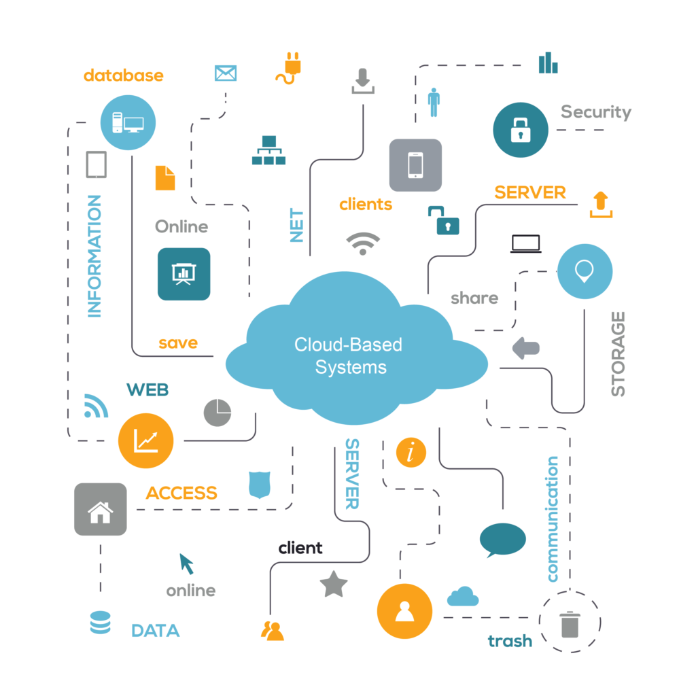

## Table of Contents

## What is a cloud system?

A cloud system is a way to store and use computer resources over the internet instead of on a local computer or server. It's like renting space and power from a big company that has lots of computers. This can help businesses and people save money and be more flexible because they don't need to buy and take care of their own equipment.

There are different types of cloud systems, like public, private, and hybrid clouds. Public clouds are shared by many people and are run by big companies like Amazon and Google. Private clouds are used by just one organization and can be more secure. Hybrid clouds mix both public and private clouds to get the best of both worlds.

## What are the main types of cloud services?

The main types of cloud services are Infrastructure as a Service (IaaS), Platform as a Service (PaaS), and Software as a Service (SaaS). IaaS is like renting the basic building blocks of computing, such as virtual machines, storage, and networks. It's great for businesses that want to build their own applications and need control over the underlying infrastructure. PaaS provides a platform that allows customers to develop, run, and manage applications without dealing with the complexity of building and maintaining the infrastructure. This is helpful for developers who want to focus on coding rather than managing servers.

SaaS is the most user-friendly type of cloud service. It delivers software applications over the internet, so users can access them from any device with a web browser. Examples include email services like Gmail and productivity tools like Google Docs. With SaaS, the service provider handles everything from the infrastructure to the software, making it easy for users to get started without worrying about technical details. Each type of cloud service has its own benefits, and businesses often use a combination of them to meet their needs.

## How does cloud computing work?

Cloud computing works by using a network of remote servers to store, manage, and process data, instead of relying on a local computer or server. When you use a cloud service, your data is sent over the internet to these servers, which are often located in big data centers run by companies like Amazon, Microsoft, or Google. These data centers have lots of computers that work together to handle requests quickly and efficiently. When you need to access your data or use an application, the cloud servers send the information back to you through the internet.

The way cloud computing works can be compared to how electricity works in a house. Just like you don't need to generate your own electricity because it's provided by a power company, you don't need to have your own servers because the cloud service provider takes care of that. You simply use the services you need, and you pay for what you use, like paying your electricity bill. This makes it easier and often cheaper for businesses and individuals to use powerful computing resources without having to buy and maintain their own equipment.

## What are the benefits of using cloud systems?

One of the biggest benefits of using cloud systems is that they can save you money. Instead of buying expensive computers and servers, you can rent what you need from a cloud provider. This means you only pay for what you use, and you don't have to worry about the cost of maintaining and upgrading your own equipment. Plus, cloud systems make it easy to grow your business because you can quickly get more resources when you need them without having to buy new hardware.

Another benefit is that cloud systems are very flexible and easy to use. You can access your data and applications from anywhere with an internet connection, which is great for people who work from different places or need to share information with others. The cloud also takes care of many technical tasks for you, like keeping your software up to date and making sure your data is safe. This means you can focus on your work instead of worrying about technology.

Lastly, cloud systems can help your business be more reliable and secure. Cloud providers have big teams of experts who work to keep their systems running smoothly and protect them from problems like hackers and power outages. This can be much better than what a small business could do on its own. Also, because your data is stored in multiple places, it's less likely to be lost if something goes wrong.

## What are the common challenges or concerns with cloud systems?

One of the main concerns with cloud systems is security. When you store your data on someone else's servers, you have to trust that they will keep it safe. There's always a risk that hackers could break into the cloud and steal or damage your information. Plus, if the cloud provider has a problem, like a power outage or a natural disaster, your data could be at risk. It's important to choose a good cloud provider that has strong security measures and a good plan for keeping your data safe.

Another challenge is the cost. While cloud systems can save you money in the long run, they can also be expensive if you're not careful. You might end up paying for more resources than you need, or you might get surprised by hidden fees. It's important to understand the pricing and make sure you're only paying for what you use. Also, switching from your own servers to a cloud system can be a big change, and it might take time and money to make the switch smoothly.

Lastly, there can be issues with control and flexibility. When you use a cloud system, you're relying on the provider to meet your needs. If they change their services or have technical problems, it could affect your business. Also, some cloud systems might not let you customize things as much as you'd like. It's important to choose a provider that offers the features and flexibility you need, and to have a plan for what to do if something goes wrong.

## How do you choose the right cloud service provider?

Choosing the right cloud service provider is important because it can affect your business a lot. You should start by thinking about what you need from a cloud system. Do you need a lot of storage space, or do you need powerful computers to run your applications? Also, think about your budget. Some cloud providers might be cheaper, but they might not have all the features you need. It's a good idea to look at different providers and compare their prices and services. You can also read reviews from other people to see what they think about the providers you're considering.

Another thing to think about is security. You want to make sure that your data will be safe with the cloud provider you choose. Look for providers that have strong security measures and a good plan for keeping your data safe. It's also important to think about how easy it is to use the cloud system. Some providers might have better tools and support to help you get started and use their services. Finally, consider the provider's reputation and reliability. You want to choose a provider that has a good track record and won't let you down when you need them. By thinking about these things, you can find a cloud service provider that's right for your business.

## What is the difference between public, private, and hybrid clouds?

Public clouds are like big shared spaces where lots of different people and businesses store their data and use computing resources. They are run by big companies like Amazon, Google, and Microsoft. Public clouds are usually cheaper because you share the costs with others, but they might not be as secure as other options because your data is mixed with everyone else's. They are great for businesses that don't need a lot of control over their computing environment and want to save money.

Private clouds are used by just one organization and are more secure because you don't share your space with others. They can be set up in your own building or by a cloud provider that sets aside space just for you. Private clouds give you more control over your data and how your computing resources are used, but they can be more expensive because you're not sharing costs with others. They are good for businesses that need to keep their data very secure or have special requirements for their computing environment.

Hybrid clouds mix public and private clouds to get the best of both worlds. You can keep your most important or sensitive data in a private cloud and use a public cloud for less important things. This can help you save money while still keeping your data secure. Hybrid clouds are flexible and can be a good choice for businesses that need to grow quickly or have changing needs.

## How can cloud systems enhance data security?

Cloud systems can enhance data security by using strong protection measures that big companies put in place. These companies have lots of experts who work hard to keep your data safe from hackers and other dangers. They use things like encryption, which is like putting your data in a secret code that only you can read, and firewalls, which are like strong walls that keep bad people out. Also, cloud providers often have backup systems that save copies of your data in different places, so if something goes wrong, you won't lose everything.

Another way cloud systems help with security is by keeping your software up to date. When you use a cloud system, the provider takes care of updating the software for you. This means you always have the latest security fixes without having to do anything yourself. Plus, cloud systems can help you control who can see your data. You can set rules that say who can access your information and what they can do with it. This helps keep your data safe from people who shouldn't be looking at it.

## What are some popular cloud platforms and their specific uses?

Amazon Web Services (AWS) is one of the most popular cloud platforms. It's used by lots of businesses because it has many different services that can help with things like storing data, running applications, and even building new software. AWS is great for big companies that need a lot of computing power and want to be able to grow quickly. It's also good for businesses that want to try out new ideas without spending a lot of money on their own computers.

Microsoft Azure is another popular cloud platform. It works well with other Microsoft products like Windows and Office, so it's a good choice for businesses that already use these tools. Azure is used for things like storing data, running applications, and helping people work together from different places. It's also good for businesses that need to move their old systems to the cloud without changing too much.

Google Cloud Platform is known for its strong tools for working with data and building smart applications. It's used by businesses that want to use things like [artificial intelligence](/wiki/ai-artificial-intelligence) and [machine learning](/wiki/machine-learning) to make their work better. Google Cloud is also good for businesses that need to store a lot of data and want to be able to find information quickly. It's a good choice for companies that want to try new technology and grow fast.

## How do cloud systems integrate with existing IT infrastructure?

Cloud systems can work together with the computers and servers you already have, making things easier for your business. You can keep using your old equipment while also using the cloud for things like storing data or running new applications. This is called a hybrid cloud, where you mix your old stuff with new cloud services. It's like having the best of both worlds because you can slowly move your important information to the cloud without changing everything at once. This way, you don't have to throw away your old computers and servers right away, and you can save money while still getting the benefits of the cloud.

To make this work, you need to plan carefully and use special tools that help your old systems talk to the cloud. These tools can move your data back and forth between your computers and the cloud, and they can also make sure that your applications work well no matter where they are running. It's important to choose a cloud provider that has good support and can help you set things up the right way. By doing this, you can make your business more flexible and ready for the future, without having to start from scratch.

## What are the advanced features of cloud systems like auto-scaling and load balancing?

Auto-scaling is a cool feature of cloud systems that helps your applications work better when lots of people are using them. Imagine you have a website that gets really busy sometimes, like during a big sale. Auto-scaling can automatically add more computers to help handle all the extra visitors, so your website stays fast and doesn't crash. When things quiet down, it can take those extra computers away, so you don't have to pay for them when you don't need them. This way, you can save money and make sure your website is always working well, no matter how busy it gets.

Load balancing is another helpful feature that makes sure your applications run smoothly. It's like having a smart traffic cop for your computers. When people visit your website or use your app, load balancing sends them to the computer that's not too busy, so everyone gets a fast experience. This helps keep things running smoothly even when lots of people are using your services at the same time. By using load balancing, you can make sure that no single computer gets overwhelmed, and your applications stay up and running without any problems.

## What future trends can we expect in cloud computing technology?

In the future, cloud computing will become even more important and powerful. One big trend we'll see is the use of artificial intelligence (AI) and machine learning in the cloud. This means that cloud systems will be able to learn from the data they handle and make smarter decisions. For example, they could help businesses predict what customers want or find problems before they happen. Another trend is the growth of edge computing, where data is processed closer to where it's created instead of sending it all the way to a faraway cloud server. This can make things faster and more efficient, especially for things like self-driving cars and smart homes.

Another trend we'll see is better security and privacy in the cloud. As more people use cloud systems, keeping data safe becomes even more important. Cloud providers will use new technology to protect your information from hackers and make sure it stays private. They'll also make it easier for you to control who can see your data and how it's used. Finally, cloud systems will become easier to use and more flexible. This means that even small businesses and regular people will be able to use powerful cloud tools without needing to be experts in technology. This will help more people take advantage of the benefits of the cloud.

## References & Further Reading

[1]: Bergstra, J., Bardenet, R., Bengio, Y., & Kégl, B. (2011). ["Algorithms for Hyper-Parameter Optimization."](https://dl.acm.org/doi/10.5555/2986459.2986743) Advances in Neural Information Processing Systems 24.

[2]: Lopez de Prado, M. (2018). ["Advances in Financial Machine Learning."](https://books.google.com/books/about/Advances_in_Financial_Machine_Learning.html?id=oU9KDwAAQBAJ) Wiley.

[3]: Aronson, D. R. (2006). ["Evidence-Based Technical Analysis: Applying the Scientific Method and Statistical Inference to Trading Signals."](https://www.amazon.com/Evidence-Based-Technical-Analysis-Scientific-Statistical/dp/0470008741) Wiley.

[4]: Jansen, S. (2018). ["Machine Learning for Algorithmic Trading."](https://github.com/stefan-jansen/machine-learning-for-trading) Packt Publishing.

[5]: Chan, E. P. (2009). ["Quantitative Trading: How to Build Your Own Algorithmic Trading Business."](https://github.com/ftvision/quant_trading_echan_book) Wiley.

[6]: Varian, H. R. (2014). ["Big Data: New Tricks for Econometrics."](https://pubs.aeaweb.org/doi/pdfplus/10.1257/jep.28.2.3) Journal of Economic Perspectives, 28(2), 3-28.

[7]: Amazon Web Services, Inc. ["AWS in Finance."](https://aws.amazon.com/financial-services/) 

[8]: Microsoft Corporation. ["Azure for Financial Services."](https://www.microsoft.com/en-us/industry/financial-services/microsoft-cloud-for-financial-services)

[9]: Google Cloud. ["Google Cloud for Financial Services."](https://cloud.google.com/solutions/financial-services/)

[10]: Kearns, M., & Nevmyvaka, Y. (2013). ["Machine Learning for Market Microstructure and High Frequency Trading."](https://www.cis.upenn.edu/~mkearns/papers/KearnsNevmyvakaHFTRiskBooks.pdf) 

[11]: Harris, L. (2003). ["Trading and Exchanges: Market Microstructure for Practitioners."](https://academic.oup.com/book/52292) Oxford University Press.

