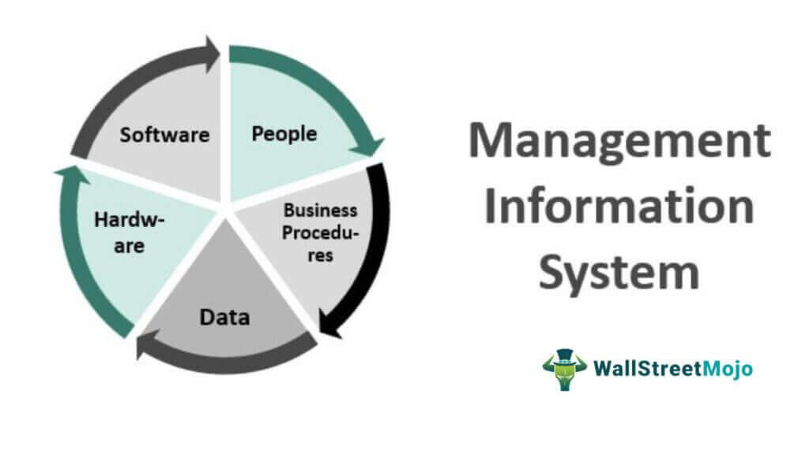

The advent of cloud computing has significantly transformed numerous industries, with algorithmic trading being a notable beneficiary of this technological evolution. Algorithmic trading, or algo trading, involves the use of complex algorithms and mathematical models to make trading decisions at speeds and frequencies far surpassing human capability. This type of trading is heavily dependent on computational power, data processing speed, and storage capabilities—areas where cloud computing excels. 

The integration of cloud infrastructures in algo trading offers enhanced performance and scalability. Cloud platforms provide traders with a flexible and virtually limitless resource pool, enabling them to scale their operations quickly in response to market conditions. This capability is particularly advantageous in high-frequency trading environments, where the ability to process large volumes of data in real-time can determine success.



In this article, the application of cloud systems in algorithmic trading will be examined, focusing on how they enhance performance and provide the necessary infrastructure for scalable trading solutions. We will explore both the benefits and challenges that come with utilizing cloud systems for trading algorithms. These cloud-based systems not only offer adaptable resource allocation but also introduce new paradigms for data processing, such as distributed computing and real-time analytics.

Moreover, cloud systems support the development and deployment of sophisticated trading strategies, thanks to their compatibility with a plethora of tools and APIs. These resources enable traders to execute complex strategies with precision and efficiency, facilitating a competitive edge in dynamic trading environments. By the end of this discussion, readers will have a comprehensive understanding of the potential and limitations of cloud systems in enhancing algorithmic trading practices.

## Table of Contents

## Understanding Cloud Systems in Algo Trading

Cloud systems provide computing services via the internet, offering significant advantages for processing and storing data in real time. These systems enable [algorithmic trading](/wiki/algorithmic-trading)—often called algo trading—which utilizes automated algorithms to make trading decisions. This approach demands considerable computational power, which cloud computing readily supplies.

Popular cloud platforms like Amazon Web Services (AWS), Microsoft Azure, and Google Cloud are prevalent choices for hosting trading algorithms. They offer robust infrastructure, enabling trading operations to handle large volumes of data and execute trades efficiently. The computational intensity required by trading algorithms can benefit from the scalability and advanced features of these platforms, such as distributed computing and [machine learning](/wiki/machine-learning) tools, that enhance decision-making processes.

The capability of cloud systems to reduce latency is crucial for high-frequency trading. Low latency is essential because even slight delays in data processing can lead to missed opportunities or unfavorable trading outcomes. Cloud providers employ vast networks of servers that minimize the physical distance and optimize data paths, thereby reducing the time it takes to execute trades.

Cloud technology integrates seamlessly with trading systems, optimizing execution and strategy deployment. This integration is facilitated through APIs and various software solutions offered by cloud platforms. For example, AWS provides services like AWS Lambda for serverless computing, which can automatically scale the number of algorithm instances in response to market activity. This fosters a flexible trading environment, where strategies can be quickly adapted to changing market conditions.

Moreover, the vast storage capacity and computing power of cloud systems enable traders to analyze historical and real-time data to refine their algorithms continuously. This capacity for ongoing analysis and improvement allows traders to maintain a competitive edge by adapting strategies based on [backtesting](/wiki/backtesting) results and evolving market conditions.

Incorporating cloud systems into algo trading operations leads to an ecosystem that supports rapid development and deployment of trading strategies, facilitating more effective and timely decision-making in financial markets. The convergence of these technologies not only improves trade execution but also contributes to innovative developments in the financial services industry.

## Benefits of Using Cloud Systems in Algo Trading

Cloud systems have revolutionized algorithmic trading by providing a highly scalable infrastructure, allowing traders to adjust computing resources efficiently and according to demand. This scalability means that during periods of high trading activity, additional resources can be allocated quickly, whereas during quieter periods, they can be scaled down. This adaptability ensures that trading systems operate at optimal capacity without unnecessary overheads.

The cost-effectiveness of cloud systems is another significant advantage. By reducing the need to invest in and maintain physical hardware, traders can achieve substantial savings in both initial setup and ongoing operational costs. Cloud providers like AWS and Google Cloud offer pay-as-you-go pricing models, which means that traders only pay for the resources they use. This financial flexibility is particularly advantageous for smaller trading firms or individual traders who might find traditional hardware costs prohibitive.

Cloud systems also support a wide array of trading tools and application programming interfaces (APIs), which are crucial for developing and deploying trading models swiftly and with greater flexibility. APIs facilitate seamless interactions between different trading software, enhancing the speed and efficiency of executing trades. This integration capability is crucial for implementing complex trading strategies that require real-time data processing and fast execution.

24/7 availability is another inherent advantage of cloud platforms. Trading is a global, continuous operation, and cloud infrastructure ensures that systems are always up and running, regardless of time zones or geographical restrictions. This uninterrupted availability is vital for executing strategies like high-frequency trading, where every millisecond counts.

Finally, cloud-based algo trading benefits from enhanced security protocols and redundancy options. The infrastructure provided by major cloud providers includes robust data security measures, such as encryption and multi-[factor](/wiki/factor-investing) authentication, which are essential for protecting sensitive financial information. Additionally, redundancy options offered by these providers reduce the risk of data loss due to system failures, ensuring more reliable and secure trading operations.

In summary, the benefits of using cloud systems in algo trading are numerous and significant, mainly due to their scalability, cost-effectiveness, support for a variety of tools and APIs, continuous availability, and enhanced security features. These advantages make cloud solutions an increasingly indispensable component of modern algorithmic trading strategies.

## Challenges of Cloud Systems in Algo Trading

Cloud systems have undoubtedly enriched the algorithmic trading landscape with numerous benefits; however, they also present a unique set of challenges that traders must address to optimize their strategies effectively. 

One primary challenge is the dependency on internet connectivity. Cloud-based algo trading systems require a stable and high-speed internet connection for seamless operation. Any interruptions or slowdowns in connectivity can lead to discrepancies in trade execution, ultimately affecting trading outcomes and strategy performance. Traders must ensure robust network infrastructure and consider redundancy options to mitigate connectivity issues.

Security risks are a major concern when storing sensitive financial data on third-party cloud servers. While cloud providers implement stringent security measures, the responsibility for data security partially rests on the traders and firms using these services. This involves encrypting data both at rest and in transit, implementing multi-layer access controls, and regularly auditing security protocols to safeguard against data breaches and unauthorized access.

Latency is another critical factor, especially in high-frequency trading ([HFT](/wiki/high-frequency-trading-strategies)) environments where trades occur in milliseconds. The inherent delay in data transfer between traders' systems and cloud servers can significantly impact performance. To address latency issues, traders might select cloud providers with data centers closest to the financial exchanges they interact with, or opt for hybrid models that leverage on-premise and cloud resources.

Managing cloud services introduces a steep learning curve and complexities that traders must navigate. Cloud platforms offer various tools and settings, each with unique configurations that require thorough understanding to use effectively. Investment in training and hiring experienced professionals can help in overcoming these challenges.

To mitigate these issues, traders can adopt various strategies and tools. For internet dependency, deploying redundant network paths and using cloud-native services like AWS Direct Connect or Azure ExpressRoute can enhance connectivity reliability. In terms of security, employing advanced encryption, leveraging identity and access management (IAM) services, and conducting regular penetration testing can fortify defenses. Addressing latency concerns could involve optimizing data pathways, employing edge computing strategies, or utilizing serverless functions for faster processing.

Overall, while cloud systems in algorithmic trading present certain obstacles, careful planning and strategic implementation of solutions can effectively address these challenges, allowing traders to fully exploit the advantages that cloud computing technologies offer.

## Choosing the Right Cloud Provider

Choosing the right cloud provider is an essential step in optimizing algorithmic trading systems. Key players in the industry, including Amazon Web Services (AWS), Google Cloud Platform (GCP), Microsoft Azure, and IBM Cloud, offer a myriad of features that cater to varying trading needs.

AWS is renowned for its extensive range of services and robust infrastructure. It provides a vast array of instances, such as spot and reserved instances, tailored for different computational needs. AWS also offers services like AWS Lambda for serverless computing, which enables the execution of code without provisioning or managing servers. This can be particularly beneficial for latency-sensitive trading algorithms. Additionally, AWS' global presence ensures low-latency connections through numerous data center locations worldwide, a critical feature for high-frequency trading.

Google Cloud Platform stands out with its machine learning capabilities. Tools like TensorFlow and BigQuery can be leveraged for developing and running sophisticated trading algorithms that require real-time data analysis. GCP’s commitment to renewable energy also appeals to environmentally conscious trading firms. Moreover, Google's private fiber optic network provides speedy connectivity, which may reduce latency in data transmission.

Microsoft Azure offers seamless integration with enterprise tools and applications due to its strong association with Microsoft’s ecosystem, making it an attractive option for firms already using Windows-based applications. Azure provides a comprehensive set of APIs and supports a wide range of programming languages, facilitating the development of custom trading models. It also offers Azure Kubernetes Service for container orchestration, ensuring scalability and flexibility.

IBM Cloud is distinguished by its focus on security and deep integration with AI through IBM Watson. With advanced security measures and compliance certification, it is particularly suitable for financial institutions needing to adhere strictly to regulatory standards. IBM Cloud’s support services and consulting can assist traders in configuring optimal cloud solutions for their trading needs.

When selecting a cloud provider, several factors should be considered:

1. **Data Center Locations**: Proximity to major financial exchanges can significantly reduce latency, enhancing trading performance. Providers with a global infrastructure can offer localized data centers to meet these demands.

2. **Available APIs and Tools**: The selection of APIs and development tools can influence the ease of deploying and managing trading algorithms. Providers that support a wide range of programming languages and frameworks can offer flexibility in algorithm development.

3. **Support Services**: Comprehensive support services, including customer service, account management, and technical support, are crucial for addressing any cloud-related issues promptly.

4. **Performance and Cost**: The cost-effectiveness of cloud services is often a decisive factor. Providers offer varied pricing models, such as pay-as-you-go, reserved instances, and subscriptions, which need to be evaluated against trading budget constraints and performance requirements.

Understanding the advantages and limitations of each provider is crucial. AWS excels in resource availability, GCP in machine learning, Azure in enterprise application integration, and IBM in security and compliance. Making an informed choice involves balancing these attributes against the specific needs of your trading operations, performance targets, and budget constraints.

## Setting Up Cloud-Based Algo Trading Platforms

Setting up a cloud-based algorithmic trading platform involves several crucial steps tailored to establish an efficient, resilient, and scalable environment. The initial phase often includes configuring a virtual server, with AWS Lightsail being a popular choice due to its cost-effectiveness and ease of use. This virtual server acts as the primary computational node where trading algorithms are deployed.

**Software Installation**

Once the server is operational, traders need to install a variety of software tools necessary for algorithmic trading. Python is a preferred programming language due to its extensive libraries and community support. Financial libraries such as NumPy, pandas, and SciPy provide powerful tools for data analysis and mathematical computations essential in developing trading strategies. Additionally, APIs from financial data providers, like Alpha Vantage or Quandl, are integrated to ensure real-time data access, crucial for executing algorithms.

**Strategy Implementation**

Implementing trading strategies requires coding precise algorithms capable of processing large volumes of market data and executing trades automatically. A simple trading algorithm often involves setting conditions under which a trade is executed:

```python
import numpy as np

def moving_average(data, window_size):
    return np.convolve(data, np.ones(window_size)/window_size, mode='valid')

def trading_strategy(price_data, short_window, long_window):
    short_ma = moving_average(price_data, short_window)
    long_ma = moving_average(price_data, long_window)

    signals = np.where(short_ma > long_ma, 1, -1)
    return signals
```

In this basic example, the algorithm calculates two moving averages of different lengths and generates trading signals based on their relative positions.

**Server Configuration Best Practices**

Optimizing cloud server configurations is pivotal for enhancing performance and ensuring reliability. This includes selecting the right instance type that balances cost with necessary computational power, tuning network settings to minimize latency, and implementing load-balancing strategies if multiple servers are involved. Regular monitoring of server performance and resource usage helps in adjusting configurations proactively.

**Automation and Continuous Operation**

Automation is integral to maintaining a robust trading platform. Tools like cron jobs can schedule routine tasks, such as data updates and strategy recalibrations. Scripts are often developed to restart services, manage backups, and execute failsafe measures in case of system failures. Such automation ensures that trading operations can continue uninterrupted, adapting seamlessly to market changes.

By following these structured steps and incorporating best practices, traders can establish a cloud-based algo trading platform that is not only effective and efficient but also agile enough to adapt to future technological advancements and market dynamics.

## Ensuring Security and Compliance

Security remains a paramount concern in the deployment of cloud systems for algorithmic trading. The sensitive nature of financial data necessitates the implementation of robust encryption standards and access control measures. Encryption, both at rest and in transit, ensures that data is unreadable to unauthorized entities. Cloud service providers often offer built-in encryption features, enabling users to manage encryption keys and policies. Access controls, including multi-factor authentication and role-based access restrictions, further safeguard data by ensuring only authorized personnel can access critical systems.

Compliance with financial regulations is crucial for traders utilizing cloud systems. This involves a comprehensive understanding of data governance and privacy standards applicable to the jurisdictions where they operate. Regulations such as the General Data Protection Regulation (GDPR) and the California Consumer Privacy Act (CCPA) require strict adherence to data handling procedures, emphasizing customer consent and data protection rights. Conformance with these regulations helps mitigate legal risks and enhances trust with clients and stakeholders.

Preventing data breaches and maintaining the integrity of trading operations involve employing advanced security protocols and regular system assessments. Security Information and Event Management (SIEM) tools can be integrated into cloud systems to monitor and analyze security events in real-time, identifying and alerting on potential threats. Additionally, automated vulnerability scanning and penetration testing provide insights into system vulnerabilities, allowing for preventive measures to be enacted before exploitation occurs.

Regularly auditing cloud setups and conducting routine maintenance and system updates are essential practices for sustained security and compliance. Auditing involves reviewing access logs, configuration settings, and compliance with organizational security policies. Cloud service providers typically offer tools and services to automate these processes. Keeping systems updated with the latest security patches prevents exploitation of known vulnerabilities and maintains operational integrity.

Understanding and managing compliance risk is a critical role for any trader using cloud systems. This includes establishing a comprehensive risk management framework that encompasses policy development, risk assessment, mitigation strategies, and continuous monitoring. Implementing an incident response plan prepared for potential data breaches ensures swift action to mitigate adverse effects. Regular training for all personnel involved in algo trading on security best practices and compliance requirements reinforces a culture of security awareness, vital for the secure and compliant operation of cloud-based trading systems.

## Future of Cloud Systems in Algo Trading

The future of cloud systems in algorithmic trading is intricately linked with advancements in [artificial intelligence](/wiki/ai-artificial-intelligence) (AI) and machine learning (ML). These technologies are becoming increasingly pivotal in refining trading strategies, as they enable sophisticated data analysis and pattern recognition that can significantly enhance decision-making processes. With cloud systems providing the necessary computing power and scalability, the integration of AI and ML in trading is expected to expand further.

One notable prediction is a shift towards more decentralized and distributed trading systems. Cloud infrastructures facilitate this movement by enabling connectivity and computation over extensive networks, which can lead to more resilient and adaptable trading environments. Decentralization may also provide advantages in terms of security and data sovereignty, as data can be dispersed across multiple locations, reducing the risk of centralized points of failure.

Innovations in real-time data processing and analysis are another critical area where cloud systems will prove essential. The ability to process and interpret large volumes of financial data quickly can offer traders a real-time edge in decision-making. Cloud computing supports these capabilities through services that can handle high-throughput data streams and complex algorithmic computations with minimal latency.

As cloud technology becomes more entwined with financial markets, it is anticipated that new regulatory landscapes will emerge. These regulations may aim to address concerns related to data privacy, security, and the ethical use of algorithmic trading strategies. Regulatory bodies may need to devise guidelines that ensure transparency and fairness in markets increasingly dominated by algorithm-driven trades.

Looking ahead, the integration of multi-cloud environments promises to further optimize trading workflows. Utilizing multiple cloud providers can allow traders to leverage the unique strengths of each platform, such as data processing speed, storage capacity, or specific toolsets, thereby enhancing overall system performance and reliability. This multi-cloud approach not only offers flexibility but also bolsters system resilience against provider-specific outages or issues.

In summary, the future of cloud systems in algorithmic trading is characterized by rapid technological advancements and evolving regulatory frameworks. As traders continue to harness cloud capabilities, they will likely achieve unprecedented levels of efficiency and innovation in their trading strategies. The ongoing evolution of cloud technology is set to reshape how markets are analyzed, interpreted, and engaged.

## Conclusion

Cloud systems have become an integral part of modern algorithmic trading, offering numerous advantages that cater to the evolving demands of financial markets. The flexibility provided by cloud infrastructures allows traders to dynamically adjust their computational resources based on market conditions, leading to more efficient trading operations. This adaptability is particularly beneficial in high-frequency trading environments where rapid scale-up or scale-down of resources can impact the efficacy of trading strategies.

Cost-efficiency is another compelling aspect of cloud-based trading. By utilizing cloud services, traders are often able to minimize the need for substantial upfront investments in physical hardware, leading to reduced operational costs. Additionally, the pay-as-you-go model offered by major cloud providers enables traders to pay for only the resources they consume, aligning costs directly with usage without necessitating ongoing maintenance expenses.

Scalability, inherent in cloud platforms, supports extensive data processing and storage requirements essential for executing complex trading algorithms. This scalability ensures that trading platforms remain responsive during high-[volume](/wiki/volume-trading-strategy) trading sessions and are prepared to handle unexpected surges in trading activity. Moreover, the global infrastructure of cloud providers facilitates low-latency access to data centers, which is crucial for executing time-sensitive trades.

Despite these benefits, challenges remain, particularly concerning security and compliance. Selecting the right cloud provider involves careful consideration of data protection measures and compliance with financial regulations to safeguard sensitive financial information. Understanding the security features and protocols offered by different cloud providers is essential to building a robust trading environment.

Technology continues to evolve, and the symbiosis between cloud systems and algorithmic trading is expected to further expand. Cloud innovations, particularly in AI and machine learning, promise to enhance the sophistication of trading strategies, while advancements in decentralized technologies might redefine market interactions. Traders must stay informed and adaptable, ensuring they leverage cloud advancements effectively to maintain a competitive edge. As cloud technology progresses, its integration with algorithmic trading will likely yield novel opportunities and transformative changes in how trades are executed and managed.

## References & Further Reading

[1]: Bergstra, J., Bardenet, R., Bengio, Y., & Kégl, B. (2011). ["Algorithms for Hyper-Parameter Optimization."](https://dl.acm.org/doi/10.5555/2986459.2986743) Advances in Neural Information Processing Systems 24.

[2]: Lopez de Prado, M. (2018). ["Advances in Financial Machine Learning."](https://books.google.com/books/about/Advances_in_Financial_Machine_Learning.html?id=oU9KDwAAQBAJ) Wiley.

[3]: Aronson, D. R. (2006). ["Evidence-Based Technical Analysis: Applying the Scientific Method and Statistical Inference to Trading Signals."](https://www.amazon.com/Evidence-Based-Technical-Analysis-Scientific-Statistical/dp/0470008741) Wiley.

[4]: Jansen, S. (2018). ["Machine Learning for Algorithmic Trading."](https://github.com/stefan-jansen/machine-learning-for-trading) Packt Publishing.

[5]: Chan, E. P. (2009). ["Quantitative Trading: How to Build Your Own Algorithmic Trading Business."](https://github.com/ftvision/quant_trading_echan_book) Wiley.

[6]: Varian, H. R. (2014). ["Big Data: New Tricks for Econometrics."](https://pubs.aeaweb.org/doi/pdfplus/10.1257/jep.28.2.3) Journal of Economic Perspectives, 28(2), 3-28.

[7]: Amazon Web Services, Inc. ["AWS in Finance."](https://aws.amazon.com/financial-services/) 

[8]: Microsoft Corporation. ["Azure for Financial Services."](https://www.microsoft.com/en-us/industry/financial-services/microsoft-cloud-for-financial-services)

[9]: Google Cloud. ["Google Cloud for Financial Services."](https://cloud.google.com/solutions/financial-services/)

[10]: Kearns, M., & Nevmyvaka, Y. (2013). ["Machine Learning for Market Microstructure and High Frequency Trading."](https://www.cis.upenn.edu/~mkearns/papers/KearnsNevmyvakaHFTRiskBooks.pdf) 

[11]: Harris, L. (2003). ["Trading and Exchanges: Market Microstructure for Practitioners."](https://academic.oup.com/book/52292) Oxford University Press.