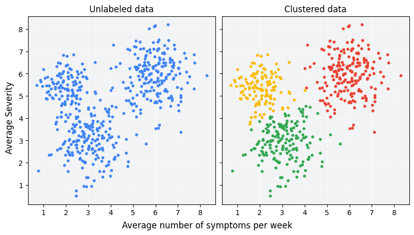

## Table of Contents

## What is clustering in machine learning?

Clustering in machine learning is a way to group similar things together without anyone telling the computer what groups to make. Imagine you have a bunch of different fruits, and you want to sort them into groups where each group has similar fruits. The computer looks at the features of each fruit, like color, size, and shape, and then decides which fruits should go into which groups. This is useful when you have a lot of data and want to find patterns or organize it in a way that makes sense.

There are different ways to do clustering, but one common method is called k-means clustering. In k-means, you decide how many groups, or clusters, you want to have. The computer then tries to put each item into one of these groups in a way that minimizes the distance between the items in each group and the center of that group. This process keeps going until the groups stop changing much. It's like trying to find the best way to arrange your fruits so that each group is as similar as possible inside, and as different as possible from the other groups.

## What are the main types of clustering algorithms?

Clustering algorithms come in different types, each with its own way of grouping data. One main type is centroid-based clustering, where the algorithm tries to find the center, or centroid, of each cluster. The most common example of this is k-means clustering. In k-means, you tell the computer how many clusters you want, and it tries to put each data point into one of those clusters by minimizing the distance between the points and the centroid of their cluster. Another type is hierarchical clustering, which builds a tree of clusters. It can work from the bottom up, starting with each data point as its own cluster and then joining them together, or from the top down, starting with one big cluster and then splitting it into smaller ones.

Another type of clustering is density-based clustering, which groups together points that are close to each other and separates areas of lower density. A popular algorithm in this category is DBSCAN (Density-Based Spatial Clustering of Applications with Noise). DBSCAN can find clusters of any shape and can even identify points that don't belong to any cluster, which it calls noise. Finally, there's distribution-based clustering, which assumes that the data follows a certain statistical distribution. One example is Gaussian Mixture Models (GMM), which use a mix of normal distributions to find clusters. Each of these types of clustering has its own strengths and is useful in different situations depending on the nature of the data and the problem you're trying to solve.

## How does K-means clustering work?

K-means clustering is a way to group similar data points together by finding the center of each group. Imagine you have a bunch of dots on a piece of paper, and you want to divide them into groups where each group has dots that are close to each other. You start by guessing how many groups, or clusters, you want. Let's say you want three groups. You then pick three random points on the paper to be the starting centers, or centroids, of these groups. Each dot on the paper is then assigned to the group whose center it is closest to. After all the dots are assigned, you move the center of each group to the middle of all the dots in that group. This process repeats until the centers stop moving much, and the groups stop changing.

Here's how it works step-by-step in simple terms: First, you pick the number of clusters, say k. Then, you randomly place k centroids on your data. Next, you assign each data point to the nearest centroid. After that, you move each centroid to the new center of the points assigned to it. You keep doing this until the centroids don't move much anymore. The math behind it is a bit more complex, but the idea is to minimize the sum of the squared distances between each point and its assigned centroid. This is called the objective function, and it looks like this: $$ J = \sum_{i=1}^{n} \sum_{j=1}^{k} w_{ij} \| x_i - c_j \|^2 $$, where $x_i$ is a data point, $c_j$ is a centroid, $w_{ij}$ is 1 if point $i$ is assigned to centroid $j$ and 0 otherwise, and $n$ is the number of data points. The goal is to make $J$ as small as possible.

## What is hierarchical clustering and how does it differ from K-means?

Hierarchical clustering is another way to group data points, but it's different from K-means because it builds a tree-like structure called a dendrogram. Imagine you have a bunch of dots on a piece of paper, and you want to group them together. In hierarchical clustering, you can start with each dot as its own group and then keep joining the closest groups together until you have one big group. Or, you can start with one big group and keep splitting it into smaller groups based on how different the dots are. This method doesn't need you to decide how many groups you want at the start, which is different from K-means where you have to pick the number of groups, k, before you start.

The main difference between hierarchical clustering and K-means is how they work and what they need. K-means needs you to choose the number of groups, k, and it tries to find the best way to put the dots into those groups by moving the centers of the groups around. It keeps doing this until the groups don't change much. On the other hand, hierarchical clustering doesn't need you to pick the number of groups at the start. Instead, it builds a tree where you can see how the groups are formed and decide later how many groups you want by cutting the tree at different levels. This makes hierarchical clustering more flexible, but it can be slower and harder to work with big sets of data compared to K-means.

## What are the advantages and disadvantages of using clustering?

Clustering is a helpful tool in [machine learning](/wiki/machine-learning) because it can find patterns in data without needing to know what those patterns are ahead of time. Imagine you have a bunch of different fruits and you want to sort them into groups where each group has similar fruits. Clustering can do this by looking at features like color, size, and shape. It's great for organizing large amounts of data into meaningful groups, which can be useful in many fields like marketing, where you might want to group customers based on their buying habits, or biology, where you might want to group genes based on their functions. Clustering can also help in finding outliers or unusual data points that don't fit into any group, which can be important for understanding the data better.

However, clustering also has its challenges. One big problem is deciding how many groups, or clusters, you should have. If you pick the wrong number, the groups might not make sense. For example, if you try to group your fruits into too many or too few groups, some groups might end up with fruits that are too different from each other. Another issue is that different clustering methods can give you different results, and it's not always clear which method is best for your data. Some methods, like K-means, can be sensitive to where you start, which means you might get different groups if you run the algorithm again with different starting points. Also, clustering can be slow and use a lot of computer power, especially with big sets of data, which can make it hard to use in some situations.

## How do you determine the optimal number of clusters in K-means?

Finding the right number of clusters in K-means can be tricky, but there are a few ways to do it. One common method is called the elbow method. Imagine you're trying to group your fruits into different baskets. You start with one basket and keep adding more until you find the point where adding another basket doesn't help much. In K-means, you run the algorithm with different numbers of clusters, from 1 to a big number, and then you look at something called the inertia, which is the sum of the squared distances between each point and its closest cluster center. You plot the inertia against the number of clusters and look for the "elbow" point, where the line starts to flatten out. That's usually a good guess for the number of clusters. The formula for inertia is $$ J = \sum_{i=1}^{n} \sum_{j=1}^{k} w_{ij} \| x_i - c_j \|^2 $$, where $x_i$ is a data point, $c_j$ is a centroid, $w_{ij}$ is 1 if point $i$ is assigned to centroid $j$ and 0 otherwise, and $n$ is the number of data points.

Another method is the silhouette score, which helps you see how well each point fits into its cluster. Imagine you have a fruit that's in one basket, but it's kind of similar to the fruits in another basket. The silhouette score measures how close each fruit is to its own basket compared to other baskets. You run K-means with different numbers of clusters and then calculate the average silhouette score for each run. The number of clusters that gives you the highest silhouette score is usually a good choice. The silhouette score for a single point $i$ is calculated as $$ s(i) = \frac{b(i) - a(i)}{\max(a(i), b(i))} $$, where $a(i)$ is the average distance from point $i$ to the other points in its cluster, and $b(i)$ is the minimum average distance from point $i$ to points in a different cluster. The average silhouette score across all points gives you an idea of how well your clusters are doing.

## What is DBSCAN and how does it handle noise in data?

DBSCAN, which stands for Density-Based Spatial Clustering of Applications with Noise, is a way to group data points that are close to each other. Imagine you have a bunch of dots on a piece of paper, and you want to group them into clusters. DBSCAN looks at how close the dots are to each other. If a dot has a lot of other dots around it within a certain distance, it's called a core point. Core points and their neighbors form a cluster. If a dot is close to a core point but not a core point itself, it's called a border point and is part of the cluster too. But if a dot is far away from any core points, it's called noise and doesn't belong to any cluster.

DBSCAN is good at handling noise because it can find clusters of any shape and also identify points that don't fit into any group. For example, if you have a group of dots that form a circle and another group that forms a line, DBSCAN can group them correctly. It does this by using two main ideas: a distance, called epsilon ($$ \epsilon $$), and a minimum number of points, called MinPts. If a dot has at least MinPts other dots within the distance $$ \epsilon $$, it becomes a core point. This way, DBSCAN can tell the difference between real clusters and random dots that don't belong anywhere.

## How can clustering be applied in real-world scenarios?

Clustering is used in many real-world situations to help organize and understand data. Imagine you work at a store and you want to know what kinds of customers come in. You can use clustering to group customers based on what they buy, how much they spend, and how often they visit. This helps you see different types of customers, like those who buy a lot of electronics or those who come in every week for groceries. By understanding these groups, you can make better decisions about what products to stock and how to market to different kinds of customers.

Another example is in healthcare, where clustering can help find patterns in patient data. Doctors might use clustering to group patients based on their symptoms, test results, and medical history. This can help identify different types of diseases or find groups of patients who might benefit from the same treatment. For instance, if a group of patients with similar symptoms and test results respond well to a certain medicine, doctors can use that information to treat other patients in the same group. Clustering helps make sense of large amounts of data and can lead to better patient care.

## What evaluation metrics are used to assess the quality of clustering?

To check how good a clustering is, people use different ways to measure it. One common way is the silhouette score. Imagine you have a fruit in one basket, but it's kind of similar to the fruits in another basket. The silhouette score measures how close each fruit is to its own basket compared to other baskets. You run the clustering with different numbers of groups and then calculate the average silhouette score for each run. The number of groups that gives you the highest silhouette score is usually a good choice. The silhouette score for a single point $$i$$ is calculated as $$ s(i) = \frac{b(i) - a(i)}{\max(a(i), b(i))} $$, where $$a(i)$$ is the average distance from point $$i$$ to the other points in its cluster, and $$b(i)$$ is the minimum average distance from point $$i$$ to points in a different cluster. The average silhouette score across all points gives you an idea of how well your clusters are doing.

Another way to measure clustering quality is the Davies-Bouldin index. This index looks at how similar the clusters are to each other and how spread out the points are within each cluster. A lower Davies-Bouldin index means the clusters are more separate and the points within each cluster are closer together, which is usually better. The formula for the Davies-Bouldin index is $$ DB = \frac{1}{k} \sum_{i=1}^{k} \max_{j \neq i} \left( \frac{s_i + s_j}{d_{ij}} \right) $$, where $$k$$ is the number of clusters, $$s_i$$ is the average distance of all points in cluster $$i$$ to the centroid of cluster $$i$$, $$s_j$$ is the same for cluster $$j$$, and $$d_{ij}$$ is the distance between the centroids of clusters $$i$$ and $$j$$. By using these metrics, you can see how well your clustering works and make better choices about how to group your data.

## How does density-based clustering differ from centroid-based clustering?

Density-based clustering and centroid-based clustering are two different ways to group data points, and they work in different ways. In density-based clustering, like DBSCAN, the idea is to find groups of points that are close together. It looks at how many points are near each other within a certain distance, called epsilon ($$ \epsilon $$). If a point has enough neighbors within this distance, it becomes a core point and forms a cluster with its neighbors. This method can find clusters of any shape and can also identify points that don't fit into any group, which it calls noise. It's good for finding natural groups in data without having to decide how many groups you want ahead of time.

On the other hand, centroid-based clustering, like K-means, works by finding the center, or centroid, of each group. You start by deciding how many groups you want, say k, and then the computer tries to put each data point into one of these groups by minimizing the distance between the points and the centroid of their group. The centroid keeps moving to the middle of the points in its group until the groups stop changing much. This method is simpler and faster but needs you to pick the number of groups at the start, and it can only find groups that are round or oval in shape. It's not as good at handling noise or finding unusual shapes in the data.

## What are some advanced clustering techniques beyond K-means and hierarchical clustering?

One advanced clustering technique is Gaussian Mixture Models (GMM). Imagine you have a bunch of dots on a piece of paper, and you want to group them into clusters. GMM assumes that each cluster follows a normal distribution, like a bell curve. It tries to find the best way to fit these bell curves to your dots. Unlike K-means, which just finds the center of each group, GMM can tell you how likely it is for a dot to belong to each group. This is useful when the groups in your data are not just round but might have different shapes. GMM uses something called the Expectation-Maximization (EM) algorithm to find the best fit, which can be more complex but also more accurate than K-means.

Another advanced method is Spectral Clustering. Think of it like trying to find groups in a big network of dots connected by lines. Spectral Clustering looks at the connections between the dots and uses something called a Laplacian matrix to find the best way to cut the network into groups. It's good for finding clusters when the data is not just about how close the dots are but also about how they are connected. This method can find groups that are not just round or close together but might be spread out in different ways. Spectral Clustering can be more complex to use, but it's powerful for finding patterns in data that other methods might miss.

## How can you implement clustering algorithms in Python using libraries like scikit-learn?

To implement clustering algorithms in Python using scikit-learn, you can use the library's built-in functions for different types of clustering. For example, if you want to use K-means clustering, you can start by importing the necessary modules and then create a KMeans object. You'll need to decide on the number of clusters, k, and then fit the model to your data. Here's a simple example of how to do this:

```python
from sklearn.cluster import KMeans
import numpy as np

# Create some sample data
X = np.array([[1, 2], [1, 4], [1, 0],
              [4, 2], [4, 4], [4, 0]])

# Create a KMeans instance with 2 clusters
kmeans = KMeans(n_clusters=2, random_state=0).fit(X)

# Get the cluster labels
labels = kmeans.labels_

# Get the cluster centers
centers = kmeans.cluster_centers_
```

For other types of clustering, like DBSCAN, you can follow a similar approach but use different parameters. DBSCAN, for instance, needs you to set the epsilon ($$ \epsilon $$) value and the minimum number of points (MinPts) to define a cluster. Here's how you can implement DBSCAN:

```python
from sklearn.cluster import DBSCAN
import numpy as np

# Create some sample data
X = np.array([[1, 2], [1, 4], [1, 0],
              [4, 2], [4, 4], [4, 0]])

# Create a DBSCAN instance
dbscan = DBSCAN(eps=3, min_samples=2).fit(X)

# Get the cluster labels
labels = dbscan.labels_

# Get the number of clusters (excluding noise if labeled as -1)
n_clusters_ = len(set(labels)) - (1 if -1 in labels else 0)
```

Both K-means and DBSCAN can be easily adjusted to fit different datasets and clustering needs, making scikit-learn a versatile tool for data analysis.

## References & Further Reading

[1]: MacQueen, J. (1967). ["Some Methods for classification and Analysis of Multivariate Observations"](https://projecteuclid.org/ebooks/berkeley-symposium-on-mathematical-statistics-and-probability/Some-methods-for-classification-and-analysis-of-multivariate-observations/chapter/Some-methods-for-classification-and-analysis-of-multivariate-observations/bsmsp/1200512992) Proceedings of the Fifth Berkeley Symposium on Mathematical Statistics and Probability.

[2]: Ester, M., Kriegel, H. P., Sander, J., & Xu, X. (1996). ["A Density-Based Algorithm for Discovering Clusters in Large Spatial Databases with Noise"](https://dl.acm.org/doi/10.5555/3001460.3001507) Proceedings of the Second International Conference on Knowledge Discovery and Data Mining.

[3]: Jain, A. K., Murty, M. N., & Flynn, P. J. (1999). ["Data Clustering: A Review"](https://dl.acm.org/doi/10.1145/331499.331504) ACM Computing Surveys.

[4]: Rokach, L., & Maimon, O. (2005). ["Clustering Methods"](https://link.springer.com/chapter/10.1007/0-387-25465-X_15) In Data Mining and Knowledge Discovery Handbook, Springer.

[5]: Pedregosa, F., Varoquaux, G., Gramfort, A., et al. (2011). ["Scikit-learn: Machine Learning in Python"](https://dl.acm.org/doi/10.5555/1953048.2078195) Journal of Machine Learning Research.

[6]: Hastie, T., Tibshirani, R., & Friedman, J. (2009). ["The Elements of Statistical Learning: Data Mining, Inference, and Prediction"](https://link.springer.com/book/10.1007/978-0-387-84858-7) Springer Series in Statistics.