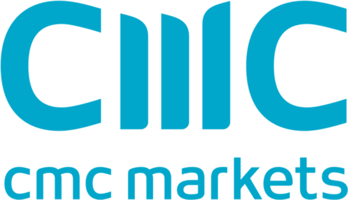

CMC Markets has made a significant impact on the trading industry since its inception in 1989. Known for its reliability and quality service, the company provides a broad array of trading instruments and platforms that cater to both retail and institutional investors. As we assess CMC Markets' offerings in 2024, this review will concentrate on the pivotal features, benefits, and potential drawbacks of the trading platforms offered by CMC Markets, with a particular focus on their algorithmic trading capabilities.

The continually evolving landscape of financial trading necessitates an adaptable and innovative approach, which CMC Markets consistently exhibits through its advanced trading solutions. This analysis aims to assist traders in determining whether CMC Markets' platforms meet their specific trading requirements and strategies. By examining the usability and performance of these tools, traders will be better equipped to make informed decisions aligned with their financial objectives.

## Table of Contents

## Overview of CMC Markets Trading Platforms

CMC Markets provides two primary trading platforms to accommodate varying trader preferences and needs: the proprietary Next Generation platform and the widely acclaimed MetaTrader 4 (MT4).

The Next Generation platform stands out due to its sophisticated array of features designed to enhance trading efficiency and accuracy. Among its key offerings are comprehensive charting tools that enable traders to visualize market movements effectively. This platform supports custom indicators, allowing users to tailor their trading environment to fit their specific strategies, whether simple or advanced. Furthermore, the platform encompasses a rich suite of technical analysis capabilities, supporting traders in making informed decisions by examining historical price movements and trend predictions.

In contrast, MetaTrader 4 (MT4) remains a popular choice among traders, chiefly due to its proven flexibility and its established reputation for automated trading solutions. MT4 offers extensive support for automated trading through its use of Expert Advisors (EAs), programmable algorithms that can be tailored to execute trades based on preset conditions. This capability makes MT4 an attractive option for traders interested in implementing systematic trading strategies without the need for constant manual intervention.

Both platforms cater to a diverse clientele, ranging from novices to seasoned trading professionals. The focus on usability ensures that even newcomers can navigate the interfaces effectively and leverage the platforms' features. At the same time, the robust performance ensures that experienced traders can meet their more complex trading demands without encountering barriers. Together, these platforms emphasize a commitment to providing a balanced trading experience that combines ease of use with the depth of tools required for detailed market analysis and trading execution.

## Features and Tools for Algorithmic Trading

Algorithmic trading has become an indispensable component of modern trading strategies, allowing traders to automate processes, optimize execution, and manage large data sets efficiently. CMC Markets accommodates this growing trend by providing various tools and resources for [algorithmic trading](/wiki/algorithmic-trading) on their platforms.

CMC Markets offers application programming interface (API) access, enabling traders to design, develop, and implement custom algorithmic trading strategies. This access provides users with the capability to integrate their strategies with the broker's trading system, allowing for seamless execution and data retrieval. API access is crucial for traders seeking to build sophisticated algorithms that require real-time data processing and rapid order execution.

The Next Generation platform, although traditionally designed for manual trading, does not directly support fully automated trading. However, it compensates for this limitation by offering a comprehensive suite of analytical tools that enhance the decision-making process. Traders can leverage advanced charting features, custom indicators, and detailed market analysis, equipping them with the necessary insights to make informed trading decisions. These tools can be used in combination with external algorithmic systems, allowing traders to manually implement strategy decisions derived from their algorithms.

In contrast, MetaTrader 4 (MT4), another platform offered by CMC Markets, is inherently designed with automated trading in mind. It supports Expert Advisors (EAs), which are programs developed in the MQL4 programming language. EAs enable traders to automate trades based on specified criteria and conditions. This allows for continuous trading without direct human intervention, optimizing the ability to capture market opportunities. Traders can either develop their own EAs or choose from a wide array of pre-built options available in the MT4 community and marketplace.

The dichotomy between the platforms allows traders to choose the most suitable environment for their trading style. While the Next Generation platform focuses more on providing tools for manual analysis and decision-making, MT4 facilitates full automation. This flexibility ensures traders can implement a hybrid approach, using Next Generation for in-depth market analysis and MT4 for executing automated trading strategies. 

In summary, CMC Markets caters to the needs of traders interested in algorithmic strategies through robust API functionalities and the versatile MT4 platform, making it an attractive choice for both developers of custom algorithms and traders looking to implement automated systems.

## Pros and Cons of CMC Markets Trading Platforms

CMC Markets' trading platforms offer a variety of advantages and some limitations that traders should consider. 

Among the advantages, platform customization stands out. The Next Generation platform allows users to create personalized trading interfaces, integrating a variety of indicators and tools to match specific strategies. Both the Next Generation platform and MetaTrader 4 (MT4) support a wide range of tradable instruments, including [forex](/wiki/forex-system), indices, and commodities, thereby granting traders access to diverse markets. The platforms are both equipped with robust charting features, enabling users to conduct detailed technical and fundamental analyses efficiently. These features allow traders to access in-depth market insights, enhancing their decision-making processes.

However, there are some disadvantages to note. A significant limitation for some traders is the absence of [cryptocurrency](/wiki/cryptocurrency) trading for retail clients, which restricts access to this burgeoning asset class. Additionally, regulatory constraints limit CMC Markets' availability for U.S.-based traders, reducing its accessibility in one of the world's largest financial markets. Furthermore, there is a notable variation in functionality between the Next Generation and MT4 platforms. This divergence means that traders may need to evaluate which platform best aligns with their specific requirements and preferences, as each platform offers different strengths and tools suitable for varying trading styles. This evaluation may involve balancing the sophisticated analytical tools of the Next Generation platform against the automated trading capabilities of MT4.

## Usability and User Experience

CMC Markets' trading platforms demonstrate a high level of usability and user experience, primarily through their intuitive interface designs and effortless navigation. Traders, regardless of their experience level, will find these platforms straightforward to operate, enhancing their overall trading efficiency.

For new traders, the complexity of financial trading tools can be daunting. CMC Markets addresses this by offering demo accounts that allow beginners to engage with the market without the immediate pressure of real financial risk. These demo accounts replicate real-world trading environments, helping beginners to acclimate to the tools and strategies necessary for live trading.

Experienced traders, meanwhile, benefit significantly from the platforms' quick execution speeds. Rapid trade execution is crucial for taking advantage of fleeting market opportunities, and CMC Markets excels in providing this capability. Moreover, the platforms boast advanced charting features, enabling experienced traders to conduct comprehensive technical analyses. This feature is vital for making informed decisions based on market movements and trends.

Mobile trading is another significant aspect of the user experience at CMC Markets. The platforms' mobile apps, available for both iOS and Android devices, ensure that traders can manage their investments and execute trades from anywhere, at any time. These apps maintain the full functionality of their desktop counterparts, allowing for seamless portfolio management on the move. This feature is particularly beneficial for traders who rely on real-time data and require the flexibility to respond to market changes instantly.

Overall, CMC Markets prioritizes user-friendly design and state-of-the-art functionality, ensuring a superior user experience that caters to both novice and seasoned traders.

## Educational Resources and Support

CMC Markets provides an extensive array of educational resources designed to equip traders with essential knowledge and skills. The Learn Hub serves as a central repository of educational content, featuring comprehensive guides that cover a wide array of trading strategies and market analysis techniques. This platform also offers videos and webinars, which are invaluable for visual and auditory learners seeking to understand complex trading concepts and market dynamics.

In addition to the educational materials, CMC Markets offers robust customer support services to assist traders with any trading-related queries. Available 24/5, traders can reach out via phone, email, and live chat, ensuring that help is readily accessible whenever needed. This support structure is critical for handling technical issues or understanding platform features, which enhances the overall trading experience.

Lastly, these educational resources and support mechanisms are crucial for traders aiming to optimize their trading potential with CMC Markets' platforms. The combination of educational content and reliable support ensures that traders, regardless of their experience level, can make informed decisions and effectively utilize the tools at their disposal.

## Conclusion: Is CMC Markets Right for You?

Whether you're a novice trader or a seasoned professional, CMC Markets presents competitive trading solutions, tailored to a wide spectrum of trading needs. With a history dating back to 1989, the company has demonstrated reliability and proficiency, though certain aspects such as cryptocurrency inclusivity and platform synchronization could see improvement.

CMC Markets’ trading platforms are equipped with a comprehensive array of tools, catering to strategic requirements of diverse traders. This includes advanced charting features and customizable interfaces, supporting both technical and [fundamental analysis](/wiki/fundamental-analysis). However, the absence of cryptocurrency trading for retail clients could limit options for those specifically interested in digital currencies. Additionally, the differentiation in functionality between platforms such as Next Generation and MetaTrader 4 necessitates a careful selection process based on individual requirements.

The customer experience is a focal point, with CMC Markets distinguishing itself through innovation and a commitment to customer satisfaction. While certain regulatory constraints affect U.S. customers, the company maintains a robust support system and a repository of educational resources that equip traders with vital knowledge and skills.

This analysis serves to highlight both the strengths and potential drawbacks of CMC Markets in 2024. As you evaluate whether their trading platforms align with your financial goals, consider the thorough support and competitive solutions they offer, weighed against the limitations in cryptocurrency offerings and platform parity. With these factors in mind, a well-informed decision can be made regarding the suitability of CMC Markets for fulfilling your trading objectives.

## References & Further Reading

[1]: Bergstra, J., Bardenet, R., Bengio, Y., & Kégl, B. (2011). ["Algorithms for Hyper-Parameter Optimization."](https://proceedings.neurips.cc/paper/2011/file/86e8f7ab32cfd12577bc2619bc635690-Paper.pdf) Advances in Neural Information Processing Systems 24.

[2]: ["Advances in Financial Machine Learning"](https://www.amazon.com/Advances-Financial-Machine-Learning-Marcos/dp/1119482089) by Marcos Lopez de Prado

[3]: ["Evidence-Based Technical Analysis: Applying the Scientific Method and Statistical Inference to Trading Signals"](https://www.amazon.com/Evidence-Based-Technical-Analysis-Scientific-Statistical/dp/0470008741) by David Aronson

[4]: ["Machine Learning for Algorithmic Trading"](https://github.com/PacktPublishing/Machine-Learning-for-Algorithmic-Trading-Second-Edition) by Stefan Jansen

[5]: ["Quantitative Trading: How to Build Your Own Algorithmic Trading Business"](https://books.google.com/books/about/Quantitative_Trading.html?id=j70yEAAAQBAJ) by Ernest P. Chan