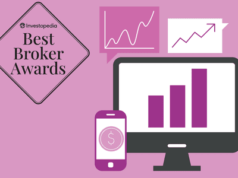

## Table of Contents

## What is the CME ClearPort Platform?

The CME ClearPort Platform is a service provided by the Chicago Mercantile Exchange (CME) that helps people trade and manage risks in over-the-counter (OTC) markets. OTC markets are where people buy and sell things directly with each other, not through a public exchange. The ClearPort platform makes it easier for traders to handle these private deals by offering tools to clear and settle trades, manage data, and reduce risks.

ClearPort works by connecting traders with clearing services, which means it helps make sure that both sides of a trade keep their promises. This is important because it builds trust in the market. The platform also provides real-time data and analytics, which help traders make better decisions. Overall, ClearPort helps make trading in OTC markets safer and more efficient.

## What types of products can be cleared through CME ClearPort?

CME ClearPort lets you clear many different kinds of products. These include energy products like oil, natural gas, and electricity. It also covers agricultural products like grains and livestock. If you're into metals, you can clear products like gold, silver, and copper through ClearPort too.

In addition to these, ClearPort handles products in the environmental sector, such as carbon credits and renewable energy certificates. It also clears financial products, including [interest rate](/wiki/interest-rate-trading-strategies) swaps and credit default swaps. This variety means that no matter what you're trading, ClearPort can help make your trades safer and more efficient.

## How does the CME ClearPort Platform benefit market participants?

The CME ClearPort Platform helps market participants by making their trades safer and easier to manage. When people trade over-the-counter (OTC) products, they can use ClearPort to make sure both sides of the trade follow through on their promises. This reduces the risk that someone won't pay up or deliver what they said they would. By using ClearPort, traders feel more secure because the platform acts like a middleman that everyone trusts.

ClearPort also helps traders by giving them useful information and tools. The platform provides real-time data and analytics, which help traders make smarter decisions about buying and selling. This can lead to better trades and more money saved or earned. Overall, ClearPort makes the whole process of trading OTC products smoother and more reliable, which is a big help for anyone involved in these markets.

## What are the steps to start using the CME ClearPort Platform?

To start using the CME ClearPort Platform, you first need to get in touch with the Chicago Mercantile Exchange (CME). You can do this by visiting their website and finding the section about ClearPort. There, you'll find information on how to sign up. You'll need to fill out some forms and provide details about your business. Once you submit your application, CME will review it to make sure you meet their requirements. If everything looks good, they'll approve your account and give you access to the platform.

After your account is set up, you'll need to learn how to use the ClearPort tools. CME offers training and resources to help you get started. You can find tutorials and guides on their website or attend webinars. Once you're comfortable with the platform, you can start trading. You'll enter your trades into the system, and ClearPort will help manage the clearing and settlement process. This makes sure your trades are safe and efficient. If you have any questions or need help along the way, CME's customer support team is there to assist you.

## How does CME ClearPort handle risk management?

CME ClearPort helps manage risk by acting like a middleman for trades. When people trade over-the-counter (OTC) products, there's always a chance that one side won't do what they promised. ClearPort reduces this risk by making sure both sides of the trade follow through. It does this by clearing trades, which means it checks and confirms that the trade is good to go. This way, traders can feel safer because they know there's a trusted system making sure everyone sticks to their promises.

ClearPort also uses real-time data and analytics to help traders see what's happening in the market. This information lets traders make better choices about when to buy or sell. By understanding the risks better, traders can take steps to protect themselves. For example, they might decide to trade less of a certain product if they see it's becoming riskier. Overall, ClearPort's tools help traders manage their risks more effectively, making the whole trading process smoother and more secure.

## What are the operational hours of CME ClearPort?

CME ClearPort works around the clock, which means it's open 24 hours a day. This is great because traders from all over the world can use it whenever they need to. No matter what time it is where you live, you can always get in touch with ClearPort to handle your trades.

The platform is always on and ready to help, but remember that the customer support team might have different hours. They usually work during normal business hours, but they're still there to help you out if you have any problems or questions. So, even though ClearPort itself never sleeps, the people you can talk to might not be available all the time.

## How does CME ClearPort integrate with other trading platforms?

CME ClearPort works well with other trading platforms by connecting with them to make trading easier. It uses special tools and technology to link up with these other systems. This way, traders can use ClearPort alongside their favorite trading platforms without any trouble. The connection helps traders move their trades smoothly from one system to another, making the whole process more efficient.

ClearPort also shares important information and data with these other platforms. This means that traders can see real-time updates and analytics from ClearPort while they're using another trading system. By working together like this, ClearPort and other platforms help traders make better decisions and manage their trades more effectively.

## What are the fees associated with using CME ClearPort?

Using CME ClearPort comes with different fees that you need to know about. There's a clearing fee, which is what you pay for the service of making sure your trades go through safely. The clearing fee can change depending on what you're trading and how much you're trading. There might also be other fees like transaction fees, which are charges for each trade you make, and data fees if you want to use the real-time data and analytics that ClearPort offers.

It's important to check the latest fee schedule on the CME website because the fees can change. They might have special rates or discounts for certain types of trades or for trading a lot. If you're not sure about the fees, you can always ask the customer support team at CME. They can explain everything and help you understand what you'll need to pay to use ClearPort.

## Can you explain the process of trade submission on CME ClearPort?

To submit a trade on CME ClearPort, you first need to log into the platform. Once you're in, you'll go to the section where you can enter your trade details. This is where you type in what you're trading, how much, and the price. You also need to put in the date when the trade will happen. After you've filled out all the information, you click a button to send the trade to ClearPort. The platform will then check your trade to make sure everything is correct and follows the rules.

After your trade is submitted, ClearPort will start the clearing process. This means they'll make sure both sides of the trade do what they promised. ClearPort acts like a middleman to keep everything fair and safe. Once the trade is cleared, you'll get a confirmation that everything went through okay. If there are any problems or if something is missing, ClearPort will let you know so you can fix it. This whole process helps make sure your trades are handled smoothly and securely.

## What reporting and analytics tools are available on CME ClearPort?

CME ClearPort has many tools to help traders with reporting and analytics. These tools give you real-time information about your trades and the market. You can see how your trades are doing and get data that helps you make better decisions. The platform shows you things like trade volumes, prices, and trends, which can be really useful for planning your next moves.

The reporting tools on ClearPort let you create detailed reports about your trading activity. You can look at your trades over time and see how well you're doing. This helps you keep track of everything and make sure you're meeting your goals. The analytics part gives you insights into market conditions, so you can understand what's happening and why. This way, you can adjust your strategies to do better in the future.

## How does CME ClearPort ensure compliance with regulatory requirements?

CME ClearPort helps traders follow the rules by making sure every trade goes through a careful checking process. When you submit a trade, ClearPort looks at it to make sure it meets all the rules set by regulators. This includes checking that the trade details are correct and that it follows the laws and regulations for trading. If something is wrong, ClearPort will let you know so you can fix it before the trade goes through. This way, traders can feel confident that their trades are compliant and avoid getting in trouble with regulators.

ClearPort also keeps detailed records of all trades, which is important for showing that you're following the rules. These records can be used for audits and to prove that you're doing things the right way. The platform has tools that help you create reports and show what you've been trading. By using these tools, you can easily keep track of your trades and make sure you're meeting all the regulatory requirements. This makes the whole process of staying compliant much easier and less stressful for traders.

## What advanced features does CME ClearPort offer to expert users?

CME ClearPort has some special tools for people who really know their stuff about trading. One cool feature is the ability to customize your trading screens. This means you can set up the platform to show you exactly what you want to see, making it easier to keep track of your trades and the market. Another advanced feature is the ability to use complex trading strategies. Expert users can set up trades that involve multiple steps or conditions, which can help them make more money or reduce their risks.

ClearPort also offers advanced analytics and risk management tools. These tools can help expert users understand the market better and make smarter choices. For example, you can use the analytics to see trends and patterns that might not be obvious at first glance. This can give you an edge in your trading. Plus, the risk management features let you set limits and alerts, so you can keep your trading safe and under control, even when things get complicated.

## References & Further Reading

[1]: ["Futures Trading Information."](https://www.investopedia.com/terms/f/futures.asp) CME Group

[2]: Pirrong, C. (2011). ["The Economics of Central Clearing: Theory and Practice."](https://www.eachccp.eu/wp-content/uploads/2015/12/ISDAdiscussion_CCP_Pirrong.pdf) ISDA Discussion Papers Series.

[3]: Rustem, B., & Veluscecu, I. (2002). ["Algorithms for Worst-Case Design and Applications to Risk Management."](https://archive.org/details/algorithmsforwor0000rust) Princeton University Press.

[4]: Melamed, L., & Lucci, S. (1993). ["The CME Group Risk Management Handbook: Products and Applications."](https://www.amazon.com/CME-Group-Risk-Management-Handbook/dp/0470137711) John Wiley & Sons.

[5]: Gomber, P., Arndt, B., Lutat, M., & Uhle, T. (2011). ["High-Frequency Trading."](https://papers.ssrn.com/sol3/papers.cfm?abstract_id=1858626) Springer.

[6]: Hull, J. C. (2017). ["Options, Futures, and Other Derivatives."](https://www.pearson.com/nl/en_NL/higher-education/subject-catalogue/finance/Options-Futures-and-Other-Derivatives-Hull.html) Pearson Education.