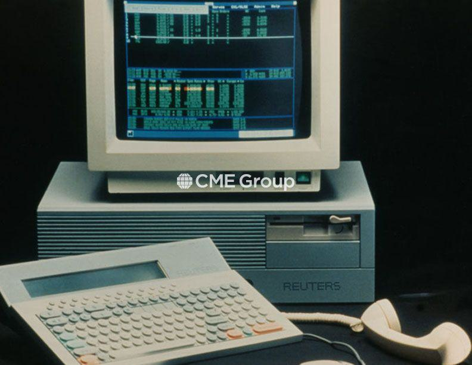

The CME Globex platform has fundamentally transformed futures trading by providing electronic access to markets on a global scale. Introduced in 1992, CME Globex was pioneering as the first electronic trading system for futures and options worldwide, allowing traders to bypass traditional pit trading and access markets from virtually anywhere. This innovation marked a significant shift in how futures were traded, replacing the open outcry systems with a streamlined electronic model.

Today, over 80 percent of the CME Group’s daily trading volume is conducted electronically through CME Globex. This platform has established itself as an industry leader, offering not only speed and efficiency but also broad global access to various financial markets. It supports a wide array of products, ranging from agricultural commodities to financial indices, thus accommodating diverse trading strategies and participants from all over the world.



CME Globex's influence is seen in its role in electronic trading systems and the significant part it plays in algorithmic trading. Algorithmic trading, which relies on automated systems to execute trades as per predefined conditions, benefits greatly from the speed and reliability of CME Globex. By incorporating sophisticated algorithms, traders and institutions can execute large volumes of trades with increased precision and reduced transaction costs.

This article explores how CME Globex's electronic trading system impacts the modern trading landscape and examines the strategic significance of algorithmic trading within this ecosystem. From its inception to its current state, CME Globex continues to shape the world of futures trading by embracing technological advancements and enabling efficient market access.

## Table of Contents

## The Evolution of CME Globex

CME Globex emerged from a collaboration between the Chicago Mercantile Exchange (CME) and technology partners, launching a new era in electronic futures trading when it was introduced in 1992. As the first worldwide electronic trading platform for futures and options, it marked a significant milestone in financial market structures, allowing traders unprecedented access to global markets.

Initially, CME Globex served as a supplementary system to the traditional open outcry trading floors, primarily operating outside regular trading hours. This allowed traders to participate in markets across different time zones, broadening their ability to engage in international transactions.

Over the years, CME Globex has undergone significant enhancements to its core systems, aimed at improving efficiency and scalability. These upgrades have been vital in accommodating the increasing number of traders and the [volume](/wiki/volume-trading-strategy) of trades handled by the platform. A major technological leap occurred in 2008 when CME Globex significantly reduced its message response times by more than 50%. This improvement was crucial for attracting a high-speed trading environment, catering to algorithmic traders who rely on rapid execution speeds.

Additionally, CME Globex has expanded its scope by integrating products from various exchanges. Notably, the acquisition of the Chicago Board of Trade (CBOT) in 2007 and the New York Mercantile Exchange (NYMEX) in 2008 allowed CME Globex to offer a more diverse range of trading products. This integration has enabled the platform to provide a more comprehensive offering, encompassing an extensive array of futures and options products within one unified system.

The continuous evolution of CME Globex underscores its key role in transforming the landscape of futures trading. By consistently upgrading its technical infrastructure and integrating new exchange products, CME Globex has maintained its position as a leader in electronic markets, offering traders efficient, accessible, and diverse trading opportunities around the clock.

## Functionality and Sessions on CME Globex

CME Globex provides nearly round-the-clock trading opportunities, starting on Sunday evening and continuing through late Friday. This extended trading window is made possible by the five distinct daily trading sessions, each designed to cater to different global markets, ensuring wide participation across time zones. The structure of these sessions allows traders from various regions to engage with the market at convenient local times, significantly enhancing market [liquidity](/wiki/liquidity-risk-premium) and flexibility.

The spectrum of products available on CME Globex is broad, encompassing financial instruments ranging from futures and options to more specialized contracts. Some of these products are traded exclusively on the Globex platform, benefiting from its electronic infrastructure and speed. For instance, many currency and [interest rate](/wiki/interest-rate-trading-strategies) futures are primarily managed through electronic trades due to their global demand and the necessity for rapid execution.

Conversely, certain products remain available through both electronic trading on Globex and traditional open outcry systems. This dual approach ensures that traders who prefer the open outcry method, often associated with human interaction and negotiation, can still participate. However, as electronic trading gains [momentum](/wiki/momentum) thanks to its efficiency and reduced costs, the trend shows a gradual shift towards an electronically-dominated marketplace.

In summary, the functionality of CME Globex, coupled with its comprehensive session scheduling, reinforces its role as a versatile and innovative platform, continuously adapting to the needs of a global trading community.

## Speed and Efficiency Enhancements

In 2008, CME Globex significantly enhanced its system by cutting message response times by over 50%, reflecting the high-speed requirements of modern trading environments. This major update was pivotal in maintaining CME Globex's competitive edge, catering to a landscape increasingly dominated by [algorithmic trading](/wiki/algorithmic-trading) strategies.

The speed improvements allowed traders to capitalize on market opportunities more effectively. Algorithmic trading, which relies on executing orders at precise times based on pre-programmed criteria, greatly benefited from these enhancements. The quick execution times facilitated by the platform's improved infrastructure are critical for high-frequency trading ([HFT](/wiki/high-frequency-trading-strategies)) strategies, where the ability to respond to market data within fractions of a second can dramatically affect profitability.

CME Globex's continuous evolution is centered on optimizing its performance to meet the needs of both individual and institutional traders. For instance, the reduction in latency achieved in 2008 laid the groundwork for subsequent technological advancements that ensured the platform remained compatible with the fast-paced nature of global electronic markets. This continual improvement is integral to supporting the complex algorithms used by modern traders, who depend on swift market data and efficient order placement to capitalize on fleeting market conditions.

Moreover, CME Globex's commitment to technological progress ensures that the platform evolves alongside advancements in hardware and software technologies. By continually investing in its infrastructure, CME Globex not only reduces latency but also enhances the overall reliability and capacity of its trading systems, making them robust enough to handle peak trading volumes and market surges.

As CME Globex continues to innovate, its infrastructure is expected to support the growing sophistication of algorithmic trading models. By maintaining cutting-edge speed and efficiency, the platform ensures that it remains a preferred choice for traders seeking to leverage technology to gain advantages in the global futures markets. Through these efforts, CME Globex not only contributes to the optimization of trading strategies but also plays a key role in shaping the future of electronic trading.

## Algorithmic Trading in Electronic Markets

Algorithmic trading utilizes automated systems to execute trades based on predefined criteria, such as price, timing, or volume. This approach to trading has become increasingly popular due to its efficiency and ability to handle large volumes of data quickly. By minimizing human intervention, algorithmic trading reduces transaction costs and allows for more precise market entry and [exit](/wiki/exit-strategy) points.

CME Globex's electronic platform is particularly well-suited for algorithmic trading strategies due to its exceptional speed and broad availability. The platform operates nearly 24 hours, accommodating traders from various time zones and enabling them to respond promptly to market developments. This accessibility is crucial for algorithmic systems that require constant market engagement to execute strategies effectively.

The continuous technological advancements of the CME Globex platform have significantly contributed to the growth of algorithmic trading. By leveraging cutting-edge infrastructure, CME Globex supports high-frequency trading (HFT) systems that depend on minimal latency to capitalize on transient market opportunities. The CME Globex platform's ability to process large volumes of trades at incredible speeds is paramount for algorithmic trading strategies that need rapid execution times.

Algorithmic trading strategies on CME Globex can incorporate various trading models, including market-making, trend-following, and [arbitrage](/wiki/arbitrage). Each model relies on the platform's efficient and reliable system to manage complex algorithms and data analysis. For instance, a trend-following algorithm might use moving averages or Bollinger Bands to identify and act on market trends, requiring timely execution of trades as market conditions shift.

Python, a popular programming language for algorithmic trading, can be utilized to develop strategies on platforms like CME Globex. Here is a simple example of a trend-following moving average crossover strategy:

```python
import pandas as pd
import numpy as np

# assume data is a DataFrame with 'Close' prices
short_window = 40
long_window = 100

signals = pd.DataFrame(index=data.index)
signals['signal'] = 0.0

# Create short simple moving average
signals['short_mavg'] = data['Close'].rolling(window=short_window, min_periods=1).mean()

# Create long simple moving average
signals['long_mavg'] = data['Close'].rolling(window=long_window, min_periods=1).mean()

# Generate signals
signals['signal'][short_window:] = np.where(signals['short_mavg'][short_window:] > signals['long_mavg'][short_window:], 1.0, 0.0)   

# Generate trading orders
signals['positions'] = signals['signal'].diff()

print(signals)
```

In this code, the algorithm calculates short and long-term moving averages and generates buy signals when the short moving average crosses above the long one, reflecting a potential upward trend. This is just a simple illustration of the types of strategies that can be implemented in an algorithmic trading system.

CME Globex's integration of sophisticated technology ensures that algorithmic traders can efficiently implement a wide range of trading strategies, adapting to both anticipated and unforeseen market movements. As algorithmic trading continues to evolve, CME Globex remains a crucial platform facilitating the innovation and application of advanced trading techniques.

## Strategic Implications of Algorithmic Trading on CME Globex

Algorithmic trading on the CME Globex platform offers several strategic advantages for market participants, notably in terms of efficiency, accuracy, and reduced transaction costs. The electronic nature of CME Globex allows trades to be executed with minimal latency, enabling traders to take advantage of even the slightest price movements in fractions of seconds. This efficiency is critical in modern trading environments where speed can significantly impact profitability.

The precision of algorithmic trading stems from its reliance on pre-programmed instructions and analytics, which helps in minimizing human error. By utilizing quantitative models, algorithms can execute trades based on a wide array of market indicators and data points. This precision means that trades are not only executed faster but they are also aligned closely with the trader's strategy, thereby optimizing their market exposure and capitalizing on small price discrepancies.

Moreover, algorithmic trading on CME Globex brings about cost efficiency by reducing the need for manual intervention and the associated labor costs. Automated systems can manage large volumes of trades more effectively than humans, allowing for better resource allocation within trading firms.

Despite these benefits, algorithmic trading also introduces certain challenges. One significant concern is the need for advanced risk management techniques to mitigate potential losses that can occur rapidly due to the automated nature of trades. Algorithms can execute large volumes of trades quickly, but this can lead to substantial losses if not properly monitored.

Additionally, the increased speed and efficiency can contribute to market [volatility](/wiki/volatility-trading-strategies). Algorithms reacting to market events can cause rapid price changes, sometimes exacerbating market fluctuations. This characteristic demands robust monitoring systems and real-time data analytics tools to handle the dynamic nature of electronic trading.

Maintaining a competitive edge on CME Globex requires traders to constantly adapt and refine their trading algorithms to keep up with technological advancements. This involves updating algorithms to utilize the latest data analytics techniques, improving the underlying technology infrastructure, and constantly testing to ensure the algorithms function as intended in various market conditions.

In summary, while algorithmic trading on CME Globex offers substantial advantages in efficiency, precision, and cost reduction, it necessitates a comprehensive approach to risk management and a commitment to technological adaptability. Market participants must balance leveraging algorithmic tools with the vigilance needed to manage the complexities introduced by these powerful trading strategies.

## The Future of Electronic Trading and Algorithms

Electronic trading is expected to maintain its dominance in the futures markets, with platforms like CME Globex spearheading this transformation. As technological advancements continue, algorithmic trading models are likely to grow in complexity and efficacy. This evolution is driven by several factors, including improvements in computational power, data analytics, and [machine learning](/wiki/machine-learning) algorithms.

One key trend is the move towards integrated platforms that facilitate seamless trading experiences on a global scale. These systems aim to merge diverse markets and asset classes, allowing traders to execute and manage strategies across various instruments and geographies from a single interface. This unified approach reduces friction and enhances the efficiency of market operations, ultimately benefiting both institutional and retail investors.

The sophistication of algorithmic trading strategies is also poised to improve. Machine learning and [artificial intelligence](/wiki/ai-artificial-intelligence) are anticipated to play a crucial role in developing more advanced predictive models. These technologies enable traders to analyze vast datasets, identify patterns, and make data-driven decisions at unprecedented speeds. For instance, [deep learning](/wiki/deep-learning) algorithms could be employed to predict price movements based on historical data, macroeconomic indicators, or even sentiment analysis derived from social media trends.

Moreover, continued improvements in network infrastructure, such as the deployment of 5G and advancements in cloud computing, will enable faster and more reliable data transmission. This enhanced connectivity is essential for executing complex algorithms that rely on real-time market data.

Python and other programming languages will increasingly facilitate algorithmic trading development. For example, leveraging Python libraries like NumPy and pandas can help in handling large datasets efficiently. Here's a simple Python example of executing a basic moving average crossover strategy:

```python
import numpy as np
import pandas as pd

# Sample data
data = {'Close': [2545, 2555, 2560, 2570, 2585, 2590, 2600, 2610]}
df = pd.DataFrame(data)

# Compute moving averages
df['Short_MA'] = df['Close'].rolling(window=3).mean()
df['Long_MA'] = df['Close'].rolling(window=5).mean()

# Signal generation
df['Signal'] = np.where(df['Short_MA'] > df['Long_MA'], 1, 0)

# Display results
print(df)
```

This script calculates short-term and long-term moving averages and generates buy signals when the short-term average crosses above the long-term average. Such algorithms can be optimized and scaled for real-world application on platforms like CME Globex.

The continuous progression of electronic trading and algorithmic models highlights the critical role of platforms like CME Globex. They not only set standards for efficiency and innovation but also anticipate and facilitate future industry developments. As the trading ecosystem becomes more interconnected, the future of electronic trading looks promising, with boundless opportunities for enhanced market engagement.

## Conclusion

CME Globex has established itself as a benchmark for electronic trading platforms, particularly within the futures market. Since its inception in 1992, it has been instrumental in transforming how futures and options are traded by offering unparalleled electronic access to global markets. This transformation is significantly linked to the rise of algorithmic trading, which has leveraged CME Globex's robust infrastructure for executing trades with increased efficiency and precision.

Algorithmic trading on CME Globex offers various opportunities, notably in enhancing operational efficiency and accuracy, reducing transaction costs, and enabling timely executions. The platform's continuous upgrades and optimizations are essential in meeting the high-speed demands required by contemporary algorithmic strategies. However, these opportunities are not without challenges. The sophisticated nature of algorithmic strategies necessitates advanced risk management practices to mitigate potential impacts such as increased market volatility and unforeseen anomalies within trading systems.

As electronic trading continues its expansion, CME Globex is poised to maintain its key role as a leader in this innovation-driven environment. Its ongoing adaptation to technological advancements ensures that it remains a crucial component of global trading infrastructures. Future developments are likely to focus on further integration and sophistication of algorithmic models, which will enhance the seamlessness and reach of global trading activities. CME Globex's continual evolution will undoubtedly mirror the trajectory of electronic trading as it increasingly dominates the futures market landscape.

## References & Further Reading

[1]: ["CME Group: Homepage"](https://www.cmegroup.com/) - Official website of CME Group with comprehensive resources on CME Globex and electronic trading.

[2]: Barker, M., & Moller, N. (2019). ["Electronic Trading in Financial Markets."](https://www.academia.edu/34521146/Doing_a_literature_review) Palgrave Macmillan.

[3]: Hendershott, T., Jones, C. M., & Menkveld, A. J. (2011). ["Does Algorithmic Trading Improve Liquidity?"](https://onlinelibrary.wiley.com/doi/full/10.1111/j.1540-6261.2010.01624.x) The Review of Financial Studies, 24(2), 339–379.

[4]: Aldridge, I. (2013). ["High-Frequency Trading: A Practical Guide to Algorithmic Strategies and Trading Systems."](https://www.wiley.com/en-us/High+Frequency+Trading%3A+A+Practical+Guide+to+Algorithmic+Strategies+and+Trading+Systems%2C+2nd+Edition-p-9781118343500) Wiley.

[5]: Gomber, P., Arndt, B., Lutat, M., & Uhle, T. (2011). ["High-Frequency Trading."](https://papers.ssrn.com/sol3/papers.cfm?abstract_id=1858626) SSRN Electronic Journal.