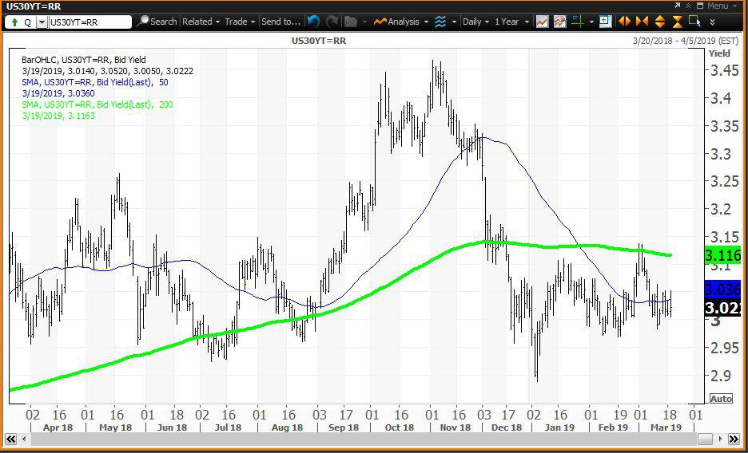

## Table of Contents

## What is CME Group?

CME Group is a company that runs a marketplace where people and businesses can buy and sell things like futures and options. These are special kinds of contracts that help people predict and manage the prices of things like crops, oil, and even interest rates. The company started in Chicago and is now one of the biggest places in the world for trading these kinds of contracts.

People use CME Group's services to protect themselves from big changes in prices. For example, a farmer might use the marketplace to make sure they get a good price for their crops, even if the market price goes down. Traders and investors also use it to make money by guessing how prices will change. The company helps make trading fair and safe by setting rules and using technology to keep track of everything.

## What are 30-Year U.S. Treasury Bonds?

30-Year U.S. Treasury Bonds are long-term loans that people give to the U.S. government. When you buy one of these bonds, you're lending money to the government for 30 years. In return, the government promises to pay you back the amount you lent them, called the face value, when the bond matures after 30 years. They also pay you interest every six months until then. These bonds are seen as very safe because they're backed by the U.S. government, which is considered very unlikely to default on its debts.

People and institutions buy these bonds for different reasons. Some want a safe place to keep their money for a long time, knowing they'll get regular interest payments. Others might buy them to balance riskier investments in their portfolios. The [interest rate](/wiki/interest-rate-trading-strategies), or yield, on these bonds can change based on what's happening in the economy. When people think the economy might have problems, they often buy more of these bonds, which can make the yield go down. When the economy is doing well, they might buy less, and the yield can go up.

## How does CME Group facilitate trading of 30-Year U.S. Treasury Bonds?

CME Group helps people trade 30-Year U.S. Treasury Bonds by providing a special marketplace where these bonds can be bought and sold. They use something called futures contracts, which are agreements to buy or sell the bonds at a set price in the future. This helps people plan and manage the risks of changing bond prices. The marketplace is electronic, so traders from all over the world can use it to make deals anytime.

CME Group makes sure trading is fair and safe by setting rules and using technology to watch over everything that happens. They also give traders tools and information to help them make smart choices. This includes things like real-time prices and market data. By doing all this, CME Group makes it easier for people to trade 30-Year U.S. Treasury Bonds and manage their investments.

## What are the benefits of trading 30-Year U.S. Treasury Bonds on the CME Group?

Trading 30-Year U.S. Treasury Bonds on the CME Group has many benefits. One big benefit is that it's a very safe place to trade. The CME Group uses rules and technology to make sure everything is fair and honest. This means traders can trust that their trades will happen the way they expect. Also, because the CME Group is a big and well-known marketplace, there are always lots of people buying and selling. This makes it easier to find someone to trade with, no matter what time it is.

Another benefit is the tools and information that the CME Group provides. Traders can see real-time prices and other important data that helps them make good choices. This can help them predict what might happen with bond prices and plan their trades better. Plus, using futures contracts on the CME Group lets traders manage the risk of changing bond prices. They can make agreements to buy or sell bonds at a set price in the future, which helps protect them from surprises in the market.

## How do interest rates affect the value of 30-Year U.S. Treasury Bonds?

Interest rates have a big impact on the value of 30-Year U.S. Treasury Bonds. When interest rates go up, the value of these bonds usually goes down. This happens because new bonds that are issued will have higher interest rates, making them more attractive to investors. If someone already owns an older bond with a lower interest rate, they might want to sell it to buy the new bond with a better rate. So, they have to lower the price of their old bond to make it more appealing to buyers.

On the other hand, when interest rates go down, the value of 30-Year U.S. Treasury Bonds usually goes up. This is because the older bonds with higher interest rates become more valuable compared to the new bonds with lower rates. People who own these older bonds might not want to sell them because they're getting a good deal on interest. If they do decide to sell, they can ask for a higher price because other people will want to buy those bonds for their higher interest payments.

## What are the risks associated with investing in 30-Year U.S. Treasury Bonds?

Investing in 30-Year U.S. Treasury Bonds can be a safe choice because they're backed by the U.S. government, but there are still some risks to think about. One big risk is interest rate risk. If interest rates go up, the value of your bond might go down. This happens because new bonds will have higher interest rates, making your old bond less attractive to other people. If you need to sell your bond before it matures, you might have to sell it for less than what you paid for it.

Another risk is inflation risk. Over 30 years, the prices of things can go up a lot. If inflation goes up faster than the interest you're getting from your bond, the money you get back might not be worth as much as you thought it would be. This means your investment might not keep up with the cost of living. Even though these bonds are seen as very safe, these risks can still affect how much money you end up with.

## How can one start trading 30-Year U.S. Treasury Bonds through CME Group?

To start trading 30-Year U.S. Treasury Bonds through CME Group, you first need to open an account with a brokerage firm that has access to the CME Group's marketplace. This is because the CME Group doesn't work directly with individual traders. Once you've chosen a brokerage firm, you'll need to fill out some forms and give them information about yourself. This is so they can set up your account and make sure you're allowed to trade.

After your account is set up, you can start trading. The CME Group uses something called futures contracts for trading these bonds. This means you're making an agreement to buy or sell the bonds at a set price in the future. You'll use the tools and information provided by the CME Group and your brokerage firm to decide when to buy or sell. It's a good idea to learn as much as you can about how these futures contracts work and the risks involved before you start trading.

## What are the contract specifications for 30-Year U.S. Treasury Bonds on CME Group?

The 30-Year U.S. Treasury Bond futures contract on the CME Group is a special agreement where people agree to buy or sell a certain amount of these bonds at a set price in the future. Each contract is for bonds worth $100,000 in face value. They trade in what's called "ticks," which are the smallest price change you can have. Each tick is worth $31.25, and the price of the contract can change in steps of one tick. The contracts have different times when they end, called expiration months, which are March, June, September, and December.

When you trade these futures, you're not buying the actual bonds right away. Instead, you're agreeing to buy or sell them later. The last day you can trade these contracts is the seventh business day before the last business day of the month they expire. If you decide to take delivery of the bonds, it happens on the last business day of that month. The bonds you get have to be ones that the U.S. government issued at least 15 years before and will mature in at least 15 but no more than 25 years from the first day of the delivery month.

## How does the yield curve impact the pricing of 30-Year U.S. Treasury Bonds?

The yield curve shows how the interest rates of bonds change depending on how long you have to wait before they pay you back. For 30-Year U.S. Treasury Bonds, the yield curve is important because it helps people guess what will happen with interest rates over the next 30 years. If the yield curve is going up, it means longer-term bonds like the 30-year ones will have higher interest rates than shorter-term bonds. This makes the 30-year bonds less valuable because new bonds with higher rates will be more attractive to people.

On the other hand, if the yield curve is going down, it means longer-term bonds have lower interest rates than shorter-term ones. This can make 30-Year U.S. Treasury Bonds more valuable because people might want to lock in the higher interest rates they offer before they go down even more. The shape of the yield curve can change because of things like what people think will happen with the economy or decisions made by the government about interest rates. So, understanding the yield curve can help you decide when it's a good time to buy or sell these bonds.

## What are the historical performance trends of 30-Year U.S. Treasury Bonds?

Over the years, the performance of 30-Year U.S. Treasury Bonds has been influenced by many things, like changes in interest rates, inflation, and what people think will happen with the economy. When interest rates go down, these bonds usually do well because their fixed interest payments become more valuable compared to new bonds with lower rates. For example, during times like the early 1980s when interest rates were very high, the yield on these bonds was around 15%. As rates fell over the following decades, the value of these bonds went up because their high yields were more attractive.

On the other hand, when interest rates go up, the value of these bonds can go down. This happened in the late 1990s and early 2000s when the Federal Reserve raised rates to fight inflation. The yield on 30-Year U.S. Treasury Bonds went up, making older bonds with lower yields less attractive. During big economic events like the 2008 financial crisis, people often turned to these bonds for safety, which pushed their prices up and yields down. Overall, the performance of these bonds depends a lot on what's happening with interest rates and the economy, making them a good choice for people who want a safe, long-term investment but need to be aware of the risks from changing rates.

## How do macroeconomic factors influence the trading of 30-Year U.S. Treasury Bonds on CME Group?

Macroeconomic factors like interest rates, inflation, and economic growth can really change how people trade 30-Year U.S. Treasury Bonds on the CME Group. When interest rates go up, the value of these bonds usually goes down because new bonds will have higher rates, making the old ones less attractive. This can lead to more selling on the CME Group as people try to get rid of their lower-yielding bonds. On the other hand, if interest rates go down, the value of these bonds can go up because their fixed interest payments become more valuable. This might make people want to buy more of these bonds on the CME Group, hoping to lock in the higher rates before they fall even more.

Inflation also plays a big role. If people think inflation will go up a lot, they might not want to buy these bonds because the money they get back might not be worth as much. This can lead to less trading on the CME Group as people look for other places to put their money. But if inflation is low and steady, these bonds can be a safe bet, leading to more buying and selling on the CME Group. Economic growth is another [factor](/wiki/factor-investing). When the economy is doing well, people might feel more confident and be less interested in safe investments like these bonds, which can slow down trading. But if the economy looks like it might have problems, people often turn to these bonds for safety, which can increase trading on the CME Group.

## What advanced trading strategies can be applied to 30-Year U.S. Treasury Bonds on CME Group?

One advanced trading strategy for 30-Year U.S. Treasury Bonds on the CME Group is called "yield curve trading." This strategy involves looking at how the interest rates of different bonds change over time. Traders might buy or sell 30-Year bonds based on what they think will happen to the yield curve. If they think the curve will get steeper, meaning long-term rates will go up compared to short-term rates, they might sell 30-Year bonds now and buy them back later at a lower price. If they think the curve will flatten, meaning long-term rates will go down compared to short-term rates, they might buy 30-Year bonds now and sell them later at a higher price.

Another strategy is "hedging." This means using futures contracts on the CME Group to protect against changes in bond prices. For example, if a trader owns a lot of 30-Year Treasury Bonds and is worried that interest rates will go up, they might sell futures contracts for these bonds. This way, if the bond prices go down because of higher rates, the money they lose on their bonds can be made up by the profit they make on the futures contracts. It's like having insurance against big changes in the market. Both of these strategies need a good understanding of the market and can be risky, but they can also help traders make money or protect their investments.

## References & Further Reading

[1]: Bergstra, J., Bardenet, R., Bengio, Y., & Kégl, B. (2011). ["Algorithms for Hyper-Parameter Optimization."](https://dl.acm.org/doi/10.5555/2986459.2986743) Advances in Neural Information Processing Systems 24.

[2]: ["Advances in Financial Machine Learning"](https://www.amazon.com/Advances-Financial-Machine-Learning-Marcos/dp/1119482089) by Marcos Lopez de Prado

[3]: ["Evidence-Based Technical Analysis: Applying the Scientific Method and Statistical Inference to Trading Signals"](https://www.amazon.com/Evidence-Based-Technical-Analysis-Scientific-Statistical/dp/0470008741) by David Aronson

[4]: ["Machine Learning for Algorithmic Trading"](https://github.com/stefan-jansen/machine-learning-for-trading) by Stefan Jansen

[5]: ["Quantitative Trading: How to Build Your Own Algorithmic Trading Business"](https://www.amazon.com/Quantitative-Trading-Build-Algorithmic-Business/dp/1119800064) by Ernest P. Chan