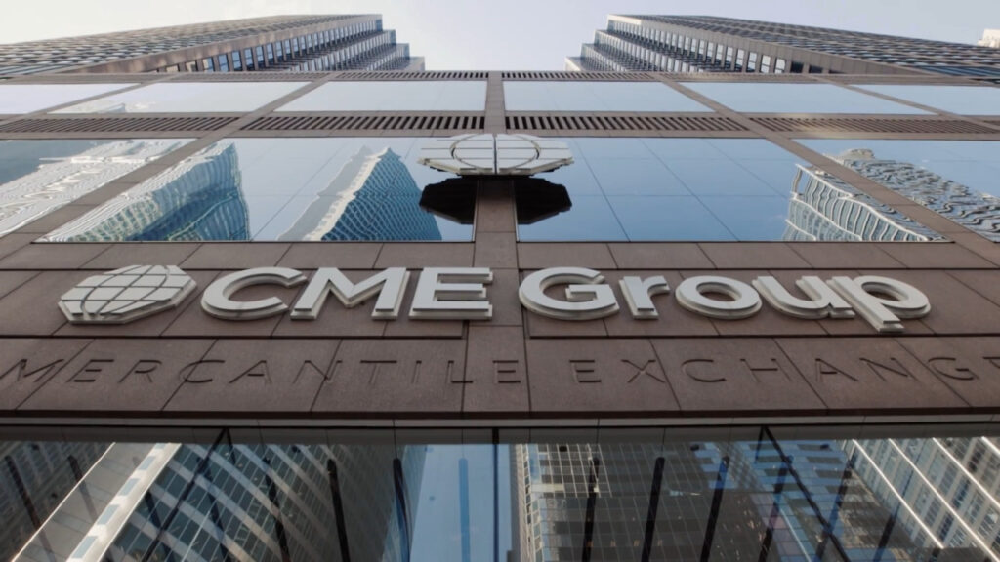

## Table of Contents

## What is CME Group Incorporated?

CME Group Incorporated is a company that runs a marketplace where people and businesses can buy and sell things like futures and options. These are special kinds of contracts that help people predict and manage the prices of things like crops, oil, and even interest rates. The company is based in Chicago, Illinois, and it's one of the biggest marketplaces of its kind in the world.

People use CME Group's services to protect themselves from big changes in prices. For example, a farmer might use the marketplace to make sure they get a good price for their crops, even if the market prices go down. Companies and investors also use it to plan for the future and make safer financial decisions. CME Group helps make these transactions smooth and reliable, which is important for the economy.

## When was CME Group Incorporated founded?

CME Group Incorporated was founded a long time ago, back in 1898. At that time, it started as the Chicago Butter and Egg Board. This was a place where people could trade things like butter and eggs.

Over the years, the company changed a lot. It grew bigger and started trading more things, like grains and other farm products. Eventually, it became the big marketplace we know today, called CME Group, where people trade all sorts of futures and options.

## What are the main products and services offered by CME Group?

CME Group offers a wide range of products and services that help people and businesses manage risks and make financial plans. The main products they offer are futures and options contracts. These contracts are agreements to buy or sell something at a set price in the future. They cover a lot of different things, like farm products (like corn, wheat, and soybeans), energy (like oil and natural gas), metals (like gold and silver), and even financial things like interest rates and stock market indexes.

In addition to these products, CME Group provides services that make trading easier and safer. They have a big electronic trading platform called CME Globex, where people can trade 24 hours a day from anywhere in the world. They also offer clearing services, which means they help make sure that all trades are settled properly and everyone gets what they are supposed to get. This helps build trust in the marketplace. Overall, CME Group's products and services help people manage the risks of price changes and make smarter financial decisions.

## How does CME Group generate its revenue?

CME Group makes money mainly by charging fees for the services it provides. When people use their trading platform, CME Globex, to buy and sell futures and options, they have to pay a fee for each trade. This is like a small charge for using the marketplace. CME Group also earns money from clearing services, where they make sure all trades are completed correctly. This helps keep the marketplace safe and trustworthy, and people pay for this service.

In addition to these fees, CME Group makes money from the data and information it collects. Many businesses and investors want to know what's happening in the markets, so they pay for access to real-time market data and reports. This information helps them make better decisions. Overall, the fees from trading, clearing services, and data sales are the main ways CME Group generates its revenue.

## What is the significance of CME Group in the financial markets?

CME Group is really important in the financial markets because it provides a place where people can buy and sell futures and options. These are special contracts that help people guess what prices might be in the future and protect themselves from big changes. For example, a farmer might use CME Group to make sure they get a good price for their crops, even if the market prices go down. This helps everyone from farmers to big companies plan better and feel more secure about their money.

Another reason CME Group is significant is that it helps keep the markets stable and trustworthy. They have a big electronic trading platform called CME Globex, where people can trade 24 hours a day from anywhere in the world. They also make sure all trades are done right through their clearing services. This means everyone can trust that they will get what they are supposed to get. By providing these services, CME Group helps the whole economy run smoother and helps people make safer financial decisions.

## Who are the major competitors of CME Group?

CME Group has a few big competitors that also run marketplaces for trading futures and options. One of the main ones is the Intercontinental Exchange (ICE). ICE is a big company that lets people trade things like energy, agriculture, and even financial products. It's based in Atlanta, Georgia, and it's known for its electronic trading platform, which is a lot like CME Globex. Another important competitor is the Eurex Exchange, which is based in Europe. Eurex is big in trading financial products like interest rates and stock market indexes, and it helps people from all over the world trade these products.

Besides ICE and Eurex, there are other players like the Chicago Board of Trade (CBOT) and the New York Mercantile Exchange (NYMEX), which are actually part of CME Group now but used to be separate competitors. These exchanges focus on different kinds of products, like agricultural goods and energy, and they help keep the market competitive. All these competitors make sure that people have different places to trade and can choose the one that works best for them. This competition helps keep the prices fair and the services good, which is important for everyone who uses these marketplaces.

## What are some recent strategic initiatives or acquisitions by CME Group?

CME Group has been busy with some big moves recently to keep growing and staying ahead in the market. One of the big things they did was buying NEX Group in 2018. NEX Group is a company based in the UK that helps people trade different financial products. By buying NEX, CME Group got a bigger reach in Europe and added more kinds of products to their marketplace. This helped them serve more people and offer more options for trading.

Another important thing CME Group did was starting a new way to trade called BrokerTec. BrokerTec is a platform that helps people trade government bonds and other financial products. It's designed to make trading these products easier and faster. This is a big deal because it helps CME Group get into new areas of the market and offer more services to their customers. By doing these things, CME Group is working hard to stay a leader in the world of trading and help more people manage their money better.

## How has CME Group adapted to technological changes in the trading industry?

CME Group has made big changes to keep up with new technology in the trading world. One of the main things they did was create CME Globex. This is a big electronic platform where people can trade futures and options 24 hours a day from anywhere in the world. It's like a giant online marketplace that makes trading faster and easier than ever before. Because of CME Globex, more people can trade, and they can do it at any time, not just during regular business hours. This has helped CME Group stay a leader in the industry.

Another way CME Group has adapted is by using new technology to make trading safer and more reliable. They use something called clearing services to make sure all trades are done correctly and everyone gets what they are supposed to get. This builds trust in the marketplace, which is really important. They also use advanced technology to give people real-time data and information about the markets. This helps people make better decisions about their trades. By using these new technologies, CME Group helps keep the trading world running smoothly and safely.

## What are the key financial metrics to assess CME Group's performance?

To understand how well CME Group is doing, people look at a few important numbers. One big one is revenue, which shows how much money the company makes from things like trading fees, clearing services, and selling market data. Another key number is net income, which is what's left after the company pays all its bills and costs. This tells us if CME Group is making a profit or not. People also look at earnings per share (EPS), which shows how much money the company makes for each share of its stock. A higher EPS usually means the company is doing well.

Another important thing to check is the company's operating margin, which shows how much profit CME Group makes from its main business activities before paying other costs like taxes and interest. A high operating margin means the company is good at turning its business into profit. Finally, people look at the return on equity (ROE), which tells us how well the company is using the money that shareholders have invested. A high ROE means CME Group is using that money well to grow and make more profit. By looking at these numbers, people can get a good idea of how healthy and successful CME Group is.

## How does CME Group manage risk, particularly in volatile market conditions?

CME Group helps manage risk in volatile markets by offering futures and options contracts. These contracts let people protect themselves from big price changes. For example, if someone thinks the price of oil might go up, they can buy an oil futures contract now to lock in a good price. This way, even if the price does go up later, they won't have to pay more. By using these contracts, people and businesses can plan better and feel more secure about their money, even when the market is going up and down a lot.

CME Group also uses its clearing services to manage risk. When people trade on their platform, CME Group makes sure all trades are settled correctly. This means they keep an eye on everything to make sure no one loses money because of mistakes or if someone can't pay. This helps keep the market stable and trustworthy, which is really important during volatile times. By providing these services, CME Group helps everyone feel safer about trading, even when the market is unpredictable.

## What is the role of CME Group in global economic stability?

CME Group plays a big part in keeping the world's economy stable. They do this by giving people a place to trade futures and options. These are special contracts that help people guess what prices might be in the future and protect themselves from big changes. For example, a farmer might use CME Group to make sure they get a good price for their crops, even if the market prices go down. This helps everyone from farmers to big companies plan better and feel more secure about their money. By helping people manage risk, CME Group makes the economy more predictable and stable.

Another way CME Group helps with global economic stability is by making sure all trades are done right. They use something called clearing services to check that everyone gets what they are supposed to get. This builds trust in the marketplace, which is really important, especially when the market is going up and down a lot. By keeping the market stable and trustworthy, CME Group helps the whole world's economy run smoother and safer.

## What future trends or challenges might impact CME Group's business model?

In the future, CME Group might face challenges from new technology. As more people use computers and the internet to trade, they might want faster and easier ways to buy and sell things. This means CME Group needs to keep improving their electronic trading platform, CME Globex, to stay ahead. They also need to watch out for new companies that might come up with better technology. If these new companies offer better services, they could take customers away from CME Group. So, staying up-to-date with technology is a big challenge for them.

Another trend that could affect CME Group is changes in the rules and laws about trading. Governments around the world might decide to make new rules to make sure trading is fair and safe. These rules could change how CME Group does business and might cost them more money to follow. Also, big changes in the world's economy, like a new financial crisis, could make the markets more unpredictable. This could make it harder for CME Group to help people manage their risks. So, they need to be ready to adapt to new rules and economic changes to keep their business strong.

## References & Further Reading

[1]: ["CME Group: History, Products, and Emerging Technologies."](https://www.cmegroup.com/company/history/timeline-of-achievements.html) CME Group Education Resources.

[2]: Fenn, D. J., Howison, S. D., & McDonald, M. (2012). ["The Emergence of a New Liquid Market: Algorithmic Trading Platforms."](https://arxiv.org/abs/1012.0349) Journal of Behavioral Finance.

[3]: Johnson, B. (2010). ["Algorithmic Trading & DMA: An Introduction to Direct Access Trading Strategies"](https://archive.org/details/algorithmictradi0000john) by Barry Johnson.

[4]: Maureen O’Hara. (2015). ["High-Frequency Trading and Its Impact on Markets."](https://statmath.wu.ac.at/~hauser/LVs/FinEtricsQF/References/oHara2015JFinEco_HighFrequ_Market_MiicroStruct.pdf) The Journal of Finance, 70(3), 1333–1374.

[5]: "CME Group and Google Cloud Announce 10-Year Strategic Partnership to Accelerate Technology Transformation Across Global Derivatives Markets." [CME Group News Releases.](https://finance.yahoo.com/news/cme-group-reports-record-annual-123000916.html)