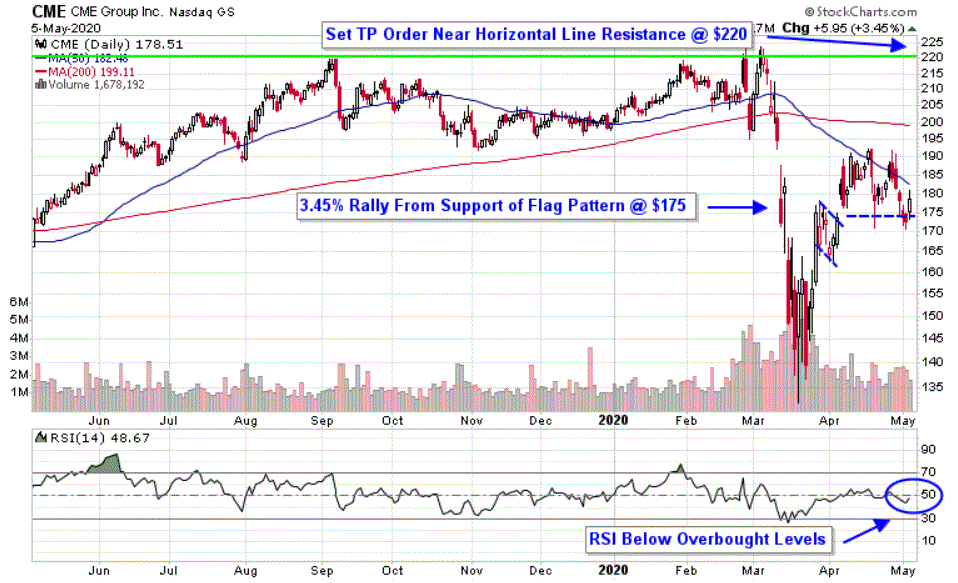

CME Group, Inc. stands as a preeminent entity in global derivatives trading. Formed in 2007 through the merger of the Chicago Mercantile Exchange and the Chicago Board of Trade, the organization has fortified its position as a leading financial exchange by offering a comprehensive array of trading platforms that encompass derivatives, futures, and options. The firm's capabilities extend across a broad spectrum of financial products, gaining recognition as a crucial hub for both commodity trading and algorithmic trading.

CME Group's expansive portfolio is illustrated by its diverse offerings, crucial for participants seeking risk management tools and investment opportunities. The organization's strategic integration of advanced technology has bolstered its electronic trading platforms, thus granting traders expedited access to global markets. This focus on electronic trading not only enhances the efficiency of transactions but also underscores the role of CME Group in the evolution of modern financial markets.

The article aims to illustrate the significance of CME Group, Inc. by examining its historical evolution, the strategic partnerships that expand its global reach, and the ongoing innovations that keep it at the forefront of the financial services industry. This exploration will highlight the integral role of CME Group in shaping financial markets and its continued impact in enabling seamless trading operations worldwide.

## Table of Contents

## History and Evolution of CME Group

CME Group Inc. is a prominent entity in the financial markets, known for its vast derivatives trade. Its inception traces back to the 2007 merger of two significant American exchanges: the Chicago Mercantile Exchange (CME) and the Chicago Board of Trade (CBOT). This strategic union marked a pivotal moment in the financial industry, propelling the new entity into a leadership position in global derivatives trading.

The Chicago Mercantile Exchange, established in 1898 originally as the Chicago Butter and Egg Board, had already evolved into a powerhouse in financial trading before the merger. It was renowned for offering contracts based on evolving market needs, ranging from agricultural commodities to complex financial derivatives. Similarly, the Chicago Board of Trade, founded in 1848, was one of the oldest derivatives and futures exchanges in the world, with deep roots in grain trading. This experience provided a solid foundation for developing a diverse range of commodity futures.

Post-merger, CME Group invested in expanding its reach through strategic acquisitions. Notably, the acquisition of NEX Group in 2018 stood out as a significant milestone. NEX Group was a leader in electronic trading platforms and services in the OTC markets, including [FX](/wiki/fx-anomaly) and fixed income, which complemented CME's robust futures portfolio. This acquisition not only diversified CME Group's offerings but also enhanced its technological capabilities in electronic trading infrastructure.

CME Group's historical focus on agriculture and grain set a precedent for its leadership in commodity trading. It established standardized contracts and practices in trading grain futures, thus shaping the modern commodity futures market. This legacy continues to influence CME Group's strategies and product offerings, ensuring that it remains a central player in commodities futures.

In summary, the merger and subsequent expansions allowed CME Group to leverage its historical expertise and capitalize on new opportunities. These strategic moves solidified its standing as a pivotal exchange in the global financial market, with a significant influence on derivatives, futures, and OTC markets.

## Commodity Trading at CME Group

CME Group offers a comprehensive suite of commodity derivatives, making it a critical player in global commodity markets. The exchange facilitates trading in various commodities, including energies, metals, and agricultural products. Its robust platform supports risk management and hedging strategies through futures and options, allowing market participants to mitigate price [volatility](/wiki/volatility-trading-strategies) and secure financial stability.

The energy sector at CME Group includes products such as [crude oil](/wiki/crude-oil), natural gas, and electricity futures, providing essential tools for managing price risks associated with these critical resources. These contracts enable producers, consumers, and investors to lock in prices and protect against market fluctuations.

In the metals category, CME Group provides derivatives for precious and industrial metals, such as gold, silver, and copper. These contracts serve as crucial instruments for investors seeking to hedge against inflation, diversify their portfolios, or speculate on metal price movements. Through these offerings, CME Group sets transparent pricing benchmarks that reflect global market supply and demand dynamics.

Agricultural products play a significant role in CME Group's commodity trading portfolio. The exchange offers futures and options for staple crops like corn, wheat, and soybeans, which are essential for food security and stability. By providing these instruments, CME Group supports farmers, processors, and consumers in managing risks related to weather conditions, supply chain disruptions, and global trade policies.

CME Group's integration with the New York Mercantile Exchange (NYMEX) and the Kansas City Board of Trade has further augmented its reach in the commodities sector. The acquisition of NYMEX expanded CME Group's capabilities in energy and precious metals trading, solidifying its position as a dominant exchange for these markets. Meanwhile, the merger with the Kansas City Board of Trade allowed CME Group to enhance its offerings in agricultural derivatives, particularly in wheat trading, thereby expanding its influence and service offerings in this vital sector.

Overall, CME Group's extensive range of commodity derivatives offers versatile tools for hedging, speculation, and diversification, cementing its status as a leading platform for global commodity trading. Its strategic integrations and partnerships underscore its commitment to providing comprehensive and efficient financial solutions in the commodity market.

## Electronic and Algorithmic Trading on CME Group

CME Globex serves as CME Group's premier electronic trading platform, designed to facilitate high-speed trading and widespread global market access. This platform has become a cornerstone for market participants, offering a fast, efficient, and reliable system for executing trades across a diverse array of asset classes, including commodities, financial derivatives, and foreign exchange.

Algorithmic trading has become increasingly integral on the CME platforms, enabling the management of substantial volumes of trades with heightened efficiency. Through the use of sophisticated algorithms, traders can develop automated trading strategies that execute pre-determined instructions at high velocities. These algorithms rely on advanced computational techniques to analyze market data, generate trading signals, and optimize trade execution timing, thereby minimizing market impact and reducing transaction costs.

CME Group's commitment to technological advancement ensures that its trading systems remain at the forefront of the industry in terms of reliability and security. High-frequency trading, induced by algorithmic processes, demands robust infrastructure with minimal latency. Consequently, CME Group has invested significantly in enhancing its technological framework, incorporating state-of-the-art hardware and software solutions to support the seamless flow of trading operations.

Security is another critical aspect of electronic and [algorithmic trading](/wiki/algorithmic-trading) at CME Group. The exchange employs advanced cybersecurity measures to protect its trading infrastructure and client data from potential threats. Techniques such as encryption, multi-[factor](/wiki/factor-investing) authentication, and continuous network monitoring are implemented to safeguard the integrity of the trading environment.

In conclusion, the integration of electronic and algorithmic trading within CME Group not only facilitates a more dynamic and efficient trading ecosystem but also reinforces its standing as a leader in the global financial markets. Through ongoing investments in cutting-edge technology and cybersecurity, CME Group continues to support the evolving needs of traders worldwide, ensuring consistently reliable and secure trading experiences.

## Strategic Partnerships and Global Reach

CME Group has strategically positioned itself in the global market through alliances with exchanges across Asia and Europe, further solidifying its role as a leader in financial derivatives trading. These alliances enable the CME Group to expand its market presence and offer a broader array of trading options to global investors.

One of CME Group's noteworthy partnerships is with Google Cloud, aimed at advancing the exchange's technology infrastructure. This alliance leverages the power of cloud computing to enhance CME Group's capabilities in data analytics, which is essential for managing vast amounts of trading data efficiently and securely. The partnership with Google Cloud is particularly significant as it facilitates scalability, improved transaction processing speeds, and innovations in trading technologies. This collaboration also points to the growing trend of financial institutions adopting cloud-based solutions to manage operations more effectively.

CME Group's global collaborations are not limited to technology firms but extend to strategic partnerships with exchanges worldwide. These alliances allow CME Group to offer more comprehensive financial trading solutions and access to a wider array of markets. By collaborating with exchanges in diverse regions, CME Group ensures that its platform accommodates the regulatory and trading requirements of different local markets, providing a seamless trading experience for international participants.

These strategic partnerships and global reach initiatives underscore CME Group's commitment to maintaining its leadership position in the financial markets. By combining advanced technology solutions with an extensive global network, CME Group is well-positioned to address the continuously evolving demands of the global trading environment.

## Innovations and Product Offerings

CME Group, Inc., renowned for its extensive derivatives marketplace, continues to adapt its offerings to cater to evolving market needs. A significant innovation is the introduction of [cryptocurrency](/wiki/cryptocurrency) futures, allowing investors to hedge and speculate on digital assets. This inclusion positions CME Group as a pioneer in integrating traditional financial instruments with modern digital currencies, facilitating the growth and stability of the cryptocurrency market.

Another strategic development by CME Group is the launch of Micro E-mini Index Futures. These are smaller-sized contracts compared to standard E-mini futures, enabling retail investors to participate in the futures markets with lower margin requirements. By reducing the entry barriers, CME Group has expanded its customer base, fostering greater market participation and [liquidity](/wiki/liquidity-risk-premium).

Innovation at CME Group is closely aligned with market trends and technological progress. The deployment of advanced trading technologies and data analytics tools contributes significantly to the introduction of new products. For instance, CME leverages algorithmic models and trading platforms to design products that meet specific client demands, thereby enhancing trading efficiency and risk management.

CME’s commitment to innovation is further exemplified by its focus on sustainability and environmental products. They have introduced products such as the Global Emissions Offset (GEO™) futures contracts which support efforts towards carbon neutrality. This aligns with the increasing global emphasis on environmental responsibility, offering market participants tools to manage climate-related risks.

In summary, CME Group’s innovative product offerings, driven by technological advancements and market dynamics, underscore its leadership in the financial markets. Through strategic product expansions such as cryptocurrency futures and Micro E-mini Index Futures, the group maintains its pivotal role in meeting diverse investor needs and shaping the future of financial trading.

## Conclusion

CME Group stands as a preeminent entity in global derivatives trading, exemplifying a commitment to diverse and innovative financial solutions. Its leadership is underpinned by a focused strategy on technological advancement, which is embodied in platforms like CME Globex. This electronic trading environment enhances trading efficiency and accessibility, allowing market participants globally to engage in high-speed, algorithm-driven transactions.

The strategic partnerships forged by CME Group are integral to its market leadership. Collaborations with technology firms, such as Google Cloud, optimize its trading infrastructure, facilitating seamless and secure trading experiences. Furthermore, alliances with international exchanges amplify its reach and influence, bolstering its position as a comprehensive provider in the financial markets.

As financial markets continue to evolve, CME Group remains an essential catalyst in shaping the future of trading. The introduction of new financial instruments, such as cryptocurrency futures, and the development of products tailored for retail and institutional investors highlight its adaptability to changing market demands. In this dynamic landscape, CME's commitment to innovation and strategic foresight ensures its pivotal role in the development of global trading systems.

## References & Further Reading

[1]: ["CME Group: History, Products, and Emerging Technologies."](https://www.cmegroup.com/company/history/timeline-of-achievements.html) CME Group Education Resources.

[2]: Fenn, D. J., Howison, S. D., & McDonald, M. (2012). ["The Emergence of a New Liquid Market: Algorithmic Trading Platforms."](https://arxiv.org/abs/1012.0349) Journal of Behavioral Finance.

[3]: Johnson, B. (2010). ["Algorithmic Trading & DMA: An Introduction to Direct Access Trading Strategies"](https://archive.org/details/algorithmictradi0000john) by Barry Johnson.

[4]: Maureen O’Hara. (2015). ["High-Frequency Trading and Its Impact on Markets."](https://statmath.wu.ac.at/~hauser/LVs/FinEtricsQF/References/oHara2015JFinEco_HighFrequ_Market_MiicroStruct.pdf) The Journal of Finance, 70(3), 1333–1374.

[5]: "CME Group and Google Cloud Announce 10-Year Strategic Partnership to Accelerate Technology Transformation Across Global Derivatives Markets." [CME Group News Releases.](https://finance.yahoo.com/news/cme-group-reports-record-annual-123000916.html)