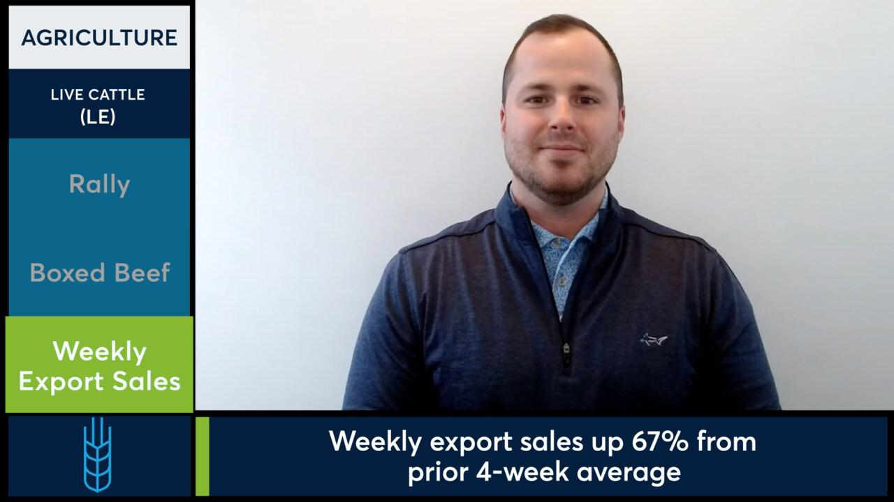

The CME Group is a preeminent institution in the field of commodity trading, offering an expansive range of derivative products that facilitate risk management across global markets. As the operator of some of the world's most significant exchanges, including the Chicago Mercantile Exchange (CME) and the New York Mercantile Exchange (NYMEX), the CME Group has been instrumental in shaping the futures and options markets. One of its notable contributions to commodity trading is the introduction of Live Cattle Futures, which has grown into a vital component of the agricultural market since its inception in 1964. This commodity market enables producers and consumers to hedge against the risks associated with unpredictable price movements in livestock.

Live Cattle Futures are particularly significant as they involve the trading of a non-storable commodity, where contracts are settled based on the future delivery of live cattle. This market is fundamental for stakeholders in the agricultural sector, providing liquidity and price discovery mechanisms that help stabilize income and manage risk effectively.



Algorithmic trading, a method leveraging pre-programmed instructions to execute trades at high speed and frequency, has gained prominence in commodities trading, including Live Cattle Futures. The use of algorithms allows traders to react to market changes more swiftly than human capabilities, utilizing data-driven models to identify trends and optimize trading decisions. Algorithms can analyze vast datasets in real-time to perform tasks such as market prediction, risk assessment, and execution of complex trading strategies, thereby offering a competitive edge to market participants.

The CME Group's robust infrastructure is pivotal in facilitating algorithmic trades. Through its advanced trading platforms, such as CME Globex, the group provides the technological backbone necessary for efficient electronic trading. These platforms support seamless integration of automated trading strategies, ensuring transparency, speed, and reliability in transaction execution. The CME Group's infrastructure not only supports high-frequency trading but also incorporates comprehensive risk management systems, which are crucial for market participants utilizing algorithmic strategies.

This article explores the intersection of Live Cattle Futures trading and algorithmic trading. It highlights how technological advancements and market dynamics interact within the CME Group's ecosystem, offering insights into the opportunities and challenges faced by traders engaging in this rapidly evolving market.

## Table of Contents

## Understanding Live Cattle Futures

The introduction of Live Cattle Futures by the Chicago Mercantile Exchange (CME) in 1964 marked a significant advance in the trading of agricultural commodities. As a pioneering financial product, Live Cattle Futures created a means for producers, processors, and investors to hedge against price [volatility](/wiki/volatility-trading-strategies) in the cattle market. Unlike other commodities, live cattle are considered non-storable due to the biological constraints of livestock, making futures contracts a critical tool for risk management and price discovery in this sector.

A Live Cattle Futures contract at CME is based on specific contract specifications, serving traders by standardizing the terms of trading activities. Each futures contract represents 40,000 pounds of live cattle. This standardization facilitates a transparent and effective trading framework. Price quotation for such contracts is denoted in cents per pound in U.S. currency, enabling precise valuation and comparison. Trading occurs in one-cent increments, simplifying the calculation of potential gains or liabilities. The trading hours for Live Cattle Futures are aligned with market participants' needs, typically taking place from Monday to Friday, allowing for continuous market engagement and [liquidity](/wiki/liquidity-risk-premium).

Live Cattle Futures serve a crucial role in the broader agricultural market by providing a mechanism for price stabilization, which is particularly important given the cyclical nature of cattle production and consumption patterns. This allows stakeholders to effectively plan and budget, with futures contracts providing forward price signals that inform production and marketing strategies.

Live Cattle Futures trading is executed via CME Group's prominent platforms, including CME Globex and Open Outcry. CME Globex revolutionized the trading landscape by enabling electronic trading, which provides continuous access to the markets, ease of order execution, and increased participation from a global audience. Open Outcry, on the other hand, is a traditional method that uses vocal bids and offers for transactions on the trading floor, preserving a human element and fulfilling specific trading needs that benefit from face-to-face interaction. Both platforms play instrumental roles in maintaining liquidity, transparency, and efficiency within the Live Cattle Futures market.

## CME Group: Pioneering Commodity Trading

CME Group stands as a dominant force in the futures market, renowned for its extensive offerings and global reach. As the world's largest derivatives marketplace, CME Group provides a vital platform for price discovery and risk management across various asset classes, including commodities, interest rates, foreign exchange, and equity indexes. Among its diverse suite of products, Live Cattle Futures hold significant importance, offering market participants a crucial tool for hedging and risk management in the livestock industry.

The facilitation of Live Cattle Futures trading by CME Group involves a comprehensive infrastructure that ensures efficient and transparent market operations. The exchange offers detailed contract specifications, which include standardized units of trading, price quotations, and designated trading hours, thereby providing a structured environment for futures trading. These specifications are crucial for maintaining market integrity and enabling participants to engage in consistent and reliable trading practices.

A notable innovation in CME Group's trading ecosystem is the shift from traditional open outcry trading to advanced electronic platforms. This transition was marked by the advent of CME Globex, an electronic trading platform that revolutionized the way futures contracts, including Live Cattle Futures, are traded. The electronic system allows for seamless and rapid execution of trades, facilitating greater market access and efficiency. The elimination of geographical barriers has further democratized trading, enabling a wider range of market participants to engage in futures markets from anywhere in the world.

With the introduction of electronic options trading on Live Cattle Futures, CME Group has expanded its toolkit for market participants to manage risk and speculate on future price movements. This development offers traders more flexibility and precision in executing sophisticated strategies, enhancing the overall liquidity and depth of the market.

CME Group's rules and regulations play a critical role in maintaining trading efficiency and market integrity. The exchange enforces stringent regulatory standards to ensure fair and transparent trading practices. These regulations, combined with CME Group's robust technological infrastructure, facilitate an orderly market environment, safeguarding participants against unfair trading practices and systemic risks. By upholding a high level of regulatory oversight, CME Group enhances market participants' confidence, thereby promoting sustained engagement and activity in futures trading.

In summary, CME Group's leading position in the futures market is underpinned by its pioneering innovations and robust regulatory framework. Through the facilitation of Live Cattle Futures trading, the transition to electronic platforms, and the introduction of electronic options, CME Group continues to set benchmarks in trading efficiency and market accessibility. The exchange's efforts ensure that both individual and institutional traders can navigate the complexities of the futures market with confidence and precision.

## Algorithmic Trading in Live Cattle Futures

Algorithmic trading refers to the use of computer algorithms to execute trading orders rapidly and efficiently, relying on complex mathematical models and statistical techniques to optimize trade decisions. In the context of Live Cattle Futures, [algorithmic trading](/wiki/algorithmic-trading) offers several benefits that traditional methods cannot match.

One significant advantage is speed. Algorithms can process vast amounts of market data in milliseconds, executing trades much faster than any human trader. This speed can be crucial in the volatile commodity markets where prices fluctuate swiftly. Additionally, algorithms can operate continuously and without fatigue, enabling traders to capitalize on opportunities around the clock.

Another benefit is precision. Algorithms can be programmed to execute trades based on specific market conditions, thus reducing human error. They can also incorporate complex decision-making models that [factor](/wiki/factor-investing) in numerous variables simultaneously, facilitating more informed trading choices.

Common strategies utilized in algorithmic trading of livestock markets, such as Live Cattle Futures, include statistical [arbitrage](/wiki/arbitrage), [trend following](/wiki/trend-following), and [market making](/wiki/market-making). Statistical arbitrage exploits price inefficiencies between correlated futures contracts, allowing traders to profit from temporary imbalances. Trend following strategies leverage [momentum](/wiki/momentum) by identifying and acting on upward or downward price trends, while market-making algorithms provide liquidity by simultaneously placing buy and sell orders, capturing the bid-ask spread.

Effective risk management is integral to algorithmic trading, utilizing models to predict potential losses and adjust strategies accordingly. Algorithms can manage risk by setting stop-loss orders that automatically close a position when a certain price threshold is reached, minimizing potential losses. Additionally, diversification algorithms can allocate capital across various trading strategies and asset classes to spread risk.

CME Group's advanced trading platforms, such as CME Globex, integrate algorithmic trading capabilities seamlessly. These platforms offer robust infrastructure and comprehensive market data feeds essential for developing and deploying algorithmic strategies. Additionally, CME Group provides various tools and application programming interfaces (APIs) that enable traders to design and test their algorithms efficiently.

In summary, algorithmic trading has revolutionized the approach to trading Live Cattle Futures by enhancing speed, accuracy, and risk management capabilities, all of which are supported by CME Group's cutting-edge technology and infrastructure.

## Market Dynamics and Trading Strategies

**Market Dynamics and Trading Strategies**

The Live Cattle Futures market, traded on the CME Group, exhibits a complex set of dynamics influenced by various market trends and factors. Understanding these market trends is essential for traders looking to participate effectively.

### Analysis of Market Trends in Live Cattle Futures

Live cattle futures are influenced by a host of factors, including supply and demand dynamics, feed costs, and broader economic indicators. Seasonal patterns also play a significant role due to the biological cycles of cattle production. Typically, prices trend lower during the spring due to increased supply from new cattle entering the market and can rise in the fall as supply tightens.

### Factors Influencing Price Movements

Several critical factors influence price movements in the cattle futures market:

1. **Supply and Demand:** Changes in cattle inventory, consumer demand for beef, and international trade policies can drastically impact prices. Any disruptions to supply chains or shifts in consumer preference can lead to significant volatility.

2. **Feed Costs:** The cost of corn and other feed grains greatly affects production costs for cattle. Rising feed costs may reduce cattle supply as producers attempt to cut costs, thereby impacting futures prices.

3. **Weather Conditions:** Extreme weather events can influence cattle supply, either through impacts on grazing conditions or through logistical disruptions.

4. **Market Sentiment and Speculation:** Investor sentiment and speculative trading often add a layer of unpredictability to the market dynamics.

### Trading Strategies Used by Institutions and Individuals

Participants in the live cattle futures market employ various trading strategies designed to capitalize on market trends and mitigate risks:

- **Hedging:** Producers, such as ranchers, use futures contracts to lock in prices and hedge against price fluctuations, protecting against potential losses due to adverse price movements.

- **Speculative Trading:** Traders aim to profit from price changes by taking long or short positions based on market predictions, often leveraging technical analysis tools to guide their decisions.

- **Spread Trading:** This involves simultaneously buying and selling two related futures contracts, capitalizing on the relative price difference. Traders might engage in calendar spreads or inter-commodity spreads to manage risks and exploit price discrepancies.

### Role of Algo Trading in Capturing Arbitrage Opportunities

Algorithmic trading plays a pivotal role in exploiting arbitrage opportunities within the Live Cattle Futures market. With the ability to process vast amounts of data rapidly, algorithms can detect and execute trades on pricing inefficiencies across different markets or contract maturities. For instance, [statistical arbitrage](/wiki/statistical-arbitrage) can be employed to identify price correlations and anomalies, thus allowing traders to capitalize on temporary market mispricings.

```python
# Example of a simple arbitrage strategy framework in Python
def detect_arbitrage(prices):
    """
    Detect arbitrage opportunities in price data.

    :param prices: List of prices for different contracts.
    :return: List of arbitrage opportunities.
    """
    opportunities = []
    for i in range(len(prices) - 1):
        price_diff = prices[i+1] - prices[i]
        if price_diff > threshold:  # Assume threshold is defined
            opportunities.append((i, i+1, price_diff))
    return opportunities

# Example usage
prices = [105, 102, 103, 106, 104]
threshold = 2
arbitrage_opps = detect_arbitrage(prices)
print(arbitrage_opps)  # Output: [(2, 3, 3)]
```

### Challenges and Considerations for Traders

While algorithmic trading offers efficiency, it also introduces unique challenges:

- **Market Volatility:** Extreme price swings can occur, influenced by sudden market news or global events.

- **Liquidity Issues:** Insufficient market liquidity might impact the execution of large orders, leading to slippage and increased transaction costs.

- **Technological Risks:** Reliance on trading systems possesses inherent risks such as system failures, connectivity issues, and algorithm bugs, which can lead to significant financial losses.

- **Regulatory Constraints:** Keeping abreast of regulatory changes is crucial, as compliance is a critical component in the trading landscape.

In conclusion, successful trading in Live Cattle Futures requires a keen understanding of market dynamics, strategic use of different trading methodologies, and careful management of the risks associated with algorithmic trading.

## The Future of Live Cattle Algo Trading

Technological advancements continue to transform the landscape of live cattle algo trading, with improving trading efficiency as one of the primary outcomes. High-frequency trading systems, enhanced processing power, and faster networking have drastically reduced latency, allowing traders to execute orders in milliseconds. This increased speed not only optimizes market entry and [exit](/wiki/exit-strategy) points but also helps in minimizing slippage, thereby enhancing overall trading performance.

Potential regulatory changes also play a crucial role in shaping the future of live cattle algo trading. As the trading environment becomes more algorithm-driven, regulatory bodies may impose stricter guidelines to ensure market fairness and transparency. Such regulations could include mandatory reporting of algorithmic strategies, limitations on order cancellations, or caps on high-frequency trading activity. The Commodity Futures Trading Commission (CFTC) and other global regulatory authorities remain watchful of algorithmic trading practices, and future regulations could significantly impact market operations.

Environmental and sustainability factors are becoming increasingly relevant in futures trading. As global attention shifts towards sustainable practices, the cattle industry faces scrutiny over its environmental impact, particularly regarding greenhouse gas emissions. Traders and markets may need to integrate these considerations into their models, evaluating the long-term sustainability of cattle production. Such factors could affect futures price trends and introduce new variables into algorithmic strategies.

Artificial intelligence (AI) is progressively revolutionizing algorithmic trading, providing sophisticated tools for data analysis and predictive modeling. Machine learning algorithms can analyze vast datasets to identify emerging patterns and trends, enabling traders to craft more accurate forecasting models. Python, with its powerful libraries such as NumPy, pandas, and scikit-learn, is frequently used to develop these algorithms. Here is a simple example of creating a basic predictive model using historical data:

```python
import pandas as pd
from sklearn.model_selection import train_test_split
from sklearn.ensemble import RandomForestRegressor
from sklearn.metrics import mean_squared_error

# Load historical live cattle futures data
data = pd.read_csv('cattle_futures.csv')

# Prepare features and target variable
X = data[['feature1', 'feature2', 'feature3']]  # Replace with actual features
y = data['futures_price']

# Split data into training and test sets
X_train, X_test, y_train, y_test = train_test_split(X, y, test_size=0.2, random_state=42)

# Create and train the model
model = RandomForestRegressor(n_estimators=100, random_state=42)
model.fit(X_train, y_train)

# Make predictions and evaluate the model
predictions = model.predict(X_test)
mse = mean_squared_error(y_test, predictions)

print(f'Mean Squared Error: {mse}')
```

In conclusion, the significance of algorithmic trading in live cattle futures is set to grow. Technological advancements and AI integration promise improved operational efficiencies, while regulatory and environmental considerations will necessitate adaptive strategies. These developments will continue to reshape how market participants engage with cattle futures, promoting a more sophisticated, data-driven approach to trading.

## Conclusion

In this article, we have explored the significant role of the CME Group in commodity trading, particularly highlighting its influence on Live Cattle Futures markets. As the epicenter of futures trading, the CME Group has pioneered efforts to modernize and streamline trading processes, notably through the incorporation of algorithmic trading. This innovative approach offers traders enhanced abilities to manage risks and make informed decisions, particularly in a volatile market like Live Cattle Futures.

Algorithmic trading serves as a powerful tool for both institutional and individual traders, enabling efficiencies through automated strategies, such as arbitrage and trend following. These algorithms are seamlessly integrated into the CME Group's advanced trading platforms, promoting a symbiotic relationship where both elements enhance each other's capabilities. This integration not only facilitates smoother transactions but also contributes to market liquidity and stability.

Traders are encouraged to explore the futures markets, leveraging algorithmic trading as a means to capitalize on opportunities within the Live Cattle Futures sectors. The future landscape of commodity trading is pivoting towards increasingly sophisticated technologies, with advancements in [artificial intelligence](/wiki/ai-artificial-intelligence) and big data analytics paving the way for even more precise trading strategies.

Moreover, potential regulatory changes and increased focus on environmental sustainability introduce new dimensions to futures trading, presenting both challenges and opportunities. As such, engaging with the CME Group's comprehensive resources—ranging from educational materials to cutting-edge trading platforms—can equip traders to better navigate the evolving market environment.

In conclusion, the partnership between the CME Group and algorithmic trading heralds a transformative era in commodity trading. By actively participating in this dynamic ecosystem, traders can not only enhance their trading outcomes but also contribute to the growth and resilience of the financial markets. Engaging with the CME Group's diverse range of trading resources can provide the insights and tools necessary for success in this ever-changing domain.


## References & Further Reading

[1]: CME Group. (n.d.). ["Live Cattle Futures and Options"](https://www.cmegroup.com/markets/agriculture/livestock/live-cattle.html). Retrieved from CME Group website.

[2]: Bartolini, R. (2019). ["Algorithmic Trading and Financial Markets: The Impact of Algorithms on Market Dynamics"](https://www.researchgate.net/publication/378548435_Algorithmic_Trading_and_AI_A_Review_of_Strategies_and_Market_Impact). Springer International Publishing.

[3]: Lopez de Prado, M. (2018). ["Advances in Financial Machine Learning"](https://www.amazon.com/Advances-Financial-Machine-Learning-Marcos/dp/1119482089). Wiley.

[4]: Chan, E. P. (2009). ["Quantitative Trading: How to Build Your Own Algorithmic Trading Business"](https://github.com/ftvision/quant_trading_echan_book). Wiley Trading Series.

[5]: Jansen, S. (2018). ["Machine Learning for Algorithmic Trading: Predictive Models to Extract Signals from Market and Alternative Data for Systematic Trading Strategies"](https://www.amazon.com/Machine-Learning-Algorithmic-Trading-alternative/dp/1839217715). Packt Publishing.

[6]: Aronson, D. R. (2006). ["Evidence-Based Technical Analysis: Applying the Scientific Method and Statistical Inference to Trading Signals"](https://www.amazon.com/Evidence-Based-Technical-Analysis-Scientific-Statistical/dp/0470008741). Wiley Trading Series.

[7]: Commodity Futures Trading Commission (CFTC). (n.d.). ["Regulation of Algorithmic Trading"](https://www.cftc.gov/). Retrieved from CFTC website.