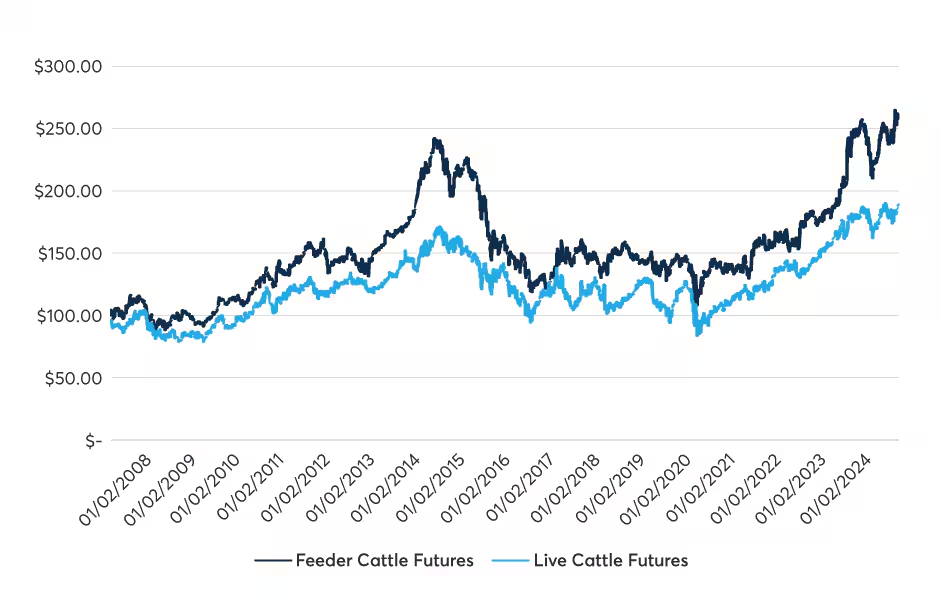

## Table of Contents

## What is the CME Group?

The CME Group is a company that runs a big marketplace where people and businesses can buy and sell things like futures and options. These are special kinds of contracts that help people manage risks or make investments. The company started in Chicago and is now one of the biggest places in the world for trading these kinds of contracts.

The CME Group helps people trade in many different areas, like farming products, energy, metals, and even things like interest rates and stock indexes. They use computers and special trading systems to make sure everything happens quickly and fairly. This helps farmers, energy companies, and investors all around the world to plan better and protect themselves from big changes in prices.

## What are Live Cattle Futures?

Live Cattle Futures are contracts that let people buy or sell cattle at a set price for delivery in the future. They are traded on the CME Group's marketplace. Farmers and ranchers use these futures to protect themselves from big changes in cattle prices. If they think prices might go down, they can sell a futures contract now and lock in a good price for their cattle later.

People who don't raise cattle, like investors, can also trade Live Cattle Futures. They might buy or sell these contracts to try and make money from changes in cattle prices. Trading these futures helps everyone in the cattle industry plan better because it gives them a way to manage the risk of price changes.

## How does trading Live Cattle Futures work on the CME Group?

Trading Live Cattle Futures on the CME Group is like making a deal to buy or sell cattle at a certain price in the future. When you trade these futures, you're not actually buying the cows right away. Instead, you're agreeing on a price now for cows that will be delivered later. This helps farmers and ranchers because they can lock in a price today, even if they won't sell their cattle for months. If they think prices might drop, they can sell a futures contract now and feel safer about their future earnings.

The CME Group makes it easy to trade these futures using computers and special trading systems. You can buy or sell Live Cattle Futures on their marketplace, which is open during certain hours each day. When you trade, you need to put down a bit of money as a deposit, called margin. This shows you're serious about the deal. If the price of cattle goes up or down, the value of your futures contract changes too. This way, both farmers and investors can manage the risk of price changes and plan better for the future.

## What are the benefits of trading Live Cattle Futures?

Trading Live Cattle Futures can help farmers and ranchers a lot. They can use these futures to lock in a good price for their cattle before they even sell them. This is really helpful because cattle prices can go up and down a lot. By selling a futures contract, farmers can feel safer about their money. They won't have to worry as much if prices drop suddenly because they already set a price they're happy with.

Investors can also benefit from trading Live Cattle Futures. They can buy or sell these contracts to try and make money from changes in cattle prices. If they think prices will go up, they can buy a futures contract now and sell it later for more money. This way, investors can make profits without having to own any actual cows. Trading these futures helps everyone in the cattle industry because it makes the market more stable and predictable.

## What are the risks associated with Live Cattle Futures trading?

Trading Live Cattle Futures can be risky because the prices of cattle can change a lot. If you buy a futures contract and the price of cattle goes down, you might lose money. For example, if you agree to buy cattle at a high price and then the market price drops, you'll have to pay more than what the cattle are worth. This can be a big problem, especially if you don't have a lot of money to cover the losses.

Another risk is that trading futures involves using something called margin, which is like a deposit. If the price moves against you, you might need to add more money to your account to keep your position open. This is called a margin call. If you can't add more money, your position might be closed, and you could lose what you've already put in. It's important to understand these risks and be ready to handle them before you start trading Live Cattle Futures.

## How do Live Cattle Futures prices influence the cattle industry?

Live Cattle Futures prices can really change how people in the cattle industry do things. When these futures prices go up, it usually means that people think cattle prices will be higher in the future. This can make farmers and ranchers feel good because they can sell their cattle for more money. They might decide to keep their cattle longer, hoping to get a better price later. Also, if futures prices are high, it might encourage more people to start raising cattle because they think they can make more money.

On the other hand, if Live Cattle Futures prices go down, it can make things harder for people in the cattle industry. Lower futures prices mean that people expect cattle prices to drop in the future. This can make farmers and ranchers worried because they might have to sell their cattle for less money than they hoped. They might decide to sell their cattle sooner, before prices drop even more. Lower futures prices can also make it less appealing for new people to get into the cattle business because they might not see it as a good way to make money.

## What are the contract specifications for Live Cattle Futures on the CME Group?

Live Cattle Futures on the CME Group have some important details that everyone trading them needs to know. Each contract is for 40,000 pounds of live cattle. That's a lot of cattle! The price of the contract is based on cents per pound, and the smallest change in price, called a tick, is 0.025 cents per pound. That might not sound like much, but it adds up to $10 for the whole contract. The contracts are traded in certain months, like February, April, June, August, October, and December. This helps people plan when they want to buy or sell.

Trading hours for Live Cattle Futures are split into two parts. The first part is from 9:05 a.m. to 1:00 p.m. Central Time, and the second part is from 2:00 p.m. to 4:00 p.m. Central Time. This gives people plenty of time to make their trades. When you start trading, you need to put down some money as a deposit, called the initial margin. This can change, but it's usually a few thousand dollars. If the price moves a lot, you might need to add more money to your account to keep your position open. This is called a margin call. Knowing these details helps traders make smart choices when they're dealing with Live Cattle Futures.

## How can one start trading Live Cattle Futures on the CME Group?

To start trading Live Cattle Futures on the CME Group, you first need to open an account with a futures broker. This broker will help you buy and sell futures contracts. Make sure to choose a broker that is registered with the CME Group and has a good reputation. Once you have an account, you'll need to deposit some money as an initial margin. This is like a deposit to show you're serious about trading. The amount can change, but it's usually a few thousand dollars.

After setting up your account and depositing the margin, you can start trading. You'll use the broker's trading platform to buy or sell Live Cattle Futures contracts. These contracts are for 40,000 pounds of live cattle and are priced in cents per pound. The trading hours are split into two sessions each day, so you can make trades during those times. Remember, the price of cattle can go up or down, so you need to keep an eye on your trades and be ready to add more money if there's a margin call.

## What are the margin requirements for Live Cattle Futures?

To start trading Live Cattle Futures, you need to put down some money as an initial margin. This is like a deposit to show you're serious about trading. The initial margin for Live Cattle Futures can change, but it's usually a few thousand dollars. This money is held by your broker to make sure you can cover any losses if the price of cattle goes down.

If the price of cattle moves a lot, you might need to add more money to your account. This is called a margin call. If you don't add more money when asked, your broker might close your position, and you could lose the money you've already put in. It's important to keep an eye on your trades and be ready to add more money if needed.

## How do seasonal trends affect Live Cattle Futures?

Seasonal trends can really change how Live Cattle Futures prices move. In the cattle industry, there are times of the year when more cattle are ready to be sold. This usually happens in the fall, after the cows have had a chance to grow over the summer. When a lot of cattle are ready at the same time, it can make prices go down because there are more cows to buy. On the other hand, in the spring, there might be fewer cattle ready to sell, which can make prices go up because there aren't as many cows available.

People who trade Live Cattle Futures need to know about these seasonal changes. If they think prices will go down in the fall because of more cattle, they might sell futures contracts now to lock in a good price. Or, if they think prices will go up in the spring because there are fewer cattle, they might buy futures contracts to try and make money from the higher prices. Understanding these seasonal trends helps traders make smarter choices and plan better for what might happen in the future.

## What advanced trading strategies can be used with Live Cattle Futures?

One advanced trading strategy for Live Cattle Futures is called spreading. This means buying one futures contract and selling another at the same time. For example, you might buy a contract for cattle to be delivered in June and sell a contract for cattle to be delivered in August. This can help you make money from the difference in prices between the two months. Spreading can be a good way to manage risk because it's less about guessing if prices will go up or down and more about the difference between two prices.

Another strategy is using options on Live Cattle Futures. Options give you the right, but not the obligation, to buy or sell a futures contract at a certain price. You can use options to protect yourself from big price changes. For example, if you're worried that cattle prices might drop, you can buy a put option. This lets you sell your futures contract at a set price even if the market price goes lower. Options can be a bit more complicated, but they can help you manage risk better and maybe make money in different ways.

A third strategy is called technical analysis. This involves looking at past price data to try and predict where prices might go next. Traders using this strategy might look for patterns or use special tools like moving averages to help them decide when to buy or sell. Technical analysis can be tricky because it's not always right, but many traders use it to help them make better decisions about when to enter or [exit](/wiki/exit-strategy) the market.

## How do global economic factors impact Live Cattle Futures on the CME Group?

Global economic factors can really change the prices of Live Cattle Futures on the CME Group. When the world economy is doing well, people might have more money to spend on things like beef. This can make the demand for cattle go up, which can push Live Cattle Futures prices higher. On the other hand, if the economy is not doing so well, people might not want to spend as much on beef. This can make the demand for cattle go down, and Live Cattle Futures prices might drop.

Also, things like exchange rates and trade policies can affect Live Cattle Futures. If the U.S. dollar gets stronger, it might make U.S. beef more expensive for people in other countries. This can lower the demand for U.S. cattle and affect futures prices. Trade policies, like tariffs or trade agreements, can also change how much beef is bought and sold around the world. If a new trade deal makes it easier to sell beef to other countries, it might make Live Cattle Futures prices go up. But if there are new tariffs that make it harder to sell beef, prices might go down.

## References & Further Reading

[1]: CME Group. (n.d.). ["Live Cattle Futures and Options"](https://www.cmegroup.com/markets/agriculture/livestock/live-cattle.html). Retrieved from CME Group website.

[2]: Bartolini, R. (2019). ["Algorithmic Trading and Financial Markets: The Impact of Algorithms on Market Dynamics"](https://www.researchgate.net/publication/378548435_Algorithmic_Trading_and_AI_A_Review_of_Strategies_and_Market_Impact). Springer International Publishing.

[3]: Lopez de Prado, M. (2018). ["Advances in Financial Machine Learning"](https://www.amazon.com/Advances-Financial-Machine-Learning-Marcos/dp/1119482089). Wiley.

[4]: Chan, E. P. (2009). ["Quantitative Trading: How to Build Your Own Algorithmic Trading Business"](https://github.com/ftvision/quant_trading_echan_book). Wiley Trading Series.

[5]: Jansen, S. (2018). ["Machine Learning for Algorithmic Trading: Predictive Models to Extract Signals from Market and Alternative Data for Systematic Trading Strategies"](https://www.amazon.com/Machine-Learning-Algorithmic-Trading-alternative/dp/1839217715). Packt Publishing.

[6]: Aronson, D. R. (2006). ["Evidence-Based Technical Analysis: Applying the Scientific Method and Statistical Inference to Trading Signals"](https://www.amazon.com/Evidence-Based-Technical-Analysis-Scientific-Statistical/dp/0470008741). Wiley Trading Series.

[7]: Commodity Futures Trading Commission (CFTC). (n.d.). ["Regulation of Algorithmic Trading"](https://www.cftc.gov/). Retrieved from CFTC website.