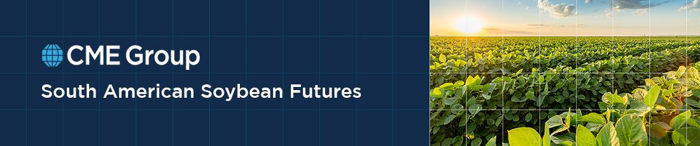

## Table of Contents

## What is the CME Group?

The CME Group is a company that runs a big marketplace where people and businesses can buy and sell things like futures and options. These are special kinds of contracts that help people predict and manage the prices of things like crops, oil, and metals. The company started in Chicago and is now one of the biggest places in the world for trading these kinds of contracts.

The CME Group helps farmers, companies, and investors by giving them a place to make deals that can protect them from big price changes. For example, a farmer can use the CME Group to make sure they get a good price for their crops, even if the market price goes down later. This helps everyone plan better and feel more secure about their money.

## What are soybeans and why are they important?

Soybeans are small, round beans that come from a plant in the pea family. They are usually yellow, but can also be black, brown, or green. People grow soybeans all over the world, especially in places like the United States, Brazil, and Argentina. Soybeans are important because they can be turned into many different things. They can be made into food like tofu, soy milk, and soy sauce. They can also be used to feed animals, make oil for cooking, and even be turned into biofuel for cars.

Soybeans are also important for the environment. They help put nutrients back into the soil, which makes it better for growing other crops. This is good for farmers because it means they can grow more food on their land. Soybeans are also a big part of international trade. Countries buy and sell a lot of soybeans, which helps their economies grow. Because soybeans are so useful and important, many people pay close attention to their prices and how much is being grown around the world.

## How does the CME Group facilitate soybeans trading?

The CME Group helps people trade soybeans by giving them a place to buy and sell soybean futures and options. These are special contracts that let farmers, food companies, and investors agree on a price for soybeans they will buy or sell in the future. This helps them protect themselves from big changes in soybean prices. For example, a farmer can use these contracts to make sure they get a good price for their soybeans, even if the market price goes down later.

The CME Group makes trading easier by having a big, organized marketplace where everyone can see the prices and make their deals. They also provide a lot of information about soybean prices and how the market is doing. This helps everyone make better decisions about when to buy or sell. By doing all this, the CME Group helps keep the soybean market running smoothly and helps farmers and businesses plan for the future.

## What are the basic steps to start trading soybeans on the CME Group?

To start trading soybeans on the CME Group, you first need to open an account with a broker that is connected to the CME Group. This broker will help you buy and sell soybean futures and options. You'll need to fill out some forms and give the broker information about yourself. Once your account is set up, you'll need to put some money into it. This money is called margin, and it's like a deposit that you use to trade.

After you have your account and money ready, you can start trading. You'll use the broker's trading platform to look at soybean prices and decide when to buy or sell. You can choose to buy soybean futures, which means you agree to buy soybeans at a set price in the future, or soybean options, which give you the choice to buy or sell soybeans at a set price. As you trade, you'll need to keep an eye on your account and make sure you have enough money to cover your trades. The CME Group provides a lot of information and tools to help you make good trading decisions.

## What are the different types of soybean contracts available on the CME Group?

The CME Group offers different types of soybean contracts to help people trade. The main type is soybean futures contracts. These are agreements to buy or sell a certain amount of soybeans at a set price on a future date. They help farmers, food companies, and investors plan ahead and protect themselves from big price changes. Another type is soybean options contracts. These give you the right, but not the obligation, to buy or sell soybeans at a set price before a certain date. Options can be a bit more flexible and can be used in different ways to manage risk or make money.

There are also mini soybean futures contracts. These are smaller versions of the regular soybean futures and are good for people who want to trade smaller amounts. They work the same way as regular futures but are easier to handle for smaller traders. Lastly, the CME Group offers soybean meal and soybean oil futures and options. These are for trading the parts of soybeans that are used to make animal feed and cooking oil. These contracts help people in those industries manage their costs and plan for the future.

## How do soybean futures work and what are their benefits?

Soybean futures are special agreements where people agree to buy or sell soybeans at a set price on a future date. They are traded on places like the CME Group. For example, a farmer might sell a soybean future to lock in a good price for their crop before they even harvest it. On the other hand, a food company might buy a soybean future to make sure they can buy soybeans at a price they can afford, even if prices go up later. The price of soybean futures changes every day based on what people think will happen to soybean prices in the future.

The benefits of soybean futures are that they help people plan and manage risk. For farmers, they can protect against falling prices. If the market price drops after they sell a future, they still get the higher price they locked in. For buyers, like food companies, futures can protect against rising prices. If the market price goes up, they still pay the lower price they agreed on. This makes it easier for everyone to budget and plan their business. Plus, trading soybean futures can also be a way for investors to make money if they guess right about future prices.

## What factors influence soybean prices on the CME Group?

Soybean prices on the CME Group are affected by many things. One big thing is how much soybeans are being grown around the world. If there's a lot of soybeans, prices might go down because there's more to sell. But if there's a bad harvest and not enough soybeans, prices can go up because everyone wants them but there's not enough to go around. The weather is really important too. If it's too dry or too wet, it can hurt the soybean plants and change how many soybeans are produced. Also, what other countries are doing matters. If a big country like China decides to buy a lot of soybeans, that can push prices up because there's more demand.

Another thing that influences soybean prices is what's happening with other crops and products. If the price of corn or wheat changes, it can affect soybeans because farmers might decide to grow more of those crops instead. The price of oil is important too, because soybeans can be turned into biofuel. If oil prices go up, it might make soybeans more valuable because people want to use them for fuel. Finally, what people think will happen in the future can move prices. If traders think soybean prices will go up later, they might buy futures now, which can push prices up right away. All these things together make soybean prices go up and down on the CME Group.

## How can one analyze soybean market trends using CME Group data?

To analyze soybean market trends using CME Group data, you need to look at the prices of soybean futures and options. The CME Group has a lot of information on their website and trading platforms that show how soybean prices have changed over time. You can see daily, weekly, and monthly price charts that help you understand if prices are going up, down, or staying the same. It's also important to look at trading volumes, which tell you how many contracts are being bought and sold. High trading volumes can mean that a lot of people think the price will change soon.

Another way to analyze soybean market trends is by looking at reports from the CME Group, like the Commitments of Traders (COT) report. This report shows what different kinds of traders, like farmers, food companies, and investors, are doing in the market. If you see that a lot of big traders are buying soybean futures, it might mean they think prices will go up. You can also use technical analysis tools on the CME Group's platform to see patterns in the price charts. These patterns can help you guess what might happen next with soybean prices. By putting all this information together, you can get a good idea of where the soybean market is heading.

## What are the risks associated with trading soybeans on the CME Group?

Trading soybeans on the CME Group can be risky because prices can go up and down a lot. If you buy a soybean future and the price goes down, you could lose money. The same is true if you sell a future and the price goes up. This is called market risk, and it's something everyone who trades has to think about. Another risk is called [liquidity](/wiki/liquidity-risk-premium) risk. This happens when there aren't enough people buying and selling, so it's hard to make a trade at the price you want. This can make it harder to get out of a trade if you need to.

There's also something called margin risk. When you trade futures, you have to put down a deposit called margin. If the price moves against you, you might have to put in more money to keep your trade open. If you can't do that, your broker might close your trade, and you could lose money. Plus, there's the risk that comes from things you can't control, like the weather or what other countries are doing. These things can change soybean prices in ways that are hard to predict. So, it's important to understand these risks and be ready for them before you start trading soybeans on the CME Group.

## What advanced trading strategies can be used for soybean futures on the CME Group?

One advanced trading strategy for soybean futures on the CME Group is called spread trading. This is when you buy one soybean future and sell another one at the same time. The idea is to make money from the difference in prices between the two futures, instead of betting on whether the price will go up or down. For example, you might buy a soybean future for a nearby month and sell one for a later month. If the difference in prices between those two months gets bigger, you can make money. This can be less risky than just buying or selling one future because it can help protect you if the overall soybean market goes down.

Another strategy is called options trading. With soybean options, you can buy the right to buy or sell soybeans at a set price in the future. This gives you more flexibility than just trading futures. You can use options to make money if you think soybean prices will go up, down, or stay the same. For example, you might buy a call option if you think prices will go up, or a put option if you think they will go down. You can also use options to protect yourself from big price changes. This is called hedging, and it can help you manage risk better. Both spread trading and options trading can be more complicated, but they give you more ways to make money and manage risk in the soybean market.

## How does the CME Group's soybean trading impact global agricultural markets?

The CME Group's soybean trading helps set the price of soybeans all around the world. When people buy and sell soybean futures and options on the CME Group, it shows what everyone thinks soybean prices will be in the future. This information is very important for farmers, food companies, and countries that buy and sell a lot of soybeans. If the price of soybean futures goes up on the CME Group, it can make soybean prices go up everywhere. This can make farmers want to grow more soybeans because they can make more money. But it can also make it harder for food companies to buy soybeans because they have to pay more.

The CME Group also helps make the global soybean market more stable. By giving everyone a place to buy and sell soybean futures and options, the CME Group helps farmers and food companies plan better. Farmers can use futures to make sure they get a good price for their soybeans, even if the market price goes down later. Food companies can use futures to make sure they can buy soybeans at a price they can afford, even if the market price goes up. This helps everyone feel more secure about their money and makes the soybean market work better. When the soybean market is stable, it helps the whole world have enough food and keep prices from changing too much.

## What regulatory considerations should be noted when trading soybeans on the CME Group?

When you trade soybeans on the CME Group, you need to follow rules set by different groups. The main group is the Commodity Futures Trading Commission (CFTC). They make sure that trading is fair and that people don't do things like lie about prices or try to trick others. The CME Group also has its own rules that you have to follow. These rules help keep the market safe and make sure everyone can trade without problems. If you don't follow these rules, you could get in trouble, like having to pay a fine or not being allowed to trade anymore.

Another important thing to know is about taxes. When you make money from trading soybeans, you have to pay taxes on it. The rules about how much you pay and when you pay it can be different depending on where you live. It's a good idea to talk to someone who knows about taxes to make sure you do everything right. Also, if you're trading from another country, you might have to follow rules from that country too. So, it's important to understand all the rules before you start trading soybeans on the CME Group.

## References & Further Reading

[1]: CME Group. ["CME Group Overview"](https://www.cmegroup.com/company/visit/files/cme-group-overview.pdf).  

[2]: CME Group. ["CME Globex Platform"](https://www.cmegroup.com/globex.html).  

[3]: Hull, J. C. (2017). ["Options, Futures, and Other Derivatives"](https://www.pearson.com/en-us/subject-catalog/p/options-futures-and-other-derivatives/P200000005938/9780136939917). Pearson Education.

[4]: Lopez de Prado, M. (2018). ["Advances in Financial Machine Learning"](https://www.amazon.com/Advances-Financial-Machine-Learning-Marcos/dp/1119482089). John Wiley & Sons.

[5]: Chan, E. P. (2009). ["Quantitative Trading: How to Build Your Own Algorithmic Trading Business"](https://github.com/ftvision/quant_trading_echan_book). John Wiley & Sons.  

[6]: Scholtes, S. (2013). ["From Pits to Bits: The Global Revolution in Computing and Communication"](https://books.google.com/books/about/Out_of_the_Pits.html?id=sWNf0gcaFlIC). MIT Press.  

[7]: Hull, J. C. (2019). ["Risk Management and Financial Institutions"](https://www.amazon.com/Management-Financial-Institutions-Wiley-Finance/dp/1119932483). John Wiley & Sons.  

[8]: Commodity Futures Trading Commission. ["Commitments of Traders Report"](https://www.cftc.gov/MarketReports/CommitmentsofTraders/index.htm).  

[9]: Aldridge, I. (2013). ["High-Frequency Trading: A Practical Guide to Algorithmic Strategies and Trading Systems"](https://www.ahmetbeyefendi.com/wp-content/uploads/2020/07/High-Frequency-Trading-Irene-Aldridge.pdf). John Wiley & Sons.