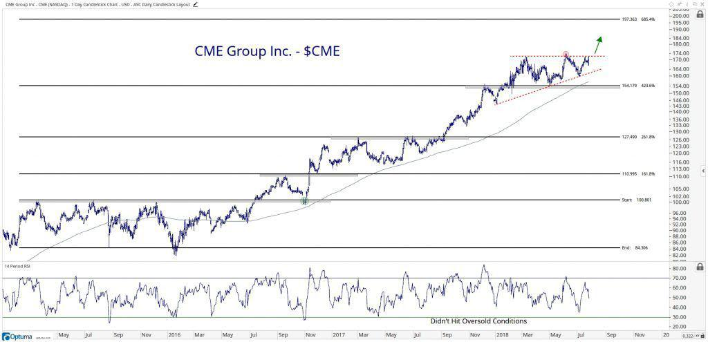

## Table of Contents

## What are stock index futures?

Stock index futures are contracts that allow investors to buy or sell a stock index at a future date for a set price. A stock index, like the S&P 500 or the Dow Jones, is a way to measure the performance of a group of stocks. When you trade stock index futures, you're not buying the actual stocks in the index, but rather betting on whether the index will go up or down.

These futures are useful for investors who want to hedge against potential losses in their stock portfolios. For example, if an investor thinks the market might drop, they can buy a futures contract that will gain value if the index falls. This can help offset any losses in their stock holdings. Stock index futures are also used by traders who want to speculate on market movements without owning the underlying stocks. They can be traded on exchanges like the Chicago Mercantile Exchange, making them accessible to many investors.

## What is the CME Group and what role do they play in stock index futures?

The CME Group is a company that runs a big marketplace where people can trade different kinds of financial products, like stock index futures. It's like a huge store where instead of buying things like clothes or food, people buy and sell contracts that are based on the value of stock indexes, like the S&P 500 or the Dow Jones. The CME Group makes sure that these trades happen smoothly and fairly.

In the world of stock index futures, the CME Group plays a very important role. They help people who want to use these futures to protect their investments or to guess how the market will move. The CME Group makes sure that there are always enough buyers and sellers, and they set the rules for how these trades should happen. This helps keep the market stable and trustworthy for everyone who uses it.

## How do CME Group stock index futures work?

CME Group stock index futures are contracts where people agree to buy or sell a stock index, like the S&P 500, at a set price on a future date. These contracts are traded on the CME Group's marketplace. When someone buys a futures contract, they're betting that the stock index will go up. If it does, they can sell the contract later for more money than they paid for it. On the other hand, if someone sells a futures contract, they're betting that the stock index will go down. If it does, they can buy it back later for less money than they sold it for.

These futures are useful for people who want to protect their stock investments. For example, if someone owns stocks and thinks the market might drop, they can buy a futures contract. If the market does drop, the value of the futures contract will go up, which can help make up for the money they lose on their stocks. The CME Group makes sure that these trades happen smoothly and fairly. They set the rules and make sure there are enough buyers and sellers, which helps keep the market stable and trustworthy for everyone.

## What are the main stock index futures products offered by the CME Group?

The CME Group offers several main stock index futures products that people can trade. One of the most popular is the E-mini S&P 500, which is based on the S&P 500 index. This index includes 500 of the biggest companies in the U.S., so it's a good way to bet on how the overall market is doing. Another popular product is the E-mini Nasdaq-100, which is based on the Nasdaq-100 index. This index includes 100 of the biggest non-financial companies listed on the Nasdaq stock exchange, so it's a good way to bet on how technology and other growth companies are doing.

The CME Group also offers the E-mini Dow, which is based on the Dow Jones Industrial Average. This index includes 30 big companies in the U.S., so it's another way to bet on the overall market. In addition to these, the CME Group offers the E-mini Russell 2000, which is based on the Russell 2000 index. This index includes 2000 small companies in the U.S., so it's a good way to bet on how small companies are doing. All of these products help people protect their investments or guess how the market will move.

## What are the benefits of trading CME Group stock index futures?

Trading CME Group stock index futures can be really helpful for people who want to protect their stock investments. If someone thinks the market might go down, they can buy a futures contract. If the market does drop, the value of the futures contract will go up, which can help make up for the money they lose on their stocks. This is called hedging, and it's like buying insurance for your investments. The CME Group makes sure these trades happen smoothly and fairly, so people can feel safe using their platform.

Another benefit is that people can use stock index futures to guess how the market will move without having to buy the actual stocks. This is called speculating, and it can be a way to make money if you're good at predicting market trends. The CME Group offers different kinds of futures, like the E-mini S&P 500 or the E-mini Nasdaq-100, so people can choose the one that fits their strategy. Plus, the CME Group is a big and trusted marketplace, so it's easy to find buyers and sellers, making it easier to trade.

## How can beginners start trading CME Group stock index futures?

To start trading CME Group stock index futures, beginners first need to open an account with a brokerage firm that offers futures trading. This can be done online, and you'll need to provide some personal information and maybe some money to get started. Once your account is set up, you can look at the different stock index futures offered by the CME Group, like the E-mini S&P 500 or the E-mini Nasdaq-100. It's a good idea to learn about these products and how they work before you start trading.

After you've chosen which futures you want to trade, you can place your first order through your brokerage's trading platform. It's important to start small and only trade with money you can afford to lose. The CME Group has a lot of resources and tools to help beginners learn more about futures trading, so it's a good idea to use these to get better at trading. Remember, trading futures can be risky, so always be careful and keep learning.

## What are the risks associated with trading CME Group stock index futures?

Trading CME Group stock index futures can be risky because the prices can change a lot in a short time. If you guess wrong about which way the market will go, you could lose a lot of money. For example, if you buy a futures contract betting that the S&P 500 will go up, but it goes down instead, you'll lose money on that trade. Also, futures trading often uses something called leverage, which means you can trade with more money than you actually have. This can make your profits bigger, but it can also make your losses bigger if things don't go your way.

Another risk is that trading futures can be complicated. It's not like buying stocks where you own a piece of a company. With futures, you're betting on the future value of an index, and that can be hard to predict. If you don't fully understand how futures work, you might make mistakes that cost you money. It's important to learn as much as you can and maybe even practice with a demo account before you start trading with real money.

## How do market conditions affect CME Group stock index futures?

Market conditions can really change how CME Group stock index futures move. When the overall stock market is doing well, like when people are buying a lot of stocks and the prices are going up, the value of stock index futures usually goes up too. This is because futures are based on stock indexes like the S&P 500, and if the stocks in that index are doing well, the futures tied to it will also do well. On the other hand, if the market is not doing so well, like when people are selling a lot of stocks and prices are going down, the value of stock index futures will usually go down too.

Economic news and events can also have a big impact on stock index futures. For example, if there's good news about the economy, like lower unemployment or higher company profits, people might think the market will go up, so they'll buy more futures. But if there's bad news, like a big company going bankrupt or a drop in consumer spending, people might think the market will go down, so they'll sell their futures. These reactions to market conditions can make the prices of futures go up and down a lot, which is something traders need to keep an eye on.

## What advanced trading strategies can be used with CME Group stock index futures?

One advanced strategy for trading CME Group stock index futures is called "spreading." This involves buying and selling different futures contracts at the same time to reduce risk. For example, you might buy a futures contract for the S&P 500 and sell a futures contract for the Nasdaq-100. The idea is that if one index goes down, the other might go up, so you can make money no matter which way the market moves. Spreading can be a good way to protect your investments, but it can also be complicated and takes a lot of practice to get right.

Another strategy is called "[scalping](/wiki/gamma-scalping)." This is when you make a lot of small trades in a short amount of time, trying to make a little bit of money on each one. Scalpers look for small changes in the price of futures and try to buy low and sell high as quickly as possible. This strategy can be exciting and can make money if you're good at it, but it's also risky because the market can change very quickly. You need to be really focused and have a good understanding of how futures work to be successful with scalping.

## How does the CME Group ensure the integrity and transparency of their stock index futures markets?

The CME Group works hard to make sure that trading stock index futures is fair and open for everyone. They do this by setting clear rules that everyone has to follow. These rules help prevent people from doing things that could cheat others or mess up the market. The CME Group also watches the market all the time to make sure no one is breaking the rules. If someone does something wrong, the CME Group can punish them to keep the market safe and fair.

Another way the CME Group keeps things transparent is by giving everyone the same information. They show the prices of futures contracts and how many are being traded in real-time, so everyone can see what's happening. This helps people make good choices about buying and selling futures. The CME Group also has a lot of reports and data that anyone can look at, which helps people understand how the market is doing and makes it easier to trust that the market is working the way it should.

## What are the historical performance trends of CME Group stock index futures?

The historical performance of CME Group stock index futures has shown a lot of ups and downs over the years, often following the general trends of the stock market. For example, during times when the economy was doing well, like in the late 1990s and mid-2010s, the value of stock index futures like the E-mini S&P 500 went up a lot. This is because these futures are tied to stock indexes, so when the stocks in those indexes do well, the futures do well too. On the other hand, during economic downturns, like the financial crisis in 2008 or the early days of the COVID-19 pandemic in 2020, the value of stock index futures dropped sharply. These big changes show how closely futures are linked to the overall health of the economy.

Looking at longer trends, the value of CME Group stock index futures has generally grown over time, matching the long-term growth of the stock market. However, the path has not been smooth, with lots of short-term ups and downs. Traders and investors need to keep an eye on these trends to make smart choices about buying and selling futures. By understanding how stock index futures have performed in the past, people can better predict what might happen in the future and use that knowledge to protect their investments or try to make money.

## How do global economic events influence CME Group stock index futures?

Global economic events can have a big impact on CME Group stock index futures. When something important happens in the world, like a change in interest rates by a big country like the United States or news about trade deals between countries, it can make people think differently about the future of the economy. If the news is good, like a new trade agreement that helps businesses, people might buy more futures because they think the market will go up. But if the news is bad, like a war or a big company going bankrupt, people might sell their futures because they think the market will go down.

These reactions to global events can cause the prices of stock index futures to change a lot. For example, when the COVID-19 pandemic started in early 2020, a lot of people got scared and sold their futures, which made the prices drop a lot. But as governments and companies found ways to deal with the crisis, people started buying futures again, and the prices went back up. So, traders need to keep an eye on what's happening around the world because it can affect their trades in big ways.

## References & Further Reading

[1]: Bergstra, J., Bardenet, R., Bengio, Y., & Kégl, B. (2011). ["Algorithms for Hyper-Parameter Optimization."](https://dl.acm.org/doi/10.5555/2986459.2986743) Advances in Neural Information Processing Systems 24.

[2]: ["Advances in Financial Machine Learning"](https://www.amazon.com/Advances-Financial-Machine-Learning-Marcos/dp/1119482089) by Marcos Lopez de Prado

[3]: ["Evidence-Based Technical Analysis: Applying the Scientific Method and Statistical Inference to Trading Signals"](https://www.amazon.com/Evidence-Based-Technical-Analysis-Scientific-Statistical/dp/0470008741) by David Aronson

[4]: ["Machine Learning for Algorithmic Trading"](https://github.com/stefan-jansen/machine-learning-for-trading) by Stefan Jansen

[5]: ["Quantitative Trading: How to Build Your Own Algorithmic Trading Business"](https://www.amazon.com/Quantitative-Trading-Build-Algorithmic-Business/dp/1119800064) by Ernest P. Chan