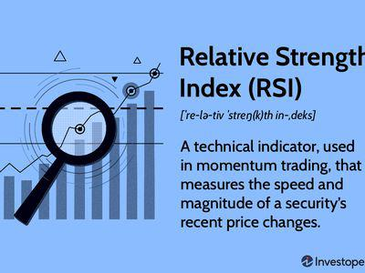

The world of financial markets is a dynamic ecosystem characterized by constant evolution and complexity. A profound understanding of foundational concepts like technical analysis is essential for navigating this intricate landscape. Technical analysis, a methodology for evaluating financial markets and forecasting future price movements, primarily relies on historical data, price patterns, and market trends. The CMT Association, a leading authority in this field, plays a pivotal role by promoting the education and development of market professionals through its Chartered Market Technician (CMT) designation. This article will discuss the significance of both the CMT Association and the CMT designation in enhancing analytical capabilities within the financial industry.

In recent years, technical analysis has undergone significant transformation, further solidifying its importance in the realm of algorithmic trading. The integration of technical analysis into algorithmic models empowers traders to interpret complex market patterns and indicators efficiently. This fusion of traditional analysis with cutting-edge technology reflects the evolution of financial markets, providing traders with a sophisticated toolset for informed decision-making. 



Understanding the role of organizations such as the CMT Association is of utmost importance for individuals pursuing careers in finance and trading. These entities foster a rigorous educational framework that encourages the acquisition of essential knowledge and ethical standards needed in the industry. By embracing the principles and expertise offered through the CMT program, aspiring professionals can gain a competitive edge. This article will explore how these elements collectively empower market practitioners, enabling them to thrive in a continuously evolving financial environment.

## Table of Contents

## Overview of the CMT Association

The CMT Association, originally known as the Market Technicians Association, stands as the leading professional organization committed to advancing technical analysis within the financial sector. This association has progressively expanded from its initial foundation to foster a global community of market professionals dedicated to the advancement and application of technical analysis.

A cornerstone of the CMT Association's mission is the promotion of education and professional development among its members and the broader financial community. Central to this is the Chartered Market Technician (CMT) program, a comprehensive curriculum designed to provide individuals with a structured, self-study [course](/wiki/best-algorithmic-trading-courses) to gain mastery in technical analysis. The program's rigorous framework aims to equip candidates with an in-depth understanding of market principles, ensuring proficiency in technical strategies and methodologies.

The philosophy of the CMT Association reflects a cohesive integration of behavioral economics and quantitative market research. This blend underscores the association’s commitment to holistic financial education, emphasizing not only the traditional aspects of technical analysis, such as chart patterns and indicators but also incorporating elements that consider market psychology and behavioral patterns. The adoption of quantitative metrics further supports the analytical aptitudes of professionals, enhancing their ability to develop evidence-based strategies and make informed decisions within complex market environments.

Overall, the CMT Association serves as a pivotal institution for those seeking to deepen their expertise in technical analysis and contribute to the evolution of financial markets globally. Through its educational initiatives and promotion of ethical and professional standards, the Association continues to uphold the integrity and advancement of technical analysis as a core financial discipline.

## The Chartered Market Technician (CMT) Designation

The Chartered Market Technician (CMT) designation stands as a highly respected credential within the field of technical analysis, serving as a benchmark for expertise in this discipline. Achieving the CMT charter entails passing a comprehensive examination process structured across three levels, each designed to progressively deepen the candidate's understanding and analytical skills.

The Level I examination primarily covers a broad range of introductory topics essential for financial market analysis, including basic concepts of technical analysis, chart construction, and technical market indicators. It lays a foundational framework which is built upon in the subsequent levels.

Level II elevates the complexity by focusing on the application of concepts covered in Level I, with an emphasis on price-pattern recognition, trend analysis, and trading management. This level also introduces more sophisticated tools and techniques such as advanced statistical methods and intermarket analysis, enabling candidates to develop a more nuanced understanding of market dynamics.

The culmination of the program, Level III, challenges candidates to integrate and synthesize their knowledge through a practical, real-world lens. This includes the exploration of behavioral finance, which addresses how psychological factors can impact market participants and trading systems performance. Instruction in trading-systems testing is also provided, helping candidates develop evidence-based strategies that are both robust and adaptable in diverse market conditions.

Across all levels, the CMT program emphasizes the importance of ethical behavior and reinforces the necessity for compliance with the highest professional standards. It instills a thorough understanding of market psychology and quantitative techniques—critical components for crafting informed and strategic decisions in trading.

Upon successful completion, CMT charterholders are recognized for their ability to provide in-depth market analysis and develop trading strategies grounded in empirical evidence. Equipped with a comprehensive toolkit of analytical techniques, they are well-prepared to navigate the complexities of the financial markets and contribute significant value to their organizations and clients.

## Technical Analysis and Its Importance in Algo Trading

Technical analysis is a key component in the development of [algorithmic trading](/wiki/algorithmic-trading) systems, providing traders with the tools to analyze market patterns, signals, and trends effectively. At its core, technical analysis involves studying historical price movements and trading volumes to identify trends and make informed predictions about future price behavior. This approach enables traders to make data-driven decisions, thereby reducing the reliance on speculation.

Algorithmic trading, which automates trading processes using pre-defined rules and instructions, benefits significantly from the integration of technical analysis. By incorporating technical indicators such as moving averages, relative strength index (RSI), and Bollinger Bands, algorithmic systems can execute trades with precision and speed. These indicators, when combined with quantitative metrics like [volatility](/wiki/volatility-trading-strategies) and [momentum](/wiki/momentum), enhance the model's capacity to predict market movements accurately. 

For example, a simple moving average (SMA) strategy can be implemented using Python to provide buy or sell signals based on price crossovers:

```python
import pandas as pd
import numpy as np

# Sample price data
data = {'Date': pd.date_range(start='2020-01-01', periods=100),
        'Price': np.random.random(size=100) * 100}

df = pd.DataFrame(data)

# Calculate 20-day simple moving average
df['SMA_20'] = df['Price'].rolling(window=20).mean()

# Buy signal when price crosses above the SMA
df['Signal'] = np.where(df['Price'] > df['SMA_20'], 1, 0)  # 1 indicates buy, 0 indicates sell

print(df.head())
```

The Chartered Market Technician (CMT) program ensures traders gain a profound understanding of these principles. Participants are trained to recognize and interpret complex indicators, fostering skills that enhance their analytical capabilities. This training is crucial as robust technical analysis underpins effective decision-making in algorithmic trading, improving the accuracy and consistency of market strategies.

The synergy between technical analysis and algorithmic trading lies in the latter's ability to process large volumes of data and execute trades faster and more accurately than manual trading. For instance, algorithmic systems can continuously monitor multiple markets and execute trades based on real-time data analysis. When informed by technical analysis, these systems can identify profitable trading opportunities that might not be apparent through simple observation.

Moreover, the systematic approach intrinsic to algorithmic trading, amplified by technical analysis, helps mitigate emotional biases that often affect manual trading. This objectivity leads to more consistent performance, as decisions are based on empirical data rather than subjective judgment.

In conclusion, the application of technical analysis in algorithmic trading enhances the trader's ability to analyze and respond to shifting market dynamics swiftly. With the comprehensive training provided by the CMT program, traders are better equipped to leverage technical analysis, contributing to more effective and reliable trading systems.

## CMT Association and the Global Expansion of Technical Analysis

The CMT Association has established itself as a central hub for technical analysts on a global scale. With diverse members and chapters worldwide, the association is pivotal in fostering a network of knowledge-sharing opportunities and professional development for its members. This broad international presence ensures that technical analysis as a discipline gains recognition and relevance across various financial markets.

One notable aspect of the CMT Association's global footprint is its concentrated efforts in regions like India. There, the rising demand for specialized technical expertise has been met through targeted educational initiatives and active community engagement. By organizing conferences, workshops, and seminars, the association helps support the growing pool of market professionals seeking to enhance their analytical skills.

Moreover, the CMT Association's collaborations with international organizations have further bolstered the stature and dissemination of technical analysis. These strategic partnerships facilitate the exchange of cutting-edge research and best practices, thereby enriching the global conversation on technical market insights.

As financial markets worldwide become more complex and interconnected, the relevance of technical analysis continues to expand. Industries ranging from banking to fintech are increasingly recognizing the value of this analytical discipline in understanding market behavior and dynamics. As such, the CMT Association's role in promoting technical analysis is more crucial than ever, empowering professionals with the skills necessary to navigate the intricacies of modern financial landscapes effectively.

## Conclusion

The CMT Association significantly contributes to the global advancement of technical analysis, making it a cornerstone for financial professionals aiming to deepen their analytical prowess. The Chartered Market Technician (CMT) designation stands as a hallmark of competence, offering extensive benefits that encompass both professional recognition and enhanced analytical capabilities within the financial sector. Achieving this certification not only validates one's expertise in technical analysis but also equips professionals with the skills necessary to develop sophisticated, evidence-based trading strategies.

As algorithmic trading continues to gain prominence, the integration of technical analysis in this domain becomes paramount. The structured approach offered by the CMT program ensures that financial professionals are well-versed in market patterns, psychological dynamics, and quantitative techniques, thereby enhancing the effectiveness of algorithmic trading systems. This synergy between technical analysis and algorithmic trading fosters improved accuracy and consistency in market strategies.

The ongoing commitment of the CMT Association to educational excellence and professional standards plays a crucial role in the constantly evolving financial landscape. By supporting continuous learning and upholding ethical practices, the association empowers individuals to stay at the forefront of industry developments. Embracing technical analysis and pursuing credentials such as the CMT can accelerate a financial professional's career, opening new pathways in a dynamic global market.

## References & Further Reading

[1]: Schwager, J. D. (1993). ["The New Market Wizards: Conversations with America's Top Traders."](https://archive.org/details/newmarketwizards00jack) HarperBusiness.

[2]: Murphy, J. J. (1999). ["Technical Analysis of the Financial Markets: A Comprehensive Guide to Trading Methods and Applications."](https://archive.org/details/technicalanalysi0000murp) New York Institute of Finance.

[3]: Pring, M. J. (2002). ["Technical Analysis Explained: The Successful Investor's Guide to Spotting Investment Trends and Turning Points."](https://www.amazon.com/Technical-Analysis-Explained-Fifth-Successful/dp/0071825177) McGraw-Hill.

[4]: Nison, S. (2001). ["Japanese Candlestick Charting Techniques: A Contemporary Guide to the Ancient Investment Techniques of the Far East."](https://archive.org/details/japanesecandlest0000niso) Prentice Hall Press.

[5]: Kirkpatrick, C. D., & Dahlquist, J. R. (2010). ["Technical Analysis: The Complete Resource for Financial Market Technicians."](https://ptgmedia.pearsoncmg.com/images/9780134137049/samplepages/9780134137049.pdf) FT Press.

[6]: ["Technical Analysis and the Active Trader"](https://www.amazon.com/Technical-analysis-active-McGraw-Hill-Traders/dp/0071467912) by Gary Norden.

[7]: Elder, A. (2002). ["Come Into My Trading Room: A Complete Guide to Trading."](https://www.amazon.com/Come-Into-My-Trading-Room/dp/0471225347) John Wiley & Sons.

[8]: Collins, M., & Fabozzi, F. J. (1999). ["Technical Analysis: Value for the Practitioner."](https://www.semanticscholar.org/paper/A-Methodology-for-Measuring-Transaction-Costs-Collins-Fabozzi/5f6edc269fab6c955cfffa329a440db31cfe1f82) CFA Institute.