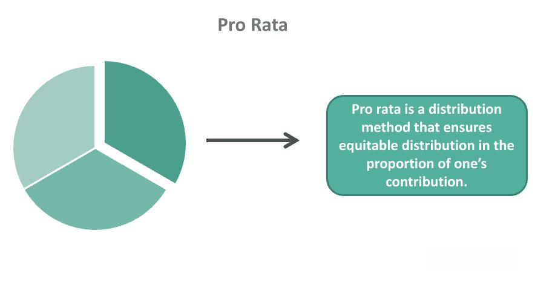

In the rapidly evolving financial markets, algorithmic trading is gaining a significant foothold, offering traders exceptional speed and efficiency. This approach utilizes complex algorithms and computer programs to execute trades based on predefined criteria, reducing the need for human intervention and allowing for rapid decision-making and execution. As technological advancements continue to transform the trading landscape, algorithmic trading enables market participants to capitalize on fleeting opportunities and respond to market changes in real-time.

CNBC Plus, as a subscription service, provides traders with critical insights, news, and analytical tools that can significantly enhance their algorithmic trading strategies. It delivers real-time financial information and in-depth analyses from seasoned market experts, which is indispensable for traders looking to optimize their trading algorithms. With the market's increasing reliance on data-driven strategies, platforms that offer comprehensive and up-to-date news coverage, such as CNBC Plus, become vital resources for informed trading.

This article will explore how CNBC Plus intersects with algorithmic trading, highlighting its value as a resource for traders. By delivering reliable market insights and fostering an understanding of current financial trends, CNBC Plus empowers algorithmic traders to fine-tune their strategies and maintain a competitive edge in the fast-paced trading environment.

## Table of Contents

## What is Algorithmic Trading?

Algorithmic trading, often referred to as algo-trading or automated trading, involves the use of sophisticated computer programs to execute a large number of trades at speeds and frequencies that would be impossible for a human trader. These trades are conducted based on predefined criteria, which may include a variety of complex mathematical models and algorithms. 

The primary advantage of [algorithmic trading](/wiki/algorithmic-trading) is its ability to minimize human intervention in the trading process. By leveraging large datasets, identifying patterns, and utilizing advanced analytics, algorithmic trading systems can make rapid decisions that help exploit market conditions more efficiently than traditional methods. These systems can process numerous elements such as price, timing, and [volume](/wiki/volume-trading-strategy) simultaneously, executing trades that align with the trader's overall strategy. 

Institutional investors and hedge funds are the predominant users of algorithmic trading methods. This is largely due to the high volume of trades these entities engage in, and the necessity to execute these trades with precision and speed to optimize returns. Furthermore, the presence of high [liquidity](/wiki/liquidity-risk-premium) in algorithms allows for trading large quantities without significantly affecting stock prices. 

Additionally, retail traders are increasingly participating in algorithmic trading as well. With advancements in technology and the availability of trading platforms that support algorithm-based strategies, individual investors have gained access to tools that were once exclusive to large financial institutions. These platforms provide retail traders with the capabilities to implement their own trading strategies, including customizing algorithms that suit their trading goals. 

Overall, algorithmic trading represents a significant evolution in modern financial markets, characterized by its ability to improve trading efficiency and performance by minimizing human error and maximizing computational capacity.

## Key Strategies Used in Algorithmic Trading

Algorithmic trading employs various strategies to optimize trading efficiency and profitability, leveraging technological advancements and complex algorithms. Below are some of the primary strategies utilized in algorithmic trading:

**Trend-following Strategies**: These strategies are based on the idea that stocks that have been moving in a certain direction will continue to do so. Traders using these strategies typically buy stocks that are trending upward and sell those that are trending downward. The underlying principle is to capitalize on market momentum. For instance, moving averages and channels are often used as indicators to monitor trends.

**Mean Reversion Strategies**: This concept rests on the assumption that asset prices will return to their mean or average over time. When a stock's price deviates significantly from its historical average, algorithms detect this disparity and execute trades to exploit the correction. Statistical indicators such as Bollinger Bands are commonly employed to identify potential mean reversion opportunities.

**Arbitrage Strategies**: Arbitrage exploits price discrepancies in the same or related assets across different markets. By simultaneously buying the asset in a market where it is underpriced and selling it in a market where it is overpriced, traders can secure risk-free profits. Two prevalent types of arbitrage are spatial arbitrage—between different geographical markets—and temporal arbitrage, focusing on price differences over time.

**Market-making Strategies**: These approaches involve providing liquidity to the markets by placing buy and sell orders for a particular asset simultaneously. Market makers profit from the bid-ask spread—the difference between the highest price a buyer is willing to pay and the lowest price a seller is willing to accept. Algorithms enable market makers to rapidly adjust their quotes in response to market changes, thus maintaining a competitive edge.

**High-frequency Trading (HFT)**: Characterized by the execution of a large number of orders at incredibly high speeds, HFT seeks to capitalize on small price discrepancies that exist for only fractions of a second. HFT depends on high-speed data feeds and advanced trading platforms, allowing traders to gain a temporal advantage in the competitive trading landscape.

In summary, these strategies highlight the diverse approaches within algorithmic trading, each exploiting different market inefficiencies. While the underlying mechanics vary, the common goal across these strategies is the automation and optimization of trading to achieve superior returns.

## How CNBC Plus Supports Algorithmic Trading

CNBC Plus plays a vital role in supporting algorithmic trading by providing access to real-time financial news and insights, which are indispensable for making informed trading decisions. The service offers a continuous stream of up-to-the-minute news that allows traders to respond swiftly to market-moving events. This capability is particularly valuable for algorithmic traders, whose strategies often depend on the speed and accuracy of information.

A key feature of CNBC Plus is its comprehensive overview of market trends. By keeping traders informed about current and emerging trends, CNBC Plus assists in the refinement of trading strategies. Access to such detailed market analyses ensures that algorithmic traders can adjust their algorithms and parameters to reflect the most recent market conditions, thereby optimizing their trading outcomes.

Furthermore, CNBC Plus provides extensive coverage of market developments, which is critical in identifying potential opportunities and risks within the market. This coverage can include insights on economic indicators, corporate earnings reports, and geopolitical events that can influence asset prices. By integrating these insights into their trading algorithms, traders can exploit new opportunities or mitigate risks more effectively.

For example, if a significant economic report is released that impacts market sentiment, algorithmic traders utilizing CNBC Plus can adjust their trading models to accommodate this new information quickly. This ability to incorporate live data into trade execution helps maintain a competitive edge in fast-paced financial markets.

In summary, by equipping traders with real-time news, comprehensive market trend analysis, and extensive coverage of market developments, CNBC Plus significantly enhances the efficiency and effectiveness of algorithmic trading strategies.

## Advantages of Using CNBC Plus in Algo Trading

CNBC Plus offers distinct advantages for algorithmic traders who rely heavily on timely and accurate information to make informed trading decisions. The platform’s ability to deliver real-time news updates is critical for traders as market conditions can shift rapidly in response to current events. By having access to the latest news, traders can adjust their algorithms and trading strategies promptly to capitalize on emerging opportunities or mitigate risks.  

In addition to timely updates, CNBC Plus offers comprehensive analysis and commentary from seasoned financial experts. This expert input provides valuable insights that go beyond mere numbers, offering context and interpretations that can aid algorithmic models in understanding the broader implications of market dynamics. Such insights can be crucial for refining trading algorithms to better predict market movements and respond to economic indicators.  

Subscribers of CNBC Plus also gain access to a wealth of in-depth reports and exclusive interviews that might influence trading decisions. These resources can provide detailed information about specific industries, companies, or economic trends, which can be integrated into algorithmic trading models for more precise and informed decision-making. By leveraging these insights, traders can enhance their algorithms to account for factors that might not be immediately apparent through standard data sources alone.  

Overall, CNBC Plus delivers a suite of resources that can offer a significant competitive advantage to algorithmic traders, particularly those who need to react and adapt strategies quickly to maintain profitability in a highly volatile market.

## Challenges and Considerations

Relying on news data for algorithmic trading requires careful filtering to distinguish relevant information from noise. This involves employing sophisticated algorithms capable of processing vast amounts of data to derive meaningful insights. The efficiency of these algorithms directly impacts the trading strategy's success, as they must rapidly identify and prioritize pertinent news that could affect market conditions.

Market liquidity plays a critical role in determining the effectiveness of algorithmic trading strategies. The ability to execute large orders quickly and at minimal cost is contingent on the presence of sufficient market liquidity. Additionally, the speed at which traders react to news events can significantly influence trading outcomes. For instance, the time taken to interpret and respond to a news event may determine whether a trade is executed at a favorable price.

Moreover, the robustness of technology is essential for leveraging news inputs effectively in algorithmic trading. This encompasses both data feeds and trading platforms that must be reliable, fast, and capable of handling high-frequency data without latency issues. Tools that manage this data—while also providing low downtime and high accuracy—are critical for maintaining an edge in algorithmic trading.

In mathematical terms, consider a scenario where news data $N(t)$ arrives continuously over a time interval. The ability of an algorithm to profit from this data depends on processing it faster than competitors, particularly in high-frequency trading contexts. Suppose $T$ represents the time lag in processing and executing trades. To ensure profitability and reduce slippage, it must hold that:
$$
T_{reaction} + T_{execution} < T_{market\_change}
$$
where:
- $T_{reaction}$ is the time required to analyze and react to news,
- $T_{execution}$ is the time taken to execute trades,
- $T_{market\_change}$ is the time before the market adjusts to the news. 

Algorithmic traders must constantly strive to optimize these processes to maintain a competitive advantage.

## Conclusion

Algorithmic trading, characterized by its utilization of computer algorithms to execute trades at high speed and frequency, relies heavily on the availability of timely and accurate information. This approach minimizes human intervention and leverages data patterns to enhance efficiency and decision-making processes. It requires a robust infrastructure capable of processing data swiftly to remain competitive in highly dynamic financial markets.

CNBC Plus serves as a vital resource in this context, providing traders with a steady stream of up-to-date financial news and insights. Its capacity to deliver real-time updates and expert analyses can significantly enrich algorithmic trading practices. By staying informed about market developments through platforms like CNBC Plus, traders can refine their strategies promptly and react swiftly to new information, thus optimizing their trading algorithms.

Moreover, the competitive edge offered by CNBC Plus lies in its comprehensive coverage of financial markets. Traders benefit from a nuanced understanding of market dynamics and potential risks, informed by expert commentary and in-depth reports. This strategic advantage can enhance the performance of algorithmic trading models, which thrive on the quality and immediacy of data inputs.

In summary, CNBC Plus proves to be more than just a news platform; it is a strategic asset for traders engaged in algorithmic trading. By leveraging the high-quality information provided by CNBC Plus, traders can maintain a leading position in the market, ensuring their algorithmic trading strategies remain both relevant and effective.

## References & Further Reading

[1]: Bergstra, J., Bardenet, R., Bengio, Y., & Kégl, B. (2011). ["Algorithms for Hyper-Parameter Optimization."](https://papers.nips.cc/paper/4443-algorithms-for-hyper-parameter-optimization) Advances in Neural Information Processing Systems 24.

[2]: ["Advances in Financial Machine Learning"](https://www.amazon.com/Advances-Financial-Machine-Learning-Marcos/dp/1119482089) by Marcos Lopez de Prado

[3]: ["Evidence-Based Technical Analysis: Applying the Scientific Method and Statistical Inference to Trading Signals"](https://www.amazon.com/Evidence-Based-Technical-Analysis-Scientific-Statistical/dp/0470008741) by David Aronson

[4]: ["Machine Learning for Algorithmic Trading"](https://github.com/stefan-jansen/machine-learning-for-trading) by Stefan Jansen

[5]: ["Quantitative Trading: How to Build Your Own Algorithmic Trading Business"](https://www.amazon.com/Quantitative-Trading-Build-Algorithmic-Business/dp/1119800064) by Ernest P. Chan