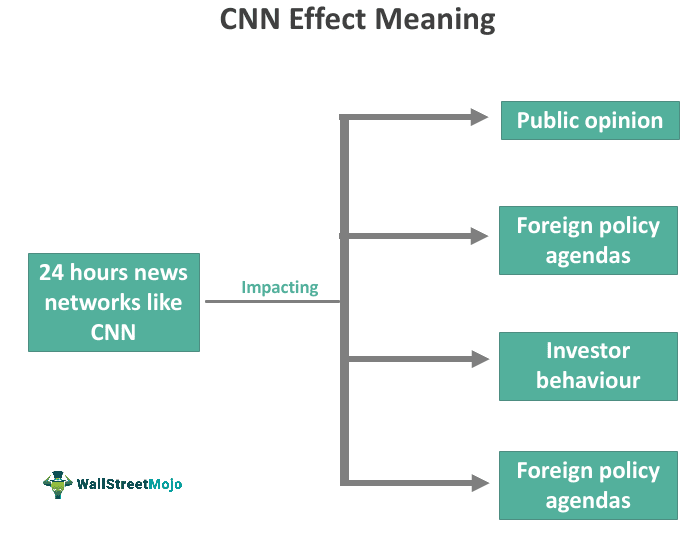

## Table of Contents

## What is the CNN Effect?

The CNN Effect refers to the impact that real-time, 24-hour news coverage has on the decisions made by governments and international organizations. When CNN and other similar news channels started broadcasting live news from around the world, people could see events happening as they unfolded. This meant that viewers at home could see crises, like wars or natural disasters, in real-time. As a result, the public often felt more urgency to respond to these situations, and they expected their governments to do something quickly.

Because of this, politicians and leaders felt more pressure to act fast. They knew that if they didn't respond to what people were seeing on TV, they might lose public support. So, the CNN Effect made it harder for governments to ignore global issues. It pushed them to take quicker action, sometimes even before they had all the information they needed. This showed how powerful media can be in shaping what governments do.

## How does the CNN Effect influence public opinion?

The CNN Effect influences public opinion by showing people around the world what is happening in real-time. When people see news about a crisis, like a war or a natural disaster, on TV or online, they feel more connected to these events. This makes them care more about what is happening and often feel a need to do something to help. For example, if people see a famine happening in another country, they might feel more urgency to support relief efforts or push their leaders to take action.

Because of this, the CNN Effect can change how people think about different issues. When news channels focus a lot on a specific problem, it can make the public believe that this issue is very important and needs immediate attention. This can lead to more people talking about the issue, joining protests, or donating money to help. Overall, the CNN Effect makes people more aware and more likely to want to make a difference in the world.

## Can you explain the basic economic principles affected by the CNN Effect?

The CNN Effect can influence basic economic principles like supply and demand. When people see news about a crisis on TV, they might want to help by buying more of certain products, like food or medicine, to send to the affected areas. This sudden increase in demand can lead to higher prices for these goods. At the same time, if the news shows that a country is in trouble, businesses might not want to invest there anymore. This can lead to less supply of goods and services in that country, making things even harder for the people living there.

Another economic principle affected by the CNN Effect is consumer behavior. When people see something bad happening on the news, like a natural disaster, they might change what they buy. For example, they might start buying more bottled water or emergency supplies because they are worried the same thing could happen to them. This change in what people buy can affect how stores and companies plan their stock and sales. Overall, the CNN Effect can make the economy more unpredictable because it can quickly change what people want and need.

## What are some historical examples where the CNN Effect had a significant economic impact?

One historical example where the CNN Effect had a significant economic impact was during the 1992 famine in Somalia. When CNN showed pictures of starving children and suffering families, people around the world felt very sad and wanted to help. This led to a big increase in donations to charities and aid organizations. The U.S. government also felt pressure to do something and sent troops to help with relief efforts. This sudden focus on Somalia changed how much money and resources went into the country, affecting its economy by increasing the supply of food and aid.

Another example is the 2004 Indian Ocean tsunami. When the disaster happened, news channels like CNN showed the destruction and loss of life in real-time. People watching at home were shocked and wanted to help the victims. This led to a huge amount of money being donated from around the world. Countries and organizations sent a lot of aid to the affected areas, which helped with rebuilding but also changed the local economy. The sudden influx of resources and money had a big impact on the areas hit by the tsunami, helping them recover but also creating new economic challenges as they tried to manage all the aid.

## How does the CNN Effect alter foreign policy decisions and their economic consequences?

The CNN Effect can change how countries make foreign policy decisions. When people see a crisis on TV, they often want their government to help right away. This makes leaders feel pressure to act fast, even if they don't have all the information they need. For example, when CNN showed the famine in Somalia in 1992, the U.S. government decided to send troops to help. This kind of quick action can lead to big changes in how countries interact with each other. Governments might start new programs or send aid to other countries because of what they see on the news.

These foreign policy changes can have big economic effects. When a country sends aid or troops to another country, it costs a lot of money. This can affect the country's own economy because the money used for aid could have been spent on other things at home. Also, when a lot of aid goes to a country in crisis, it can change the local economy there. For example, after the 2004 Indian Ocean tsunami, many countries sent help to rebuild. This sudden increase in resources helped the affected areas but also created new economic challenges as they tried to manage all the aid and rebuild their economies.

## What role does media coverage play in shaping economic policies through the CNN Effect?

Media coverage, like what you see on CNN, can change how governments make economic policies. When news channels show a crisis happening in real-time, people at home feel more connected to the problem. They want their leaders to do something quickly to help. This makes governments feel pressure to act fast. They might decide to send aid or start new programs to help the country in need. These quick decisions can change how a country spends its money and what economic policies it follows.

For example, when CNN showed the famine in Somalia in 1992, the U.S. government decided to send troops and aid to help. This decision was made quickly because of the pressure from the public who saw the crisis on TV. Sending aid and troops costs a lot of money, which can affect the U.S. economy. The money used for aid could have been spent on other things at home. Also, when a lot of aid goes to a country in crisis, it can change the local economy there. After the 2004 Indian Ocean tsunami, many countries sent help to rebuild, which helped the affected areas but also created new economic challenges as they managed all the aid.

## How do governments and international organizations respond to the economic pressures created by the CNN Effect?

Governments and international organizations often feel a lot of pressure to respond quickly when they see a crisis on TV. When people watch news about a disaster or a famine, they want their leaders to do something right away. This makes governments and groups like the United Nations feel they have to act fast. They might send money, food, or even troops to help the country in need. For example, after seeing the famine in Somalia on CNN in 1992, the U.S. government quickly decided to send aid and troops. This kind of fast action is because of the pressure from the public who saw the crisis on TV.

When governments and international organizations respond to these crises, it can change how they spend their money. Sending aid and troops costs a lot, and this can affect their own economy. The money used for aid could have been spent on other things at home. Also, when a lot of aid goes to a country in crisis, it can change the local economy there. After the 2004 Indian Ocean tsunami, many countries sent help to rebuild. This helped the affected areas but also created new economic challenges as they managed all the aid. So, the CNN Effect can make governments and international organizations change their economic plans to deal with the pressure from the public.

## What are the short-term versus long-term economic impacts of the CNN Effect?

In the short term, the CNN Effect can lead to quick economic changes. When people see a crisis on TV, they might want to help right away. This can make governments and groups like the United Nations send money, food, or even troops to the affected area fast. For example, after seeing the famine in Somalia on CNN, the U.S. government quickly sent aid and troops. This quick action can increase demand for certain goods, like food or medicine, which can raise their prices. It can also make businesses less willing to invest in the troubled country, which can reduce the supply of goods and services there.

In the long term, the CNN Effect can have bigger and more lasting economic impacts. When a lot of aid goes to a country in crisis, it can help rebuild, but it also creates new challenges. For example, after the 2004 Indian Ocean tsunami, many countries sent help to rebuild the affected areas. This aid helped in the short term, but managing all the resources and money took a lot of work and planning. It changed the local economy by creating jobs and boosting some sectors, but it also made the economy more unpredictable. Governments and international organizations might have to change their economic plans and policies to deal with these long-term effects, which can affect their own economies as well.

## How can the economic impact of the CNN Effect be measured and analyzed?

To measure and analyze the economic impact of the CNN Effect, we can look at how much money is being spent on aid and relief efforts. When a crisis is shown on TV, governments and organizations often send money, food, or troops to help. We can track these expenses and see how they change the economy of the country sending the aid. For example, if a country like the U.S. sends a lot of money to help with a famine in Somalia, we can see how this affects the U.S. budget and economy. We can also look at how much money is donated by people and businesses, which can show how the public is responding to the news.

Another way to analyze the economic impact is by looking at how the aid changes the economy of the country receiving help. When a lot of aid comes into a country, it can help rebuild, but it also creates new economic challenges. We can study how this aid affects local prices, jobs, and businesses. For example, after the 2004 Indian Ocean tsunami, the aid helped rebuild the affected areas, but it also made the local economy more unpredictable. By comparing economic data before and after the crisis, we can see how the CNN Effect changed things in the long run.

## What strategies can be employed to mitigate negative economic effects caused by the CNN Effect?

One way to reduce the bad economic effects of the CNN Effect is by planning better. Governments and groups can make plans for how to use aid money before a crisis happens. This way, when they see a problem on TV, they can act fast but also make sure the money is used in a smart way. They can also work with local people to understand what the country really needs. This can help make sure the aid helps the economy instead of making things worse.

Another strategy is to spread out the aid over time. Instead of sending all the help at once, governments can send it little by little. This can stop prices from going up too fast and give the local economy time to adjust. It can also help create more jobs and keep the economy stable. By doing this, the negative effects of the CNN Effect can be smaller, and the help can be more useful in the long run.

## How does the CNN Effect interact with other global economic factors like trade and investment?

The CNN Effect can change how countries trade with each other. When people see a crisis on TV, they might want to buy more things to help the country in need. This can make more demand for certain goods, like food or medicine, and can change trade patterns. For example, if there's a famine in a country, other countries might send more food there. This can help the country in need but also change the prices and where the food is coming from. If businesses see a country is in trouble, they might not want to trade or invest there anymore. This can make less supply of goods and services in that country, which can hurt its economy.

The CNN Effect can also affect how much money people and businesses invest in different places. When a crisis is shown on TV, investors might feel scared to put their money into that country. They might think it's too risky, so they take their money out or don't invest at all. This can make it harder for the country to grow its economy. On the other hand, if a country gets a lot of aid because of the CNN Effect, it might attract more investment later on. People might see the aid as a sign that the country is getting help and could be a good place to invest in the future. So, the CNN Effect can make trade and investment more unpredictable and change how the global economy works.

## What are the future trends and potential developments in the relationship between the CNN Effect and economic impact?

In the future, the CNN Effect might get even stronger because of new technology. More people can see news on their phones and computers, so they can know about a crisis anywhere in the world very quickly. This means people might want their governments to help even faster than before. Also, social media can make the CNN Effect bigger. When people share news and videos online, it can make more people care about a problem and push for help. This can change how much money and resources go to different countries and affect their economies in new ways.

As the world gets more connected, the economic impact of the CNN Effect could change a lot. Governments and groups might need to find better ways to plan and use aid money so it helps without causing too many problems. They might also need to work together more to make sure the help they send is what the country really needs. This could make the world's economy more stable, even when there are big crises shown on TV. The way people trade and invest might also change because of the CNN Effect, as businesses and investors react to what they see in the news.

## References & Further Reading

[1]: Cottle, S., & Nolan, D. (2007). ["Global Humanitarianism and the Changing Aid-Media Field: 'Everyone was Dying for Coverage'."](https://www.tandfonline.com/doi/full/10.1080/14616700701556104) Media, Culture & Society, 29(6), 819-841.

[2]: Livingston, S. (1997). ["Clarifying the CNN Effect: An Examination of Media Effects According to Type of Military Intervention."](https://shorensteincenter.org/wp-content/uploads/2012/03/r18_livingston.pdf) Shorenstein Center on Media, Politics and Public Policy.

[3]: Soroka, S. N. (2003). ["Media, Public Opinion, and Foreign Policy."](https://journals.sagepub.com/doi/10.1177/1081180X02238783) The Harvard International Journal of Press/Politics, 8(1), 27-48.

[4]: Schoenbach, K., & Engel, A. (2001). ["The CNN Effect: News Organization as a Source of Influence in International Politics."](https://www.semanticscholar.org/paper/The-CNN-Effect%3A-The-Search-for-a-Communication-of-Gilboa/e0581bf5e8b520e116d413b80e383373d1042e47) International Journal of Press/Politics, 6(2), 18-40.

[5]: Lazar, D., & Robb, J. (2016). ["Algorithmic Trading in Forex: An Introduction to the Robots and Strategies"](https://books.google.com/books/about/Ensuring_Digital_Accessibility_through_P.html?id=YepDBAAAQBAJ) Investopedia.