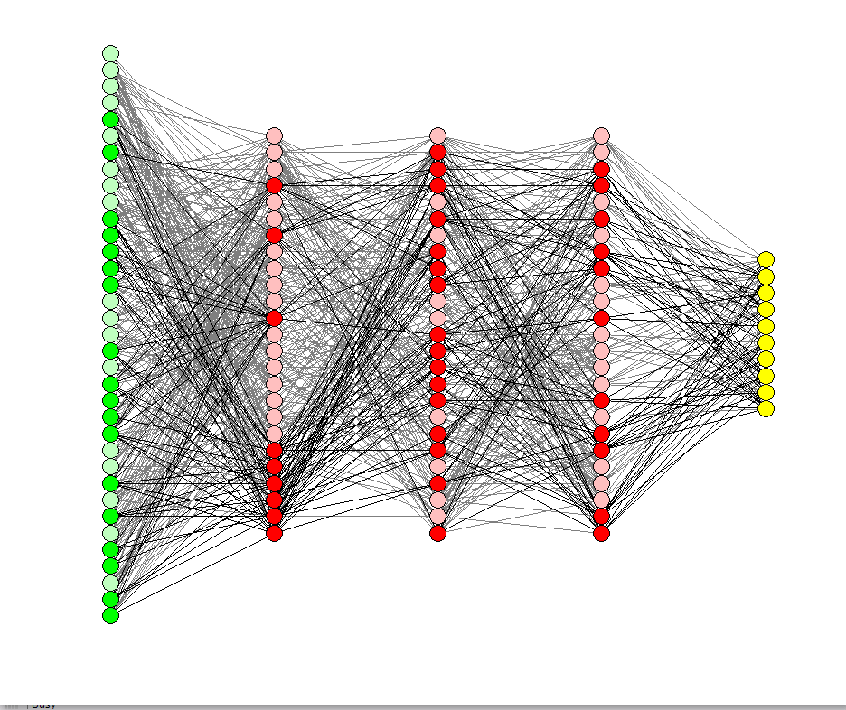

## Table of Contents

## What is co-adaptation in the context of machine learning?

Co-adaptation in machine learning refers to the phenomenon where different parts of a model start to rely too much on each other during training. Imagine you have a team working on a project. If one team member always does the work for another, the second member might stop trying hard because they know the first will cover for them. In machine learning, this can happen with neurons in a neural network. Some neurons might become overly specialized in handling certain types of data, while others might not learn much because they rely on these specialized neurons.

This can be a problem because it makes the model less robust. If the model encounters new data that the specialized neurons can't handle well, the whole model might perform poorly. To prevent co-adaptation, techniques like dropout are used. Dropout randomly turns off some neurons during training, forcing the others to learn and not become too dependent on any single neuron. This helps create a more balanced and effective model that can handle a wider variety of data.

## How does co-adaptation occur in neural networks?

Co-adaptation in neural networks happens when certain neurons start to depend too much on others during training. Imagine you're in a group project, and one person always does the work for another. The second person might stop trying hard because they know the first will cover for them. In a neural network, some neurons might become really good at recognizing specific patterns in the data, while other neurons might not learn much because they rely on these specialized neurons to do the work.

This can cause problems because if the model sees new data that the specialized neurons can't handle well, the whole network might not perform well. It's like if the hard-working person in the group project gets sick, and the lazy person can't do the work alone. To stop co-adaptation, techniques like dropout are used. Dropout randomly turns off some neurons during training, which makes the other neurons work harder and learn more. This helps the neural network become stronger and better at handling different kinds of data.

## What are the potential benefits of co-adaptation in machine learning models?

Co-adaptation in [machine learning](/wiki/machine-learning) models can sometimes lead to faster training times. When neurons start to specialize and rely on each other, they can quickly learn to recognize certain patterns in the data. This can make the model converge to a solution more quickly during training, which is useful when time is a critical [factor](/wiki/factor-investing). For example, if you're training a model to recognize faces and some neurons become experts at detecting eyes, the model might learn faster because these specialized neurons can quickly identify eyes and pass that information along.

However, while co-adaptation can speed up training, it can also make the model more robust in specific scenarios. If the data the model is trained on has a lot of similar patterns, the co-adapted neurons can become very good at handling these patterns. This means the model might perform exceptionally well on similar data it sees in the future. For instance, if a model is trained on images of dogs and some neurons specialize in detecting dog ears, the model might be very good at identifying dogs in new images that also have clear dog ears.

## Can you explain the relationship between co-adaptation and overfitting?

Co-adaptation and overfitting are closely related in machine learning. Overfitting happens when a model learns the training data too well, including all its little details and even its noise. This makes the model perform great on the training data but poorly on new, unseen data. Co-adaptation can lead to overfitting because when neurons start to rely too much on each other, they might become really good at recognizing specific patterns in the training data. But if these patterns don't show up in new data, the model won't do well.

To prevent both co-adaptation and overfitting, techniques like dropout are used. Dropout randomly turns off some neurons during training, which stops them from becoming too dependent on each other. This helps the model learn more general features that are useful for a wider range of data. By breaking the co-adaptation, dropout helps the model avoid overfitting and become better at handling new data it hasn't seen before.

## What techniques are used to detect co-adaptation in machine learning models?

To detect co-adaptation in machine learning models, one common approach is to monitor the performance of the model on a validation set during training. If the model's performance on the validation set starts to degrade while its performance on the training set continues to improve, this could be a sign of co-adaptation leading to overfitting. This happens because the model becomes too specialized in the training data, and the neurons start to rely too much on each other, causing them to not generalize well to new data.

Another technique involves analyzing the weights and activations of the neurons. If certain neurons have very high weights or activations, it might indicate that they are becoming overly specialized and other neurons are depending on them. Tools like visualization of the [neural network](/wiki/neural-network)'s structure and activation maps can help identify such patterns. By examining these, you can see if some neurons are consistently activated together, suggesting co-adaptation.

## How can co-adaptation impact the generalization of a model?

Co-adaptation can make a model worse at handling new data. When neurons in a neural network start to rely too much on each other, they might become really good at recognizing specific patterns in the training data. But if these patterns don't show up in new data, the model won't do well. This is because the model becomes too specialized and can't handle different kinds of data it hasn't seen before.

To prevent this problem, techniques like dropout are used. Dropout randomly turns off some neurons during training, which forces the other neurons to learn and not become too dependent on any single neuron. This helps the model learn more general features that are useful for a wider range of data. By breaking the co-adaptation, dropout helps the model become better at handling new data it hasn't seen before.

## What are some strategies to mitigate the effects of co-adaptation?

One way to reduce co-adaptation in machine learning models is by using dropout. Dropout randomly turns off some neurons during training, which stops them from becoming too dependent on each other. This makes the other neurons work harder and learn more, helping the model handle different kinds of data better. For example, if you're training a model to recognize faces, dropout can help make sure that the model doesn't just rely on a few neurons to detect eyes but uses many neurons to learn about different parts of the face.

Another strategy is to use regularization techniques like L1 and L2 regularization. These methods add a penalty to the model's loss function to keep the weights of the neurons from getting too big. By doing this, the model is encouraged to spread out the learning across more neurons, reducing the chance of co-adaptation. For instance, L2 regularization adds a term to the loss function like $$ \lambda \sum_{i} w_i^2 $$, where $$ \lambda $$ is a hyperparameter and $$ w_i $$ are the weights of the neurons. This helps keep the weights small and prevents any single neuron from becoming too important.

Using [data augmentation](/wiki/data-augmentation) is also helpful. By adding small changes to the training data, like rotating images or adding noise, the model sees more varied examples. This makes it harder for neurons to specialize too much on specific patterns, reducing co-adaptation. For example, if you're training a model to recognize cats, you can flip the cat images or change their brightness. This way, the model learns to recognize cats from different angles and lighting conditions, making it more robust and less likely to overfit due to co-adaptation.

## Can you provide examples of machine learning models where co-adaptation has been observed?

In deep neural networks, co-adaptation has been observed in models used for image classification, such as Convolutional Neural Networks (CNNs). For instance, when training a CNN on a dataset like ImageNet, researchers have noticed that certain neurons in the network start to specialize in recognizing specific features like edges or textures. These neurons can become overly reliant on each other, leading to co-adaptation. If the model sees new images that don't have these exact features, it might not perform well because the specialized neurons can't handle the new data.

Another example where co-adaptation has been observed is in Recurrent Neural Networks (RNNs) used for natural language processing tasks. When training an RNN to predict the next word in a sentence, some neurons might start to focus on certain types of words or grammatical structures. This can cause co-adaptation where these neurons depend too much on each other to make predictions. If the model then encounters a different style of language or new vocabulary, it might struggle because the co-adapted neurons can't adapt to the new patterns.

## How does co-adaptation relate to the concept of ensemble learning?

Co-adaptation can be a problem in machine learning, but ensemble learning can help solve it. In ensemble learning, you train many different models and then combine their predictions. This helps because if one model has neurons that are too specialized and depend on each other too much, the other models might not have the same problem. By putting the predictions from all these models together, you get a more balanced and stronger final prediction that can handle different kinds of data better.

Ensemble methods like bagging and boosting are good at reducing co-adaptation. In bagging, you train many models on different parts of the data, so no single model can become too specialized on one pattern. In boosting, you train models one after the other, with each new model trying to fix the mistakes of the last one. This way, even if some models start to co-adapt, the overall ensemble can still perform well because it uses the strengths of all the models together.

## What research has been conducted on co-adaptation in deep learning?

Researchers have looked into co-adaptation a lot, especially in [deep learning](/wiki/deep-learning). One big study was done by Hinton et al. in 2012, where they talked about how dropout can help stop neurons from relying too much on each other. They found that by randomly turning off some neurons during training, the model can learn better and not just focus on a few specialized neurons. This helps the model handle new data better because it doesn't just depend on a few neurons to do all the work.

Another important piece of research came from Srivastava et al. in 2014. They did more work on dropout and found that it not only helps with co-adaptation but also makes the model more robust. They showed that dropout can be seen as training many different versions of the neural network at the same time. By doing this, the model learns to be more general and not overfit to the training data. This research has been really important for making deep learning models work better in real-world situations where data can be very different from what the model was trained on.

## How can co-adaptation be leveraged to improve model performance?

Co-adaptation, where neurons in a neural network start to rely on each other too much, can be used to make a model train faster. When some neurons become really good at recognizing certain patterns in the data, they can help the model learn quickly. For example, if a model is trained to recognize faces and some neurons become experts at detecting eyes, the model can quickly learn to spot eyes in new images. This can be helpful when you need the model to start working well in a short amount of time.

But, to make sure the model stays useful for new data, you need to use techniques like dropout. Dropout randomly turns off some neurons during training, which stops them from becoming too dependent on each other. By doing this, the model learns more general features that are useful for a wider range of data. This way, you can use the fast learning from co-adaptation to get a quick start, and then use dropout to make sure the model can handle different kinds of data well.

## What future directions could research on co-adaptation in machine learning take?

Future research on co-adaptation in machine learning could focus on understanding how it happens in different types of neural networks, like transformers and graph neural networks. Researchers might want to find new ways to measure co-adaptation so they can see when it's happening and how bad it is. This could help them come up with better ways to stop it from making models less useful. They might also look at how co-adaptation affects different tasks, like understanding language or recognizing images, and see if there are patterns that can help make models better.

Another direction could be to develop new techniques that use co-adaptation to make models train faster without losing their ability to handle new data. Researchers might try to find a balance where co-adaptation helps the model learn quickly at first, but then other methods like dropout or new regularization techniques keep the model from overfitting. This could lead to models that start working well quickly and then keep improving as they see more data. By studying co-adaptation more, researchers can make machine learning models more reliable and useful for real-world problems.