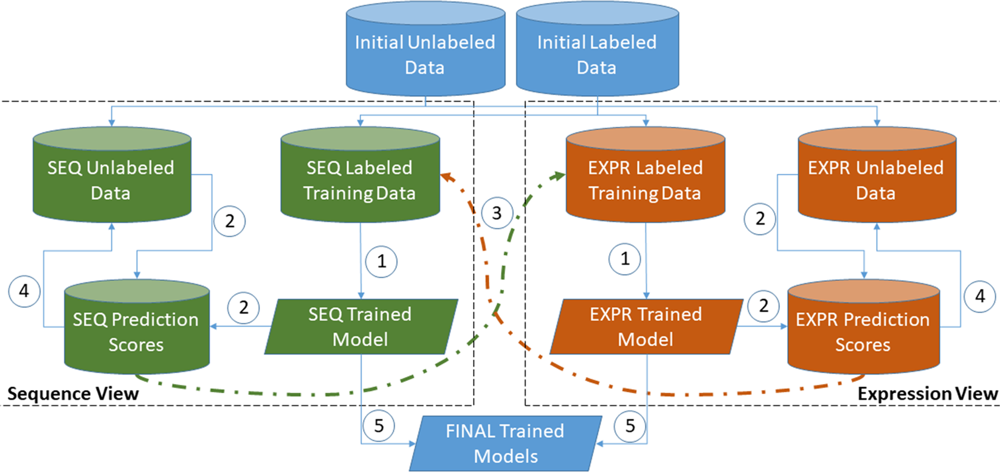

## Table of Contents

## What is co-training in machine learning?

Co-training is a type of semi-supervised learning method used in machine learning. It is useful when you have a small amount of labeled data and a large amount of unlabeled data. The main idea behind co-training is to use two different sets of features, or "views," of the data to train two separate models. These models then work together to label the unlabeled data, improving their performance over time. By using two views, co-training assumes that the features in each view are conditionally independent given the class label, which helps in making the learning process more effective.

In practice, co-training works by first training the two models on the labeled data using their respective views. Then, each model selects the most confidently predicted unlabeled examples and adds them to the labeled set of the other model. This process is repeated for several iterations, allowing both models to learn from increasingly larger labeled datasets. The key benefit of co-training is that it can significantly improve classification accuracy by leveraging the unlabeled data, making it a powerful tool in scenarios where labeled data is scarce.

## How does co-training differ from traditional supervised learning?

Co-training is different from traditional supervised learning mainly because it uses both labeled and unlabeled data, while traditional supervised learning only uses labeled data. In co-training, you have two separate models that look at different parts of the data, called "views." These models help each other by sharing the most confidently predicted unlabeled examples. This process helps both models get better over time. On the other hand, traditional supervised learning trains one model on all the features at once, and it doesn't use any unlabeled data to improve.

The key idea in co-training is that the two views of the data should be conditionally independent given the class label. This means that knowing one view doesn't give you much information about the other view if you already know the class. This assumption helps co-training work well, even with less labeled data. In contrast, traditional supervised learning doesn't need this assumption because it doesn't split the data into views. It just uses all the available labeled data to train a single model, without any help from unlabeled data.

## What are the key assumptions behind co-training?

The first key assumption behind co-training is that the data can be split into two different views, and these views should be conditionally independent given the class label. This means if you know what class an example belongs to, the information in one view does not tell you much about the other view. This helps the two models learn from each other better because they are looking at different parts of the data.

The second key assumption is that each view should be sufficient to train a good classifier on its own. This means that if you had enough labeled data, you could train a model using just one view and still get good results. This is important because co-training relies on each model being able to confidently predict new labels for the other model to use. Together, these assumptions allow co-training to make the most out of a small amount of labeled data and a large amount of unlabeled data.

## Can you explain the process of co-training with an example?

Let's say you want to classify whether a news article is about sports or politics. You have two views of the data: one view is the article's text, and the other view is the article's metadata like the author and publication date. You have 100 labeled articles and 1000 unlabeled articles. You start by training two models: Model A uses the text view, and Model B uses the metadata view. You train these models on the 100 labeled articles.

After the initial training, Model A looks at the text of the unlabeled articles and picks the ones it is most confident about. For example, if an article has many words like "goal" and "match," Model A might confidently label it as sports. Model A then gives these confidently labeled articles to Model B. Similarly, Model B looks at the metadata of the unlabeled articles and picks the ones it is most confident about. If an article is written by a sports journalist and published during a major sports event, Model B might confidently label it as sports. Model B then gives these confidently labeled articles to Model A. Both models keep doing this, getting better and better at classifying the articles as they use more and more of the unlabeled data.

## What types of data are best suited for co-training?

Co-training works best with data that can be split into two different views, where each view can be used to train a good classifier on its own. These views should also be conditionally independent given the class label, which means knowing one view doesn't give you much information about the other view if you already know the class. For example, if you're classifying news articles, one view could be the text of the article, and the other view could be metadata like the author and publication date. The text and metadata should be able to predict the class of the article independently.

In practice, co-training is often used with text data, where one view might be the content of the text, and the other view might be features like the structure or formatting of the text. It can also be used in image classification, where one view might be the pixel values of the image, and the other view might be the color histogram or texture features. The key is that both views should be able to contribute to the classification task on their own, and they should provide different kinds of information about the data.

## How do you select the views or features for co-training?

When selecting views or features for co-training, you need to find two sets of features that can each predict the class well on their own. These views should also be different enough that knowing one view doesn't tell you much about the other if you already know the class. For example, if you're classifying web pages, one view could be the text on the page, and the other view could be the links and structure of the page. Both views should help predict if the page is about sports or politics, but they should do it in different ways.

To check if your views are good for co-training, you can test if each view can train a good model by itself using the labeled data you have. If both models do well, that's a good sign. You also need to make sure the views are conditionally independent given the class label. This means that if you know a web page is about sports, knowing the text on the page shouldn't tell you much about the links and structure, and vice versa. If your views meet these conditions, they are likely to work well for co-training.

## What are the common challenges faced when implementing co-training?

One common challenge in implementing co-training is finding the right views of the data. These views need to be good at predicting the class on their own, but also different enough from each other. If the views are too similar, they won't help each other much. If they are not good at predicting the class, the models won't learn well. This can be hard to do, especially if the data is complicated or if there are not many labeled examples to start with.

Another challenge is making sure the views are conditionally independent given the class label. This means that if you know what class an example belongs to, the information in one view shouldn't tell you much about the other view. This can be tricky to check, and if the views are not independent enough, the co-training process might not work well. Also, choosing how many unlabeled examples to add in each iteration and how confident the models should be can be tricky. If you add too many or too few examples, or if the confidence threshold is too high or too low, the models might not improve as much as they could.

## How can one evaluate the performance of a co-training model?

To evaluate the performance of a co-training model, you can use standard [machine learning](/wiki/machine-learning) metrics like accuracy, precision, recall, and F1-score. These metrics help you understand how well the model is classifying the data. For example, accuracy tells you the percentage of correct predictions out of all predictions. You can calculate these metrics on a test set that the model has not seen during training. This helps you see how well the model can generalize to new data. You can also use cross-validation to get a more reliable estimate of the model's performance by splitting the data into different training and testing sets multiple times.

Another way to evaluate the performance of a co-training model is to compare it with a model trained only on the labeled data. This helps you see how much the co-training process has improved the model's performance by using the unlabeled data. You can also look at how the performance changes over the iterations of co-training. If the performance gets better as more unlabeled data is added, it's a good sign that co-training is working well. By using these evaluation methods, you can understand how effective the co-training process is and whether it's worth the extra effort compared to traditional supervised learning.

## What are some advanced techniques to improve co-training efficiency?

One advanced technique to improve co-training efficiency is to use active learning. In active learning, the model picks the unlabeled examples it is least sure about and asks a human to label them. This helps the model learn from the most useful examples first, making the co-training process faster and more effective. For example, if the model is unsure whether an article is about sports or politics, it can ask a human to check and label it. This way, the model gets better quickly by learning from the examples that are hard to classify.

Another technique is to use ensemble methods. In ensemble methods, you train many models instead of just two, and each model uses a different view of the data. These models then vote on the class of the unlabeled examples. This can make the co-training process more robust because it combines the predictions of many models. For example, if you have five models and three of them agree that an article is about sports, the co-training process can be more confident in adding that label to the dataset. By using these advanced techniques, you can make co-training more efficient and improve the performance of your models.

## Can co-training be applied to semi-supervised learning scenarios?

Co-training is a type of semi-supervised learning method. This means it uses both labeled and unlabeled data to train models. In co-training, you have two models that look at different parts of the data, called "views." These models help each other by sharing the most confidently predicted unlabeled examples. This process helps both models get better over time. Co-training works well when you don't have a lot of labeled data but you have a lot of unlabeled data. By using the unlabeled data, co-training can improve the models' accuracy.

In a semi-supervised learning scenario, co-training starts with the labeled data to train the two models. Each model then uses its view to predict the class of the unlabeled data. If a model is very confident about its prediction, it shares that example with the other model. This way, both models can learn from more data than just the initial labeled set. Over several iterations, the models keep improving as they use more and more of the unlabeled data. This makes co-training a powerful tool in scenarios where labeled data is scarce.

## How does co-training handle noisy or mislabeled data?

Co-training can handle noisy or mislabeled data by using two models that check each other's work. If one model is confident about a label but the other model disagrees, it might mean the label is wrong. By having two views of the data, co-training can spot mistakes and not use them to train the models. This makes the models more accurate even when some of the labeled data is noisy or wrong.

In practice, co-training can be set up to be careful about adding new labels. If a model is not very sure about a label, it won't add it to the other model's training data. This helps keep the training data clean. Also, if both models agree on a label, it's more likely to be correct, so co-training can use this to make the models better at handling noisy data.

## What are some real-world applications of co-training in machine learning?

Co-training is used in many real-world situations where there isn't a lot of labeled data but plenty of unlabeled data. One common use is in text classification, like sorting news articles into categories such as sports or politics. In this case, one model might look at the words in the article, while the other model looks at the article's metadata like the author and publication date. By working together, these models can better classify the articles even if they start with only a few labeled examples.

Another application of co-training is in image classification. For example, if you want to identify different types of animals in pictures, one model could look at the pixel values of the images, while the other model could look at features like color histograms or texture. Co-training helps these models learn from each other and improve their accuracy over time. This is especially useful in fields like medical imaging, where labeled data can be hard to come by, but there are many unlabeled images available.