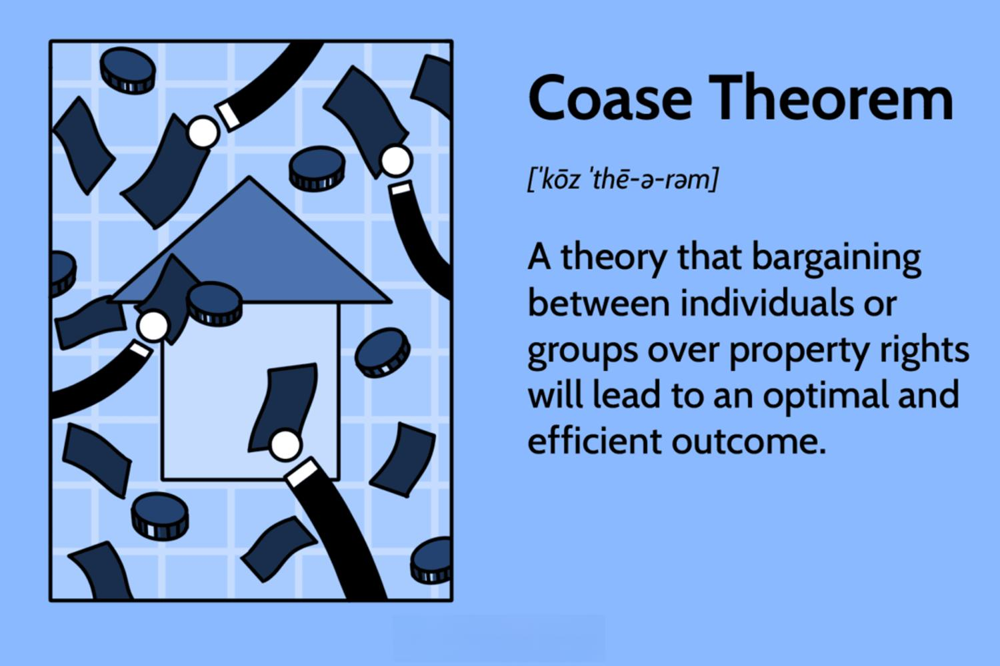

## Table of Contents

## What is the Coase Theorem?

The Coase Theorem is an idea in economics that says if people can talk and make deals easily, they can solve problems about who should use a resource without needing the government to step in. It was named after Ronald Coase, who came up with it. The key point is that as long as property rights are clear and there are no big costs to making deals, people will find a way to use resources in the best way possible, no matter who owns them at first.

For example, imagine two farmers, one growing crops and the other raising cattle. The cattle might wander onto the crop field and damage the crops. If the farmers can easily talk and agree on a solution, like building a fence or paying for the damage, they can sort it out themselves. The Coase Theorem says it doesn't matter which farmer is legally responsible for the damage, as long as they can negotiate freely. However, in real life, it's not always easy for people to talk and make deals, so the theorem works best in theory.

## Who developed the Coase Theorem and when?

The Coase Theorem was developed by Ronald Coase, an economist. He introduced this idea in his famous paper called "The Problem of Social Cost," which he published in 1960. Coase's work changed how people think about economic problems and how to solve them.

In simple terms, Coase said that if people can talk to each other easily and make deals without much trouble, they can figure out who should use a resource in the best way. This means that the government doesn't always need to step in to solve problems about resources. Coase's idea has been really important in economics and has helped shape many policies and laws.

## Can you explain the Coase Theorem with a simple example?

Imagine there are two neighbors, Alice and Bob. Alice likes to play loud music in her garden, but Bob, who lives next door, can't enjoy his quiet evenings because of the noise. According to the Coase Theorem, if Alice and Bob can easily talk to each other and make deals, they can solve this problem themselves without needing the government to step in. 

Let's say Alice has the legal right to play her music as loud as she wants. If Bob really values his quiet evenings, he might offer to pay Alice to turn down the [volume](/wiki/volume-trading-strategy). On the other hand, if Alice really loves her loud music, she might offer to pay Bob to put up with the noise. The Coase Theorem says that as long as they can negotiate freely and the cost of making a deal isn't too high, they will find a solution that works for both of them.

## What are the key assumptions of the Coase Theorem?

The Coase Theorem has two main assumptions that make it work. The first one is that property rights need to be clear. This means everyone knows who owns what. If Alice owns the right to play loud music, then everyone knows that. If Bob owns the right to quiet, then everyone knows that too. Without clear property rights, people can't make deals easily because they don't know who has the right to do what.

The second assumption is that the costs of making deals, called transaction costs, need to be low. This means it shouldn't be too hard or expensive for people to talk to each other and agree on something. If Alice and Bob have to spend a lot of time and money just to talk and make a deal, then the Coase Theorem won't work as well. When transaction costs are low, people can quickly and easily find a solution that makes them both happy.

## How does the Coase Theorem apply to real-world scenarios?

The Coase Theorem can be useful in real life, but it often faces challenges because the world is more complicated than the theory suggests. Imagine a factory that pollutes a river, affecting fishermen downstream. If the factory and the fishermen can easily talk and make deals, they might agree on a solution, like the factory paying the fishermen or installing better filters. However, in reality, it's often hard for them to negotiate because there might be many fishermen, making it difficult to reach everyone. Also, the costs of getting everyone together to talk and agree on a solution can be high, which goes against the Coase Theorem's assumption of low transaction costs.

Another real-world example is neighbors dealing with noise. If one neighbor likes to play loud music and another wants quiet, they could negotiate a solution if the costs of talking and making a deal are low. But in practice, it might not be so simple. There could be disagreements about who should pay or how much, and the legal system might need to step in to clarify property rights. This shows that while the Coase Theorem offers a good way to think about solving problems, it often needs help from laws and regulations to work in the real world, where transaction costs and unclear property rights can get in the way.

## What is the difference between the original and the modified versions of the Coase Theorem?

The original Coase Theorem, developed by Ronald Coase, says that if people can talk to each other easily and make deals without much trouble, they can solve problems about who should use a resource without needing the government to step in. It assumes that property rights are clear and that the costs of making deals, called transaction costs, are low. For example, if a factory pollutes a river and affects fishermen, the factory and fishermen could agree on a solution if they can easily talk and make a deal. The original theorem focuses on the idea that the initial allocation of property rights doesn't matter as long as people can negotiate freely.

The modified Coase Theorem, which has been developed over time by other economists, takes into account that real life is more complicated. It recognizes that transaction costs are often high and property rights might not be clear, which makes it harder for people to negotiate solutions on their own. This version suggests that the government might need to step in to help, like setting up rules or laws to make sure property rights are clear or to lower the costs of making deals. For instance, in the factory and fishermen example, the government might need to set pollution limits or create a system where the factory has to pay the fishermen, making it easier for them to reach a solution.

## How does transaction cost affect the application of the Coase Theorem?

Transaction costs are really important when it comes to using the Coase Theorem in real life. The Coase Theorem says that if people can talk to each other easily and make deals without much trouble, they can solve problems about resources on their own. But in the real world, it's often hard for people to talk and agree on things. If it costs a lot of time, money, or effort just to make a deal, then the Coase Theorem doesn't work as well. For example, if a factory is polluting a river and there are many fishermen affected, it might be really hard to get everyone together to talk and agree on a solution. The high costs of organizing everyone and negotiating make it tough for the Coase Theorem to work smoothly.

Because transaction costs can be so high, the government often needs to step in to help. The government can make laws or set up systems that make it easier for people to solve their problems. For instance, the government might create rules about pollution or set up a way for the factory to pay the fishermen without needing to negotiate with each one. This lowers the transaction costs and makes it easier for the Coase Theorem to apply in real life. So, while the Coase Theorem is a great idea in theory, high transaction costs in the real world mean that we often need help from laws and regulations to make it work.

## What are the criticisms of the Coase Theorem?

One big criticism of the Coase Theorem is that it doesn't work well in the real world because it assumes that transaction costs are low. In real life, it's often hard for people to talk and make deals. For example, if a factory is polluting a river and there are many fishermen affected, it might be too hard to get everyone together to negotiate a solution. The costs of organizing everyone and making a deal can be very high, which makes the Coase Theorem less useful.

Another criticism is that the Coase Theorem assumes that property rights are clear, but in reality, they often aren't. If people don't know who owns what, it's hard for them to make deals. For instance, if it's not clear who has the right to a quiet neighborhood or clean air, neighbors or companies can't easily agree on a solution. This means that the government often needs to step in to clarify property rights and help people solve their problems, which goes against the idea of the Coase Theorem that people can sort things out on their own.

## How does the Coase Theorem influence economic policy?

The Coase Theorem has a big impact on how governments think about making economic policies. It suggests that if people can talk and make deals easily, they can solve their own problems without the government stepping in. This idea has led to policies that focus on making sure property rights are clear and that it's easy for people to negotiate. For example, governments might set up rules to make it easier for people to buy and sell things or to agree on how to use shared resources. The goal is to lower the costs of making deals so that people can find their own solutions.

But the Coase Theorem also shows that in real life, it's often hard for people to talk and make deals. This means that governments still need to create laws and regulations to help. For instance, if a factory is polluting a river and affecting many fishermen, it might be too hard for everyone to get together and agree on a solution. So, the government might set pollution limits or create a system where the factory has to pay the fishermen. This helps to make sure that problems get solved even when people can't negotiate easily on their own.

## In what ways does the Coase Theorem intersect with legal theory?

The Coase Theorem has a big impact on legal theory because it changes how we think about property rights and how people can solve problems. In legal theory, the Coase Theorem suggests that as long as property rights are clear, people can talk and make deals to solve their problems without needing the law to step in all the time. For example, if a factory is polluting a river and it's clear who owns the river, the factory and the people affected by the pollution can agree on a solution, like the factory paying to clean up the river or the affected people paying the factory to pollute less. This idea has led to legal systems focusing more on making sure property rights are clear so that people can solve their own problems.

But the Coase Theorem also shows that real life is more complicated. Sometimes, it's hard for people to talk and make deals because of high transaction costs or unclear property rights. This means that legal theory also has to think about when the law should step in to help. For example, if it's too hard for everyone affected by pollution to negotiate with a factory, the law might need to set pollution limits or create a system where the factory has to pay for the damage. So, while the Coase Theorem suggests that people can solve their own problems, legal theory uses this idea to figure out when and how the law should help make that possible.

## Can you discuss a case study where the Coase Theorem was applied in a legal dispute?

One famous case where the Coase Theorem was applied is the case of Boomer v. Atlantic Cement Company, which happened in New York in 1970. In this case, some homeowners sued a cement factory because the dust and noise from the factory were bothering them. The court had to decide what to do. According to the Coase Theorem, if the homeowners and the factory could talk and make a deal easily, they could figure out a solution themselves. But in real life, it's not always that simple. The court ended up making the factory pay the homeowners for the harm they were causing, but it didn't make the factory stop polluting. This shows how the Coase Theorem can influence legal decisions, but also how real-world problems can be more complicated than the theory suggests.

In the Boomer case, the court used the idea of the Coase Theorem by letting the factory keep polluting as long as it paid the homeowners. This was like saying, "You can keep doing what you're doing, but you have to pay for the harm you cause." The court thought that this way, the factory and the homeowners could sort of make a deal through the court's decision. But it also showed that the Coase Theorem's idea of people solving their own problems doesn't always work perfectly in real life. The homeowners might not have been happy with just getting money, and the factory might have found it hard to keep paying. So, while the Coase Theorem can help guide legal decisions, it often needs help from the law to work in the real world.

## What are the latest developments and research related to the Coase Theorem in economics and law?

In recent years, economists and legal scholars have been looking more deeply into how the Coase Theorem works in the real world. They've found that while the idea of people solving their own problems through negotiation is great, it's often hard to do in practice. New research has focused on how high transaction costs and unclear property rights can make it tough for people to make deals. For example, studies have shown that when there are many people involved, like in environmental issues, it's really hard to get everyone together to talk and agree on a solution. Economists are trying to find ways to lower these transaction costs, like using technology to help people negotiate more easily.

Legal scholars have also been exploring how the law can help make the Coase Theorem work better. They've been looking at how laws and regulations can make property rights clearer and help people negotiate. For instance, some research has looked at how governments can set up systems where people can easily buy and sell rights to pollute or use resources. This helps lower the costs of making deals and makes it easier for people to find solutions on their own. Overall, the latest developments in research are showing that while the Coase Theorem is a powerful idea, it needs help from both economics and law to work well in the real world.

## References & Further Reading

[1]: Coase, R. H. (1960). ["The Problem of Social Cost."](https://www.jstor.org/stable/10.1086/674872) Journal of Law and Economics, 3, 1-44.

[2]: Medema, S. G. (1997). ["The Coase Theorem: Lessons for the Study of Institutional Design."](https://competitionandappropriation.econ.ucla.edu/wp-content/uploads/sites/95/2017/08/CoaseTheoremHistory.pdf) Journal of Economic Perspectives, 11(2), 188-208.

[3]: Arrow, K. J. (1969). ["The Organization of Economic Activity: Issues Pertinent to the Choice of Market versus Non-market Allocation."](https://ia801705.us.archive.org/32/items/arrow-market-vs-non-market/Arrow%20Market%20vs%20Non%20Market.pdf) The Analysis and Evaluation of Public Expenditure: The PPB System, U.S. Joint Economic Committee.

[4]: Hull, J. (2007). ["Options, Futures, and Other Derivatives."](https://www.amazon.com/Options-Futures-Other-Derivatives-10th/dp/013447208X) Pearson Education.

[5]: Lopez de Prado, M. (2018). ["Advances in Financial Machine Learning."](https://www.amazon.com/Advances-Financial-Machine-Learning-Marcos/dp/1119482089) Wiley.

[6]: Hasbrouck, J. (2003). ["Intraday Price Formation in U.S. Equity Markets."](https://onlinelibrary.wiley.com/doi/10.1046/j.1540-6261.2003.00609.x) The Journal of Finance, 58(6), 2375-2400.

[7]: Chan, E. (2009). ["Quantitative Trading: How to Build Your Own Algorithmic Trading Business."](https://github.com/ftvision/quant_trading_echan_book) Wiley.