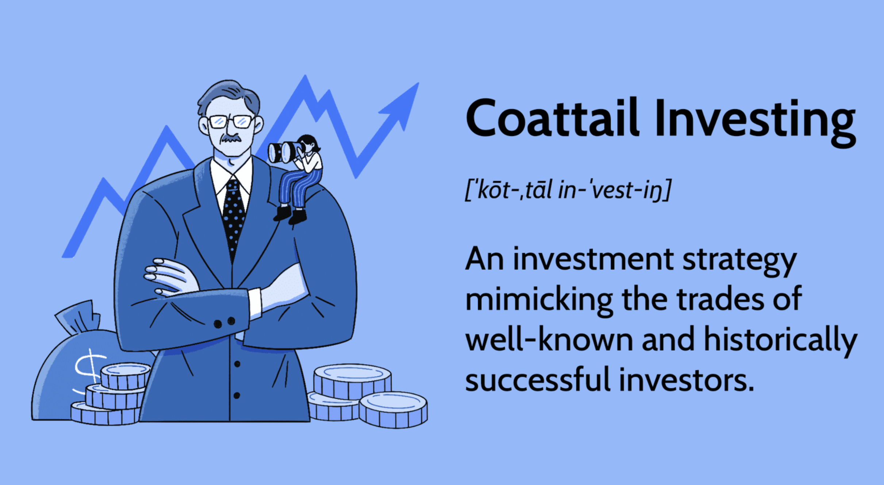

Understanding financial markets and crafting an effective investment strategy is crucial for both novice and seasoned investors. In today's rapidly evolving economic environment, identifying and employing the right strategies can lead to substantial financial gains while mitigating potential risks. This article explores two prominent investment strategies: coattail investing and algorithmic trading. Each strategy offers unique approaches and tools, enabling investors to maximize their returns and manage their portfolios more efficiently. 

Coattail investing involves replicating the trades of highly successful investors, such as Warren Buffett, by utilizing publicly available information, often disclosed through regulatory filings. This approach requires meticulous research and timing to capitalize on the strategies of well-known investors, providing a potentially low-risk method of investment by following proven decision-makers.



On the other hand, algorithmic trading leverages technology to execute trades based on pre-set criteria, including timing, price, and volume. This strategy employs complex algorithms to facilitate high-frequency trading with minimal human intervention, offering advantages in terms of speed, accuracy, and reduced market impact. Algorithmic trading demands constant monitoring and fine-tuning of the algorithms to remain effective amidst market fluctuations.

Navigating the complexities of these strategies enables investors to potentially reap financial rewards while managing the inherent risks associated with each. A comprehensive understanding of how these strategies operate is pivotal, whether one is considering coattail investing as a method to mimic successful investors or is inclined to utilize artificial intelligence and automated systems in trading. By integrating these approaches, investors can strategically position themselves to achieve optimal outcomes in today's dynamic market landscape.

## Table of Contents

## Coattail Investing: An Overview

Coattail investing is an investment strategy where individual investors seek to replicate the trades of renowned and successful investors. This approach capitalizes on publicly available information about the investment activities of these influential figures, often disclosed through regulatory filings such as those required by the U.S. Securities and Exchange Commission (SEC). 

Specifically, the SEC mandates that institutional investors managing assets of $100 million or more must file Form 13F on a quarterly basis. This form lists the holdings of these investors, providing valuable insight for those seeking to mimic their strategies. Investors adopting a coattail approach analyze these filings to determine the recent transactions of these successful investors and aim to replicate them in their own portfolios.

A critical aspect of successful coattail investing is the judicious selection of which investors to follow. This requires significant due diligence to ensure that the investment philosophy and risk tolerance of the selected investor align with one's own investment objectives. Furthermore, as there is an inherent delay in the filing of these reports, typically up to 45 days after the end of a quarter, investors must remain cognizant of the fact that they are, to some extent, acting on historical data. This delay can mean that market conditions have changed, or the investor being emulated has adjusted their strategy, potentially impacting the profitability of such trades.

A prominent figure often emulated in coattail investing is Warren Buffett, renowned for his "buy-and-hold" investment mentality. Buffett's strategy focuses on acquiring stocks in well-established, financially sound companies with the intention of holding these positions long-term, thus capitalizing on the ongoing growth and value appreciation of these companies. This long-term perspective makes choose wisely from available strategies and ensuring their followers are prepared for potential fluctuations in the market.

In summary, coattail investing offers the potential for returns by leveraging the proven success of renowned investors. However, it requires thorough analysis, an understanding of timing implications, and a strategic alignment with the chosen investor's approach to ensure optimal outcomes.

## The Mechanics of Coattail Investing

SEC regulations mandate that institutional investment managers must disclose their investment holdings quarterly through Form 13F filings. This requirement is integral for coattail investing, as it allows individual investors to access the information necessary to mimic the trades of successful market participants managing assets over $100 million. The transparency provided by 13F filings means that investors can analyze these documents to identify securities favored by prominent fund managers, thus aligning their investment strategies with those of established experts.

To leverage coattail investing effectively, it is crucial to choose the right investors to follow. This decision should be based on matching your own investment horizon and risk tolerance with the investment philosophies of the chosen fund managers. For instance, a long-term investor may gravitate towards investors known for their commitment to value investing and buy-and-hold strategies, such as Warren Buffett.

While coattail investing can be profitable, it inherently benefits long-term investors more due to the delays in public filings. The nature of quarterly disclosures means there is often a lag between when a trade is made by a fund manager and when it becomes publicly available. This delay can range from weeks to months, depending on the filing schedule. Consequently, investors looking to employ this strategy should adopt a long-term outlook to accommodate these time lags.

Prompt action on the information available is another critical aspect of coattail investing. Market conditions can change rapidly, and the delay in public filings could mean that the market has already reacted to the trades made by the successful fund managers. Therefore, staying vigilant and acting swiftly on the available data is essential to maximize the potential benefits of coattail investing. 

Overall, while SEC filings empower investors with valuable insights into the strategies of successful fund managers, the effectiveness of coattail investing is subject to the timeliness of one's actions and the alignment of one's investment strategy with those being mirrored.

## Algorithmic Trading: Harnessing Technology

Algorithmic trading utilizes sophisticated software systems to automate the trading process with minimal human intervention, driven by established parameters such as timing, price, and [volume](/wiki/volume-trading-strategy). This strategy enables rapid execution of trades, efficiently handling large transactions while minimizing market risk. The core of [algorithmic trading](/wiki/algorithmic-trading) lies in its capacity to leverage complex algorithms and high-performance computing systems to process vast amounts of data and identify optimal trading opportunities.

One of the fundamental aspects of algorithmic trading is the use of predetermined instructions, which are based on various market indicators and statistical models. These instructions or algorithms allow traders to execute orders only when specific criteria are met. For example, a simple moving average crossover strategy can be implemented where a buy order is triggered when a short-term moving average surpasses a long-term moving average, signaling an upward trend.

Algorithmic trading substantially improves precision and speed, factors crucial in high-frequency trading ([HFT](/wiki/high-frequency-trading-strategies)) environments where time is measured in microseconds. The ability to respond to market movements almost instantaneously offers a significant edge, reducing the likelihood of missed opportunities and decreasing transaction costs. The efficiency of algorithmic trading ensures that trades are executed at the best possible prices, reducing the impact of price slippage.

To maintain effectiveness, traders must continuously monitor and fine-tune their algorithms, ensuring they adapt to market [volatility](/wiki/volatility-trading-strategies) and evolving conditions. Market conditions can change rapidly, and an algorithm designed for a specific scenario may lose its relevance if not updated regularly. Back-testing using historical data is an essential process, allowing traders to validate the performance of their algorithms under various market conditions before deployment in live trading.

Despite its advantages, algorithmic trading is not without risks. Technological dependence presents challenges, as system failures or bugs can lead to significant financial losses. Moreover, the rapid nature of algorithmic trades can sometimes exacerbate market volatility, contributing to irregular price movements. As such, traders must employ robust monitoring systems to detect and mitigate potential issues promptly.

In essence, algorithmic trading combines the speed and accuracy of computers with sophisticated trading strategies, offering a dynamic approach to modern trading that, if managed effectively, can significantly enhance market operations and investment returns.

## Advantages and Risks of Algorithmic Trading

Algorithmic trading, also known as algo trading, has revolutionized the financial markets by automating complex trading strategies with precision and speed. The adoption of algorithmic trading offers several advantages. Firstly, speed is a critical advantage, as algorithms can analyze vast datasets and execute trades in milliseconds—much faster than any human trader. This rapid execution allows traders to capitalize on fleeting opportunities and achieve optimal pricing. 

Accuracy is another fundamental benefit. Algorithms operate based on predefined criteria, minimizing human errors in trade execution. This precision can enhance profitability by reducing costs associated with slippage and missed trades. Additionally, algorithmic trading permits back-testing of strategies. By using historical data, traders can assess the viability of a strategy prior to actual market deployment, thus refining the strategy to maximize returns.

Despite its advantages, algorithmic trading comes with inherent risks. The heavy dependence on technology means that any system failures or bugs could lead to significant financial losses. Furthermore, algorithms are only as effective as the data and models they rely on; hence, short-term market fluctuations can pose risks if not properly accounted for within the algorithm's parameters.

Regulatory compliance is another challenge. Algorithms can exploit market inefficiencies, potentially leading to concerns regarding market fairness and transparency. Consequently, traders must ensure their algorithms adhere to regulatory standards to avoid legal repercussions.

Continuous monitoring of algorithms is crucial to ensure their relevance in rapidly evolving market conditions. As markets change, algorithms may require adjustments to maintain their effectiveness and avoid becoming obsolete. This necessitates regular updates and vigilant oversight to ensure that these algorithms function optimally and ethically within financial markets.

## Combining Coattail Investing and Algo Trading

Integrating insights from coattail investing with algorithmic trading strategies can significantly enhance investment outcomes by combining human expertise with technological efficiency. This hybrid approach allows investors to capitalize on the successful strategies of renowned investors and swiftly execute trades, aiming for optimized returns.

Algorithms can be programmed to monitor and react to public filings like the SEC's Form 13F, which discloses the holdings of institutional investment managers. By automating the process of coattail investing, an algorithm can quickly adjust an investment portfolio in response to any new data, thereby minimizing the delay between the public disclosure and actionable investment decisions. For example, Python scripts can be developed to parse and analyze these filings, triggering trades based on pre-defined criteria.

Here's a simple Python snippet demonstrating parsing of such filings:

```python
import requests
from bs4 import BeautifulSoup

def fetch_13f_filings(cik):
    url = f'https://www.sec.gov/cgi-bin/browse-edgar?action=getcompany&CIK={cik}&type=13F&dateb=&owner=exclude&output=xml&count=100'
    response = requests.get(url)
    soup = BeautifulSoup(response.content, 'xml')
    filings = soup.find_all('filing')

    for filing in filings:
        date_filed = filing.dateFiled.text
        filing_url = f"https://www.sec.gov{filing.filingHREF.text}"
        print(f"Date: {date_filed}, URL: {filing_url}")

fetch_13f_filings('0001067983')  # Example CIK for Berkshire Hathaway
```

The effectiveness of this dual strategy depends on balancing human judgment with technological advancements. While algorithms offer speed and precision, human expertise is invaluable in interpreting market nuances and making strategic decisions, such as selecting which investors' activities to emulate. The integration of [machine learning](/wiki/machine-learning) models with [fundamental analysis](/wiki/fundamental-analysis) helps refine algorithmic responses and align them with long-term investment objectives.

Moreover, employing a hybrid strategy requires continuous refinement of algorithms to adapt to dynamic market conditions and regulatory changes. Investors need to ensure that their algorithms remain relevant by regularly reviewing their performance and fine-tuning parameters to align with current market trends.

Overall, by leveraging the strengths of both coattail investing and algorithmic trading, investors can navigate different market scenarios more effectively. This combination not only optimizes reaction times to new information but also harnesses the insights of successful investors, providing a robust strategy for managing investment portfolios in an increasingly complex financial environment.

## Conclusion

Implementing advanced investment strategies, such as coattail investing and algorithmic trading, is crucial for maximizing financial returns. These strategies each provide distinct benefits and confront unique challenges, making their selection highly dependent on the individual investor's objectives, risk tolerance, and market proficiency.

Coattail investing, which involves emulating the trades of renowned investors, offers the potential benefit of learning from experienced market participants. However, it requires patience and a long-term perspective due to time lags in public disclosures and inherent market fluctuations. Meanwhile, algorithmic trading brings the advantages of speed and precision, automating trade execution with minimal human intervention. This approach can capitalize on slight market inefficiencies but demands stringent technological oversight and adaptability to ever-evolving conditions.

Successful investors align their strategic choice with personalized financial goals, carefully balancing their portfolio's exposure to risk against expected returns. Staying informed and adaptable remains critical; as market trends shift and regulatory landscapes evolve, investors who remain agile can better leverage these strategies for sustained financial growth.

Moreover, staying abreast of current market trends and regulatory changes is essential for effectively deploying these strategies. Regularly reviewing and updating strategy parameters ensures that investments remain aligned with both financial objectives and prevailing market conditions, thus fostering long-term success. By maintaining this awareness and adaptability, investors can strategically navigate the complexities of financial markets.

## References & Further Reading

[1]: ["The Intelligent Investor: The Definitive Book on Value Investing"](https://www.amazon.com/Intelligent-Investor-3rd-Ed/dp/0063356724) by Benjamin Graham

[2]: ["Advances in Financial Machine Learning"](https://www.amazon.com/Advances-Financial-Machine-Learning-Marcos/dp/1119482089) by Marcos Lopez de Prado

[3]: Filings submitted to the [U.S. Securities and Exchange Commission (SEC)](https://www.sec.gov/search-filings), particularly Form 13F filings.

[4]: Chan, E. P. (2009). ["Quantitative Trading: How to Build Your Own Algorithmic Trading Business"](https://github.com/ftvision/quant_trading_echan_book). John Wiley & Sons.

[5]: ["Evidence-Based Technical Analysis: Applying the Scientific Method and Statistical Inference to Trading Signals"](https://www.amazon.com/Evidence-Based-Technical-Analysis-Scientific-Statistical/dp/0470008741) by David Aronson

[6]: Bauer, R. J., & Dahlquist, J. R. (1999). ["Technical Market Indicators: Analysis & Performance"](https://archive.org/details/technicalmarketi0000baue). McGraw-Hill.