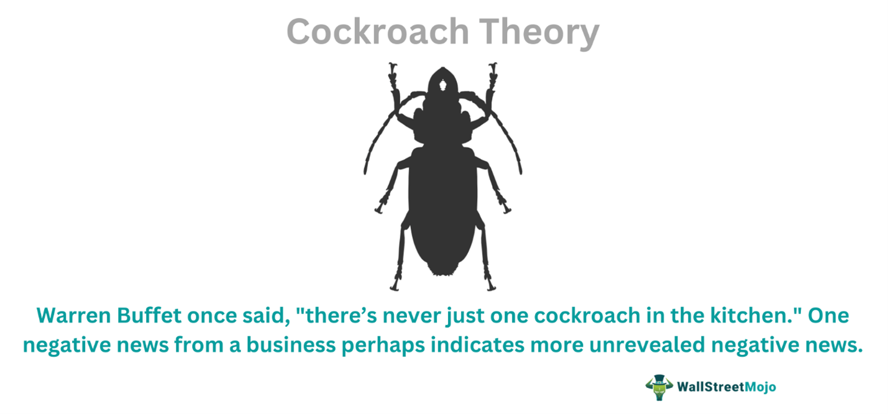

Algorithmic trading has evolved significantly over recent years, primarily due to advancements in fields such as psychology and data science. This evolution has enabled the development of more sophisticated trading strategies capable of analyzing market behaviors and predicting outcomes with enhanced precision. A notable concept within this interdisciplinary approach is the 'Cockroach Theory', a significant element in the field of behavioral finance with profound implications for trading decisions.

The Cockroach Theory operates on the premise that the disclosure of negative financial news often foretells additional similar disclosures. This financial concept is analogous to observing one visible cockroach, which implies the presence of more hidden from view. In financial markets, this theory suggests that an initial revelation of adverse news about a company could lead to similar disclosures from other companies within the same industry. The theory highlights the impact of sequential negative information on market psychology, which can lead to cascading effects as investors react to each new piece of information.



Understanding the Cockroach Theory and its implications in behavioral finance is crucial for optimizing algorithmic trading strategies. These strategies, which are predicated on quantitative models and automated decision-making, can benefit from integrating insights from behavioral finance. Behavioral finance examines cognitive biases and emotional responses that influence investor behavior, such as overconfidence, herd mentality, and loss aversion. By acknowledging these psychological factors, algorithmic traders can refine their models to anticipate market movements more accurately, thereby enhancing decision-making processes.

This article explores the relationship between the Cockroach Theory and behavioral finance, focusing on their influence on market psychology and their potential applications in algorithmic trading. The integration of these ideas into algorithmic models presents opportunities for developing more robust trading strategies that can navigate the complexities of financial markets with increased insight and efficiency.

## Table of Contents

## Understanding the Cockroach Theory

The Cockroach Theory in financial markets refers to the phenomenon where the emergence of one piece of bad news often signals the likelihood of additional negative information surfacing. This theory draws a parallel to the common saying, "when you see one cockroach, there are more you cannot see." In essence, it highlights the notion that bad news rarely occurs in isolation.

In financial contexts, the Cockroach Theory suggests that the initial disclosure of unfavorable information by one company within an industry can act as a precursor to similar revelations by other companies. This often leads to a series of negative disclosures impacting the entire sector, potentially causing widespread investor panic and market downturns.

The underlying principle of the Cockroach Theory is rooted in the interconnected nature of financial markets and the tendency for bad news to have a cascading effect. When one company reveals issues such as accounting irregularities, regulatory violations, or financial distress, it prompts stakeholders to scrutinize other firms within the same sector for similar problems. This heightened vigilance can unveil additional negative information, reinforcing the perception that the initial bad news was not an isolated incident.

In practice, the Cockroach Theory suggests that market participants should be cautious when encountering bad news from one firm and consider the broader implications for the industry. Recognizing the potential for further information shocks can influence trading strategies and risk management decisions. This theory underscores the importance of comprehensive due diligence and ongoing monitoring of market signals to anticipate and mitigate the impacts of cascading negative information events.

## Psychological Insights in Financial Markets

Behavioral finance examines how psychological factors and cognitive biases influence investors' decisions and market outcomes. These biases often lead to deviations from the predictions of traditional financial models, creating inefficiencies and opportunities within financial markets.

One of the most pervasive cognitive biases affecting market decisions is overconfidence. Overconfidence can cause investors to overestimate their knowledge, underestimate risks, and overtrade, thus leading to increased market [volatility](/wiki/volatility-trading-strategies) and suboptimal portfolio performance. For instance, overconfident traders are more likely to ignore objective data and rely heavily on their intuition or past successes, which might not always align with reality.

Herd mentality is another common bias that significantly impacts financial markets. It refers to the tendency of investors to follow the actions of a larger group, often leading to asset bubbles or market crashes. When investors prioritize conforming to the majority over their independent analysis, markets can become irrationally exuberant or excessively pessimistic.

Loss aversion is a well-documented psychological phenomenon where the pain of losses is felt more acutely than the joy of equivalent gains. This bias causes investors to hold onto losing positions longer than economically rational and to sell winning investments prematurely. Such behavior opposes the traditional financial advice of cutting losses quickly and letting profits run, leading to potentially reduced gains or amplified losses.

Understanding these behavioral biases can improve the identification of patterns that deviate from traditional financial models. By recognizing the influence of psychology on market dynamics, analysts and investors can better anticipate and navigate market anomalies. These insights also provide valuable data for developing more robust trading algorithms that can adapt to the erratic nature of human behavior, counteracting irrational trading tendencies and enhancing overall market efficiency.

## Algorithmic Trading and Behavioral Patterns

Algorithmic trading employs sophisticated mathematical models and predefined rules to execute trades with speed and precision. This approach leverages the processing power of computers to analyze vast amounts of financial data and execute trades at a scale and speed unattainable by human traders. By utilizing [algorithmic trading](/wiki/algorithmic-trading) systems, traders can take advantage of minute price discrepancies across markets, manage large-[volume](/wiki/volume-trading-strategy) trades, and maintain a consistent and disciplined trading approach.

Remarkably, the integration of behavioral insights enhances the functionality of these algorithms. Behavioral patterns observed in financial markets often result from cognitive biases and emotional reactions of market participants. By incorporating these patterns into trading algorithms, it becomes possible to anticipate and react to market anomalies driven by human psychology.

Algorithms are fine-tuned using behavioral data, allowing them to predict market movements more accurately. For example, a common behavioral bias is herd mentality, where traders follow the perceived actions of others, often leading to overvaluations or undervaluations in the market. By identifying indicators of herd behavior, algorithms can be programmed to detect these trends early, enabling traders to capitalize on subsequent price corrections.

Moreover, algorithms can utilize real-time sentiment analysis derived from news articles, financial reports, and social media updates to gauge market sentiment and adjust trading strategies accordingly. This adaptive approach allows for a more dynamic response to volatile market conditions, as behavioral finance provides insights into how psychological factors may influence market trends. 

For instance, algorithms might use a [machine learning](/wiki/machine-learning) model to recognize patterns of overreaction during earnings announcements. By training the model on historical data, where reactions were irrational and exaggerated, the algorithm can predict similar movements in current trading and adjust its strategy proactively. Python code, employing libraries such as Scikit-learn or TensorFlow, can be developed to implement such machine learning models.

```python
from sklearn.ensemble import RandomForestClassifier
from sklearn.model_selection import train_test_split

# Sample code for a basic model setup
# X might be historical market data, and y the corresponding market movements
X_train, X_test, y_train, y_test = train_test_split(X, y, test_size=0.2, random_state=42)

# Initialize the RandomForest model
model = RandomForestClassifier(n_estimators=100, random_state=42)

# Fit the model
model.fit(X_train, y_train)

# Predict market movements
predictions = model.predict(X_test)
```

By leveraging advanced models, algorithmic trading can incorporate a comprehensive understanding of human behavior patterns, thereby enhancing its predictions and decision-making processes. As these systems continue to evolve, they hold the potential to unlock new efficiencies and insights into trading strategies by marrying technical analysis with behavioral finance.

## Implementing Behavioral Finance in Algorithmic Models

Incorporating behavioral finance into algorithmic models involves recognizing and systematically integrating cognitive biases, such as overconfidence and loss aversion, to enhance trading outputs. Cognitive biases systematically affect decision-making processes, leading to predictable deviations from rationality. By acknowledging and modeling these biases, traders improve their ability to navigate complex market dynamics effectively.

Machine learning plays a crucial role in detecting and quantifying psychological patterns embedded in trading data. Machine learning algorithms can process vast amounts of historical data, identifying and classifying patterns in trader behaviors and market reactions. Sentiment analysis, a branch of machine learning focusing on emotional and opinion-oriented data, further enhances the ability to discern psychological states in the market. By analyzing social media content, news articles, and financial reports, sentiment analysis tools can assign sentiment scores to evaluate the overall market mood. These scores can be fed into algorithms as parameters to refine decision-making processes.

Python, widely used in the financial industry for its simplicity and robust libraries, offers tools like TensorFlow and PyTorch for machine learning, enabling traders and developers to build complex models that incorporate behavioral insights. Below is a basic example of implementing sentiment analysis using Python:

```python
from textblob import TextBlob
import pandas as pd

# Sample data
data = {'news': ['Company X reports unexpected losses', 
                 'Investor confidence in Company Y grows', 
                 'Market panics amid economic uncertainty']}

# Convert to DataFrame
df = pd.DataFrame(data)

# Function to compute sentiment
def get_sentiment(text):
    analysis = TextBlob(text)
    return analysis.sentiment.polarity

# Apply sentiment analysis
df['sentiment_score'] = df['news'].apply(get_sentiment)

print(df)
```

The integration of behavioral finance with machine learning and sentiment analysis results in more adaptive algorithmic trading strategies. These models can dynamically adjust trading parameters when specific cognitive biases are detected, such as adjusting predictions when overconfidence causes stock overvaluation. Additionally, algorithms using behavioral data can better anticipate market anomalies, recognizing early signs of overreaction or herd behavior.

In summary, implementing behavioral finance in algorithmic models not only enhances the predictive accuracy of these systems but also supports a more nuanced approach to market strategy development, responding effectively to the psychological inflections that traditional models might overlook. This integration serves as a significant step towards creating algorithms capable of adaptive learning and improved decision-making in fluctuating market conditions.

## Examples of Behavioral Finance in Algorithmic Trading

The disposition effect is a recognized behavioral phenomenon in financial markets where investors display a tendency to sell assets that have gained in value while retaining those that have dropped in value. This behavior often deviates from rational decision-making principles, which advocate for decisions based on expected future returns rather than past performance. Algorithmic trading models can be adapted to exploit this bias by recalibrating sell and hold strategies based on the historical patterns of asset performance. By detecting moments when traders are likely to exhibit the disposition effect, models can execute trades that take advantage of these inefficiencies, thereby maximizing returns.

Overreaction and underreaction to news events are common behavioral biases that can significantly impact financial markets. Overreaction occurs when investors respond too strongly to news, leading to exaggerated price movements that deviate from fundamental values. Conversely, underreaction involves a tempered response, where price adjustments are slower than expected. Trading algorithms can be designed to identify these biases by monitoring news sentiment and price volatilities. By systematically analyzing the textual and quantitative elements of news and correlating them with market movements, algorithms can predict and capitalize on temporary price deviations. Sentiment analysis tools, alongside machine learning models, can facilitate this by quantifying investor sentiment and its probable market impact.

A salient example of the Cockroach Theory in practice is the Enron scandal, where revelations of accounting fraud led to a cascade of adverse news in both the company and its sector. This phenomenon aligns with the Cockroach Theory's assertion that the emergence of one piece of bad news typically signals the likelihood of additional negative information. In algorithmic trading, recognizing signs of this cascading effect is crucial. By implementing models that are sensitive to news frequency and sentiment within specific industries, traders can adjust their strategies preemptively, potentially shorting stocks likely to follow the negative news wave or divesting from vulnerable sectors. This approach underlines the crucial interplay between news sentiment analysis and algorithmic adjustments in leveraging behavioral finance patterns to yield favorable trading outcomes.

## Challenges and Opportunities

Modeling behavioral patterns into algorithms presents both significant challenges and substantial opportunities for profit. One of the primary challenges in this area is the inherent unpredictability of human behavior. Unlike traditional financial models, which often rely on historical price movements and rational decision-making, behavioral finance incorporates psychological factors and cognitive biases that can lead to seemingly irrational actions. This requires sophisticated computational models that can handle the complexity and variability of human-driven market dynamics.

To effectively integrate behavioral insights into trading algorithms, extensive data analysis is crucial. It involves the collection and examination of large datasets, including market transactions, investor sentiment, and social media trends. These datasets help identify patterns associated with cognitive biases such as overconfidence, herd behavior, and loss aversion. The complexity of this data demands the use of advanced analytical techniques like machine learning and natural language processing to extract meaningful insights.

Developing models that can adapt to both market data and psychological signals is essential. Algorithms need to be capable of recognizing shifts in market sentiment and investor behavior in real-time. For example, a sudden surge in negative sentiment on social media platforms can act as a signal for potential market movements. Incorporating indicators like the volume of mentions or the sentiment of posts into trading algorithms can enhance their predictive capabilities.

Adaptive models can be designed using a variety of methods. For instance, [reinforcement learning](/wiki/reinforcement-learning), a type of machine learning where algorithms learn by interacting with the environment, can be employed to simulate and adapt to market conditions. By continuously updating their strategies based on feedback from market performance, these models can better handle the nuances of human behavior.

Consider a simple reinforcement learning model implemented in Python using the popular library `stable-baselines3`. This would allow an algorithm to learn optimal trading strategies by balancing exploration (trying new strategies) with exploitation (using known strategies that work). Here is a basic example to illustrate the concept:

```python
from stable_baselines3 import PPO
from stable_baselines3.common.envs import DummyVecEnv

# Assume 'MarketEnv' is a pre-defined trading environment
env = DummyVecEnv([lambda: MarketEnv()])

# Define the model - using PPO for stable performance in continuous action spaces
model = PPO('MlpPolicy', env, verbose=1)

# Train the agent
model.learn(total_timesteps=10000)

# Test the trained model
obs = env.reset()
for _ in range(1000):
    action, _states = model.predict(obs, deterministic=True)
    obs, rewards, done, info = env.step(action)
    env.render()
```

In the above code, `MarketEnv` would be an environment conforming to OpenAI's gym interface, encapsulating the market dynamics and behavioral factors. The algorithm repeatedly interacts with this environment, optimizing its strategy based on feedback, which mimics real-world trading decisions under behavioral influences.

The opportunities presented by successfully integrating behavioral finance into algorithmic trading are substantial. Algorithms that can predict and react to psychological market patterns have the potential to identify profitable trading opportunities that traditional models might overlook. By accounting for the nuances of human behavior, these algorithms can offer a strategic edge, making more informed decisions and ultimately enhancing both stability and profitability in dynamic market environments.

## Conclusion

Integrating behavioral finance principles with algorithmic trading offers a robust framework for understanding and navigating financial markets. By acknowledging and incorporating the psychological factors that influence investor behavior, traders can develop strategies that are not only reactive to historical data but also predictive of market sentiment and anomalies. This comprehensive approach to market analysis enhances the ability to make well-informed decisions that mitigate potential losses while maximizing gains.

Technological advancements present numerous opportunities for the integration of behavioral insights into trading systems. Machine learning algorithms, natural language processing (NLP), and sentiment analysis tools have become increasingly sophisticated, enabling a more nuanced understanding of market psychology. As these technologies evolve, there is significant potential to leverage them for the real-time analysis of trading behaviors, enhancing the adaptability and precision of algorithmic trading models.

Furthermore, the integration of behavioral finance into algorithmic trading can contribute to market stability and profitability. By anticipating psychological responses to market events, algorithms can be designed to avoid the common pitfalls associated with cognitive biases such as overconfidence or herd mentality. This proactive approach not only facilitates more strategic trading decisions but also supports the development of resilient trading systems capable of thriving in dynamic market conditions.

As the field continues to evolve, the synthesis of behavioral finance and algorithmic trading will likely lead to the creation of innovative strategies that redefine market interactions, offering substantial opportunities for traders to succeed in increasingly complex financial ecosystems.

## References & Further Reading

[1]: Barberis, N., & Thaler, R. (2003). ["A Survey of Behavioral Finance."](https://www.nber.org/papers/w9222) In G. M. Constantinides, M. Harris & R. M. Stulz (Eds.), Handbook of the Economics of Finance.

[2]: Kahneman, D., & Tversky, A. (1979). ["Prospect Theory: An Analysis of Decision under Risk."](http://web.mit.edu/curhan/www/docs/Articles/15341_Readings/Behavioral_Decision_Theory/Kahneman_Tversky_1979_Prospect_theory.pdf) Econometrica.

[3]: Shiller, R. J. (2003). ["From Efficient Markets Theory to Behavioral Finance."](https://www.aeaweb.org/articles?id=10.1257/089533003321164967) Journal of Economic Perspectives.

[4]: Chen, M. K., Lakshminarayanan, V., & Santos, L. R. (2006). ["How Basic Are Behavioral Biases? Evidence from Capuchin Monkey Trading Behavior."](https://www.journals.uchicago.edu/doi/abs/10.1086/503550) The American Economic Review.

[5]: Montier, J. (2007). ["Behavioral Finance: Insights into Irrational Minds and Markets."](https://www.amazon.com/Behavioural-Finance-Insights-Irrational-Markets/dp/0470844876) John Wiley & Sons.

[6]: Thaler, R. H. (1980). ["Toward a Positive Theory of Consumer Choice."](https://www.sciencedirect.com/science/article/pii/0167268180900517) Journal of Economic Behavior & Organization.