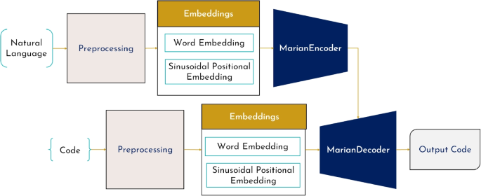

## Table of Contents

## What is a Code Generation Transformer?

A Code Generation Transformer, often abbreviated as CodeT, is a type of artificial intelligence model designed to generate code. It uses a transformer architecture, which is a type of neural network commonly used in natural language processing tasks. The transformer model is good at understanding and generating sequences of text, which makes it suitable for generating code because code is essentially a sequence of text that follows specific rules and patterns.

When you use a Code Generation Transformer, you give it a prompt or a set of instructions, and it produces code based on those inputs. For example, if you ask it to write a function that calculates the area of a circle, it might generate a piece of code that looks like this:

```python
def calculate_circle_area(radius):
    return 3.14159 * radius * radius
```

The model learns from a large dataset of existing code, which helps it understand how to write code that follows best practices and is likely to work correctly. This makes Code Generation Transformers useful tools for programmers who want to speed up their coding process or get help with writing complex pieces of code.

## How do Code Generation Transformers differ from traditional code generation methods?

Code Generation Transformers differ from traditional code generation methods mainly in how they work and how they learn. Traditional methods often use rule-based systems or templates to generate code. This means they follow a set of pre-defined rules to create code that fits certain patterns. For example, a traditional method might use a template to generate a function that adds two numbers. These methods are good at producing code that follows strict guidelines, but they can be limited because they rely on the rules and templates that humans set up.

On the other hand, Code Generation Transformers use a type of [artificial intelligence](/wiki/ai-artificial-intelligence) called [deep learning](/wiki/deep-learning). They learn from a large amount of existing code, which allows them to understand more complex patterns and relationships in code. Instead of following strict rules, they predict what code should come next based on what they've learned. For instance, if you ask a Code Generation Transformer to write a function that calculates the area of a circle, it might produce something like this:

```python
def calculate_circle_area(radius):
    return 3.14159 * radius * radius
```

This ability to learn from examples makes Code Generation Transformers more flexible and capable of generating code that's more creative and better suited to specific tasks. They can adapt to different programming styles and languages, making them a powerful tool for modern software development.

## What are some popular Code Generation Transformer models?

One popular Code Generation Transformer model is called CodeT5. It's designed to understand and generate code in many different programming languages. CodeT5 is good at tasks like translating code from one language to another or fixing bugs in code. It learns from a big collection of code examples, which helps it understand how to write code that follows best practices and works well. For example, if you ask CodeT5 to write a function that adds two numbers, it might generate something like this:

```python
def add_numbers(a, b):
    return a + b
```

Another well-known model is called Codex, which was developed by the company xAI. Codex is special because it can generate code from natural language descriptions. This means you can tell it what you want in regular sentences, and it will write the code for you. Codex is used in tools like GitHub Copilot, which helps programmers write code faster. For instance, if you tell Codex to "write a function to calculate the area of a circle," it might produce this:

```python
def calculate_circle_area(radius):
    return 3.14159 * radius * radius
```

These models show how powerful Code Generation Transformers can be, making it easier for people to create and work with code.

## What is CodeBERT and how does it work?

CodeBERT is a type of AI model that helps understand and work with code. It's made by a company called Microsoft and it's good at tasks like translating code from one language to another or finding mistakes in code. CodeBERT learns from a big collection of code examples, which helps it understand how code works and how to write it correctly. For example, if you ask CodeBERT to translate a piece of Python code into JavaScript, it can do that by understanding the patterns in both languages.

CodeBERT uses a special kind of [neural network](/wiki/neural-network) called a transformer, which is really good at understanding sequences of text. When you give CodeBERT a piece of code, it looks at the whole thing and tries to figure out what it means. It does this by breaking the code into smaller parts and looking at how those parts fit together. This helps CodeBERT understand the structure of the code and how to change it or fix it. For instance, if you give CodeBERT a function in Python that adds two numbers, it can understand that and maybe translate it into another language like this:

```javascript
function addNumbers(a, b) {
    return a + b;
}
```

This way, CodeBERT can help programmers work with code more easily and quickly.

## How does CodeT5 improve upon existing code generation models?

CodeT5 improves upon existing code generation models by being able to handle a wider variety of tasks and programming languages. It can do things like translate code from one language to another, fix bugs, and even generate new code from scratch. This is because CodeT5 is trained on a huge amount of code from different languages and sources, which helps it understand many different coding styles and patterns. For example, if you ask CodeT5 to write a function that calculates the area of a circle, it might produce something like this:

```python
def calculate_circle_area(radius):
    return 3.14159 * radius * radius
```

Another way CodeT5 improves on other models is by being more flexible and accurate. It uses a special kind of neural network called a transformer, which is really good at understanding and generating sequences of text. This helps CodeT5 not just follow strict rules, but also learn from examples and adapt to new situations. This makes it a powerful tool for programmers who need help with complex coding tasks or want to speed up their work.

## What unique features does PICARD offer in code generation?

PICARD, which stands for "Program Induction with Code Attention and Recursive Decomposition," offers unique features in code generation by using a special method called recursive decomposition. This means it breaks down complex coding tasks into smaller, easier parts. By doing this, PICARD can handle tasks that other models might find too hard. It also uses something called code attention, which helps it focus on the most important parts of the code it's working on. This makes PICARD very good at understanding and generating code that's both correct and efficient.

Another feature that makes PICARD stand out is its ability to learn from examples in a way that's different from other models. It can look at a piece of code and figure out not just what it does, but also how it's structured and why it's written that way. This helps PICARD generate code that follows best practices and fits well with existing code. For example, if you ask PICARD to write a function that calculates the area of a circle, it might produce something like this:

```python
def calculate_circle_area(radius):
    return 3.14159 * radius * radius
```

This ability to understand and generate code in a more human-like way makes PICARD a powerful tool for programmers who need help with complex coding tasks.

## Can you explain the architecture of CuBERT?

CuBERT is a type of AI model that helps understand and work with code. It's made by Google and uses a special kind of neural network called a transformer. This transformer is good at understanding sequences of text, which is helpful for code because code is just a sequence of text that follows certain rules. CuBERT learns from a big collection of code examples, which helps it understand how code works and how to write it correctly. For example, if you give CuBERT a piece of code, it can figure out what it does and maybe even suggest ways to make it better.

One unique thing about CuBERT is that it uses something called "masked language modeling." This means it can predict missing parts of code by looking at the rest of the code around it. For instance, if you have a piece of code with some parts missing, CuBERT can fill in those parts based on what it knows about how code usually works. This makes CuBERT really good at understanding and fixing code. If you ask CuBERT to complete a function that adds two numbers, it might produce something like this:

```python
def add_numbers(a, b):
    return a + b
```

This ability to understand and generate code makes CuBERT a helpful tool for programmers who need help with their coding tasks.

## How are Code Generation Transformers trained?

Code Generation Transformers are trained using a large amount of code from different programming languages. They learn by looking at this code and trying to understand the patterns and rules that make it work. This process is called "training on a dataset." The model looks at many examples of code and tries to figure out how to write new code that follows the same patterns. For example, if the model sees a lot of functions that add numbers, it will learn how to write its own functions that do the same thing.

During training, the model uses a special method called "masked language modeling." This means it tries to predict missing parts of code by looking at the rest of the code around it. For instance, if a piece of code has some parts missing, the model will try to fill in those parts based on what it knows about how code usually works. This helps the model understand and generate code more accurately. If you ask the model to complete a function that calculates the area of a circle, it might produce something like this:

```python
def calculate_circle_area(radius):
    return 3.14159 * radius * radius
```

This way, the model learns to write code that follows best practices and works well, making it a helpful tool for programmers.

## What types of programming languages can Code Generation Transformers handle?

Code Generation Transformers can handle many different programming languages. They are trained on a large collection of code from languages like Python, JavaScript, Java, and C++. This means they can understand and generate code in these languages and others, making them very useful for programmers who work with different coding languages. For example, if you ask a Code Generation Transformer to write a function that adds two numbers, it might produce something like this in Python:

```python
def add_numbers(a, b):
    return a + b
```

The ability of Code Generation Transformers to work with multiple languages comes from their training data. They learn from examples in each language, which helps them understand the specific rules and patterns of those languages. This makes them flexible and capable of generating code that fits the needs of different programming tasks. For instance, if you need a function to calculate the area of a circle in JavaScript, the model might generate this:

```javascript
function calculateCircleArea(radius) {
    return 3.14159 * radius * radius;
}
```

This versatility makes Code Generation Transformers a powerful tool for modern software development, helping programmers work more efficiently across different languages.

## What are the main challenges faced when using Code Generation Transformers?

One of the main challenges when using Code Generation Transformers is making sure the code they produce is correct and follows best practices. These models learn from a lot of code, but sometimes they can make mistakes or generate code that doesn't work as expected. For example, if you ask a Code Generation Transformer to write a function that calculates the area of a circle, it might produce something like this:

```python
def calculate_circle_area(radius):
    return 3.14159 * radius * radius
```

But if the model hasn't seen enough examples of this kind of function, it might get it wrong. Another challenge is that these models can be hard to understand. They work like a "black box," meaning it's not always clear how they come up with their answers. This can make it difficult for programmers to trust the code the model generates or to fix it if there are problems.

Another challenge is that Code Generation Transformers need a lot of computing power to work well. Training these models requires a huge amount of data and powerful computers, which can be expensive and time-consuming. Once trained, running the model to generate code also uses a lot of resources. This can make it hard for smaller teams or individual programmers to use these models effectively. Additionally, these models might struggle with very specific or new programming tasks because they rely on what they've learned from their training data. If the task is too different from what they've seen before, the model might not be able to generate the right code.

## How can Code Generation Transformers be integrated into existing software development workflows?

Code Generation Transformers can be integrated into existing software development workflows by using them as tools that help programmers write code faster and more efficiently. For example, a developer might use a Code Generation Transformer like Codex through a tool like GitHub Copilot. This tool can suggest code completions or even write entire functions based on the programmer's prompts. If a developer is working on a function to calculate the area of a circle, they might type a few lines, and the model could suggest the rest of the function, like this:

```python
def calculate_circle_area(radius):
    return 3.14159 * radius * radius
```

This integration can save time and help developers focus on more complex parts of their projects. Another way to use Code Generation Transformers is in code review and refactoring. These models can analyze existing code and suggest improvements or fixes. For instance, if a piece of code has a bug, a Code Generation Transformer might identify the issue and propose a corrected version. By incorporating these models into the development process, teams can improve the quality of their code and speed up their workflow, making the overall development process smoother and more productive.

## What are the future prospects and potential advancements in Code Generation Transformers?

The future of Code Generation Transformers looks very promising. As more and more code is written and shared, these models will have even more data to learn from. This means they could get better at understanding and generating code in all sorts of programming languages. Researchers are also working on making these models more efficient, so they won't need as much computing power to run. This could make them easier for everyone to use, even if they don't have big computers. Another exciting area is making these models better at understanding what programmers really want. For example, if you ask a model to write a function that calculates the area of a circle, it might produce something like this:

```python
def calculate_circle_area(radius):
    return 3.14159 * radius * radius
```

In the future, Code Generation Transformers could also become more specialized. This means they could be trained to be really good at certain types of programming tasks, like writing code for web applications or fixing bugs in software. They might also get better at working with other AI tools, making them part of a bigger system that helps with all parts of software development. As these models keep improving, they could change the way programmers work, making it easier and faster to write good code.

## References & Further Reading

[1]: Vaswani, A., Shazeer, N., Parmar, N., Uszkoreit, J., Jones, L., Gomez, A. N., ... & Polosukhin, I. (2017). ["Attention is All You Need."](https://arxiv.org/abs/1706.03762) Advances in Neural Information Processing Systems, 30.

[2]: Feng, Z., Guo, D., Tang, D., Duan, N., Feng, X., Qin, B., ... & Liu, T. (2020). ["CodeBERT: A Pre-Trained Model for Programming and Natural Languages."](https://arxiv.org/abs/2002.08155) arXiv preprint arXiv:2002.08155.

[3]: Chen, M., Tworek, J., Jun, H., Yuan, Q., de Oliveira Pinto, H. P., Kaplan, J., ... & Zaremba, W. (2021). ["Evaluating Large Language Models Trained on Code."](https://arxiv.org/abs/2107.03374) arXiv preprint arXiv:2107.03374.

[4]: Wang, Y., Liu, S., Xia, F., He, P., Chen, W., Zhou, M., & Gao, J. (2021). ["CodeT5: Identifier-aware Unified Pre-trained Encoder-Decoder Models for Code Understanding and Generation."](https://www.nature.com/articles/s41467-025-59020-w) arXiv preprint arXiv:2109.00859.

[5]: Ahmed, F., & Devanbu, P. (2021). ["The Impact of Code Attention in Practical Program Synthesis."](https://www.researchgate.net/publication/366918308_Few-shot_training_LLMs_for_project-specific_code-summarization) Proceedings of the AAAI Conference on Artificial Intelligence, 35(14), 12221-12229.

[6]: Furrer, D., Coavoux, M., & Narayan, S. (2020). ["Toward Interpretable Code Generation by Meaningful Code Attention."](https://arxiv.org/abs/1808.09408) arXiv preprint arXiv:2009.08522.

[7]: Allamanis, M., Barr, E. T., Bird, C., & Sutton, C. (2018). ["A Survey of Machine Learning for Big Code and Naturalness."](https://dl.acm.org/doi/10.1145/3212695) ACM Computing Surveys (CSUR), 51(4), 1-37.