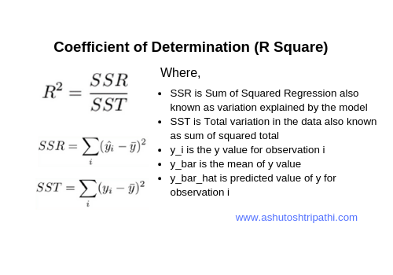

## Table of Contents

## What is the coefficient of determination?

The coefficient of determination, often known as R-squared, is a statistical measure used to evaluate how well the data in a model fits a line or curve. It tells us the proportion of the variance in the dependent variable that is predictable from the independent variable(s). In simpler terms, it shows how well changes in the independent variable explain changes in the dependent variable. The value of R-squared ranges from 0 to 1, where a value closer to 1 indicates a better fit of the model to the data.

For example, if you are trying to predict a student's test score based on the number of hours they studied, R-squared would tell you how much of the variation in test scores can be explained by the variation in study hours. If R-squared is 0.80, this means that 80% of the variation in test scores can be explained by the number of hours studied. However, a high R-squared does not necessarily mean that the model is good; it just means that the model explains a large portion of the variability of the response data around its mean. It is important to consider other factors and not rely solely on R-squared when evaluating a model's effectiveness.

## How is the coefficient of determination calculated?

The coefficient of determination, or R-squared, is calculated using the data from your model. You start by finding the total sum of squares (TSS), which measures the total variation in your dependent variable. Then, you calculate the regression sum of squares (RSS), which shows how much of that variation your model explains. Finally, you find the residual sum of squares (ESS), which is the variation that your model does not explain. R-squared is then calculated as 1 minus the ratio of ESS to TSS. In simpler terms, it's 1 minus the unexplained variation divided by the total variation.

To put it another way, R-squared tells you how much better your model is at predicting the dependent variable compared to just using the mean of the dependent variable. If your model's predictions are close to the actual values, the ESS will be small, making R-squared closer to 1. If your model's predictions are not much better than just using the mean, the ESS will be large, and R-squared will be closer to 0. This calculation helps you understand how well your model fits the data.

## What does the coefficient of determination measure?

The coefficient of determination, also called R-squared, measures how well a model fits the data. It tells you the percentage of the change in the dependent variable that can be explained by the changes in the independent variable or variables. For example, if R-squared is 0.75, it means that 75% of the variation in the dependent variable can be explained by the independent variable.

R-squared is a number between 0 and 1. A value closer to 1 means the model fits the data well, while a value closer to 0 means the model does not fit the data well. However, a high R-squared does not always mean the model is good; it just means the model explains a lot of the variation in the data. It's important to look at other things too when deciding if a model is useful.

## What is the range of the coefficient of determination?

The coefficient of determination, also known as R-squared, has a range from 0 to 1. This means it can be any number between 0 and 1, including 0 and 1 themselves. If R-squared is 0, it means the model does not explain any of the variation in the dependent variable. If R-squared is 1, it means the model explains all of the variation in the dependent variable.

In simple terms, a higher R-squared value means the model fits the data better. For example, if R-squared is 0.8, it means 80% of the changes in the dependent variable can be explained by the independent variable. But remember, even if R-squared is high, it does not always mean the model is good. You should also look at other things to see if the model really works well.

## How is the coefficient of determination related to the correlation coefficient?

The coefficient of determination, or R-squared, and the correlation coefficient, often symbolized as "r," are closely related. The correlation coefficient measures the strength and direction of the linear relationship between two variables. It ranges from -1 to 1, where a value of 1 means a perfect positive linear relationship, -1 means a perfect negative linear relationship, and 0 means no linear relationship. The coefficient of determination, on the other hand, is the square of the correlation coefficient (R-squared = r^2). This means that if you know the correlation coefficient, you can easily calculate the coefficient of determination by squaring it.

For example, if the correlation coefficient between two variables is 0.8, the coefficient of determination would be 0.64 (0.8 squared). This tells us that 64% of the variation in the dependent variable can be explained by the independent variable. Because R-squared is always a positive value between 0 and 1, it does not tell us about the direction of the relationship, only the strength of the linear fit. This makes it a useful tool for understanding how well a model fits the data, while the correlation coefficient gives more detailed information about the nature of the relationship between the variables.

## What does a high coefficient of determination indicate?

A high coefficient of determination, or R-squared, means that the model fits the data well. If R-squared is close to 1, it tells us that a large part of the changes in the dependent variable can be explained by the independent variable. For example, if R-squared is 0.9, it means 90% of the changes in the dependent variable are explained by the independent variable. This is good because it shows that the model is doing a good job at predicting the outcome based on the input.

However, a high R-squared does not always mean the model is perfect. It just means that the model explains a lot of the variation in the data. Other things like the model being too simple or too complicated, or not including all the important factors, can still make the model not work well even if R-squared is high. So, while a high R-squared is a good sign, it's important to look at other things too to make sure the model is really useful.

## What does a low coefficient of determination indicate?

A low coefficient of determination, or R-squared, means that the model does not fit the data very well. If R-squared is close to 0, it tells us that the independent variable does not explain much of the changes in the dependent variable. For example, if R-squared is 0.1, it means only 10% of the changes in the dependent variable can be explained by the independent variable. This is not good because it shows that the model is not doing a good job at predicting the outcome based on the input.

However, a low R-squared does not always mean the model is useless. It just means that other factors, not included in the model, might be affecting the dependent variable more. Sometimes, even if R-squared is low, the model might still be useful for understanding the relationship between the variables. It's important to look at other things like the type of data and the purpose of the model to decide if a low R-squared is a problem.

## How can the coefficient of determination be used to assess model fit?

The coefficient of determination, or R-squared, helps us see how well a model fits the data. It tells us how much of the change in the dependent variable can be explained by the independent variable. If R-squared is close to 1, it means the model fits the data well. For example, if R-squared is 0.9, it means 90% of the changes in the dependent variable are explained by the independent variable. This is good because it shows that the model is doing a good job at predicting the outcome based on the input.

However, R-squared is not the only thing to look at when checking how good a model is. A high R-squared might mean the model fits the data well, but it does not always mean the model is perfect. Other things like the model being too simple or too complicated, or not including all the important factors, can still make the model not work well. Also, a low R-squared does not always mean the model is useless. It just means that other factors, not included in the model, might be affecting the dependent variable more. So, while R-squared is a helpful tool, it's important to look at other things too to make sure the model is really useful.

## What are the limitations of using the coefficient of determination?

The coefficient of determination, or R-squared, has some limitations that you should know about. One big problem is that R-squared can make you think a model is good when it's actually not. Just because R-squared is high doesn't mean the model is the best one for your data. It only shows how well the model fits the data, but it doesn't tell you if the model is too simple or too complicated. Sometimes, adding more variables to a model can make R-squared go up, even if those variables don't really help predict the outcome better.

Another limitation is that R-squared doesn't tell you about the direction of the relationship between the variables. It only shows how much of the change in the dependent variable can be explained by the independent variable, but it doesn't say if the relationship is positive or negative. Also, R-squared might not be useful for all types of models. For example, in some non-linear models or when you're working with time series data, other measures might be better for checking how well the model fits the data. So, while R-squared is a helpful tool, you should always look at other things too to make sure your model is really good.

## How does the coefficient of determination differ between simple and multiple regression?

The coefficient of determination, or R-squared, works the same way in both simple and multiple regression, but there's a small difference. In simple regression, you're looking at how one independent variable affects the dependent variable. R-squared tells you how much of the change in the dependent variable can be explained by that one independent variable. For example, if you're trying to predict a student's test score based on how many hours they studied, R-squared would show how well the number of study hours explains the test scores.

In multiple regression, you're looking at how more than one independent variable affects the dependent variable. R-squared still tells you how much of the change in the dependent variable can be explained, but now it's based on all the independent variables together. For example, if you're trying to predict a student's test score based on both the number of hours they studied and the number of hours they slept, R-squared would show how well these two factors together explain the test scores. The main difference is that in multiple regression, R-squared can go up if you add more variables, even if those variables don't really help predict the outcome better.

## Can the coefficient of determination be misleading, and if so, how?

The coefficient of determination, or R-squared, can be misleading because it might make you think a model is good when it's not. Just because R-squared is high doesn't mean the model is perfect. It only shows how well the model fits the data, but it doesn't tell you if the model is too simple or too complicated. Sometimes, adding more variables to a model can make R-squared go up, even if those variables don't really help predict the outcome better. This can trick you into thinking the model is better than it actually is.

Another way R-squared can be misleading is that it doesn't tell you about the direction of the relationship between the variables. It only shows how much of the change in the dependent variable can be explained by the independent variable, but it doesn't say if the relationship is positive or negative. Also, R-squared might not be useful for all types of models. For example, in some non-linear models or when you're working with time series data, other measures might be better for checking how well the model fits the data. So, while R-squared is a helpful tool, you should always look at other things too to make sure your model is really good.

## What are some advanced statistical considerations when interpreting the coefficient of determination?

When interpreting the coefficient of determination, or R-squared, it's important to remember that a high value doesn't always mean your model is the best one. R-squared can go up if you add more variables to your model, even if those variables don't really help predict the outcome better. This is called overfitting, where the model fits the data too well, including the random noise, and might not work well with new data. To avoid this, you can use adjusted R-squared, which takes into account the number of variables in the model and gives a more accurate picture of how well the model fits the data. Adjusted R-squared will only go up if the new variable improves the model more than you would expect by chance.

Another thing to think about is that R-squared doesn't tell you if your model is useful in a practical way. Just because your model explains a lot of the variation in the data doesn't mean it's good for making predictions or decisions. You should also look at other measures like the mean squared error or the mean absolute error to see how well your model predicts the actual values. Also, R-squared might not work well for all types of models, like non-linear models or time series data. In these cases, other measures like the coefficient of determination for non-linear models or the Akaike Information Criterion (AIC) for time series might be better for checking how well the model fits the data.

## What is the Coefficient of Determination and how do we understand it?

The coefficient of determination, commonly denoted as R-squared (R²), is a statistical measure that assesses the proportion of variance in a dependent variable that can be explained by one or more independent variables in a regression model. It is an essential tool in statistical analysis for quantifying the goodness of fit of a model. The importance of R-squared lies in its ability to reveal how well a model predicts the outcomes of a dependent variable based on the associated independent variables.

Mathematically, R-squared is defined as:

$$
R² = 1 - \frac{\text{SS}_{\text{res}}}{\text{SS}_{\text{tot}}}
$$

where $\text{SS}_{\text{res}}$ is the sum of squares of residuals, representing the portion of the total variation in the observed data that the model does not capture. $\text{SS}_{\text{tot}}$ is the total sum of squares, representing the overall variation in the dependent variable. R-squared thus measures the proportion of this total variation that the model does account for.

The values of R-squared range from 0 to 1. An R-squared value of 0 indicates that the proposed model fails to explain any of the variability of the response data around its mean. Conversely, an R-squared value of 1 indicates that the model explains all the variability of the response data. Generally, higher R-squared values indicate a better fit of the model to the data, but it is also crucial to consider the context and specific application in which the model is used.

Outside of trading, R-squared finds application across various fields to measure predictive accuracy. For instance, in real estate, R-squared can be used in a model predicting property prices, where the independent variables could be square footage, location, number of bedrooms, etc. A financial analyst may use R-squared to examine the relationship between a company's financial performance and market trends, where a high R-squared value could indicate that market trends reliably predict company performance. Environmental scientists might apply R-squared in climate models to understand how well variables such as greenhouse gas emissions or deforestation explain changes in global temperature trends.

Despite its utility, R-squared has its limitations; a high R-squared does not imply that the independent variables are the cause of variations in the dependent variable or that the model is valid without considering other statistical validations. Therefore, it is often used alongside other statistical tests and metrics to provide more robust insights into model performance.

## How can trading strategies be evaluated using R-squared?

Algorithmic trading has become an integral part of modern financial markets, utilizing advanced mathematical models and computational algorithms to execute trades at high speed and frequency. Among the numerous metrics available to evaluate these trading strategies, the coefficient of determination, or R-squared, is particularly valuable. This section explores how traders can leverage R-squared to assess the efficacy of their trading models and make informed strategic decisions.

### Calculating R-squared for a Trading Model

To compute R-squared for a trading model, traders typically follow these steps:

1. **Collect Data**: Gather historical price data and any relevant features used in the trading strategy, such as technical indicators or market signals.

2. **Build the Model**: Develop the predictive model using statistical techniques or machine learning algorithms. Common methods include linear regression, where the dependent variable could be future returns or price movements.

3. **Obtain Predictions**: Use the model to predict the dependent variable based on the independent variables.

4. **Compute R-squared**: Compare the predicted values against the actual values to calculate R-squared. The formula for R-squared is:
$$
   R^2 = 1 - \frac{\sum (y_i - \hat{y}_i)^2}{\sum (y_i - \bar{y})^2}

$$

   Here, $y_i$ represents the actual values, $\hat{y}_i$ the predicted values, and $\bar{y}$ the mean of the actual values. The numerator sums the squares of the differences between the actual and predicted values (the residual sum of squares), while the denominator sums the squares of the differences between the actual values and their mean (the total sum of squares).

5. **Implementation in Python**:

   ```python
   from sklearn.metrics import r2_score

   # y_true: actual values
   # y_pred: predicted values from the model

   r_squared = r2_score(y_true, y_pred)
   print(f"R-squared: {r_squared}")
   ```

### Interpretation of R-squared Results

A high R-squared value indicates that a large proportion of the variance in the dependent variable is explained by the model. However, within trading strategies, a high R-squared can sometimes be misleading:

- **Overfitting**: If R-squared is excessively high, it may indicate that the model is too closely fitted to the historical data, capturing noise rather than the underlying trend. This could lead to poor out-of-sample performance.

- **Model Context**: The context in which the model is applied greatly affects interpretation. In certain trading strategies, a relatively lower R-squared might still be desirable if the model is effectively capturing key market turns.

### Adjusting Strategies Based on R-squared Feedback

Traders can use R-squared not as an absolute measure but as part of a diagnostic process:

- **Model Refinement**: A low R-squared suggests that the model may need additional features or a different algorithmic approach to improve its explanatory power.

- **Strategy Adaptation**: If the model's performance does not align with market conditions, traders might consider diversifying signals or incorporating additional economic indicators.

### Integrating R-squared with Other Metrics

R-squared should be used in conjunction with other financial and statistical metrics to gain a comprehensive understanding of a strategy’s performance:

- **Sharpe Ratio**: Analyzes the risk-adjusted return, providing insight into the efficiency of a trading strategy.

- **P-values and T-tests**: Assess the statistical significance of model parameters, ensuring that features contribute meaningful information.

- **Drawdowns**: Evaluate the risk of a trading strategy by examining peak-to-trough declines.

In conclusion, while R-squared is a powerful tool for evaluating trading models, it should not be used in isolation. By combining R-squared with other analytical metrics, traders can develop a more nuanced understanding of their strategies, leading to more robust and adaptive trading systems.

## References & Further Reading

[1]: Bergstra, J., Bardenet, R., Bengio, Y., & Kégl, B. (2011). ["Algorithms for Hyper-Parameter Optimization."](https://papers.nips.cc/paper/4443-algorithms-for-hyper-parameter-optimization) Advances in Neural Information Processing Systems 24.

[2]: ["Advances in Financial Machine Learning"](https://www.amazon.com/Advances-Financial-Machine-Learning-Marcos/dp/1119482089) by Marcos Lopez de Prado

[3]: ["Evidence-Based Technical Analysis: Applying the Scientific Method and Statistical Inference to Trading Signals"](https://www.amazon.com/Evidence-Based-Technical-Analysis-Scientific-Statistical/dp/0470008741) by David Aronson

[4]: ["Machine Learning for Algorithmic Trading"](https://github.com/stefan-jansen/machine-learning-for-trading) by Stefan Jansen

[5]: ["Quantitative Trading: How to Build Your Own Algorithmic Trading Business"](https://www.amazon.com/Quantitative-Trading-Build-Algorithmic-Business/dp/1119800064) by Ernest P. Chan