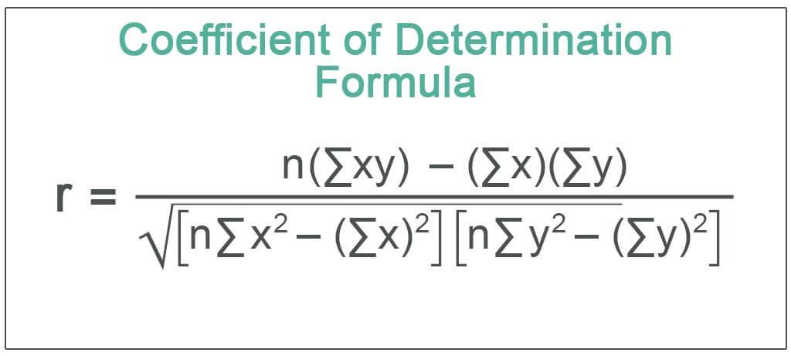

Algorithmic trading, often referred to as algo trading, is a method of executing orders using automated and pre-programmed trading instructions that account for variables such as time, price, and volume. This method leverages the speed and computational power of computers to perform trading at a pace and frequency that would be impossible for human traders. Increasingly, algorithmic trading has become a significant component of the financial markets, accounting for a substantial percentage of trades in markets worldwide. The growth of this trading approach is attributable to its ability to provide liquidity, reduce trading costs, and enable sophisticated investment strategies.

In the evaluation and construction of algorithmic trading strategies, statistical tools play a pivotal role. These tools help traders to analyze past market data and forecast future price movements, thereby improving the decision-making process. Among these tools, the coefficient of determination, commonly known as R-squared (R²), is a critical metric. R-squared measures the proportion of the variance in the dependent variable that is predictable from the independent variable(s), providing insight into the goodness of fit of a statistical model. In trading, R-squared is particularly useful in quantifying how well a strategy's predictions align with actual market movements.



The purpose of this article is to interpret the coefficient of determination within the context of algorithmic trading. By understanding R-squared, traders and analysts can better assess the effectiveness and reliability of their trading models. This metric helps determine how well a predictive model will perform, which is essential for developing strategies that are robust and adaptable in different market conditions.

In the context of algorithmic trading models, R-squared is applied to measure how well a particular trading strategy's predictions match actual price movements. A high R-squared value may indicate that the strategy has captured the underlying trends of the financial market effectively. However, it is also important to recognize that solely relying on R-squared can lead to pitfalls such as overfitting, where a model may perform exceptionally well on historical data but fail to predict future outcomes accurately. Consequently, a balanced approach incorporating R-squared with other analytical metrics is advocated to ensure comprehensive strategy evaluation and development.

## Table of Contents

## Understanding the Coefficient of Determination

The coefficient of determination, commonly denoted as R-squared (R²), is a statistical measure that assesses the proportion of variance in a dependent variable that can be explained by one or more independent variables in a regression model. It is an essential tool in statistical analysis for quantifying the goodness of fit of a model. The importance of R-squared lies in its ability to reveal how well a model predicts the outcomes of a dependent variable based on the associated independent variables.

Mathematically, R-squared is defined as:

$$
R² = 1 - \frac{\text{SS}_{\text{res}}}{\text{SS}_{\text{tot}}}
$$

where $\text{SS}_{\text{res}}$ is the sum of squares of residuals, representing the portion of the total variation in the observed data that the model does not capture. $\text{SS}_{\text{tot}}$ is the total sum of squares, representing the overall variation in the dependent variable. R-squared thus measures the proportion of this total variation that the model does account for.

The values of R-squared range from 0 to 1. An R-squared value of 0 indicates that the proposed model fails to explain any of the variability of the response data around its mean. Conversely, an R-squared value of 1 indicates that the model explains all the variability of the response data. Generally, higher R-squared values indicate a better fit of the model to the data, but it is also crucial to consider the context and specific application in which the model is used.

Outside of trading, R-squared finds application across various fields to measure predictive accuracy. For instance, in real estate, R-squared can be used in a model predicting property prices, where the independent variables could be square footage, location, number of bedrooms, etc. A financial analyst may use R-squared to examine the relationship between a company's financial performance and market trends, where a high R-squared value could indicate that market trends reliably predict company performance. Environmental scientists might apply R-squared in climate models to understand how well variables such as greenhouse gas emissions or deforestation explain changes in global temperature trends.

Despite its utility, R-squared has its limitations; a high R-squared does not imply that the independent variables are the cause of variations in the dependent variable or that the model is valid without considering other statistical validations. Therefore, it is often used alongside other statistical tests and metrics to provide more robust insights into model performance.

## The Importance of R-squared in Algorithmic Trading

The coefficient of determination, commonly known as R-squared, is indispensable for assessing the efficacy of [algorithmic trading](/wiki/algorithmic-trading) models. In essence, R-squared determines how well a trading model can explain or predict the variability of a dependent variable, which, in trading, often involves the returns or price movements of financial instruments. A high R-squared value indicates that a significant proportion of the variance in the target variable is predictable from the independent variables included in the model.

In the context of trading, R-squared is a critical metric because it provides a quantitative measure of a model's quality and reliability. For instance, an R-squared value of 0.7 implies that 70% of the variance in the asset’s returns can be explained by the model's predictors. This enables traders to discern how much of the performance can be attributed to their model versus external market conditions or noise.

Interpreting R-squared values in trading strategy evaluation requires careful consideration. A very high R-squared, closer to 1, might suggest that the model perfectly explains past data. However, this often signals overfitting, where the model captures noise instead of the underlying market signal, leading to poor out-of-sample predictive performance. Conversely, a low R-squared might indicate that the model fails to capture any meaningful patterns, suggesting an inadequacy of the chosen predictors or the model structure itself.

Despite its utility, relying solely on R-squared has substantial limitations. It does not account for the complexity of the model or the possibility of multicollinearity among predictors. Furthermore, it offers no insight into the model's capacity to predict unseen data unless verified with out-of-sample testing. Thus, R-squared should be part of a comprehensive analysis, accompanied by other metrics like adjusted R-squared, which accounts for the number of predictors, as well as out-of-sample [statistics](/wiki/bayesian-statistics) such as mean squared error (MSE) or information criteria like AIC and BIC.

For algorithmic traders, evaluating trading models through a multidimensional lens ensures more reliable performance insights. Combining R-squared analysis with [backtesting](/wiki/backtesting) against historical data and cross-validation techniques provides a balanced approach, enhancing the robustness of trading strategies. By acknowledging R-squared's limitations and integrating it with a suite of statistical evaluations, traders can more effectively fine-tune their models for better predictability and profitability in the complex landscape of financial markets.

## Evaluating Trading Strategies with R-squared

Algorithmic trading has become an integral part of modern financial markets, utilizing advanced mathematical models and computational algorithms to execute trades at high speed and frequency. Among the numerous metrics available to evaluate these trading strategies, the coefficient of determination, or R-squared, is particularly valuable. This section explores how traders can leverage R-squared to assess the efficacy of their trading models and make informed strategic decisions.

### Calculating R-squared for a Trading Model

To compute R-squared for a trading model, traders typically follow these steps:

1. **Collect Data**: Gather historical price data and any relevant features used in the trading strategy, such as technical indicators or market signals.

2. **Build the Model**: Develop the predictive model using statistical techniques or machine learning algorithms. Common methods include linear regression, where the dependent variable could be future returns or price movements.

3. **Obtain Predictions**: Use the model to predict the dependent variable based on the independent variables.

4. **Compute R-squared**: Compare the predicted values against the actual values to calculate R-squared. The formula for R-squared is:
$$
   R^2 = 1 - \frac{\sum (y_i - \hat{y}_i)^2}{\sum (y_i - \bar{y})^2}

$$

   Here, $y_i$ represents the actual values, $\hat{y}_i$ the predicted values, and $\bar{y}$ the mean of the actual values. The numerator sums the squares of the differences between the actual and predicted values (the residual sum of squares), while the denominator sums the squares of the differences between the actual values and their mean (the total sum of squares).

5. **Implementation in Python**:

   ```python
   from sklearn.metrics import r2_score

   # y_true: actual values
   # y_pred: predicted values from the model

   r_squared = r2_score(y_true, y_pred)
   print(f"R-squared: {r_squared}")
   ```

### Interpretation of R-squared Results

A high R-squared value indicates that a large proportion of the variance in the dependent variable is explained by the model. However, within trading strategies, a high R-squared can sometimes be misleading:

- **Overfitting**: If R-squared is excessively high, it may indicate that the model is too closely fitted to the historical data, capturing noise rather than the underlying trend. This could lead to poor out-of-sample performance.

- **Model Context**: The context in which the model is applied greatly affects interpretation. In certain trading strategies, a relatively lower R-squared might still be desirable if the model is effectively capturing key market turns.

### Adjusting Strategies Based on R-squared Feedback

Traders can use R-squared not as an absolute measure but as part of a diagnostic process:

- **Model Refinement**: A low R-squared suggests that the model may need additional features or a different algorithmic approach to improve its explanatory power.

- **Strategy Adaptation**: If the model's performance does not align with market conditions, traders might consider diversifying signals or incorporating additional economic indicators.

### Integrating R-squared with Other Metrics

R-squared should be used in conjunction with other financial and statistical metrics to gain a comprehensive understanding of a strategy’s performance:

- **Sharpe Ratio**: Analyzes the risk-adjusted return, providing insight into the efficiency of a trading strategy.

- **P-values and T-tests**: Assess the statistical significance of model parameters, ensuring that features contribute meaningful information.

- **Drawdowns**: Evaluate the risk of a trading strategy by examining peak-to-trough declines.

In conclusion, while R-squared is a powerful tool for evaluating trading models, it should not be used in isolation. By combining R-squared with other analytical metrics, traders can develop a more nuanced understanding of their strategies, leading to more robust and adaptive trading systems.

## Challenges and Limitations

Algorithmic trading increasingly relies on the coefficient of determination (R-squared) to evaluate the performance of predictive models. However, traders face several challenges when employing R-squared as a standalone metric. One significant issue is overfitting, which results from overly complex models designed to fit historical data excessively well, thereby inflating the R-squared value. An overfitted model may exhibit a high R-squared but fail to generalize to new data, ultimately producing unreliable predictions.

Model complexity further complicates the application of R-squared. Complex models might capture noise rather than genuine patterns, leading to high R-squared values without offering meaningful predictive power. This complexity can mislead traders into overestimating the efficacy of a trading strategy based solely on its R-squared score.

Relying on R-squared in isolation also presents risks of misinterpretation. R-squared indicates the proportion of variance in the dependent variable explained by the independent variables, but it does not reflect the model's predictive capacity outside the sample data. Additionally, a high R-squared does not assure causation or imply that the model includes all relevant factors affecting the trading outcome. As a linear metric, R-squared may inadequately depict relationships in trading data that are inherently nonlinear.

To address these limitations, traders should complement R-squared with other metrics for a more rounded analysis. Adjusted R-squared accounts for the number of predictors in a model, offering a more accurate measure when comparing models with different numbers of explanatory variables. Metrics like Mean Absolute Error (MAE) and Root Mean Square Error (RMSE) provide insights into prediction errors, while cross-validation techniques assess model performance on unseen data. Additionally, metrics such as the Akaike Information Criterion (AIC) and Bayesian Information Criterion (BIC) evaluate model quality by weighing goodness of fit against complexity, aiding in the prevention of overfitting.

Employing a combination of these metrics promotes a comprehensive understanding of a strategy's validity and robustness, ensuring that R-squared serves as a valuable part of a broader toolkit rather than a solitary benchmark.

## Practical Applications and Case Studies

Algorithmic trading employs quantitative models to make decisions about buying or selling assets. The coefficient of determination, or R-squared, often assists traders in evaluating the performance and robustness of these models. R-squared measures the proportion of variance in the dependent variable that is predictable from the independent variable(s). Its application in trading strategies is multifaceted, showing strengths and pitfalls through various case studies.

### Case Study: Successful Trading Model

A prominent example involves a high-frequency trading firm optimizing a statistical [arbitrage](/wiki/arbitrage) strategy. The firm built a linear regression model to predict the spread between two correlated stocks. Their initial model returned an R-squared value of 0.85, suggesting that 85% of the variance in the spread was explained by the predictor variables. This high R-squared value indicated a strong correlation, providing confidence in the model's predictive ability.

Due to the promising R-squared, the firm decided to employ the trading strategy using historical and live data simulations. The model's success in predicting spread movements accurately led to significant profitability. The success can be attributed to the high R-squared value combined with rigorous risk management practices. This case highlights the reliability that a high R-squared can indicate when backed by strict model validation and testing.

### Lessons Learned from Case Studies

From practical applications, it becomes evident that while a high R-squared can imply a good fit between predicted and actual values, it does not guarantee future performance. Overfitting is a common concern, especially when models adapt too closely to historical data. Successful strategies, as in the aforementioned case, often use R-squared alongside out-of-sample testing to validate performance.

### Analyzing Failures and Misinterpretations

An example of unsuccessful application involved a [hedge fund](/wiki/hedge-fund-trading-strategies) focusing on currency pairs. The fund developed a trading model with an R-squared value close to 0.9. Despite the high R-squared, the model underperformed in live trading. Upon investigation, it was found that the model was heavily overfitted to historical data and sensitive to structural changes in market conditions that had not been accounted for.

This failure underscores the limitation of relying solely on R-squared without considering the broader market dynamics. R-squared's inability to account for external factors or brisk market changes, important in currency trading, demonstrated the need for complementary metrics like the Adjusted R-squared, Mean Absolute Error (MAE), and backtesting results to achieve a comprehensive evaluation.

### Balancing Insights

Both successful and unsuccessful applications of R-squared in trading elucidate the metric's pivotal role and limitations. While high R-squared values are desirable, the context of data, model flexibility, and external validation are equally crucial. Traders are encouraged to integrate R-squared with other diagnostic metrics to enhance model robustness and predictive power sustainably.

## Conclusion

In the context of algorithmic trading, the coefficient of determination, or R-squared, represents a crucial metric for evaluating the effectiveness of trading models. Throughout the article, we have explored how R-squared quantifies the proportion of variance in a dependent variable that is predictable from independent variables, offering insight into the model's explanatory power and fit quality. However, it is critical to emphasize that R-squared should not be viewed in isolation when assessing trading strategies. Instead, it must be integrated into a broader analytical framework that considers multiple performance metrics and contextual factors.

Relying solely on R-squared can be misleading, particularly in the complex and dynamic environment of financial markets. A high R-squared value may indicate a strong correlation between variables, but it does not necessarily imply causation or robust predictive power. In some cases, a high R-squared can even signal overfitting, where the model captures noise rather than underlying market signals. Consequently, traders must exercise caution and apply critical thinking when interpreting R-squared, ensuring it is supported by other statistical measures and practical insights.

The ongoing evolution of statistical tools and technologies continues to enhance the sophistication of algorithmic trading strategies. As these tools advance, traders have the opportunity to develop more nuanced models that incorporate diverse data sources and complex relationships. By blending R-squared with other analytical techniques, traders can achieve a more comprehensive understanding of their models' performance and adaptability, ultimately improving their decision-making processes and trading outcomes. As we move forward, the integration of robust statistical evaluations will remain a cornerstone of effective algorithmic trading, fortified by an ever-expanding toolkit of quantitative methods.

## References & Further Reading

[1]: Bergstra, J., Bardenet, R., Bengio, Y., & Kégl, B. (2011). ["Algorithms for Hyper-Parameter Optimization."](https://papers.nips.cc/paper/4443-algorithms-for-hyper-parameter-optimization) Advances in Neural Information Processing Systems 24.

[2]: ["Advances in Financial Machine Learning"](https://www.amazon.com/Advances-Financial-Machine-Learning-Marcos/dp/1119482089) by Marcos Lopez de Prado

[3]: ["Evidence-Based Technical Analysis: Applying the Scientific Method and Statistical Inference to Trading Signals"](https://www.amazon.com/Evidence-Based-Technical-Analysis-Scientific-Statistical/dp/0470008741) by David Aronson

[4]: ["Machine Learning for Algorithmic Trading"](https://github.com/stefan-jansen/machine-learning-for-trading) by Stefan Jansen

[5]: ["Quantitative Trading: How to Build Your Own Algorithmic Trading Business"](https://www.amazon.com/Quantitative-Trading-Build-Algorithmic-Business/dp/1119800064) by Ernest P. Chan