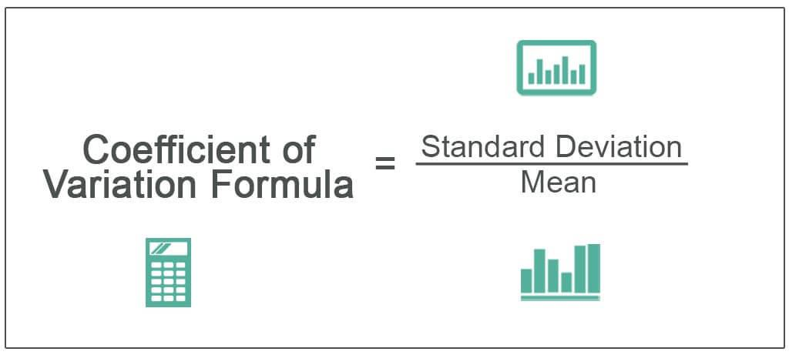

In algorithmic trading, statistical metrics and their applications are essential for achieving success. As traders and developers strive for more sophisticated and efficient trading strategies, understanding complex statistical concepts becomes increasingly important. This article focuses on two significant components of statistical analysis: data variability and the coefficient of variation (CV). Both are instrumental in crafting robust trading algorithms that can effectively manage risk and exploit market opportunities.

Data variability pertains to the extent of dispersion or spread within a set of data points. In the trading context, it provides insights into the level of uncertainty or risk associated with price movements, enabling traders to make more informed decisions. Parallelly, the coefficient of variation offers a standardized measure of this dispersion relative to the mean, thus allowing for better comparison of the risk-reward ratio across different securities. This makes CV particularly useful in algorithmic trading for assessing the volatility concerning expected returns.



By understanding and applying these statistical tools, both novice and experienced traders can enhance their decision-making processes. These concepts not only facilitate the optimization of trading strategies but also play a critical role in the development and execution of trading algorithms. As we explore the significance of data variability and the coefficient of variation in algorithmic trading, the aim is to demystify their application, ultimately empowering traders to leverage data analytics more effectively.

## Table of Contents

## Understanding Data Variability

Data variability refers to the extent of dispersion or spread within a set of data points, often gauged by statistical tools such as standard deviation and range. In the context of trading, grasping the notion of variability is essential, as it encapsulates the uncertainty or risk inherent in price fluctuations. By examining data variability, traders can craft strategies that anticipate possible market movements, an advantage for crafting well-informed trading decisions.

**Standard Deviation and Range in Trading**

Standard deviation is a prevalent measure of data variability, indicating how much individual data points deviate from the mean. In trading, it serves as an indicator of volatility. A higher standard deviation suggests that prices are widely spread out over a larger value range, signifying greater market volatility. Standard deviation is critical for traders attempting to quantify risk, particularly in options pricing models and in establishing stop-loss levels.

For instance, consider a stock with a mean price of $100 and a standard deviation of $10. In a normal distribution, roughly 68% of the observed prices will lie between $90 and $110. This insight helps traders estimate potential price fluctuations and adjust their strategies—such as setting appropriate bullish or bearish positions—accordingly.

The range, another measure of variability, denotes the difference between the maximum and minimum values in a dataset. In trading, the range can unveil the highest and lowest price points over a specific period, such as a day or week. A broader range implies higher [volatility](/wiki/volatility-trading-strategies), helping traders decide entry or [exit](/wiki/exit-strategy) points, especially in [momentum](/wiki/momentum) trading strategies.

**Leveraging Data Variability**

Understanding and leveraging data variability can offer traders a competitive edge. For instance, high-frequency trading ([HFT](/wiki/high-frequency-trading-strategies)) algorithms often exploit minute price differences within a narrow range to execute trades at lightning speed. Here, even minimal variability can be highly profitable if trades are timed correctly.

Traders can also use variability to manage risk through diversification. By analyzing the variability of different asset classes or securities using measures like standard deviation, traders can construct diversified portfolios that spread risk across uncorrelated assets. A diversified portfolio with lower overall variability can cushion against significant losses during volatile market conditions.

Employing algorithms to continuously monitor data variability across markets enables traders to adapt their strategies in near real-time, responding promptly to shifts in volatility.

In conclusion, understanding data variability and adeptly employing measures such as standard deviation and range can significantly enhance a trader's ability to navigate uncertain markets. By anticipating potential price movements, traders can better position themselves to capitalize on opportunities while managing risk effectively.

## The Coefficient of Variation: A Key Metric

The coefficient of variation (CV) is a vital statistical metric that quantifies the relative [dispersion](/wiki/dispersion-trading) of data points in a probability distribution or frequency distribution. It is calculated as the ratio of the standard deviation ($\sigma$) to the mean ($\mu$) of the data set, and is often expressed as a percentage. The formula for CV is:

$$
\text{CV} = \left( \frac{\sigma}{\mu} \right) \times 100\%
$$

In [algorithmic trading](/wiki/algorithmic-trading), the CV is an indispensable tool for assessing the risk-reward ratio of various securities. A lower CV indicates that the investment's returns have less relative volatility, which is usually more desirable for risk-averse traders. Conversely, a higher CV suggests greater relative volatility, which may appeal to traders willing to take on more risk for potentially higher returns.

The CV is particularly beneficial because it provides a standardized measure of volatility that is independent of the unit of measurement, thereby facilitating direct comparison across different securities and asset classes. This capability is crucial in portfolio diversification, where the goal is to attain an optimal blend of assets that maximizes returns while minimizing risk.

In risk management, the CV assists traders in quantifying relative risk. By comparing the CV of different assets, traders can identify those with higher risk relative to their expected returns and adjust their portfolios accordingly. This approach allows traders to systematically manage their risk by prioritizing assets with attractive risk-reward profiles.

To illustrate the practical applications of CV in quantitative strategies, consider a scenario where a trader is comparing two stocks, Stock A and Stock B. If Stock A has a standard deviation of 5% and a mean return of 10%, its CV is 50%. In contrast, if Stock B has a standard deviation of 4% and a mean return of 8%, its CV is 50%. This comparison tells traders that, despite the difference in absolute numbers, both stocks exhibit similar relative volatility, aiding them in making informed decisions about portfolio weights.

Case studies have shown that incorporating CV into algorithmic strategies can enhance decision-making. For instance, high-frequency trading firms often utilize CV to refine their algorithms for better forecasting precision and risk assessment. By continually analyzing the CV of trading signals derived from historical data, these firms improve their strategic decisions, manage risk more effectively, and optimize their performance outcomes.

In summary, the coefficient of variation is an essential metric in algorithmic trading, offering valuable insights into volatility relative to expected returns, thereby enabling more effective risk management and portfolio diversification strategies. Traders and algorithm developers who leverage CV in their analysis can achieve superior results by crafting quantitatively grounded trading strategies.

## Statistical Analysis in Algorithmic Trading

Statistical analysis is fundamental to algorithmic trading, providing the essential tools and techniques for developing sophisticated trading algorithms. Traders employ statistical methods to detect market patterns, test hypotheses, and forecast future price movements, which are crucial for making informed trading decisions.

A widely used statistical method in algorithmic trading is regression analysis. This technique helps in modeling and analyzing the relationships between variables. For example, in predicting stock prices, a trader might use regression analysis to understand how price changes are related to economic indicators. The basic linear regression model can be represented as:

$$
Y = \beta_0 + \beta_1X + \epsilon
$$

where $Y$ is the dependent variable (e.g., stock price), $X$ is the independent variable (e.g., an economic indicator), $\beta_0$ and $\beta_1$ are the model coefficients, and $\epsilon$ is the error term.

Time-series analysis is another critical component, focusing on data points indexed in time order. This type of analysis is pivotal for capturing temporal dependencies and identifying trends or seasonal patterns in financial data. Autoregressive Integrated Moving Average (ARIMA) models are frequently employed in such analyses, offering a comprehensive framework for modeling time-dependent data.

Machine learning models bolster statistical analyses by providing advanced methods for pattern recognition and predictive analytics. Algorithms such as support vector machines, random forests, and neural networks are integrated into trading systems to enhance predictive accuracy and adaptability. Python offers extensive libraries like Scikit-learn and TensorFlow, which facilitate the implementation of these models.

The integration of statistical analysis with modern technology platforms allows traders to execute trades with unparalleled precision and speed. Automated trading systems leverage powerful computing resources to process vast amounts of data in real-time, applying statistical methods to make split-second decisions. These platforms often utilize APIs for live data feeds, employing advanced analytics to continuously refine trading strategies.

Incorporating statistical analysis into algorithmic trading strategies enables traders to enhance decision-making processes, improve risk management, and ultimately optimize trading outcomes. By grounding strategies in statistical rigor, traders can better navigate the complexities of financial markets and achieve a competitive edge.

## Applying These Concepts to Algo Trading

In applying the concepts of data variability and the coefficient of variation (CV) to algorithmic trading, traders can enhance strategy precision and adaptability. The practical application begins by incorporating these statistical tools into the [backtesting](/wiki/backtesting) process, which involves running trading algorithms through historical data to evaluate their potential performance in future market conditions. By assessing how these algorithms behave under varying market scenarios, traders gain insights into their reliability and robustness. 

During backtesting, the use of data variability metrics such as standard deviation allows traders to visualize and quantify the risk associated with their strategies. For instance, an algorithm with a high standard deviation in its returns may indicate greater volatility, requiring further optimization to manage risks effectively. In Python, this process can be executed using libraries such as pandas and numpy to handle data and calculate standard deviation:

```python
import pandas as pd
import numpy as np

# Sample returns data
returns = np.array([0.01, 0.02, -0.005, 0.04, 0.03])

# Calculate standard deviation
std_dev = np.std(returns)
print(f"Standard Deviation: {std_dev}")
```

Similarly, the coefficient of variation (CV), computed as the ratio of the standard deviation to the mean (expressed as $\text{CV} = \frac{\sigma}{\mu}$), offers a standardized measure of risk per unit of return, aiding in comparing different securities or strategies. By applying CV, traders can focus on those strategies or assets that provide better risk-adjusted returns.

Furthermore, continuously calibrating algorithms is crucial as market conditions are ever-changing. Statistical analyses should be routinely conducted to refine algorithms, ensuring they are responsive to new patterns or trends. This could involve updating parameters or threshold levels within the algorithm based on recent statistical findings, thereby improving the algorithm's market adaptation.

To integrate these concepts within existing trading frameworks, several practical tips can be adopted. Firstly, incorporating [machine learning](/wiki/machine-learning) models that adapt based on detected data variability can automate the calibration process. Secondly, diversifying strategies across different market conditions using robust data variability assessments can reduce systemic risk.

Examples of successful trading algorithms that leverage data variability and CV include momentum-based strategies that adjust position sizes based on volatility estimates, and mean-reversion strategies that trigger trades under specific statistical thresholds. Such strategies demonstrate the innovative application of statistical metrics, serving as a benchmark for future algorithmic development.

By employing these practices, traders not only enhance the efficiency of their strategies but also contribute to a culture of data-driven innovation in the trading domain.

## Conclusion

The exploration of data variability and the coefficient of variation underscores their essential role in algorithmic trading. These statistical metrics are instrumental in developing and refining trading algorithms, providing traders with the ability to effectively anticipate market volatility and manage risk. By adopting these insights, traders and developers can design trading strategies that not only minimize potential losses but also optimize returns by seizing favorable market conditions.

The evolution of algorithmic trading is closely intertwined with advancements in statistical analysis and data processing technologies. As new analytical tools emerge, they offer enhanced capabilities for understanding market dynamics and improving algorithm performance. Traders must continuously investigate and integrate these tools, fostering a culture of data-driven decision-making that emphasizes rigorous analysis and empirical validation.

For practical implementation, Python libraries such as `numpy` and `pandas` can facilitate the calculation of statistical metrics. For instance, the coefficient of variation can be easily computed using:

```python
import numpy as np

def coefficient_of_variation(data):
    return np.std(data) / np.mean(data)

price_data = [100, 102, 101, 103, 105]
cv = coefficient_of_variation(price_data)
print(f"The Coefficient of Variation is: {cv}")
```

Ultimately, by embracing these statistical methodologies, traders can enhance their algorithmic strategies and maintain a competitive edge in increasingly data-intensive financial markets.

## References & Further Reading

[1]: Lopez de Prado, M. (2018). ["Advances in Financial Machine Learning."](https://www.amazon.com/Advances-Financial-Machine-Learning-Marcos/dp/1119482089) Wiley.

[2]: Aronson, D. R. (2006). ["Evidence-Based Technical Analysis: Applying the Scientific Method and Statistical Inference to Trading Signals."](https://www.amazon.com/Evidence-Based-Technical-Analysis-Scientific-Statistical/dp/0470008741) Wiley.

[3]: Jansen, S. (2020). ["Machine Learning for Algorithmic Trading."](https://github.com/stefan-jansen/machine-learning-for-trading) Packt Publishing.

[4]: Chan, E. P. (2009). ["Quantitative Trading: How to Build Your Own Algorithmic Trading Business."](https://github.com/ftvision/quant_trading_echan_book) Wiley.

[5]: Bergstra, J., Bardenet, R., Bengio, Y., & Kégl, B. (2011). ["Algorithms for Hyper-Parameter Optimization."](https://dl.acm.org/doi/10.5555/2986459.2986743) Advances in Neural Information Processing Systems 24.