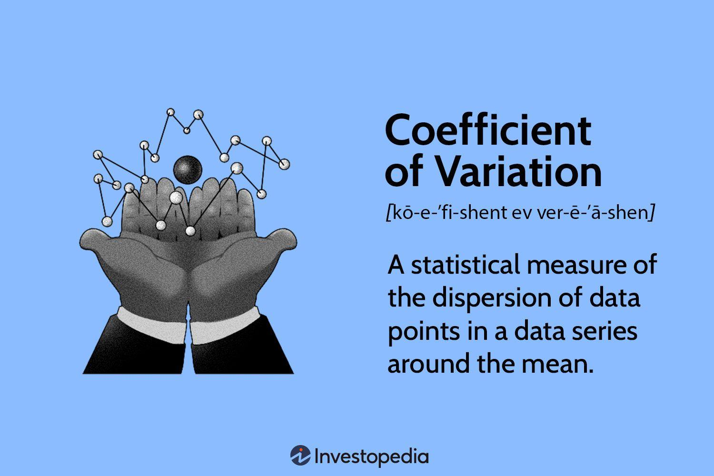

Investment analysis employs a multitude of metrics to evaluate the efficiency and risk of potential investment opportunities. Among these, the Coefficient of Variation (COV) stands out for its significance in finance. The COV is a valuable measure that assists investors in understanding the relationship between risk and expected return, allowing for more informed decision-making.

The role of the COV in investment analysis, financial metrics, and algorithmic trading strategies cannot be understated. It provides a standardized measure of risk-adjusted return, enabling investors to compare the volatility associated with different investments in relation to their expected returns. By doing so, the COV facilitates the identification of investments that offer the most favorable tradeoffs between risk and return, assisting investors in constructing optimized portfolios.



Understanding the COV's role enables investors to assess the attractiveness of investment opportunities by examining the efficiency with which returns are generated relative to the risk undertaken. The application of COV thus transcends basic investment analysis, offering insights that enhance both traditional financial evaluations and more sophisticated financial modeling techniques, including algorithmic trading.

This article will explore the applicability of the COV across diverse financial contexts, ranging from fundamental investment analysis to complex algorithmic modeling, illustrating its utility in optimizing risk-adjusted returns. By integrating the COV into their analytical frameworks, investors can enhance their approach to managing and optimizing investment decisions.

## Table of Contents

## Understanding the Coefficient of Variation (COV)

The Coefficient of Variation (COV) is a crucial statistical tool in investment analysis that quantifies risk relative to return by calculating the ratio of the standard deviation to the mean. Mathematically, it is expressed as:

$$
\text{COV} = \frac{\sigma}{\mu}
$$

where $\sigma$ is the standard deviation and $\mu$ is the mean of the investment returns.

COV is useful in assessing the relative [volatility](/wiki/volatility-trading-strategies) of an investment. It provides investors with insight into how much risk is associated with a given level of expected return. A lower COV value indicates a more attractive tradeoff, signaling that the investment offers reasonable returns with reduced volatility. Conversely, a higher COV points to increased risk relative to the return, potentially making the investment less appealing.

In financial analysis, the COV is key to identifying investments with superior risk-adjusted returns. For example, consider two investments: Investment A with an expected return of 10% and standard deviation of 5%, and Investment B with an expected return of 15% and standard deviation of 10%. Calculating the COV for both:

- Investment A: $\text{COV}_A = \frac{5}{10} = 0.5$
- Investment B: $\text{COV}_B = \frac{10}{15} \approx 0.67$

Here, Investment A has a lower COV, indicating it offers a better risk-adjusted return compared to Investment B.

For practical applications, the calculation of COV can be automated using programming languages like Python. An example Python code snippet to compute the COV for an array of investment returns is as follows:

```python
import numpy as np

def calculate_cov(returns):
    mean_return = np.mean(returns)
    std_deviation = np.std(returns)
    cov = std_deviation / mean_return
    return cov

# Example usage with hypothetical return data
investment_returns = [0.1, 0.12, 0.08, 0.11, 0.09]
cov_value = calculate_cov(investment_returns)
print(f"The Coefficient of Variation is: {cov_value:.2f}")
```

Using the COV to determine investment efficiency involves analyzing this ratio across multiple investment options. It assists in gauging which investments provide a more favorable balance of risk and return, thus guiding portfolio selection and management decisions.

In conclusion, understanding and utilizing the COV in financial contexts help investors and analysts to make informed decisions by objectively comparing the risk efficiency of different investment opportunities.

## Comparing Investment Risks Using COV

Investors face the ongoing challenge of selecting suitable investments from a multitude of options, each with distinct risk and return characteristics. The Coefficient of Variation (COV), defined as the ratio of the standard deviation ($\sigma$) to the mean ($\mu$) of a data set, offers a valuable measure for the relative risk assessment of investments. Mathematically, COV is expressed as:

$$
\text{COV} = \frac{\sigma}{\mu}
$$

This dimensionless ratio enables investors to compare the risk per unit of return across different asset classes, thus providing a standardized measure for investment evaluation.

### Standardized Risk Comparison

COV's primary advantage lies in its ability to enable direct comparisons of risk profiles across diverse asset classes such as stocks, bonds, and real estate. For example, suppose an investor evaluates two stocks: Stock A with an expected return of 8% and a standard deviation of 4%, and Stock B with an expected return of 10% and a standard deviation of 7%. The COV for Stock A and Stock B would be:

$$
\text{COV}_A = \frac{4\%}{8\%} = 0.5
$$
$$
\text{COV}_B = \frac{7\%}{10\%} = 0.7
$$

This calculation shows that Stock A has a lower COV, indicating it offers a better risk-adjusted return compared to Stock B despite its lower expected return.

### Aligning Investments with Risk Appetite

Investors can use COV to align selections with their individual risk tolerance levels. Risk-averse investors may prefer investments with low COVs, indicating lower risk per unit of return, while those with higher risk tolerance might opt for investments with higher potential returns, accepting greater COVs.

### Portfolio Diversification and Risk Management

The application of COV extends to portfolio construction, where it aids in creating a diversified investment strategy. By considering COVs, investors can balance high and low-risk investments to achieve an overall portfolio COV aligning with their risk-reward preferences. For instance, incorporating assets with varying COVs can smooth portfolio volatility while potentially enhancing returns.

### Evaluating Stocks, Bonds, and Other Investments

COV is applicable to various financial instruments, enabling comparisons that inform decisions on investment allocations. In stocks, COV helps in identifying securities offering optimal returns relative to their volatility. In fixed income, such as bonds, COV allows for the assessment of expected yield relative to [interest rate](/wiki/interest-rate-trading-strategies) risk. For alternative investments, like commodities or real estate, COV provides insight into market-specific volatility compared to expected gains.

In conclusion, the Coefficient of Variation serves as a crucial metric for comparing investment risks across different asset classes. Its ability to offer a uniform measure of risk per unit of return empowers investors to construct well-balanced portfolios that reflect their risk preferences while optimizing potential returns.

## Application of COV in Algorithmic Trading

Algorithmic trading relies on high-speed computations and the ability to execute trades at lightning speed based on programmatically specified criteria. The use of the Coefficient of Variation (COV) in this environment enhances the decision-making process by providing a quantifiable gauge of risk relative to expected returns. In finance, COV is the ratio of the standard deviation (σ) of a set of values to their mean (μ), expressed as:

$$
\text{COV} = \frac{\sigma}{\mu}
$$

This formulation allows traders to evaluate and compare the relative volatility of different trading instruments, ensuring strategies maintain an optimal balance between risk and return.

Algorithmic traders apply COV in various aspects, beginning with model development and continuing through to strategy refinement. The metric is invaluable in [backtesting](/wiki/backtesting) where algorithms sift through historical data to evaluate performance under different market conditions. By analyzing COV values, traders can identify periods of high volatility and adjust their strategies accordingly, preparing them to handle future market fluctuations.

For instance, in a [momentum](/wiki/momentum)-based trading strategy, where decisions are driven by recent market trends, COV can indicate whether the price movements are strong enough compared to their volatility to justify a trade. A lower COV suggests that the market is experiencing less variability relative to its average trend—an attractive condition for traders seeking to capitalize on stable trends with reduced risk exposure.

Moreover, the inclusion of COV in [algorithmic trading](/wiki/algorithmic-trading) models enhances adaptive capabilities. Trading algorithms can be programmed to dynamically adjust their risk exposure based on real-time COV calculations, allowing more aggressive positions during low-volatility periods and more conservative approaches when market volatility is high. This flexibility ensures that strategies are not static but evolve with market conditions, thus optimizing performance.

Python, a prevalent language in algorithmic trading, can easily facilitate COV calculations. Consider the following Python code snippet for computing COV for any financial time series:

```python
import numpy as np

def calculate_cov(prices):
    mean_price = np.mean(prices)
    std_deviation = np.std(prices)
    cov = std_deviation / mean_price
    return cov

# Example usage with historical price data
historical_prices = [110, 115, 120, 125, 130]
cov_value = calculate_cov(historical_prices)
print(f"The Coefficient of Variation is {cov_value:.4f}")
```

Case studies demonstrate how algorithmic trading systems, powered by COV analysis, achieve optimal outcomes across different market environments. In volatile conditions, for instance, adjusting position sizes based on COV has shown to mitigate risk substantially, preserving capital while capitalizing on return prospects.

Integrating COV into algorithmic trading not only broadens a strategy’s robustness but also fortifies its adaptability to market dynamics. When employed effectively, COV empowers traders to fine-tune their algorithms, ensuring that risk exposure aligns with their investment goals and market expectations. Ranching out its utility this way makes COV an indispensable tool in the arsenal of modern-day algorithmic trading strategies.

## Advanced Techniques with COV

Beyond basic analysis, the Coefficient of Variation (COV) facilitates more advanced financial modeling and decision-making. It plays a crucial role in enhancing risk-adjusted performance metrics and scenario analysis. Investors can use COV to assess the consistency of returns across different market conditions. By considering the variability of returns relative to their expected value, COV aids in constructing scenarios where different risk factors are tested. This allows for a better understanding of potential outcomes and the likelihood of achieving desired financial goals.

In stress testing and risk management frameworks, COV supports the evaluation of an investment's resilience under adverse market conditions. Stress testing involves simulating extreme market events to assess the vulnerability of a portfolio. COV provides a quantitative basis for determining how much variability in returns might occur under such conditions. This analysis helps in identifying investments that exhibit less volatility relative to their expected returns, thereby strengthening the risk management process and ensuring that portfolios are optimized for resilience.

When it comes to portfolio optimization and diversification, COV is invaluable. It helps in the selection of assets that collectively maximize returns while minimizing risk. Investors can use COV as a criterion to choose a mix of investments that offer the most efficient trade-off between risk and return. For example, if Portfolio A has a COV of 0.5 and Portfolio B has a COV of 0.8, Portfolio A is considered more stable relative to its expected return, making it a potentially better option for risk-averse investors.

In quantitative finance, COV is utilized in complex models to enhance decision-making processes. Financial engineers and quantitative analysts leverage COV within algorithms to refine predictive models and improve the accuracy of forecasts. For example, [machine learning](/wiki/machine-learning) models used in finance may incorporate COV to adjust predictions based on the relative volatility of inputs. This integration allows for more accurate modeling of market behaviors, leading to better-informed investment strategies.

Overall, by incorporating COV into advanced financial techniques, investors and analysts can more effectively balance risk and return, ensuring robust portfolio performance under various market conditions.

## Conclusion

The Coefficient of Variation (COV) stands as a crucial tool in investment analysis, bridging both established and contemporary financial practices. It adeptly quantifies the balance between risk and return, empowering investors to make more informed decisions regarding asset selection and portfolio construction. By evaluating the ratio of the standard deviation to the mean, COV provides insight into the relative risk of an investment relative to its expected return, therefore aiding in the strategy development across various financial contexts.

Beyond its foundational role in traditional financial evaluation, COV is pivotal in advanced settings like algorithmic trading and complex financial modeling. Its ability to normalize risk regardless of asset class makes it invaluable for designing algorithms that efficiently manage and optimize trade-offs between risk and reward. This normalization allows for COV's application across diverse assets, enhancing the analytical capabilities of traders and financial analysts.

Integrating COV into investment and finance strategies encourages a comprehensive view of risk-adjusted returns. This is especially pertinent in today's dynamic market environments, where risk management is paramount. By encouraging investors and traders to incorporate COV into their analytical toolkit, it ensures a robust framework for financial analysis and decision-making, ultimately optimizing investment performance by providing a deeper understanding of how volatility pertains to expected outcomes.

## References & Further Reading

[1]: McKinney, W. (2017). ["Python for Data Analysis: Data Wrangling with pandas, NumPy, and IPython."](https://wesmckinney.com/book/) O'Reilly Media.

[2]: Fabozzi, F. J., Kolm, P. N., Pachamanova, D. A., & Focardi, S. M. (2007). ["Robust Portfolio Optimization and Management."](https://onlinelibrary.wiley.com/doi/book/10.1002/9781119202172) Wiley.

[3]: De Prado, M. L. (2018). ["Advances in Financial Machine Learning."](https://www.amazon.com/Advances-Financial-Machine-Learning-Marcos/dp/1119482089) Wiley.

[4]: Hull, J. C. (2018). ["Options, Futures, and Other Derivatives."](https://www.semanticscholar.org/paper/Options%2C-Futures%2C-and-Other-Derivatives-Hull/89bdee500c8623864fc9eb7a471546aa713acc44) Pearson.

[5]: Jansen, S. (2018). ["Mastering Python for Finance."](https://github.com/PacktPublishing/Mastering-Python-for-Finance-Second-Edition) Packt Publishing.