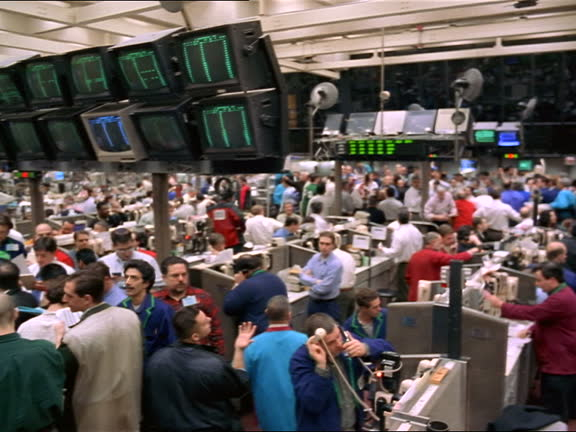

## Table of Contents

## What is the Coffee, Sugar and Cocoa Exchange?

The Coffee, Sugar and Cocoa Exchange, often called the CSCE, was a place where people traded these three products. It started in 1882 and was located in New York City. Traders would come to the exchange to buy and sell coffee, sugar, and cocoa. This helped set prices for these items around the world.

In 1998, the CSCE joined with another big exchange called the New York Cotton Exchange. Together, they became part of the New York Board of Trade (NYBOT). Today, the trading of coffee, sugar, and cocoa continues, but it is now managed by the Intercontinental Exchange (ICE), which took over NYBOT in 2007. Even though the CSCE doesn't exist anymore as a separate group, its work still affects how these products are traded globally.

## Where is the Coffee, Sugar and Cocoa Exchange located?

The Coffee, Sugar and Cocoa Exchange, or CSCE, was located in New York City. It was a place where people came to trade coffee, sugar, and cocoa. The exchange started in 1882 and became an important spot for setting prices for these items around the world.

In 1998, the CSCE merged with the New York Cotton Exchange to form the New York Board of Trade (NYBOT). This meant that the CSCE was no longer a separate place, but its activities continued under the new organization. Later, in 2007, NYBOT was taken over by the Intercontinental Exchange (ICE), which now manages the trading of coffee, sugar, and cocoa. Even though the CSCE doesn't exist on its own anymore, its impact is still felt in the global trading of these products.

## What types of commodities are traded on the Coffee, Sugar and Cocoa Exchange?

The Coffee, Sugar and Cocoa Exchange, often called the CSCE, was a place where people traded three main things: coffee, sugar, and cocoa. These are all important products that many people use every day. The exchange helped people buy and sell these items, and it helped set the prices for them around the world.

The CSCE started in 1882 and was located in New York City. It was a busy place where traders would come together to do business. Over time, the CSCE joined with other exchanges and eventually became part of bigger groups like the New York Board of Trade (NYBOT) and later the Intercontinental Exchange (ICE). Even though the CSCE doesn't exist on its own anymore, the trading of coffee, sugar, and cocoa continues through these other organizations.

## How does trading work on the Coffee, Sugar and Cocoa Exchange?

Trading on the Coffee, Sugar and Cocoa Exchange, or CSCE, is all about buying and selling coffee, sugar, and cocoa. People called traders come to the exchange to do this. They use something called futures contracts, which are agreements to buy or sell a certain amount of these products at a set price in the future. This helps farmers and businesses know what they will get for their products and what they will have to pay, making things more predictable.

The CSCE used to be a busy place in New York City where traders would meet and trade. They would shout out their offers and make deals right there. Now, even though the CSCE is part of bigger groups like the Intercontinental Exchange (ICE), the trading still happens, but a lot of it is done using computers. Traders can buy and sell from anywhere, not just in New York. This makes the market more connected and helps set prices for coffee, sugar, and cocoa all around the world.

## What is the history of the Coffee, Sugar and Cocoa Exchange?

The Coffee, Sugar and Cocoa Exchange, or CSCE, started in 1882 in New York City. It was a place where people came to buy and sell coffee, sugar, and cocoa. Traders would meet at the exchange to make deals, and this helped set prices for these products around the world. The CSCE was important because it made trading these items easier and more organized.

In 1998, the CSCE joined with the New York Cotton Exchange to become the New York Board of Trade, or NYBOT. This meant the CSCE was no longer a separate group, but its work continued under NYBOT. Then, in 2007, NYBOT was taken over by the Intercontinental Exchange, or ICE. Today, even though the CSCE doesn't exist on its own anymore, the trading of coffee, sugar, and cocoa still goes on through ICE. The history of the CSCE shows how trading these products has changed over time, but its impact is still felt today.

## Who are the main participants in the Coffee, Sugar and Cocoa Exchange?

The main participants in the Coffee, Sugar and Cocoa Exchange, or CSCE, are traders, producers, and buyers. Traders are people who buy and sell coffee, sugar, and cocoa. They work for companies or trade on their own. Producers are the farmers and companies that grow and make these products. They come to the exchange to sell what they have. Buyers are companies or people who need these products for things like making food or drinks. They come to the exchange to buy what they need.

These participants all have a role in setting prices and making sure there is a good supply of coffee, sugar, and cocoa. Traders help match what producers have with what buyers need. This can happen quickly at the exchange, where everyone comes together to make deals. Even though the CSCE is now part of bigger groups like the Intercontinental Exchange (ICE), these main participants are still important. They help keep the market for coffee, sugar, and cocoa working smoothly around the world.

## How does the Coffee, Sugar and Cocoa Exchange impact global commodity prices?

The Coffee, Sugar and Cocoa Exchange, or CSCE, plays a big role in setting prices for these products around the world. When traders buy and sell coffee, sugar, and cocoa at the exchange, they help decide what these things are worth. If lots of people want to buy coffee, the price might go up. If fewer people want to buy it, the price might go down. This trading helps everyone know what to expect, from farmers who grow the crops to companies that use them to make things like chocolate bars and soft drinks.

Even though the CSCE is now part of bigger groups like the Intercontinental Exchange (ICE), its impact is still strong. The prices set at the exchange are used by people all over the world to make decisions about buying and selling coffee, sugar, and cocoa. This means that what happens at the exchange can affect how much these products cost in stores everywhere. So, the CSCE helps keep the global market for these items working smoothly and fairly.

## What are the major futures contracts available on the Coffee, Sugar and Cocoa Exchange?

The Coffee, Sugar and Cocoa Exchange, or CSCE, offers major futures contracts for coffee, sugar, and cocoa. These contracts are agreements to buy or sell a certain amount of these products at a set price in the future. For coffee, the main futures contract is for Arabica coffee, which is a popular type of coffee bean. For sugar, there are futures contracts for both raw sugar and white sugar. Raw sugar comes straight from the cane, while white sugar is processed and ready to use. Cocoa futures contracts are for cocoa beans, which are used to make chocolate and other cocoa products.

These futures contracts help farmers and businesses plan ahead. Farmers can sell their coffee, sugar, or cocoa at a set price before they even harvest their crops. This helps them know how much money they will make. Companies that use these products, like chocolate makers or soft drink companies, can buy what they need at a set price too. This helps them know how much they will have to pay and plan their budgets. The trading of these futures contracts on the CSCE helps set global prices for coffee, sugar, and cocoa, making the market more predictable and stable.

## How has technology influenced trading on the Coffee, Sugar and Cocoa Exchange?

Technology has changed the way trading happens on the Coffee, Sugar and Cocoa Exchange, or CSCE. In the old days, traders would meet in person in New York City to buy and sell coffee, sugar, and cocoa. They would shout out their offers and make deals right there. But now, with computers and the internet, a lot of trading is done online. Traders can buy and sell from anywhere in the world, not just in New York. This makes the market more connected and faster.

This shift to using technology has made trading easier and more efficient. Traders can see prices and make deals quickly using their computers. They don't have to be in the same place to trade. This also means more people can take part in the market, which can help set better prices for coffee, sugar, and cocoa. Even though the CSCE is now part of bigger groups like the Intercontinental Exchange (ICE), technology keeps playing a big role in how trading works.

## What are the regulatory bodies overseeing the Coffee, Sugar and Cocoa Exchange?

The Coffee, Sugar and Cocoa Exchange, or CSCE, is overseen by different groups that make sure everything is fair and follows the rules. The main one is the Commodity Futures Trading Commission, or CFTC. This group is part of the U.S. government and makes sure that trading in futures markets like the CSCE is honest and open. They check that traders are not doing anything wrong and that the prices are set fairly.

Another important group is the Intercontinental Exchange, or ICE, which now runs the trading that used to be done by the CSCE. ICE has its own rules and people who watch over trading to make sure it's done right. They work with the CFTC to keep everything in order. Together, these groups help make sure that the trading of coffee, sugar, and cocoa is safe and fair for everyone involved.

## How do geopolitical events affect trading on the Coffee, Sugar and Cocoa Exchange?

Geopolitical events can really change how trading works on the Coffee, Sugar and Cocoa Exchange. If there's a war or a big political problem in a country that grows a lot of coffee, sugar, or cocoa, it might be harder to get these products. This can make prices go up because there's less to buy. For example, if there's a problem in Brazil, which grows a lot of coffee, it might mean less coffee is available, and traders on the exchange might have to pay more to get it.

These events can also make prices go up and down a lot. Traders might be worried about what's happening in the world, so they might buy more or sell more, which can make prices change quickly. Even though the Coffee, Sugar and Cocoa Exchange is now part of bigger groups like the Intercontinental Exchange, or ICE, these geopolitical events still have a big impact on how trading happens and what prices are set for coffee, sugar, and cocoa around the world.

## What are the recent trends and future outlook for the Coffee, Sugar and Cocoa Exchange?

In recent years, trading on the Coffee, Sugar and Cocoa Exchange has seen some big changes. More and more trading is happening online, thanks to technology. This makes it easier for people all over the world to buy and sell coffee, sugar, and cocoa without having to be in New York. Also, there's been a lot of interest in sustainable farming. People want to make sure that the coffee, sugar, and cocoa they buy are grown in ways that are good for the environment and the farmers. This has led to more trading in what's called "certified" products, which meet certain standards for how they're grown.

Looking into the future, the Coffee, Sugar and Cocoa Exchange is likely to keep growing and changing. More technology will probably be used to make trading even faster and easier. There might also be more focus on sustainability, with more traders looking for certified products. As the world gets more connected, the exchange will play an even bigger role in setting prices for coffee, sugar, and cocoa everywhere. Even though the exchange is now part of bigger groups like the Intercontinental Exchange, or ICE, these trends and changes will keep shaping how trading happens.

## References & Further Reading

[1]: Harris, L. (2003). ["Trading and Exchanges: Market Microstructure for Practitioners."](https://academic.oup.com/book/52292) Oxford University Press.

[2]: ["Algorithmic Trading and DMA: An Introduction to Direct Access Trading Strategies"](https://www.amazon.com/Algorithmic-Trading-DMA-introduction-strategies/dp/0956399207) by Barry Johnson

[3]: D'Souza, C. (2002). ["Can Currency Markets be Disrupted by Traders' Use of Automated Responses?"](https://www.annualreviews.org/content/journals/10.1146/annurev-economics-092220-103354) Bank of Canada Working Paper.

[4]: Fabozzi, F. J., Focardi, S. M., & Kolm, P. N. (2010). ["Quantitative Equity Investing: Techniques and Strategies"](https://www.semanticscholar.org/paper/Quantitative-Equity-Investing%3A-Techniques-and-Fabozzi-Focardi/1c49a2a53919f7e65cb96f16691b8ff726fd3cd7) Wiley.

[5]: Aldridge, I. (2013). ["High-Frequency Trading: A Practical Guide to Algorithmic Strategies and Trading Systems"](https://www.amazon.com/High-Frequency-Trading-Practical-Algorithmic-Strategies/dp/1118343506) Wiley.