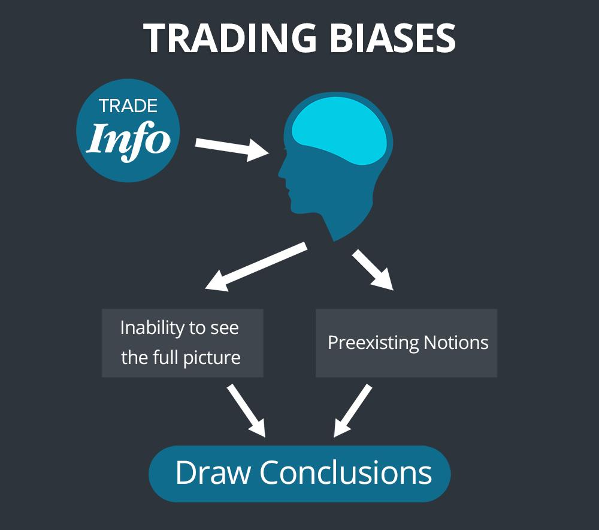

## Table of Contents

## What are cognitive biases and how do they affect decision-making in trading?

Cognitive biases are like shortcuts our brains take when we make decisions. They are natural, but they can lead us to think in ways that aren't always right. In trading, these biases can make us see things differently than they really are, which can affect the choices we make about buying and selling.

For example, one common bias is called "confirmation bias." This is when we look for information that supports what we already believe and ignore information that doesn't. In trading, if you think a stock will go up, you might only pay attention to news that says it will, and miss out on news that says it won't. This can lead to bad decisions because you're not seeing the whole picture.

Another bias is "loss aversion," where we feel the pain of losing money more than the joy of gaining it. This can make traders hold onto losing stocks too long, hoping they'll go back up, instead of cutting their losses. Understanding these biases can help traders make better, more balanced decisions.

## Can you explain the most common cognitive biases traders face?

One of the most common cognitive biases traders face is confirmation bias. This happens when traders look for information that agrees with what they already think and ignore information that doesn't. For example, if a trader believes a stock will go up, they might only read news articles that support this belief and ignore any warnings about the stock going down. This can lead to poor trading decisions because the trader isn't seeing the full picture.

Another common bias is loss aversion. This is when traders feel the pain of losing money much more than the joy of making money. Because of this, traders might hold onto losing stocks for too long, hoping they will recover, instead of selling them and cutting their losses. This can result in bigger losses than necessary because the trader is too afraid to accept a smaller loss now.

A third bias to be aware of is overconfidence. Traders with this bias might think they know more than they actually do, leading them to take bigger risks than they should. They might trade too often or invest too much money in one stock, thinking they can predict the market better than others. This can lead to big losses if the market doesn't go the way they expected.

## How does the confirmation bias influence trading decisions?

Confirmation bias can really mess up a trader's decisions. It happens when a trader only looks for information that agrees with what they already think. For example, if a trader believes a stock will go up, they might only read news that says the stock is doing well. They might ignore any news that says the stock could go down. This can lead to bad choices because the trader isn't seeing the whole picture.

Because of confirmation bias, traders might keep buying a stock even if there are signs it's not a good idea. They might miss out on important warnings or different opinions that could help them make better choices. This can lead to losing money because they're not making decisions based on all the facts. It's important for traders to be aware of this bias and try to look at all the information, not just what they want to see.

## What is the overconfidence bias and how does it impact trading performance?

Overconfidence bias is when traders think they know more than they really do. They might believe they can predict the market better than others and take bigger risks because of this. For example, a trader might think they have a special way of [picking](/wiki/asset-class-picking) stocks that will always make them money. This can lead them to trade too often or put too much money into one stock, thinking they can't lose.

This bias can really hurt a trader's performance. Because they think they're better at trading than they are, they might not listen to advice or learn from their mistakes. They could end up losing a lot of money if the market doesn't go the way they expected. It's important for traders to stay humble and realize that the market can be unpredictable, no matter how much they think they know.

## How can the loss aversion bias lead to suboptimal trading strategies?

Loss aversion bias makes traders feel the pain of losing money much more than the joy of making money. Because of this, traders might hold onto stocks that are losing value for too long. They hope the stocks will go back up, but this can lead to bigger losses. Instead of selling the stocks and accepting a small loss, they wait and wait, hoping things will get better. This can make their trading strategy not work well because they're not making decisions based on what's happening now.

This bias can also make traders miss out on good opportunities. They might be so scared of losing money that they don't take risks that could lead to big gains. For example, they might not buy a stock that could go up a lot because they're too worried about it going down a little. This fear can keep them from making smart moves that could help them make more money. In the end, loss aversion can make their trading strategy less effective because they're not balancing the risks and rewards properly.

## What role does the anchoring bias play in setting trading targets and stop-losses?

Anchoring bias can really affect how traders set their trading targets and stop-losses. It happens when traders focus too much on the first piece of information they see, like the price they bought a stock at. They might set their trading targets or stop-losses based on that first price, even if it doesn't make sense anymore. For example, if a trader bought a stock at $50, they might set a target to sell it at $60 just because it's a nice round number, not because it's a good goal based on current market conditions.

This can lead to bad trading decisions. If the market changes and the stock's value goes down to $40, a trader with anchoring bias might still hold onto it, hoping it will get back to $50. They might set their stop-loss too close to the original buying price, missing out on potential gains. By being stuck on that first number, they might not adjust their targets and stop-losses to fit what's really happening in the market, which can hurt their trading performance.

## How does the availability heuristic affect a trader's perception of market trends?

The availability heuristic is when traders make decisions based on information that's easy to remember or find. For example, if a trader just read a news article about a stock going up, they might think that stock is a good buy. They might not look at other information that shows the stock could go down. This can make them see market trends in a way that's not accurate because they're only focusing on what's easy to remember.

This bias can lead traders to think certain trends are more common than they really are. If a trader hears a lot about tech stocks doing well, they might think all tech stocks are a safe bet. They might not realize that not all tech stocks are doing well, or that other industries could be a better investment. By relying too much on what's easily available, traders might miss out on seeing the full picture of market trends, which can affect their trading choices.

## Can you describe how the gambler's fallacy might mislead traders?

The gambler's fallacy can trick traders into thinking that past events in the market will affect what happens next. For example, if a stock has gone down for a few days in a row, a trader might think it's due for a rise soon. They believe that because the stock has been going down, it has to go up to balance things out. But the market doesn't work like that. Each day's price movement is independent, and just because a stock went down before doesn't mean it will go up next.

This kind of thinking can lead traders to make bad decisions. They might buy a stock thinking it's about to go up, just because it's been going down. If the stock keeps falling, they could lose a lot of money. It's important for traders to understand that the market doesn't follow patterns like a coin toss. They need to base their decisions on current information and analysis, not on what happened in the past.

## What strategies can traders use to mitigate the effects of cognitive biases?

Traders can use a few strategies to fight against cognitive biases. One good way is to keep a trading journal. Writing down why they made each trade can help traders see if they're making decisions based on biases like confirmation bias or overconfidence. By looking back at their journal, they can learn from their mistakes and make better choices next time. Another helpful strategy is to use stop-loss orders. These can help traders avoid holding onto losing stocks too long because of loss aversion. By setting a stop-loss, traders can limit their losses and stick to their plan, even when emotions get in the way.

Another strategy is to always do research from different sources. This can help traders avoid the availability heuristic and confirmation bias. If they only look at one type of information, they might miss out on the full picture. By checking different news and analysis, traders can make more balanced decisions. It's also a good idea to talk to other traders or join a trading community. Getting different points of view can help traders see their own biases and make better choices.

## How do experienced traders identify and overcome their cognitive biases?

Experienced traders often identify their cognitive biases by keeping a detailed trading journal. They write down all their trades and the reasons behind them. This helps them see patterns in their decision-making that might be influenced by biases like confirmation bias or overconfidence. By reviewing their journal regularly, they can spot when they're making choices based on what they want to believe instead of what the data shows. This self-awareness is key to overcoming these biases.

To overcome their biases, experienced traders also use tools like stop-loss orders to manage loss aversion. They set these orders to automatically sell a stock if it drops to a certain price, which helps them stick to their trading plan even when emotions might make them want to hold on. Additionally, they seek out diverse sources of information to avoid the availability heuristic and confirmation bias. By considering different viewpoints and data, they can make more balanced decisions. Talking to other traders and being part of a trading community also helps, as it provides different perspectives and can highlight their own biases.

## What are some advanced techniques for measuring the impact of cognitive biases in trading?

Experienced traders use advanced techniques to measure how cognitive biases affect their trading. One way is by using statistical analysis to look at their trading data. They can see if they're making more trades when they're overconfident or if they're holding onto losing stocks longer than they should because of loss aversion. By comparing their actual trading results with what they expected, they can see if biases are making their decisions worse. This helps them understand how much their biases are costing them in terms of money and missed opportunities.

Another technique is to use behavioral finance models. These models help traders see how their emotions and biases affect their choices. For example, a model might show how confirmation bias makes a trader focus too much on information that supports their beliefs. By using these models, traders can test different scenarios and see how their biases might change their trading outcomes. This can help them make better plans to reduce the impact of these biases and improve their trading performance.

## How can cognitive biases be integrated into algorithmic trading models to improve decision-making?

Traders can make their [algorithmic trading](/wiki/algorithmic-trading) models better by thinking about cognitive biases. They can build the models to spot when a trader might be making choices because of biases like confirmation bias or overconfidence. For example, if the model sees that a trader is buying more stocks after a few good trades, it might warn them that they could be overconfident. By adding these checks, the model can help traders make decisions based on facts, not feelings.

Another way to use cognitive biases in algorithmic trading is to make the model learn from past trades. The model can look at old data to see if biases like loss aversion or the gambler's fallacy affected the trader's choices. If it finds patterns, it can suggest ways to avoid these biases in the future. This helps the model give better advice and can lead to smarter trading decisions that are less influenced by human errors.

## What is the Importance of Consistency in Trading?

Consistency plays a pivotal role in trading, acting as a safeguard against impulsive decisions fueled by emotional biases. A well-crafted trading plan offers a structured methodology, enabling traders to systematically assess potential trades based on predefined criteria, minimizing the influence of transient emotions like fear and greed.

Consistent risk management is fundamental to sustained profitability in trading. This involves setting and adhering to clear rules regarding position sizes, stop-loss orders, and profit-taking strategies. For instance, applying the risk-reward ratio formula:

$$
\text{Risk-Reward Ratio} = \frac{\text{Potential Loss}}{\text{Potential Gain}}
$$

helps traders quantify potential systems and structures to mitigate losses while optimizing potential gains. By adhering to predefined rules, traders can limit exposure and avoid catastrophic losses, preserving capital over the long term.

Moreover, disciplined trading underscores the importance of adhering to trading rules and strategies, maintaining focus on long-term financial objectives. A consistent approach emphasizes the use of data-driven decisions, remaining impervious to market noise and short-term [volatility](/wiki/volatility-trading-strategies). This discipline is vital in navigating both prosperous and challenging market conditions, ensuring traders do not deviate from their strategic objectives due to momentary setbacks or windfalls.

In maintaining consistency, traders should regularly review their performance, identifying patterns of strengths and weaknesses. This practice not only reinforces adherence to the trading plan but also encourages continuous improvement and adaptation to evolving market dynamics. Utilizing trading journals for documenting decisions and outcomes offers insightful retrospective analysis, further embedding consistency in the trading practice.

Ultimately, consistency in trading fortifies a trader's ability to achieve and sustain long-term success and reach financial goals. By steadfastly applying a disciplined, rule-based approach and maintaining robust risk management strategies, traders are better positioned to achieve profitability and resilience in volatile markets.

## References & Further Reading

[1]: Nickerson, R. S. (1998). ["Confirmation bias: A ubiquitous phenomenon in many guises."](https://www.researchgate.net/publication/280685490_Confirmation_Bias_A_Ubiquitous_Phenomenon_in_Many_Guises) Review of General Psychology, 2(2), 175–220. doi:10.1037/1089-2680.2.2.175.

[2]: Barber, Brad M.; Odean, Terrance (2001). ["Boys Will Be Boys: Gender, Overconfidence, and Common Stock Investment."](https://faculty.haas.berkeley.edu/odean/papers/gender/BoysWillBeBoys.pdf) The Quarterly Journal of Economics, 116(1), 261–292. doi:10.1162/003355301556400.

[3]: Kahneman, Daniel & Tversky, Amos (1979). ["Prospect Theory: An Analysis of Decision under Risk."](https://www.jstor.org/stable/1914185) Econometrica, 47(2), 263–291.

[4]: Pompian, Michael M. (2011). ["Behavioral Finance and Wealth Management: How to Build Optimal Portfolios That Account for Investor Biases."](https://onlinelibrary.wiley.com/doi/book/10.1002/9781119202400) John Wiley & Sons.

[5]: Thaler, Richard H. (2015). ["Misbehaving: The Making of Behavioral Economics."](https://link.springer.com/article/10.1007/s11127-015-0276-5) W. W. Norton & Company.

[6]: Ariely, Dan (2008). ["Predictably Irrational: The Hidden Forces That Shape Our Decisions."](https://en.wikipedia.org/wiki/Predictably_Irrational) HarperCollins.

[7]: Lo, A. W. (2005). ["Reconciling Efficient Markets with Behavioral Finance: The Adaptive Markets Hypothesis."](https://papers.ssrn.com/sol3/papers.cfm?abstract_id=1702447) Journal of Investment Management, 4(1), 21-44.