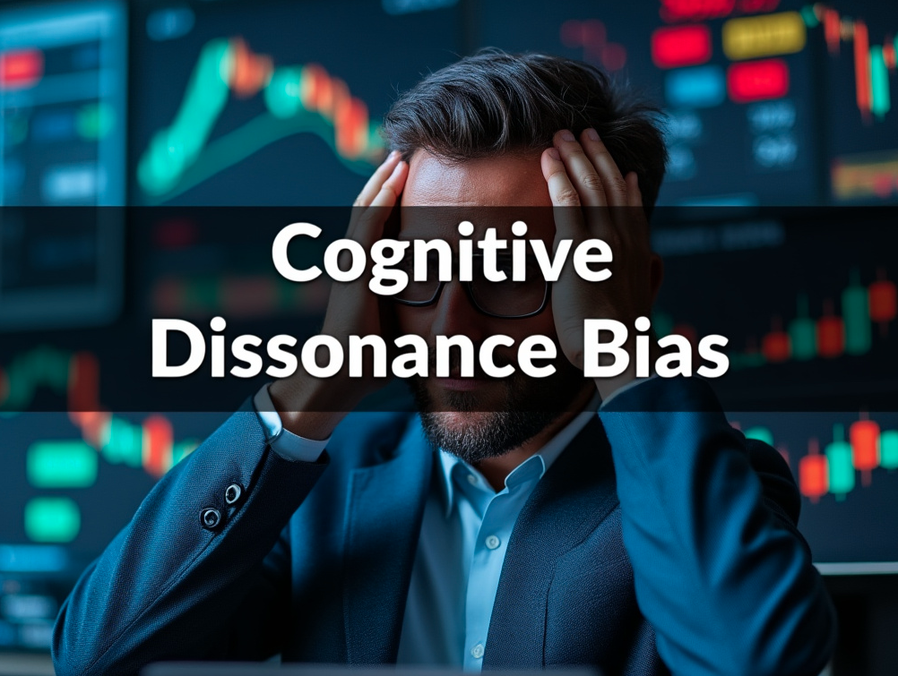

In investing and trading, understanding the intricacies of investor behavior and trading psychology can significantly impact success. Investors and traders are constantly faced with psychological biases that can skew decision-making processes and lead to suboptimal outcomes. These biases often result from cognitive and emotional influences that distort perception, judgment, and ultimately, financial decisions. Recognizing and understanding these biases is crucial to overcome them and improve trading efficiency.

Psychological biases have profound effects on investor behavior and trading psychology. Cognitive biases such as confirmation bias, overconfidence, anchoring, and loss aversion can lead individuals to perceive information in a way that supports their pre-existing beliefs, take excessive risks, or be unduly influenced by recent events, respectively. Such mental shortcuts can adversely influence trading decisions, making investors vulnerable to irrational behavior during market fluctuations.



Moreover, while algorithmic trading is often perceived as a method to eliminate human emotion from trading decisions, it is not immune to psychological influences. Algorithms are designed and monitored by humans, and therefore, the biases of the creators can inadvertently affect trading outcomes. Understanding these dynamics and implementing strategies for bias mitigation are key to enhancing the performance of algorithmic systems.

The exploration of these various cognitive and emotional biases, together with strategies to mitigate their effects, forms the basis for improving decision-making processes in trading. The aim is to foster a trading environment that minimizes emotional interference, allowing for more rational and objective financial decisions. Ultimately, by weaving psychological insights into investment strategies, traders can strive for more consistent and successful outcomes in the financial markets.

## Table of Contents

## Understanding Investor Behavior and Psychological Biases

Investor behavior is significantly influenced by psychological biases, which can lead to less-than-optimal decision-making and have profound impacts on financial outcomes. Understanding these biases is critical for investors aiming to improve their financial decision-making processes.

One of the most pervasive biases is **confirmation bias**. This cognitive bias leads individuals to favor information that confirms their preexisting beliefs while disregarding information that contradicts them [1]. In the context of investing, confirmation bias can result in investors focusing on positive news about a stock they own while ignoring negative developments, which can skew their perception of the investment’s true value.

**Overconfidence** is another bias that affects many investors. This bias causes individuals to overestimate their knowledge or ability to predict market movements, leading to excessive trading and risk-taking. A 1998 study by Barber and Odean found that overconfident investors often trade much more frequently than their less confident counterparts, leading to lower net returns [2]. 

Anchoring is a cognitive bias where individuals rely too heavily on the first piece of information they encounter (the "anchor") when making decisions. In investing, this can manifest when an investor fixates on the historical price of an asset, such as a stock's high-water mark, affecting their judgments about its current or future value, regardless of new information that may suggest a different valuation.

**Loss aversion** refers to the tendency for investors to prefer avoiding losses over making gains. Behavioral economists Daniel Kahneman and Amos Tversky found that people feel the pain of losses more acutely than the pleasure of equivalent gains [3]. This bias can lead investors to hold onto losing investments for too long, hoping to recoup their losses, rather than cutting their losses and reallocating capital to more promising opportunities.

Awareness of these psychological biases and acknowledging their impact can help investors develop strategies to mitigate them. This may involve seeking out diverse perspectives, conducting rigorous analysis beyond one's intuitive feelings, or utilizing objective decision-making frameworks to counteract the inherent biases in human cognition.

By remaining cognizant of these biases, investors can work towards more rational decision-making, which in turn can lead to improved financial performance and goal achievement.

**References:**

[1] Nickerson, R. S. (1998). "Confirmation bias: A ubiquitous phenomenon in many guises". Review of General Psychology. 2 (2): 175–220. doi:10.1037/1089-2680.2.2.175.

[2] Barber, Brad M.; Odean, Terrance (1998). "Boys Will Be Boys: Gender, Overconfidence, and Common Stock Investment". The Quarterly Journal of Economics. 116 (1): 261–292. doi:10.1162/003355301556400.

[3] Kahneman, Daniel; Tversky, Amos (1979), "Prospect Theory: An Analysis of Decision under Risk", Econometrica, 47 (2): 263–291. 

## The Role of Trading Psychology

Trading psychology focuses on how emotions and mental states influence a trader's decision-making process. Understanding and managing these elements is crucial for achieving success in trading, as emotions can lead to irrational decisions that undermine trading objectives.

Emotional regulation is the process of recognizing, understanding, and managing one's emotions. In trading, emotions such as fear, greed, and anxiety can lead to impulsive decision-making, which often results in negative outcomes. Effective emotional regulation helps traders remain calm and focused, allowing for more rational analysis and decision-making.

Maintaining discipline is equally important in ensuring decisions are based on objective criteria rather than momentary emotional reactions. Traders need to adhere to pre-established strategies and rules, resisting the temptation to deviate based on short-term emotional impulses. This discipline allows for consistent application of trading strategies, which is key to long-term success.

There are several techniques traders can employ to manage psychological challenges effectively. Mindfulness is one such technique that involves being present and fully engaged with the current moment without judgment. Practicing mindfulness can help traders become more aware of their emotional states and mitigate the impact of emotions on their trading decisions. This can be achieved through regular mindfulness exercises, such as meditation or focused breathing, that help develop a calm and aware mindset.

Developing a solid trading plan is another essential strategy. A robust plan outlines specific entry and [exit](/wiki/exit-strategy) points, risk management procedures, and criteria for making trades. By following a well-defined plan, traders can reduce the influence of emotions and ensure decisions are grounded in logic and analysis. A good trading plan also involves setting realistic goals and maintaining flexibility to adjust as market conditions change.

Seeking diverse opinions is a helpful way to counteract individual biases and gain different perspectives on market conditions and strategies. Discussing trading ideas with peers or mentors can provide valuable insights and help challenge one’s own assumptions and emotional inclinations. This dialogue can lead to a more comprehensive understanding of market dynamics and encourage more informed decision-making.

Incorporating these techniques into trading practices can reduce the effect of emotions and improve decision-making processes. By focusing on emotional regulation, maintaining discipline, and utilizing strategies like mindfulness, traders can enhance their ability to execute trades based on rational and objective analyses, ultimately leading to improved trading outcomes.

## Cognitive and Emotional Biases in Trading

Cognitive and emotional biases significantly impact trading decisions and outcomes. These biases often lead to perceptions and actions that deviate from rationality, potentially impairing a trader’s success. Cognitive biases such as confirmation bias, anchoring, and hindsight bias often distort facts and logic, steering traders away from objective decision-making.

Confirmation bias is the tendency to seek out information that confirms one’s pre-existing beliefs or hypotheses while disregarding information that contradicts them. This bias can result in traders ignoring critical market signals that do not align with their expectations, possibly leading to poor investment outcomes. For instance, if a trader believes a particular stock will rise, they may focus only on news and data supporting this belief and overlook any negative indicators.

Anchoring is another prevalent cognitive bias where traders rely heavily on the first piece of information they encounter (the “anchor”) when making decisions. This can occur when traders stick to an initial stock price or market trend they have set in their minds, even as new information becomes available. This bias can result in the mispricing of assets or missed opportunities for better trades.

Hindsight bias is the inclination to see past events as having been predictable, despite there being little evidence for this at the time. Traders influenced by hindsight bias might overestimate the accuracy of their past predictions, potentially leading them to become overconfident and take erroneous risks.

Emotional biases, including fear and greed, further complicate trading psychology by influencing impulsive behaviors that can undermine long-term success. Fear can lead to premature selling in a downturn, while greed might prompt overinvestment in rising markets. These emotions can cloud judgment and result in erratic trading habits, counterproductive to deliberate financial strategies.

To mitigate these biases, traders must cultivate self-awareness and discipline. Recognizing the presence of cognitive and emotional biases is the first step towards countering their effects. Training oneself to adhere to a systematic trading process and employing strategies like diverse data analysis, setting pre-defined stop-loss limits, and maintaining a trading journal can enhance decision-making. By acknowledging and addressing these biases, traders can improve their objectivity and make more informed decisions, thereby enhancing their chances of success in volatile markets.

## Algorithmic Trading and Psychological Influences

Algorithmic trading aims to leverage computational power to make swift and efficient trading decisions, ostensibly free from the emotional biases that often trip up human traders. However, algorithms are ultimately crafted and overseen by humans, introducing the potential for cognitive biases to seep into automated trading strategies. One significant cognitive bias is confirmation bias, where programmers might only select data that supports their preconceived notions about market behavior, potentially skewing the algorithm's logic. Similarly, herding bias can manifest when algorithms are adjusted to follow popular trends, rather than relying on objective analysis, which could lead to suboptimal trading decisions.

Anchoring bias is another pitfall in [algorithmic trading](/wiki/algorithmic-trading). This occurs when undue weight is given to specific information or initial data points, potentially skewing decision-making processes. An algorithm might, for instance, place excessive reliance on a company's historical stock price, affecting future trade decisions even if market conditions have changed.

To mitigate these biases, several strategies can be implemented. Rigorous testing and validation of algorithms are vital. This includes [backtesting](/wiki/backtesting) across diverse market conditions to ensure robustness and adaptability. Implementing stop-loss orders within algorithmic strategies can also safeguard against unexpected market shifts by limiting potential losses. 

Further, employing comprehensive risk management tools is crucial. These tools should encompass both quantitative measures, such as [value at risk](/wiki/var-value-at-risk) (VaR), and qualitative assessments, ensuring a holistic view of potential risks. Here is a basic Python snippet illustrating a simple mechanism for implementing stop-loss orders in algorithmic trading:

```python
def execute_trade(current_price, entry_price, stop_loss_percentage):
    stop_loss_price = entry_price * (1 - stop_loss_percentage / 100)

    if current_price <= stop_loss_price:
        return "Stop-loss executed. Selling at {}".format(current_price)
    else:
        return "Holding position."

# Example Usage
current_price = 95
entry_price = 100
stop_loss_percentage = 10

result = execute_trade(current_price, entry_price, stop_loss_percentage)
print(result)
```
This function calculates the stop-loss price based on the entry price and a defined percentage. It then checks the current price against this stop-loss threshold, executing a sale if the current price falls below the stop-loss limit. Employing such automated safeguards can help traders reduce the impact of biases in rapidly changing markets. 

By recognizing and actively addressing potential cognitive biases, traders can enhance the integrity and effectiveness of algorithmic trading systems, ensuring more objective and successful trading outcomes.

## Strategies for Mitigating Biases

Education and awareness form the bedrock for recognizing and mitigating the impact of cognitive and emotional biases in trading. A comprehensive understanding of these biases equips traders to develop strategies that enhance decision-making and trading outcomes.

### Crafting Objective Plans and Research

Creating objective trading plans is crucial in minimizing the influence of biases. An effective trading plan should outline specific entry and exit criteria, risk management rules, and position sizing strategies. This detailed approach helps in reducing emotional decision-making and fosters consistency. For instance, using technical analysis, traders can set predefined conditions such as moving averages or support and resistance levels to guide their trading actions.

Conducting thorough research is essential in countering the bias of overconfidence and reliance on insufficient information. By evaluating various data sources and market indicators, traders ensure a comprehensive view of market conditions and reduce the likelihood of making impulsive decisions based on limited or erroneous information.

### Seeking Contrarian Perspectives

Contrarian perspectives challenge prevailing market sentiments and can help traders question their assumptions and biases. Engaging with diverse opinions prevents herd mentality, where traders follow the majority without independent analysis. Forums, investment groups, and professional advisory services offer platforms for exploring alternative views, enabling traders to make well-rounded decisions.

### Implementing Strict Trading Rules

Strict trading rules, including stop-loss orders and take-profit levels, provide a structured framework that limits the impact of biases. Such rules ensure that trades are closed at predetermined levels, reducing the influence of fear and greed. For example, a stop-loss order automatically sells a security when it drops to a specified price, thus mitigating emotional reactions to temporary market fluctuations.

### Reviewing Trading Performance

Consistent performance reviews enable traders to evaluate their decisions and refine their strategies. By analyzing past trades, traders can identify patterns linked to emotional and cognitive biases. Tools like trading journals or software analytics can facilitate this process by providing insights into trading behavior, highlighting areas for improvement.

The systematic review encourages accountability and fosters an environment of continuous learning, pivotal for overcoming ingrained biases. Graphical representation of performance data, such as equity curves or drawdown charts, offers visual aids to track progress and adjust strategies accordingly.

Overall, implementing these strategies requires discipline and commitment. However, the long-term benefits of mitigating biases through structured planning, comprehensive research, diverse perspectives, and consistent evaluation are significant. These practices not only enhance a trader's ability to make objective decisions but also contribute to achieving sustainable success in the financial markets.

## The Importance of Consistency in Trading

Consistency plays a pivotal role in trading, acting as a safeguard against impulsive decisions fueled by emotional biases. A well-crafted trading plan offers a structured methodology, enabling traders to systematically assess potential trades based on predefined criteria, minimizing the influence of transient emotions like fear and greed.

Consistent risk management is fundamental to sustained profitability in trading. This involves setting and adhering to clear rules regarding position sizes, stop-loss orders, and profit-taking strategies. For instance, applying the risk-reward ratio formula:

$$
\text{Risk-Reward Ratio} = \frac{\text{Potential Loss}}{\text{Potential Gain}}
$$

helps traders quantify potential systems and structures to mitigate losses while optimizing potential gains. By adhering to predefined rules, traders can limit exposure and avoid catastrophic losses, preserving capital over the long term.

Moreover, disciplined trading underscores the importance of adhering to trading rules and strategies, maintaining focus on long-term financial objectives. A consistent approach emphasizes the use of data-driven decisions, remaining impervious to market noise and short-term [volatility](/wiki/volatility-trading-strategies). This discipline is vital in navigating both prosperous and challenging market conditions, ensuring traders do not deviate from their strategic objectives due to momentary setbacks or windfalls.

In maintaining consistency, traders should regularly review their performance, identifying patterns of strengths and weaknesses. This practice not only reinforces adherence to the trading plan but also encourages continuous improvement and adaptation to evolving market dynamics. Utilizing trading journals for documenting decisions and outcomes offers insightful retrospective analysis, further embedding consistency in the trading practice.

Ultimately, consistency in trading fortifies a trader's ability to achieve and sustain long-term success and reach financial goals. By steadfastly applying a disciplined, rule-based approach and maintaining robust risk management strategies, traders are better positioned to achieve profitability and resilience in volatile markets.

## Conclusion

Understanding investor behavior and trading psychology plays a crucial role in the success of trading endeavors. Various psychological biases can lead to suboptimal decisions, impacting financial outcomes. Strategies to counter these biases are effective in enhancing the decision-making process. Traders can achieve better results by recognizing common cognitive biases such as confirmation bias, overconfidence, and anchoring, and by implementing techniques to mitigate their influence.

A disciplined approach, fostered by an awareness of these psychological factors, is integral for traders aiming to make rational decisions. This entails maintaining emotional regulation and adhering strictly to a well-structured trading plan. Techniques such as mindfulness can assist in managing emotions and reducing the likelihood of impulsive decisions, while cultivating an objective mindset enhances the consistency of trading outcomes.

Integration of psychological awareness into trading strategies is not merely beneficial; it is vital for performance enhancement and consistency in the financial markets. This includes not only understanding one's own psychological tendencies but also implementing systems to maintain an objective perspective. For instance, incorporating rigorous backtesting of trading strategies and setting predefined exit criteria, such as stop-loss orders, can be invaluable in maintaining objectivity. Furthermore, engaging in continuous learning and seeking diverse perspectives can prevent the tunnel vision often caused by biases.

By systematically tackling psychological biases and striving for a disciplined approach, traders are better equipped to improve their trading success. Integrating these insights into trading strategies leads to more rational decision-making and a higher likelihood of achieving long-term financial goals. Achieving a balance between psychological insight and technical acumen considerably enhances the ability of traders to perform consistently across varying market conditions.

## References & Further Reading

[1]: Nickerson, R. S. (1998). ["Confirmation bias: A ubiquitous phenomenon in many guises."](https://www.researchgate.net/publication/280685490_Confirmation_Bias_A_Ubiquitous_Phenomenon_in_Many_Guises) Review of General Psychology, 2(2), 175–220. doi:10.1037/1089-2680.2.2.175.

[2]: Barber, Brad M.; Odean, Terrance (2001). ["Boys Will Be Boys: Gender, Overconfidence, and Common Stock Investment."](https://faculty.haas.berkeley.edu/odean/papers/gender/BoysWillBeBoys.pdf) The Quarterly Journal of Economics, 116(1), 261–292. doi:10.1162/003355301556400.

[3]: Kahneman, Daniel & Tversky, Amos (1979). ["Prospect Theory: An Analysis of Decision under Risk."](https://www.jstor.org/stable/1914185) Econometrica, 47(2), 263–291.

[4]: Pompian, Michael M. (2011). ["Behavioral Finance and Wealth Management: How to Build Optimal Portfolios That Account for Investor Biases."](https://onlinelibrary.wiley.com/doi/book/10.1002/9781119202400) John Wiley & Sons.

[5]: Thaler, Richard H. (2015). ["Misbehaving: The Making of Behavioral Economics."](https://link.springer.com/article/10.1007/s11127-015-0276-5) W. W. Norton & Company.

[6]: Ariely, Dan (2008). ["Predictably Irrational: The Hidden Forces That Shape Our Decisions."](https://en.wikipedia.org/wiki/Predictably_Irrational) HarperCollins.

[7]: Lo, A. W. (2005). ["Reconciling Efficient Markets with Behavioral Finance: The Adaptive Markets Hypothesis."](https://papers.ssrn.com/sol3/papers.cfm?abstract_id=1702447) Journal of Investment Management, 4(1), 21-44.