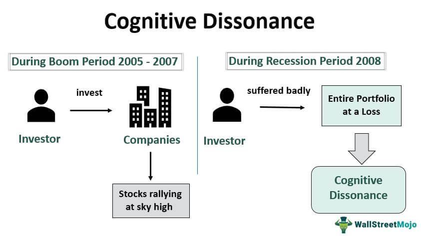

The intersection of psychology and trading presents a fascinating landscape where human emotions, cognitive processes, and economic models converge. At the heart of this interaction is cognitive dissonance, a psychological phenomenon that plays a crucial role in decision-making, particularly in algorithmic trading. Cognitive dissonance arises when an individual holds two or more contradictory beliefs, causing mental discomfort and often prompting the person to alter one of the beliefs to reduce the dissonance and restore psychological harmony. In trading, this can significantly impact decision-making, as traders may find themselves rationalizing poor decisions or clinging to failed strategies to alleviate the discomfort of dissonance.

In algorithmic trading, decisions are programmed into systems that operate on predefined rules and data analysis, theoretically minimizing emotional influence. However, the strategy development and adaptive learning process of these algorithms can still be subjected to the cognitive biases of their human creators. As automated systems continue to grow in prominence, understanding the psychological biases that affect trading decisions, like cognitive dissonance, becomes increasingly important. These biases can lead to suboptimal trading strategies and execution, ultimately impacting financial outcomes.



This growing awareness of psychological influences has highlighted the need for traders and developers to recognize and mitigate these biases to enhance performance and achieve better decision-making outcomes. By integrating psychological insights into the trading process, both individuals and institutions can aim for a more balanced approach that considers the complexities of human behavior alongside the precision of algorithmic systems.

## Table of Contents

## Understanding Cognitive Dissonance

Cognitive dissonance is a foundational concept in social psychology, first introduced by psychologist Leon Festinger in the late 1950s. It describes the internal psychological tension that occurs when an individual holds two or more contradictory beliefs, values, or attitudes simultaneously. This inconsistency between beliefs prompts an uncomfortable mental conflict, as it challenges the individual's sense of harmony and coherence in their cognition.

### Origins and Definition
Cognitive dissonance theory emerged to explain how people strive for internal consistency. When confronted with contradictions among their cognitions, individuals experience an emotional discomfort, driving them to reduce dissonance by altering their existing beliefs or attitudes. Festinger's seminal work laid the groundwork for understanding how people manage and reconcile these often conflicting thoughts.

### Mental Conflict and Contradictory Beliefs
The mental conflict arising from cognitive dissonance often leads individuals to engage in rationalization, denial, or avoidance as coping mechanisms. For example, a person who values health but smokes may experience dissonance because their behavior (smoking) conflicts with their belief (valuing health). To alleviate this discomfort, the person may alter their beliefs about smoking's harm, justify their behavior by emphasizing its stress-relieving benefits, or reduce the significance they place on maintaining health.

### Everyday Examples of Cognitive Dissonance
Cognitive dissonance manifests in numerous everyday situations, including:
- **Diet and Eating Habits**: An individual who commits to a diet but indulges in high-calorie dessert may rationalize by deciding that a reward was deserved due to sticking to their diet through the day.
- **Purchasing Decisions**: After buying an expensive product, a consumer might experience dissonance if they later discover a more affordable alternative. To justify their choice, the consumer may convince themselves that the quality or features of their purchased item are superior.
- **Environmental Concerns**: A person concerned about climate change but who frequently drives a gas-guzzling vehicle may downplay their environmental impact to reconcile the dissonance between their actions and beliefs.

### Impact on Rational Decision-Making
Cognitive dissonance significantly affects rational decision-making. It can impede objective analysis as individuals are more likely to favor information that confirms their preexisting beliefs and disregard information that contradicts them. This bias, known as confirmation bias, can lead to suboptimal decision outcomes. As people strive to minimize dissonance, they may prematurely close off options, fail to consider alternative solutions, or distort reality to conform to their beliefs.

The impact of cognitive dissonance extends beyond individual decision-making to inform broader behavioral and attitude changes. Understanding this psychological phenomenon is critical for enhancing decision-making processes, as it highlights the need for awareness of inherent biases and the importance of fostering mental flexibility. Through strategies to manage cognitive dissonance, individuals can work toward more rational, balanced, and informed decisions.

## Cognitive Dissonance in Psychology

Cognitive dissonance stands as a core subject in psychology, shedding light on the complexities of human behavior and attitudinal shifts. It originated from Leon Festinger's theory, which postulates that individuals experience psychological discomfort or tension when holding two or more contradictory beliefs, values, or attitudes. This discomfort often prompts a change in attitudes or behaviors to restore coherence.

Research indicates that cognitive dissonance can significantly influence behavior and attitude changes. For instance, when individuals engage in actions that contradict their beliefs, they may alter their attitudes to align with their behaviors, thereby reducing dissonance. This phenomenon can manifest in everyday scenarios, such as when a person convinces themselves that an unhealthy lifestyle choice is acceptable despite knowing the potential consequences.

Psychologists have proposed various strategies to resolve cognitive dissonance. One common method involves changing one's beliefs or attitudes to be more consistent with one's actions. Another approach is to minimize the importance of the conflicting belief or add new cognitions that harmonize the discrepancies. For example, someone might reduce dissonance from smoking despite knowing its health risks by downplaying the negative effects or focusing on smoking's stress-relief benefits.

Cognitive dissonance theory is intricately connected to behavior modification techniques. By understanding the mechanism of dissonance, psychological interventions can be designed to facilitate behavior change. For instance, health campaigns might use dissonance induction to encourage smoking cessation by highlighting the conflict between smoking and the desire for good health.

Moreover, methods such as motivational interviewing leverage cognitive dissonance principles by helping individuals recognize discrepancies between their current behaviors and their broader goals or values. This recognition often motivates change, demonstrating how cognitive dissonance can be harnessed to support behavior modification efforts.

In conclusion, the study of cognitive dissonance in psychology provides essential insights into how conflicting beliefs influence behavior and attitudes. By employing strategies to resolve dissonance, individuals can achieve greater psychological harmony, contributing to more effective behavior modification techniques.

## Cognitive Dissonance in Trading

Cognitive dissonance, a psychological phenomenon encountered when individuals experience inconsistency between their beliefs and actions, significantly impacts trading decisions. In the trading environment, cognitive dissonance manifests as traders grapple with conflicting beliefs, often leading to suboptimal decision-making. This bias can lead traders to maintain positions that conflict with market realities due to a denial of contradictory information.

One central aspect of cognitive dissonance in trading is the tendency to justify poor investment choices. Traders often strive to reduce dissonance by rationalizing decisions that have resulted in losses. For example, rather than accepting a loss and exiting a trade, an individual might cling to an unprofitable position, hoping the market will turn in their favor or doubling down on the investment to confirm their initial claim. This behavior stems from the discomfort of admitting an error, leading traders to modify their rationale to align with their actions, thereby preserving their self-image as competent decision-makers.

Real-world examples illustrate how pervasive cognitive dissonance can be in trading. One notable instance is during market bubbles, such as the dot-com bubble of the late 1990s. Many investors continued to purchase overvalued tech stocks despite emerging signs of an impending downturn, driven by the belief that this time was different or that the market would continue its upward trajectory indefinitely. When the bubble burst, the stark reality contradicted their prior optimism, causing significant financial losses.

Traders might also experience cognitive dissonance when adhering to a trading strategy that consistently underperforms. The innate desire to perceive oneself as rational and effective can lead to a reluctance to abandon the existing strategy even when empirical evidence suggests the need for adjustment. This persistence is often fueled by selective memory and confirmation bias, where traders focus on the occasional successes or potential of a strategy despite overwhelming data indicating its failure.

The influence of cognitive dissonance also extends to the interpretation of market data and forecasts. Traders may selectively interpret or overlook data that contradicts their market positions. For example, if a trader has invested heavily in a company's stock, any negative news might be disregarded or dismissed as irrelevant, while positive news, however insignificant, is embraced and given undue weight.

Understanding and acknowledging cognitive dissonance in trading is vital for developing more effective strategies and improving decision-making. Traders need to become aware of the psychological mechanisms that lead them to justify poor decisions and confront inconsistencies between their beliefs and market realities. Implementing objective, predefined rules based on empirical evidence and adhering strictly to them can help mitigate the impact of cognitive dissonance, fostering a more disciplined and successful trading approach.

## Impact on Algorithmic Trading

Cognitive dissonance, a psychological phenomenon where individuals experience discomfort due to conflicting beliefs or behaviors, poses unique challenges in the field of [algorithmic trading](/wiki/algorithmic-trading). In traditional trading settings, cognitive dissonance can lead traders to rationalize poor decisions or adhere to losing strategies. However, in algorithmic trading, which relies heavily on automation and pre-defined rules, the interplay between human biases and machine-driven processes introduces new dynamics in decision-making.

Automated trading systems can both alleviate and aggravate cognitive biases. On one hand, these systems are programmed to follow strict, rule-based parameters, inherently reducing the influence of subjective human biases like cognitive dissonance. By executing trades based on objective data rather than emotional impulses or conflicting beliefs, algorithmic systems can potentially mitigate the adverse effects of cognitive biases. For example, an algorithm may be programmed to cut losses at a predetermined threshold, thereby preventing a trader from justifying the decision to hold onto a declining asset in the hope of a market turnaround.

However, cognitive dissonance can still manifest through the human elements of algorithmic trading, such as the development and tweaking of trading strategies. Traders may experience dissonance when faced with discrepancies between what their strategies predict and actual market outcomes. This can lead to the tweaking of algorithms to fit past performance, known as overfitting, where the system becomes too finely tuned to historical data and loses its efficacy in real-time market conditions.

Objective rule-based trading systems are crucial in minimizing cognitive dissonance. By establishing clear, quantifiable rules for trade execution, traders can shift focus from emotional decision-making to systematic approaches. Python code, for instance, can be utilized in algorithmic trading strategies to implement these rules consistently. Consider the following example:

```python
def trading_strategy(price, moving_average):
    if price > moving_average:
        return "buy"
    elif price < moving_average:
        return "sell"
    else:
        return "hold"
```

This simple strategy enforces decisions based solely on price movements relative to a moving average, thus limiting room for cognitive dissonance-related deviations.

Cognitive dissonance impacts not only the execution but also the strategy development phase in algorithmic trading. Strategy developers must remain vigilant against the temptation to alter algorithms to match desired outcomes or preconceived market notions. Objective validation processes, such as out-of-sample testing and walk-forward analysis, are vital to ensure that strategies maintain their robustness and are not merely products of overfitting or biased manipulation.

Understanding and addressing cognitive dissonance in algorithmic trading is crucial for developing resilient, effective trading systems. By prioritizing objective, rule-based strategies and awareness of psychological biases, traders and developers can enhance the reliability and performance of their algorithmic trading approaches.

## Managing Cognitive Dissonance

Cognitive dissonance can significantly impact decision-making in trading, especially when emotional biases and rational financial strategies collide. Recognizing and managing this dissonance is vital for traders aiming to maintain both psychological balance and financial efficacy.

To identify cognitive dissonance in trading, traders should self-reflect on decisions particularly those made under pressure or following unexpected market movements. Analyzing the inner conflict between existing beliefs, such as confidence in a specific strategy, and new information challenging these beliefs allows traders to recognize this dissonance. Awareness is the first step towards mitigation, fostering an environment where rational decisions prevail over emotional reactions.

External feedback and mentorship play crucial roles in this recognition process. By seeking objective opinions from mentors or peer groups, traders are exposed to diverse perspectives that can illuminate cognitive dissonance they may be blind to. Engaging with mentors who have extensive experience in financial markets can provide historical context and alternative views that challenge entrenched biases, leading to a deeper self-awareness and less emotionally driven decisions.

Predefined trading rules can significantly reduce cognitive dissonance by establishing a clear, objective framework for decision-making. Rules based on empirical evidence help maintain consistency, even when market conditions provoke emotional responses. These rules might include specific entry and [exit](/wiki/exit-strategy) points, stop-loss settings, and diversification strategies, which collectively prevent the rash decisions often fueled by dissonance-induced emotions. By adhering to these guidelines, traders can avoid being swayed by conflicting beliefs or emotions in favor of sticking to a systematic approach.

In addition to structured guidelines, psychological tools such as mindfulness and journaling offer personal strategies to combat cognitive dissonance. Mindfulness, the practice of maintaining awareness of one’s thoughts and emotions without immediate judgment or reaction, allows traders to observe their cognitive processes objectively. This separation from their immediate emotional and cognitive reactions enables clearer thinking and better decision-making. Journaling complements mindfulness by offering a tangible record of past trades and associated emotions. By reflecting on this detailed account, traders can identify patterns of cognitive dissonance, enabling them to address these conflicts proactively in future trading situations.

Incorporating these techniques creates a well-rounded approach to managing cognitive dissonance in trading. The synergy of external feedback, systematic rules, and personal psychological practices helps traders make more informed and less emotionally reactive decisions, ultimately contributing to long-term success.

## The Psychological Edge in Trading

Understanding cognitive biases is crucial for trading success, as it equips traders with the ability to navigate the psychological pitfalls that can impair decision-making. Cognitive dissonance, particularly, plays a significant role in shaping trading behaviors, where conflicting beliefs can lead to poor investment choices or resistance to changing a failing strategy. Awareness and management of these biases can directly enhance a trader's ability to make sound decisions.

Education and training are instrumental in building psychological resilience among traders. By engaging in structured learning and training programs, traders can develop a keen awareness of their mental processes. Educational initiatives that focus on identifying cognitive biases, like cognitive dissonance, help traders recognize when their decision-making may be compromised by psychological factors. Such programs often emphasize the importance of mindset training and emotional regulation, providing traders with strategies to maintain composure under pressure.

Managing cognitive dissonance yields long-term benefits in trading. By acknowledging and addressing this psychological phenomenon, traders can reduce the mental conflict that arises from holding contradictory beliefs. This allows for more consistent adherence to trading plans and reduces the tendency to rationalize suboptimal trading decisions. Effective management of cognitive dissonance fosters a disciplined trading approach, which is crucial for sustained profitability and growth in trading performance.

Achieving better decision-making through psychology involves integrating psychological insights into trading processes. Recognizing cognitive dissonance enables traders to adjust their strategies proactively and reinforces the importance of objective analysis over emotional reactions. By cultivating an understanding of their cognitive frameworks, traders can develop strategies that minimize biases and enhance their decision-making capabilities. Ultimately, this psychological edge empowers traders to thrive in dynamic and often unpredictable market environments, ensuring both short-term gain and long-term success.

## Conclusion

Cognitive dissonance significantly affects trading decisions by causing traders to hold onto losing positions in an attempt to avoid admitting mistakes, or to overemphasize information that confirms their pre-existing beliefs. This mental conflict can lead to irrational decision-making, resulting in suboptimal trading outcomes. Acknowledging these psychological influences is crucial in algorithmic trading, where decisions can be skewed by emotional biases, even within automated systems designed to be objective.

The importance of psychological awareness in trading cannot be overstated. Traders who comprehend these biases and their impacts are better equipped to navigate market complexities. They can leverage this understanding to refine trading strategies, ensuring these are based on robust, logical criteria rather than emotional responses or cognitive errors.

To counteract cognitive dissonance, traders are encouraged to develop strategies that enhance self-awareness and rational evaluation. This includes setting predefined rules which dictate decision-making processes and regular reflections on past trades to identify bias effects.

A call to action for traders highlights the need to engage with educational resources and psychological tools that bolster resilience against cognitive biases. Methods such as mindfulness, journaling, and seeking external feedback or mentorship can significantly contribute to better decision-making. Embracing these strategies can enhance trading performance, reduce emotional trading pitfalls, and ultimately lead to more consistent success in the markets.

## References & Further Reading

[1]: Festinger, L. (1957). ["A Theory of Cognitive Dissonance."](https://psycnet.apa.org/record/1993-97948-000) Stanford University Press.

[2]: Kahneman, D. (2011). ["Thinking, Fast and Slow."](https://link.springer.com/article/10.1007/s00362-013-0533-y) Farrar, Straus and Giroux.

[3]: Thaler, R. H. (2015). ["Misbehaving: The Making of Behavioral Economics."](https://psycnet.apa.org/record/2015-22902-000) W. W. Norton & Company.

[4]: Elliott, A. J., & Devine, P. G. (1994). ["On the Motivational Nature of Cognitive Dissonance: Dissonance as Psychological Discomfort."](https://psycnet.apa.org/record/1995-05331-001) Journal of Personality and Social Psychology, 67(3), 382–394.

[5]: Byrne, D., & Worthy, D. A. (2013). ["Cognitive Biases in Trading: The Psychology of Financial Decisions."](https://psycnet.apa.org/record/2013-11378-001) The Psychology of Investing.